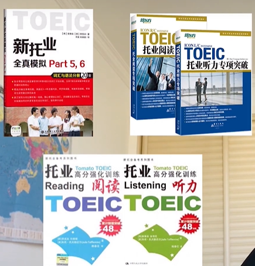
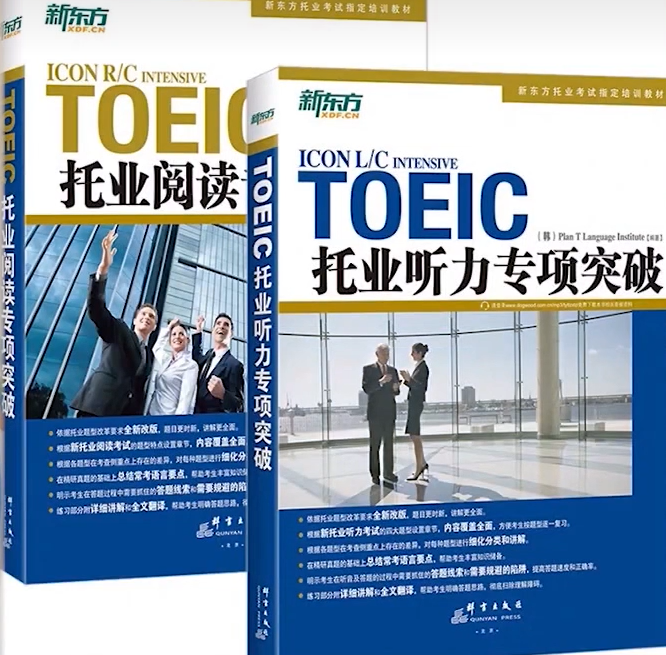

# TOEIC-Learning

## 题型组成

|          | 试题类型 | 试题数量 | 考试时间  | 总分区间 |
| :------: | :------: | :------: | :-------: | :------: |
| 听力部分 |  客观题  |  100 题  | 约45 分钟 |  5～495  |
| 阅读部分 |  客观题  |  100 题  |  75 分钟  |  5～495  |

**(一)  听力部分**

总共有四大题，100 小题。考生会听到各种各类英语的直述句、问句、短对话以及短独白，然后根据所听到的内容回答问题。听力的考试时间大约为 45 分钟。
第一大题：照片描述 6 题（四选一）
第二大题：应答问题 25 题（三选一）
第三大题：简短对话 39 题（四选一）
第四大题：简短文章 30 题（四选一）

**(二) 阅读部分**

总共有三大题，100 小题。考生须阅读多种题材的文章，然后回答相关问题。考试时间为 75 分钟，考生可在时限内依自己能力调配阅读及答题速度。
第五大题：完成句子 30 题（四选一）
第六大题：短文填空 16 题（四选一）
第七大题：阅读理解 54 题（四选一）

## 2025年考试时间 & 考点

| 2025年度托业公开考试时间安排（听读部分） |              |                                                              |                               |                  |
| ---------------------------------------- | :----------: | :----------------------------------------------------------: | :---------------------------: | ---------------- |
| 考试日期                                 | 开考城市数量 |                           开考城市                           |   常规报名缴费    起止日期    | 加急报名截止日期 |
| 2025年1月19日                            |      11      | 北京、上海、广州、深圳、武汉大连、南京、西安、成都、天津济南 | 2024年11月01日 2024年12月23日 | 2025年 01月09日  |
| 2025年2月23日                            |      16      | 北京、上海、广州、深圳、武汉大连、南京、西安、成都、天津杭州、沈阳、厦门、青岛、昆明哈尔滨 | 2024年11月01日 2025年01月27日 | 2025年 02月13日  |
| 2025年3月23日                            |      15      | 北京、上海、广州、深圳、武汉大连、南京、西安、成都、天津杭州、重庆、济南、长沙、南昌 | 2025年01月01日 2025年02月24日 | 2025年 03月13日  |
| 2025年4月20日                            |      18      | 北京、上海、广州、深圳、武汉大连、南京、西安、成都、天津沈阳、厦门、苏州、青岛、长春郑州、宁波、贵阳 | 2025年01月01日 2025年03月31日 | 2025年 04月10日  |
| 2025年5月25日                            |      15      | 北京、上海、广州、深圳、武汉大连、南京、西安、成都、天津杭州、重庆、济南、合肥、海口 | 2025年01月01日 2025年04月28日 | 2025年 05月15日  |
| 2025年6月22日                            |      16      | 北京、上海、广州、深圳、武汉大连、南京、西安、成都、天津沈阳、苏州、长沙、宁波、南宁哈尔滨 | 2025年02月01日 2025年05月26日 | 2025年 06月12日  |
| 2025年7月20日                            |      17      | 北京、上海、广州、深圳、武汉大连、南京、西安、成都、天津杭州、重庆、厦门、苏州、青岛昆明、郑州 | 2025年03月01日 2025年06月23日 | 2025年 07月10日  |
| 2025年8月24日                            |      15      | 北京、上海、广州、深圳、武汉大连、南京、西安、成都、天津沈阳、苏州、济南、合肥、贵阳 | 2025年03月01日 2025年07月28日 | 2025年 08月14日  |
| 2025年09月21日                           |      15      | 北京、上海、广州、深圳、武汉大连、南京、西安、成都、天津杭州、重庆、长沙、青岛、哈尔滨 | 2025年03月01日 2025年08月25日 | 2025年 09月12日  |
| 2025年10月26日                           |      15      | 北京、上海、广州、深圳、武汉大连、南京、西安、成都、天津沈阳、厦门、苏州、郑州、宁波 | 2025年06月01日 2025年09月29日 | 2025年 10月16日  |
| 2025年11月23日                           |      15      | 北京、上海、广州、深圳、武汉大连、南京、西安、成都、天津杭州、重庆、济南、长春、海口 | 2025年06月01日 2025年10月27日 | 2025年 11月13日  |
| 2025年12月21日                           |      15      | 北京、上海、广州、深圳、武汉大连、南京、西安、成都、天津沈阳、厦门、苏州、长沙、青岛 | 2025年06月01日 2025年11月24日 | 2025年 12月12日  |

## 考试注意事项

官方时间：上午8:30， 建议8:00到达

考试用品：文具、证件（身份证、准考证），不能使用笔袋

答题卡较为复杂，长时间填写大量个人信息，会有专门指导

不能在试卷上留下痕迹？

时间分配建议（阅读）：

| Reading Part     | Reccommend Time (75min in total) |
| ---------------- | -------------------------------- |
| Reading Part 5-6 | 20 min - 23min                   |
| Reading Part 7   | 52 min                           |

日常听力磨耳朵： [听力 19days](./)

## 各部分做题技巧

（By Johnson）

Part 2

Part2中的潜规则
如果选项中有与题目中重复的、发音相似(意思完全不同)的词，那么 100%是错误答案(如review-interview)
遇到 yes/no 开头的选项要很谨慎，即使是一般疑问句，大多数正确答案也不是 yes/ no开头。
表达“不知道”之类的选项，一定是正确答案，这个系列还包括:没决定，忘记了，你去找别人吧，我不负责，随便你(up to you)，视情况而定(it depends on)等等。当发现其他两个选项貌似都不太对，另一个正好是这种类型的回答时，100%选他就对了。

Part 3 Part 4 

注意读题、涂卡

Part 56 基础语法？

Part 7 快速阅读能力，提取关键信息能力

## 参考教材

刷题类

专项类

下图下面两本《高分强化训练》有专项归纳

新东方全真模拟1000（略难）

​                                                                                                                                                                                                                                                                                                                                                                                                                                                                                                                                                                                                                                                                                                                                                                                                                                                                                                                                                                                                                                                                                                                                                                                                                                                                                                                                                                                                                                                                                                                                                                                                                                                                                                                                                                                                                                                                                                                                                                                                 

冲刺模拟题（难度一致）

[官方样题](https://www.test-toeic.cn/down.aspx?id=4)

计划个人学习教材：

1.初始阶段先做几套真题，归纳问题

2.使用新东方1000以及专项突破难点

3.冲刺：女跨栏

## 学习记录表

| 练习日期 | 题目名称  | 听力错误 | 阅读错误 | 总错误题数 | 总分 |
| :------: | :-------: | :------: | :------: | :--------: | :--: |
|  Feb.19  | 全新全真1 |    20    |    23    |     43     | 785  |
|          |           |          |          |            |      |
|          |           |          |          |            |      |

