易混单词

corporate  公司的

cooperate  合作

incorporate 加入

# 全新全真

## 全真模拟2

131.**If you’re looking to get on the 131 to financial freedom...**

**选项：**
 (A) road
 (B) path
 (C) access
 (D) line

**解析：**
 短语 **"get on the path to financial freedom"**（踏上通往财务自由的道路）是一个常见表达，"path" 符合语境。

✅ **正确答案：B (path)**

132 **they never thought that they could get ahead on their 132 until they discovered...**

**选项：**
 (A) bonus（奖金）
 (B) charges（费用）
 (C) wages（工资）
 (D) prices（价格）

**解析：**
 句意：“他们一直努力工作，直到发现 New York Life 的投资技术，才意识到自己可以改善……。”
 "get ahead on" 意味着“在某方面取得进展”，通常与 **wages（工资）** 相关，因为工资决定了他们的财务状况。

✅ **正确答案：C (wages)**

 **133. ...until they discovered New York Life’s simple 133 effective investing techniques.**

**选项：**
 (A) however
 (B) and
 (C) very
 (D) yet

**解析：**
 这里需要一个可以连接 **"simple"** 和 **"effective investing techniques"** 的词，表达“简单且有效的投资技术”，"and" 最符合语法和语义。

✅ **正确答案：B (and)**

✅ **"yet" 也是正确的答案**，但它强调“尽管简单，但仍然有效”。
 **如果题目倾向于广告宣传语，“and” 更常见，因为它是中性表达，强调两个特性并存，不带对比意味。**


 **135.  a new replacement will be delivered to you by UPS by tomorrow afternoon 135 the latest. **

**选项：**
 (A) for
 (B) at
 (C) on
 (D) from

**解析：**
at the latest 意为最迟、 最晚 ，为固定搭配，故选B。


 **You will not be subject to any legal action upon notification to the proper authorities.**

 be subject to  受到

authorities 权威（官方部门）


Q151 - 152

**As our valued customer,you are eligible to use our EBPP (Electronic Bill Presentment and Payment)system,which allows our consumers to view and pay bills electronically.**

eligible 有资格的


**The systems also enable payments to be made by consumers,given that the amount appearing on the e-bill is correct.**

**given that** - **连词短语 (Conjunction Phrase):**  “考虑到...”、“假如...”、“鉴于...” 的意思。  它引导一个表示条件的状语从句。  类似于 "provided that", "assuming that" 等。


Q159 - 161


GEM Computers has topped the Wall Street headlines with its organization-wide restructuring exercise.GEM Computers,a computer giant,sold its low margin competitive desktop division.In recent years,GEM Computers has spent billions of dollars investing in the desktop division,where low cost manufacturers have managed to stay at the top of the ompetition.However,GEM' s desktop products have virtually stopped evolving and ceased making new products despite its heavy spending on R& D.This has caused the cash-stricken company to offer its loss-making division to Electronica.As one of the leading computer companies, Electronica paid $5 billion to buy the division. The market deems this as more favorable to GEM,as it received more than what it deserves for selling the division.It is expected to pay off most of its multimillion dollar loans and avoid filing for bankruptcy for some time.Economists comment that GEM will stmt turning a profit as long as it keeps with its core products of mini computers and mainframe systems. 


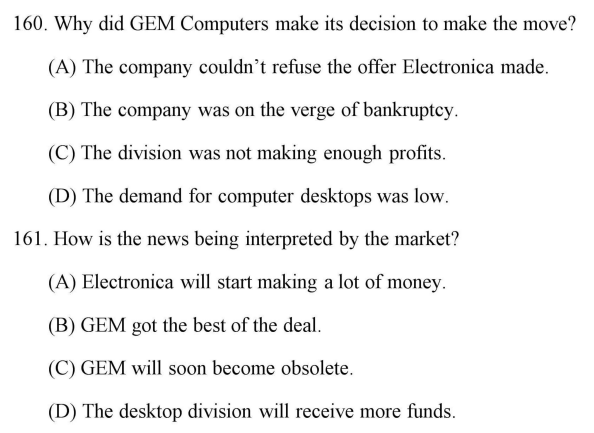


margin 利润

virtually 几乎

division 部分

loans 贷款

bankruptcy 破产

答案：CB


**A s compensation,I am willing to offer a 30% rebate on this order,as well as a $50 credit on your next order with us. **


| 词语                   | 直接折扣？   | 先付全款？       | 需要申请？       | 形式               | 适用场景                       |
| ---------------------- | ------------ | ---------------- | ---------------- | ------------------ | ------------------------------ |
| **Coupon（优惠券）**   | ✅ 结账时立减 | ❌                | ❌                | 纸质/电子          | 超市、餐饮、电商等             |
| **Rebate（返现）**     | ❌ 先付全款   | ✅                | ✅ 可能需提交申请 | 现金/支票/银行转账 | 电子产品、汽车、家电等大额消费 |
| **Credit（账户余额）** | ❌ 未来使用   | ✅ 可能因退货获得 | ❌                | 账户余额           | 商店退款、会员积分、预存款     |

**简单记忆：**

- **Coupon = 结账前立减**（用完即失效）
- **Rebate = 先买后退钱**（需要等待）
- **Credit = 账户余额**（未来可用）


Q166-168

I am not ashamed to admit that I spent a solid two hours perusing your articles on foreign customs and amazing cultural sites,even though I originally stumbled onto it while doing a search for study abroad programs.I feel you' ve done a wonderful job creating content that appeals to a wide variety of people eager to discover new things about the world. Congratulations!


peruse (动词):  细读，浏览 (仔细但非精读)

**stumble onto (短语动词):  偶然发现，碰巧遇到**

- **用法:**  `stumble onto something`  偶然发现某物，通常是没有预料到的。
- **例句:** *I stumbled onto this website by accident.* (我偶然发现了这个网站。) *She stumbled onto a good idea.* (她偶然想到了一个好主意。)

stumble 绊倒

**appeal to (短语动词):  对...有吸引力，吸引...**

**用法:**  `appeal to somebody/something`  对某人/某物有吸引力。

**例句:** *This movie appeals to young audiences.* (这部电影对年轻观众有吸引力。) *The idea appeals to me.* (这个想法吸引了我。)


debut work 处女作

Nonfiction 非虚构的


Q176 - 180

workshop **研讨会，讲习班，工作坊 (Meeting for discussion and practical work on a subject):**  这是 “workshop” 在现代社会中最常用、也是最广泛理解的意思。  指的是一种 **互动式、实践性强** 的会议或培训活动，参与者通常围绕特定主题进行讨论、学习、实践和交流。 强调 “动手” 和 “集体学习”。

**例句：**

- I attended a writing **workshop** last weekend. (我上周末参加了一个写作研讨会。)
- The company is organizing a leadership **workshop** for its managers. (公司正在为经理们组织一个领导力培训班。)
- We are holding a **workshop** on website design. (我们正在举办一个关于网站设计的工作坊。)
- a **workshop** on stress management (压力管理研讨会)
- a creative writing **workshop** (创意写作讲习班)
- a drama **workshop** (戏剧工作坊)


# 旧跨栏 Part 5-6

## test 1

lease 租借

logistic service  物流服务

his doctor suggested to him that he (should) **take** medication today

do one's utmost 尽最大努力

we ___ with all laws and regulations, applied in local and international society

comply

apply

account 

respond

comply with 遵守 apply for 申请  apply to 适用于 

我们遵守当地和国际社会适用的所有法律法规


renovate  翻新

attractive compensation ___ with qualifications and experience will be offered to all successful candidates.

eligible

responsive

commensurate

adaptable


句子：
 👉 *The executives have repeatedly indicated the company's interest in setting up shops provided the regulatory **______** are removed.*

provide

hurdles

handles

paddles


- "provided" 这里相当于 **if**（如果），表示**条件**。
- "the regulatory ______ are removed" → 监管方面的 **某些东西** 被**移除**。
- 语境暗示：监管方面的**障碍/限制**需要被移除，以便公司可以开店。

------

 **选项分析：**

(A) **provides** ❌（动词，语法错误）

- *provide* 是动词，名词形式应为 *provision*，但这里需要的是一个可数名词的复数形式（因为动词 *are* 表明主语是复数）。

(B) **hurdles** ✅ **（正确答案）**

- *hurdle*（障碍，困难），通常用于指**需要克服的困难或限制**，符合句意。
- "regulatory hurdles"（监管障碍）是一个常见搭配，指**法规方面的阻碍**。
- **完整搭配：** *remove regulatory hurdles*（消除监管障碍）。

(C) **handles** ❌（手柄，操纵，意思不符）

- *handle* 作为名词表示**把手，柄**，不符合语境。

(D) **paddles** ❌（桨，意思不符）

- *paddle* 指**桨**（如皮划艇的桨），与监管无关。

**完整句子：**
 👉 *The executives have repeatedly indicated the company's interest in setting up shops provided the regulatory **hurdles** are removed.*
 （高管们一再表示，公司有兴趣开设商店，前提是监管障碍被移除。）


maximun weight allowance 最大承重许可


I beg you ___ our other products

consider

I beg (that) + 主语加谓语动词

place an order 下订单


## test 2


 **1️⃣ respectively（分别地，各自地）**

👉 **用于列举多个对象时，表示它们一一对应的关系。**

- **词性**：副词
- **意思**：表示顺序对应关系，强调“分别”或“各自地”。
- **常见搭配**："A and B **respectively** correspond to X and Y"（A 和 B **分别** 对应 X 和 Y）。

**✅ 例句：**

1. *Tom and Jerry received $100 and $200, respectively.*
    （汤姆和杰瑞**分别**收到了 100 美元和 200 美元。）
2. *The three books were written by Alice, Bob, and Charlie, respectively.*
    （这三本书**分别**由爱丽丝、鲍勃和查理所著。）

------

 **2️⃣ respectfully（尊敬地，恭敬地）**

👉 **表示对某人或某事表示尊重的态度。**

- **词性**：副词
- **意思**：带着**尊敬**或**礼貌**的方式去做某事。
- **常见搭配**："speak **respectfully**"（恭敬地说话）、"treat someone **respectfully**"（尊重某人）。

**✅ 例句：**

1. *The employee spoke respectfully to his manager.*
    （这名员工**恭敬地**对他的经理说话。）
2. *She listened respectfully to the professor’s lecture.*
    （她**恭敬地**听教授讲课。）

------

 **如何区分？**

- **respectively → 顺序对应**（“分别地”）
- **respectfully → 充满尊敬**（“恭敬地”）

**对比例句：**
 ✅ *John and Lisa greeted the guests respectfully.*（约翰和丽莎**恭敬地**迎接客人。）
 ✅ *John and Lisa greeted Mr. Smith and Ms. Brown, respectively.*（约翰和丽莎**分别**迎接了史密斯先生和布朗女士。）

👉 **小技巧：**

- **respectively** = "**r**ank and order"（有顺序的“分别地”）
- **respectfully** = "**r**espect"（带有“尊敬”之意）


contanimated 被污染

deteriorate 恶化

incurred 招致


prescribe medication to somebody 给某人开药


Nowadays, we do almost all our ___ by e-mail for business purposes.
connection

correspondence

contract

construction


do correspondence 通信联系 sign the contract 签合同

correspondence  一致性/通讯

there is a simple **correspondence** between the distance of a focused object from the eye and the size of its image on the retina

do our correspondences by e-mail for business purposes

**correspond 家族**

**1️⃣ correspond（v. 对应，符合，通信）**

- **词性**：动词

- 基本意思

  ：

  1. **对应，相一致** → *A correspond with/to B*（A 和 B 对应 / 一致）。
  2. **通信**（常用于正式书信往来） → *correspond with someone*（与某人通信）。

**✅ 例句：**

- *The color of the curtains corresponds with the furniture.*（窗帘的颜色**与**家具**相匹配**。）
- *She still corresponds with her childhood friend.*（她仍然**与**童年朋友**通信**。）

------

 **2️⃣ corresponding（adj. 相应的，对应的）**

- **词性**：形容词
- **意思**：表示与某物对应的、匹配的、相符的。
- **常见搭配**："the corresponding number"（相应的数字）、"the corresponding result"（对应的结果）。

**✅ 例句：**

- *Each student has a corresponding seat number.*（每个学生都有一个**对应的**座位号。）
- *Prices have increased, but the corresponding wages have not.*（价格上涨了，但**相应的**工资却没有。）

------

 **3️⃣ correspondent（n. 通讯员，记者；通信者）**

- **词性**：名词

- 意思

  ：

  1. **新闻通讯员，记者**（常指派驻国外的记者，如“war correspondent” 战地记者）。
  2. **通信者**（与别人通信的人）。

**✅ 例句：**

- *She works as a foreign correspondent for BBC.*（她是 BBC 的一名**驻外记者**。）
- *My grandfather was a great correspondent and wrote letters every week.*（我的祖父是个很好的**通信者**，每周都写信。）

------

 **4️⃣ correspondence（n. 通信，信件；一致，符合）**

- **词性**：名词

- 意思

  ：

  1. **通信，信件往来**（指人与人之间的书信交流）。
  2. **一致，相符**（指两者在某方面一致或匹配）。

**✅ 例句：**

- *I have kept all my correspondence with my pen pal.*（我保留了与笔友的**所有书信**。）
- *There is a clear correspondence between education and income.*（教育与收入之间存在明显的**对应关系**。）

------

总结区别：

| 单词               | 词性   | 含义                 | 例子                                                         |
| ------------------ | ------ | -------------------- | ------------------------------------------------------------ |
| **correspond**     | 动词   | 对应、一致；通信     | *His words do not correspond to his actions.*（他的话**与**行动**不一致**。） |
| **corresponding**  | 形容词 | 对应的、相应的       | *The salary increase was not corresponding to inflation.*（工资增长**与**通货膨胀**不匹配**。） |
| **correspondent**  | 名词   | 记者、通讯员；通信者 | *She is a political correspondent for CNN.*（她是 CNN 的**政治记者**。） |
| **correspondence** | 名词   | 书信往来；一致，相符 | *We have regular correspondence with our customers.*（我们与客户保持**定期通信**。） |


119 The company ___ to lose one of its oldest accounts since it failed to meet the customer's needs several times.
(A)expects
(B)relies
(C)acquires
(D)negotiates


expect 不一定是正面的，也有可能是负面的


customer's demands have outpaced the business sector's ability ___ to meet such growing expectations A meeting B to meeting C to meet D for meeting

A meeting B to meeting C to meet D for meeting


句意：**客户的需求增长速度已经超过了商业领域满足这些增长期望的能力。**

**分析句子结构：**

- 主语：**customer's demands**（客户的需求）
- 谓语：**have outpaced**（已经超过了）
- 宾语：**the business sector's ability**（商业领域的能力）
- **空格后应填动词不定式（to do）结构**，表示“能力去做某事”

在英语中，**ability to do something**（做某事的能力）是固定搭配，因此应该选择 **"to meet"**。


128 European carmakers will expand their business in Asia, relying on local manufacturers to develop new models their brand names.
(A) to bear
(B) bearing
(C) born
(D) bore


句意：**欧洲汽车制造商将扩展他们在亚洲的业务，依赖本地制造商开发新车型，这些新车型带有他们的品牌名称。**

在这里，需要一个**现在分词（bearing）\**作\**定语**修饰“new models”，表示“**正在带有**品牌名称的车型”。

✅ **(B) bearing**


notify 通知


131 The manufacturer lost many of its most loyal customers after the media focused attention on its lack of ___ to  product quality 

(A)commitment (B)assurance (C)value (D)interest


**A) commitment（承诺）** 

- “commitment to product quality” 意思是“对产品质量的承诺”，符合逻辑。
- **lack of commitment to product quality**（缺乏对产品质量的承诺）表达了制造商的问题，因此是正确答案。

**(B) assurance（保证）** 

- “lack of assurance” 一般指“缺乏保证、担保”，但后面接“product quality”时不太自然。

**(C) value（价值）** 

- “lack of value product quality” 语法错误，且“value” 更常用于表示价格或抽象意义的价值。

**(D) interest（兴趣）** 

- “lack of interest in product quality” 可能看起来合理，但通常 interest 需要接 **“in”**，这里直接接“product quality”不符合语法。


I have received no acknowledgement of the order, nor have the dictionaries 148. ___

(A) been delivered (B) were delivered (C) delivered (D) being delivered


 **have received...** 这里用了**现在完成时**（have received）。

**nor** 表示否定，并且会引导**倒装句**，主语 **"the dictionaries"** 置于 **have** 之后。

**时态应与前文一致（现在完成时）**，所以需要**现在完成时的被动语态**（have + been + 过去分词）。


**(A) been delivered** ✅（正确）

- **现在完成时的被动语态** → **nor have the dictionaries been delivered（字典也没有被送达）**。
- 这个结构与前面的 **have received** 保持一致，符合逻辑和语法。


**1. 倒装句的类型**

英语中的倒装主要分为两种：

**（1）部分倒装（Partial Inversion）**

👉 **只有助动词（auxiliary verb）放到主语前，而主要动词仍然在后面。**

- 适用于**否定副词、only类词语、nor/neither等连词**引导的句子。
- **常见的触发词**：**Nor, Neither, Never, Seldom, Rarely, Hardly, Scarcely, Only** 等。

**例子**

- I have never seen such a beautiful sunset.（正常语序）
- **Never have I seen such a beautiful sunset.**（部分倒装）

在你的句子中：

- **正常语序**：The dictionaries have not been delivered.
- **倒装后**：**Nor have the dictionaries been delivered.**
   （助动词 "have" 提前，主语 "the dictionaries" 在其后）

------

 **（2）完全倒装（Full Inversion）**

👉 **谓语动词的整个部分都放在主语前面**，主语通常放在句尾。

- **主要用于地点副词、方位副词、表强调的 there, here, now, then 等**。

**例子**

- A big tree stood in front of the house.（正常语序）
- **In front of the house stood a big tree.**（完全倒装）


## test 3


102.LAPD reported that the middle-aged man had been apprehended at the scene ___ after the accident.
(A) shortly
(B) rightly
(C)presently
(D)likely

LAPD 洛杉矶警察局

apprehend 逮捕

shortly after = right after = soon after = immediately after 刚...之后


The Human Resources department is considering ______ a new benefits package for the benefit of the employees.

(A) **introduced**
 (B) **to introduce**
 (C) **being introduced**
 (D) **introducing**


**"consider" 是一个动名词搭配动词**，其常见用法如下：

✅ **consider + doing sth.（动名词）**（表示正在考虑做某事）
 ⛔ **consider + to do sth.**（错误，consider 后不接 to do）

例如：

**I am considering changing my job.**（我正在考虑换工作。）

**He is considering moving to another city.**


106.The newlypurchased equipment from Korea is capable ___ and producing subminiature products.
( A) measuring
(B )to measure
(C)in measuring
(D)of measuring


be capable of doing  

subminiature 超小型的


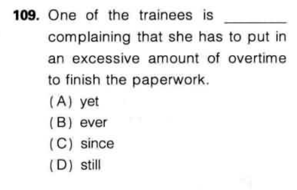

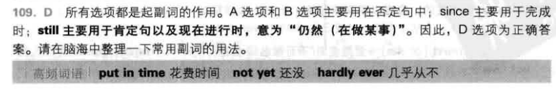


110 题目：

> **All workers can take a day off as the installation of cutting-edge facilities at our factory is ______ underway.**

选项： (A) **directly**
 (B) **extremely**
 (C) **presently**
 (D) **enormously**


 presently**（目前、现在）

**完整句子：**
 ✅ **All workers can take a day off as the installation of cutting-edge facilities at our factory is presently underway.**
 （由于我们工厂的尖端设施安装工作目前正在进行中，所有工人都可以休息一天。）


113 题目：

> **I will ______ him that no methods were found for solving the conflicts associated with the refund.**

选项： (A) **announce**
 (B) **talk**
 (C) **mention**
 (D) **remind**


(A) **announce**（宣布）❌

- **announce** 是及物动词，但它通常不接人作直接宾语，而是直接接事物。
   ❌ **I announced him that...**（错误）
   ✅ **I announced that no methods were found.**（正确）

(B) **talk**（谈论）❌

- **talk** 是不及物动词，不能直接接宾语。
   ❌ **I will talk him that...**（错误）
   ✅ **I will talk to him about that issue.**（正确）

(C) **mention**（提到）❌

- **mention** 虽然可以接 that 从句，但不能接 "人" 作直接宾语。
   ❌ **I will mention him that...**（错误）
   ✅ **I will mention that no methods were found.**（正确）

(D) **remind**（提醒）✅

- **remind** 是**唯一一个可以接双宾语（人 + that 从句）**的动词，符合句子结构。
   ✅ **I will remind him that no methods were found.**（我会提醒他，没有找到解决退款相关冲突的方法。）


**D) remind**（提醒）

**完整句子：**
 ✅ **I will remind him that no methods were found for solving the conflicts associated with the refund.**
 （我会提醒他，没有找到解决退款相关冲突的方法。）


**相关短语:**

**remind somebody of something**（提醒某人某事）
 ✅ **This song reminds me of my childhood.**（这首歌让我想起了童年。）

**remind somebody to do something**（提醒某人做某事）
 ✅ **Please remind me to send the email.**（请提醒我发邮件。）

**remind somebody that...**（提醒某人某事）
 ✅ **She reminded me that the meeting was at 3 PM.**（她提醒我会议在下午 3 点。）


announce / mention to sb that 通知 / 对某人说起某事

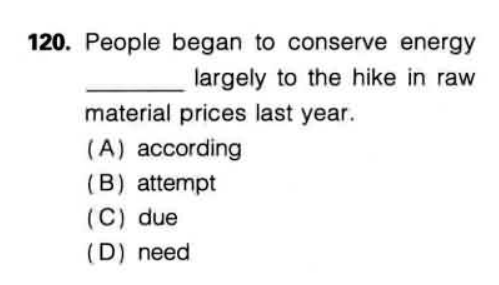


conserve energy 节省能量

raw materials 原材料


121 ___a 2% revaluation of the country's currency last year, the big jump came.
( A) In spite of
(B)Although
(C)However
(D)Nevertheless


选项： (A) **In spite of**（尽管）
 (B) **Although**（虽然）
 (C) **However**（然而）
 (D) **Nevertheless**（然而，尽管如此）


 **In spite of**（尽管）✅ **正确**

- **"In spite of"** 是介词短语，后面必须接**名词、代词或动名词**。
- 句中 **"a 2% revaluation"**（货币升值）是**名词短语**，符合语法。

**"Although"** 是**从属连词**，**后面必须接完整的主谓结构**，


128. The manager,however, did not pay much attention ___ the grounds that the problem will be solved soon.
(A) to
( B) from
(C) at
(D)on


on the grounds that 基于...理由 / 由于

但经理并未过多理会，理由是问题很快就会解决。


129. While it may sound，l think you will soon experience the improvement of your ability by concentrating more on
this lecture.
( A)indicative
(B) presumable
(C) interesting
(D)exaggerated


(A)指示性的
(B)可推测的
(C)有趣的
(D)夸张的

​	

concentrating on 集中精力

lecture 讲座


130.You are required to wear ___ clothing before you enter the room.

( A)protect

(B) protective

(C)protection

(D)protecting


protective clothing 防护服

sun protection clothing 防晒服


133. You will have to this reminder to all staff regarding changes in our unused vacation policy.
(A) distribute
(B) attribute
(C)contribute
(D) tribute

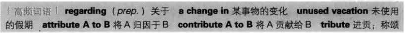


in most cases, we will be able to supply any of the same or similar products to you at much more competitive prices.___, based on your particular needs, we can propose a new design for your hotel.
143.(A) Even though
(B)Furthermore
(C)Nevertheless
(D)Aside


(B) **Furthermore（此外，进一步地）** ✅

- "Furthermore" 表示“此外”，用于添加额外的信息或补充说明，符合这里的语境。
  - ✅ **"Furthermore, based on your particular needs, we can propose a new design for your hotel."**
  - **（此外，根据您的特定需求，我们可以为您的酒店提出新的设计方案。）**

(C) **Nevertheless（尽管如此，然而）** ❌

- "Nevertheless" 用于转折，表示前后句有对比或矛盾关系，而这里没有矛盾，反而是补充信息，所以不合适。
  - ❌ **"Nevertheless, based on your particular needs, we can propose a new design for your hotel."**
  - **（尽管如此，我们仍然可以提出新的设计方案。）**（但这里没有“尽管如此”的对比关系）

✔ **B) Furthermore**

✅ **"Furthermore, based on your particular needs, we can propose a new design for your hotel."**
 （此外，根据您的特定需求，我们可以为您的酒店提出新的设计方案。）


相关短语

- Furthermore = Moreover（此外，进一步地）
  - **We offer high-quality furniture. Furthermore, we provide free delivery.**
     （我们提供高质量的家具。此外，我们还提供免费送货。）
- Nevertheless = However（尽管如此，然而）
  - **The product is expensive. Nevertheless, it is very popular.**
     （这个产品很贵。尽管如此，它仍然很受欢迎。）
- Even though = Although（尽管）
  - **Even though the price is low, the quality is great.**
     （尽管价格低，质量却很好。）
- Aside from = Apart from（除了……之外）
  - **Aside from the price, I like everything about this hotel.**
     （除了价格之外，我喜欢这家酒店的一切。）


## test 4

题目：

> **A simple way to ___ funds would be to offer an incentive program for the donors.**
>  **（一个简单的筹集资金的方法是为捐赠者提供激励计划。）**

选项： (A) **generate** 
 (B) **manufacture** 
 (C) **deliver** 
 (D) **contract** 


相关短语

**Generate revenue**（产生收入）

**Generate ideas**（产生想法）

**Generate electricity**（发电）

**Raise funds**（筹集资金，类似于 "generate funds"）


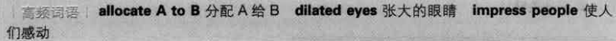


vicious circle 恶性循环

virtuous circle 良性循环


```
近义词：

> 展示

demonstration

exhibition

presentation

display

> 潜在的

potential

prospective

probable
```

descriptive 描述性的

assured 确定的


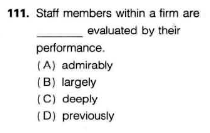

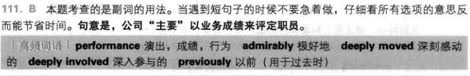


112 although he ___ mentioned the introduction of that product, his remark still has a profound effect on his fellows.
A once

B besides

C still

D yet


(A) **once（曾经）**

- **"once mentioned"** = **“曾经提到过”**，符合语境。
- 例句：**I once visited Paris.**（我曾经去过巴黎。）

(B) **besides（此外）** 

- **"Besides mentioned"** 语法错误。

- "Besides"

   需要连接两个独立的信息，例如：

  - **Besides, we should consider other factors.**（此外，我们还应该考虑其他因素。）

(C) **still（仍然）** 

- "Still mentioned"

   语法错误，

  still

   一般用于进行时或强调动作的持续：

  - **He is still working.**（他仍然在工作。）

(D) **yet（尚未，仍然）** 

- "Yet mentioned"

   不符合语法规则，"yet" 一般用于否定句或疑问句：

  - **He hasn’t mentioned it yet.**（他还没有提到它。）


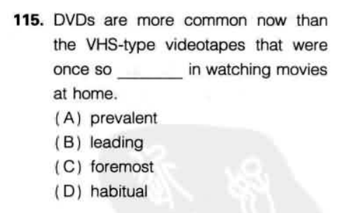

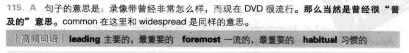


electrically (电气地)

**侧重于“电”本身作为能量或动力的形式。** 它指的是与电力、电气设备、或使用电力运行的系统相关的。

**更广泛地指代与电有关的事物，包括强电和弱电。** 强电通常指用于供电和驱动大型设备的电力，而弱电则指用于信号传输和控制的低电压电。

**主要关注的是电的物理属性和功能，例如电流、电压、功率等。**

**例子：**

- The machine is **electrically** powered. (这台机器是电力驱动的。)
- The building has a complex **electrical** system. (这栋建筑有一个复杂的电气系统。)
- He works as an **electrical** engineer. (他是一名电气工程师。)
- There was an **electrical** fault that caused the blackout. (一次电气故障导致了停电。)


**electronically (电子地)**

- **侧重于“电子”作为信息处理和控制的媒介。** 它指的是与电子学、电子设备、或使用电子电路和组件的系统相关的。
- **更具体地指代利用电子元件（如晶体管、集成电路等）来处理、存储和传输信息的设备和系统。** 这通常涉及到弱电。
- **主要关注的是电子信号的处理和应用，例如数据处理、通信、控制等**

**例子：**

- The data is stored **electronically**. (数据以电子方式存储。)
- The door lock can be opened **electronically**. (这个门锁可以用电子方式打开。)
- She is an expert in **electronic** devices. (她是电子设备方面的专家。)
- The company manufactures **electronic** components. (这家公司生产电子元件。)


120. Most of the people know the importance of extensive research ___ they fail to get accurate information at times.
(A) so
(B) either
(C) besides
(D) yet


(C) **besides（此外）** 

- **“besides” 表示补充信息**，但这里是对比，不合适。
- 例句：**She is smart; besides, she works hard.**（她很聪明，此外，她也很努力。）

(D) **yet（然而）** 

- **“yet” 表示对比，即“虽然如此，但…”**
- **符合本句逻辑：知道研究重要性，但有时仍然失败。**
- 例句：
  - **He is rich, yet he is not happy.**（他很富有，然而他并不快乐。）
  - **She tried hard, yet she failed.**（她很努力，然而她失败了。）


122.The newly established restrictions prohibited the distributor from getting the goods cleared customs.
(A) through
(B) for
(C) on
(D) in


货物过海关，customs 海关、关税


 **1. Tariff（关税）**

🔹 **定义**：

- **Tariff** 指 **进口或出口时政府对商品征收的税**，通常用于保护本国工业或增加财政收入。
- **它是一种税（tax），专门针对进出口商品。**

🔹 **用法**：

- **Impose a tariff on sth.**（对……征收关税）
- **Reduce tariffs on imports**（降低进口关税）
- **High tariffs on foreign goods**（对外国商品征收高关税）

🔹 **例句**：

- The government **imposed a high tariff on** imported steel.
   **（政府对进口钢铁征收了高额关税。）**
- Many countries have agreed to **reduce tariffs** on electronic products.
   **（许多国家已同意降低电子产品的关税。）**

------

**2. Customs（海关）**

🔹 **定义**：

- **Customs** 指 **政府设立的管理进出口贸易的机构**，负责检查货物、收取关税、执行进出口法规等。
- **它是一个机构，而不是一种税。**

🔹 **用法**：

- **Go through customs**（通过海关检查）
- **Declare goods at customs**（在海关申报货物）
- **Customs officer**（海关官员）

🔹 **例句**：

- He was stopped by **customs** for carrying too much cash.
   **（他因携带过多现金被海关拦下。）**
- The package was held at **customs** due to missing documents.
   **（这个包裹因缺少文件被海关扣留了。）**

| **比较项** | **Tariff（关税）**                 | **Customs（海关）**            |
| ---------- | ---------------------------------- | ------------------------------ |
| **定义**   | 进口/出口时征收的税                | 管理进出口的政府机构           |
| **本质**   | 一种税                             | 一个机构                       |
| **作用**   | 控制贸易、增加财政收入             | 监管进出口、收税、检查货物     |
| **例子**   | High tariffs on cars（汽车高关税） | Customs inspection（海关检查） |


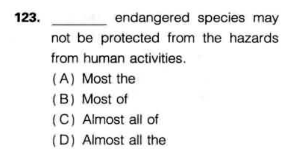

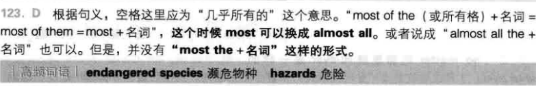

其他类似表达

 ✅ **Most endangered species...** （大多数濒危物种）
 ✅ **Most of the endangered species...** （大多数这些濒危物种）
 ✅ **Almost all the endangered species...**（几乎所有这些濒危物种）
 ✅ **All endangered species...** （所有濒危物种）

 ✅ **Almost all the endangered species...**
 ✅ **Almost all of the endangered species...**


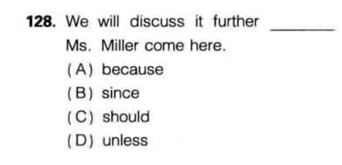

正确答案是 **(C) should**。

**解析：**
 该句子使用了**虚拟条件句**的倒装结构，完整的句子应该是：

➡ **We will discuss it further if Ms. Miller should come here.**

在正式或书面英语中，有时会将**"if" 省略**，并把 "should" 提前，从而形成**倒装句**： ➡ **We will discuss it further should Ms. Miller come here.**

**虚拟条件句的倒装结构：**

1. Should + 主语 + 动词原形

   , 主句部分不变。

   - **Should you need any help, please let me know.** （= If you should need any help, please let me know.）
   - **Should he call, tell him I'm out.** （= If he should call, tell him I'm out.）

**错误选项解析：**
 ❌ **(A) because**：表示因果关系，但句意是“等Ms. Miller来了我们再讨论”，不符合逻辑。
 ❌ **(B) since**：表示“自从”或“因为”，与句意不符。
 ❌ **(D) unless**：表示“除非”，但这里的意思是“如果Ms. Miller来了”，而不是“除非她来”。

**最终答案：** ✅ **(C) should**


concentration 专注


131. He immediately put in for a transfer at the end of the ___ year as he was motivated enough to do so.
(A) seasonal
(B) fiscal
(C) annual
(D) periodic


**解析：**

这句话的核心在于 **“at the end of the ___ year”**，其中的 **“year”** 需要修饰词，而不同选项的“年”有不同的含义。

- **(A) seasonal**：表示“季节性的”，比如“季节性工作” (**seasonal job**)，但这里讨论的是某种特定的“年度”，不合适。
- **(B) fiscal**：表示“财政的、会计的”，**fiscal year（财政年）**指的是公司或政府用来计算财务报表的年度周期，通常从某个特定月份开始，而非自然年（calendar year）。
- **(C) annual**：表示“每年的”，**annual year** 这个说法不常见，通常是 **annual report（年度报告）** 或 **annual meeting（年度会议）**，但“annual year”本身并不地道。
- **(D) periodic**：表示“周期性的”，强调**不固定的时间间隔**，不适用于特定的一年。


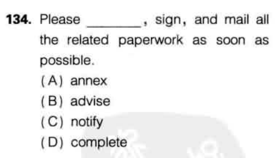


140. if we hire more experienced employees, we will continue to grow and prosper well ______ the next decade. 

(A) to

(B) of 

(C) as 

(D) into


**(A) to**：通常用于表示“到达某个时间点”，但一般不会与“时间段”（如“the next decade”）搭配，例如 **"to next Monday"**（到下周一）是可以的，但 **"to the next decade"** 不是地道表达。

**(B) of**：表示“……的”，但不符合句子结构，例如 **"the start of the next decade"** 是正确的，但这里不适合。

**(C) as**：通常表示“当……时”或“作为……”，不符合语境。

**(D) into**：表示“进入”，用来描述一种**从现在持续到未来的过程**，例如 **"into the future"（进入未来）**，**"into the next decade"（进入下一个十年）**，符合句意。


139) ___ a security alert, personal belongings should not be left unattended

A in spite of

B with regard to

C due to

D as of


reputation 名声

**原句：**
"We may well be sure that should you favorably consider our proposal."

**翻译：**
我们完全可以确信，如果您能积极考虑我们的提议。

 语法分析

1. **主句：**
   - **主语：** We
   - **谓语：** may well be sure
   - **宾语从句：** that should you favorably consider our proposal
2. **宾语从句：**
   - **结构：** that + 条件句
   - **条件句：** should you favorably consider our proposal
     - **倒装结构：** "should you" 是 "if you should" 的倒装形式，表示假设条件。
     - **主语：** you
     - **谓语：** favorably consider
     - **宾语：** our proposal

 详细解释

- **"may well be sure"：** 表示有充分的理由相信某事。
- **"that should you favorably consider our proposal"：** 这是一个条件句，表示假设对方积极考虑提议，主句中的确信是基于这个假设。

总结

这句话表达了说话者对对方积极考虑提议的信心，语法上通过主句和条件从句的结合，清晰地传达了这一意思。


## test 5


104.___with an intricate trouble, one should concentrate on what he can do best.
(A) Face
(B) Faced
(C) Facing
(D) To face

intricate = complicated = complex 

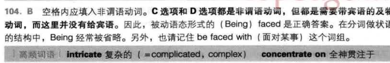


105. Until recently there was no ___ of being promoted.
(A) assure
(B) assured
(C) assurance
(D) assuring


promotion 晋升

句子的意思是：“直到最近，晋升都没有保障。”

- **(C) assurance（名词）**：意思是“保证、确保”，符合句子的逻辑和语法需求，正确答案。
  - 例：**We need assurance that the project will be completed on time.**（我们需要保证这个项目会按时完成。）
- **(D) assuring（现在分词/形容词）**：
  - 作为现在分词，它需要和助动词搭配（如“is assuring”），但这里没有助动词，因此不适合。
  - 作为形容词时，意思是“令人放心的”，但这里需要的是名词，因此也不符合。
  - 例：**He gave me an assuring smile.**（他给了我一个令人放心的微笑。）


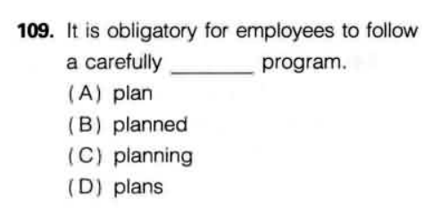

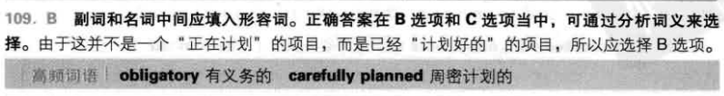

obligatory 15的 obligation 义务


It's hard to pay no attention to a market of a growing middle-class with higher disposable incomes

disposable incomes 可支配收入


114. ___the company is upgrading its inter-office mailing system, employees will still proceed with their work as planned
     (A)Even if
     (B) In short
     (C)As if
     (D)According


Even if（即使）

- 这个短语表示“即使某件事情发生，另一件事情仍然会发生”，符合句子的逻辑。
- 例：**Even if it rains tomorrow, we will still go hiking.**（即使明天下雨，我们仍然去远足。）
- 这里表示即使邮件系统在升级，员工的工作不会受到影响，符合语境。

As if（好像、仿佛

- 用于描述某种假设或不真实的情况，但这里并不是在描述员工“假装”邮件系统在升级，而是确实在升级，所以不适合。
- 例：**He talks as if he knew everything.**（他说话的样子好像他什么都知道。）


demanding job 高要求工作   		allocate 分配


129.Workers should keep in mind that ___ using this material carelessly may result in serious accidents since it is lethal.
(A) they
(B) their
(C)them
(D)themselves


their 

- 物主代词 **“their”** 可以修饰动名词 **“using”**，形成 **“their using this material carelessly”**，表示 **“他们的使用方式”**，符合语法和语义要求。
- 例：**I appreciate your helping me.**（我很感激你的帮助。）
- 这里 **“your helping”** 结构与题目中的 **“their using”** 结构相同，符合语法规则。


132. ___the market' s rapid growth, the start-up venture could surpass the established company within the next 3 years.

(A) So as to
(B) Furthermore
(C) According as
(D) Given


**(A) So as to **

- **“So as to”** 表示 **“为了……”**，通常后接动词原形（如 **“so as to achieve success”**）。
- 但这里的 **“the market’s rapid growth”** 是 **名词短语**，不能用 **“so as to”** 连接。

**(B) Furthermore **

- **“Furthermore”** 作为副词，表示 **“此外”**，通常用于补充信息，不能引导原因状语。
- 例如：**“The company is growing rapidly. Furthermore, it has secured new investors.”**
- 这里需要一个引导原因的表达，**“furthermore”** 不合适。

**(C) According as **

- **“According as”** 是老式用法，意思是 **“根据……”**，但几乎不用于现代英语，且通常后接从句，而这里后面是名词短语 **“the market’s rapid growth”**，语法错误。

**(D) Given **

- **“Given”** 作为介词，表示 **“考虑到……/鉴于……”**，后面可以接 **名词、名词短语**，符合本句结构。
- 例如：**“Given his experience, he is the best candidate for the job.”**（鉴于他的经验，他是这份工作的最佳人选。）
- 在本题中，**“Given the market’s rapid growth”**（考虑到市场的快速增长）合理且符合逻辑。


133. As a way of giving incentives, the pharmaceutical company is announcing that all of its workers are ___  for  membership at a nearby resort.

 (A) remarkable  (B) allowable  (C) dependable  (D) eligible

resort 度假地


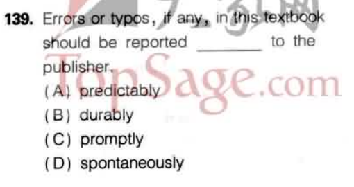

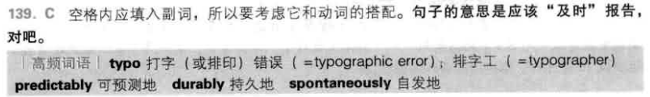


lift a ban 解除禁令

contradict 顶撞


## test 6

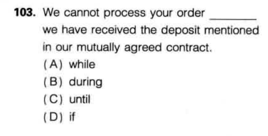

 deposit  定金、存款、沉淀


in case (that) = in case of = in the event that / of


题目句子：
 **For most cases, working with colleagues with competence has ______ value as a high compensation.**
 **（在大多数情况下，与有能力的同事一起工作与高薪一样有价值。）**


defective 有缺陷的

refrigerator 冰箱


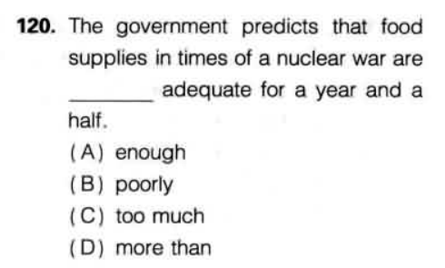

**A. enough adequate**
 → 这是错误搭配，"enough" 通常放在形容词后面，如 "adequate enough"（但这本身也不自然）。而且 "adequate" 本身已经有“足够”的意思，用 "enough" 修饰它重复了。

**B. poorly adequate**
 → 这也不成立。"Poorly" 是副词，不能修饰形容词 "adequate"。而且意义上也矛盾，"adequate" 是“足够的”，“poorly adequate”意思是“差地足够的”，不通顺。

**勉强合格 (miǎnqiǎng hégé):** Barely adequate, just passing.

"more than adequate" 意思是“绰绰有余”


“**Beside**” 是个多义词，主要有以下几种用法，注意它和 **besides** 的区别：

------

1. **介词：在……旁边**

表示空间上的“在……旁边”，物理位置。

- 例句：
  - He sat **beside** me.（他坐在我旁边。）
  - There is a lamp **beside** the bed.（床旁边有一盏灯。）

------

2. **短语：beside the point**

意思是“离题的，不相关的”，常用于议论话题时。

- 例句：
  - Your opinion is interesting, but it's **beside the point**.（你的意见很有意思，但不相关。）

------

3. **短语：beside oneself (with emotion)**

表示“（因情绪而）失去控制”，常见搭配为 **beside oneself with joy/rage/fear**。

- 例句：
  - She was **beside herself with joy**.（她欣喜若狂。）
  - He was **beside himself with anger**.（他怒不可遏。）

------

 ⚠️ 注意：**beside** ≠ **besides**

- **beside** = “在旁边”
- **besides** = “除了……之外，还……” 或者“此外”


选出正确的词填空：beside 还是 besides？

1. He stood ______ the window.
2. ______ English, she speaks French and German.
3. That’s ______ the point. We need to focus on the real issue.
4. She was ______ herself with worry.


**He stood beside the window.**
 → 表示空间位置，“在窗边” ✔️

**Besides English, she speaks French and German.**
 → besides 表示“除了……还”，意思是“她除了英语还会法语和德语” ✔️

**That’s beside the point.**
 → 固定搭配，意思是“那不相关，离题了” ✔️

**She was beside herself with worry.**
 → 固定表达，表示“她忧虑得不知所措” ✔️


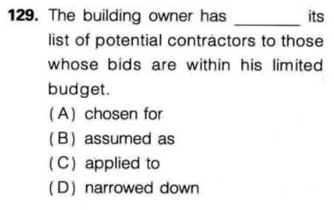

A. **chosen for**

→ “choose for” 表示“为……选择”，但句子主语是 “has chosen for its list...” 不通顺，语义也不符。
 ✘ 错误。

B. **assumed as**

→ “assume as” 不是常见固定搭配，语义也不通顺，“assume” 意为“假定”，和“缩小名单”无关。
 ✘ 错误。

C. **applied to**

→ “apply to” 表示“适用于”，通常主语是规则、法律之类的，不能用于“list of contractors”。句子结构不合适。
 ✘ 错误。

D. **narrowed down**

→ “narrow down” 表示“缩小（范围）”，搭配 “narrow down A to B” 完全符合句意：

bids 出价 投标

 “将潜在承包商的名单缩小到那些投标在预算内的人。”
  正确。


132 **They’ll buy a stock only at a reduced rate to what they perceive is its ______ value.**

选项： (A) intrinsic
 (B) applicable
 (C) deliverable
 (D) critic


**intrinsic**（本质的，固有的）
  搭配固定：**intrinsic value 本质价值/内在价值**，正是金融术语，表示股票本身的实际价值。
 → **正确搭配，句意通顺。**

applicable tax 适用税率

critic 评论家


extinction 灭绝

decadence 颓废、衰退

The empire’s fall was attributed to years of **decadence**, corruption, and political instability.
 （这个帝国的衰亡被归因于多年的堕落、腐败和政治不稳定。）

Eating chocolate cake for breakfast feels like pure **decadence**, but I don’t regret it.
 （早餐吃巧克力蛋糕感觉纯属放纵，但我一点也不后悔。）


135 The leader from the labor union is about to reach a ______ agreement with the management which took a tough stance before.

A tentative

B domesticated

C talkative

D consulted


**A.tentative**（试探性的，暂时的）
  搭配固定：**tentative agreement** 表示“初步协议，暂时协议”。符合语境，说明双方关系紧张，只达成试探性协议。

**B. domesticated**（被驯养的）
 ✘ 形容动物或植物，不修饰“agreement”，语义不通。

**例句**：Dogs were **domesticated** thousands of years ago to help humans hunt and guard their homes.
 （狗在几千年前被驯养，用于帮助人类狩猎和守卫家园。）

**C. talkative**（健谈的）
 ✘ 形容人，不形容“agreement”，语法错误。

**例句**：She’s usually quiet, but today she’s unusually **talkative** at the meeting.
 （她平时很安静，但今天会议上出奇地健谈。）

**D. consulted**（被咨询的）
 ✘ 过去分词，修饰 agreement 不合适，没有“被协商的协议”这种说法。

**例句**：The lawyer was **consulted** before they signed the contract.
 （他们在签合同前咨询了律师。）


solely 唯一的


分词小练习

单选题

The police arrested a man _______ near the crime scene.
 (A) see (B) saw (C) seen (D) seeing

I love reading books _______ different cultures and histories.
 (A) describing (B) described (C) are described (D) describe

The products _______ in this catalog are available until June.
 (A) list (B) listing (C) listed (D) lists

修改错误

We visited a museum exhibit show the life of ancient people.
 → 修改后：_________________________

Please check the documents are attached to the email.
 → 修改后：_________________________


(C) seen   (A) describing   (C) listed 

We visited a museum exhibit showing the life of ancient people. 

Please check the documents attached to the email.


143

in the unlikely event of "在（不太可能的）......情况下" 用于假设负面事件发生时使用


147 
时间 + at the latest "最迟不超过" = no later than ...


# 新东方阅读全真模拟

## test 1

111 It will be next to impossible to ______ a room at the Ashton Hotel this week because of the film festival.

reserve / appoint


**appoint** 后面只能接人（职位），不能接“房间”

“预订房间”正确动词是 **reserve**

| 单词        | 词性 | 意思       | 示例                                     |
| ----------- | ---- | ---------- | ---------------------------------------- |
| appointment | 名词 | 预约       | I have an **appointment** with a client. |
| appoint     | 动词 | 任命、委派 | He was **appointed** CEO last year.      |


112 precisely 准确地

113 sports complex 体育中心 
116 favorable(有利的)和 favorite(特别喜爱的)

117 strike 罢工

119 “纪念…”的表达方式是in celebration of...，

121 prompt adj 迅速的 | n 提示

122 retail 零售


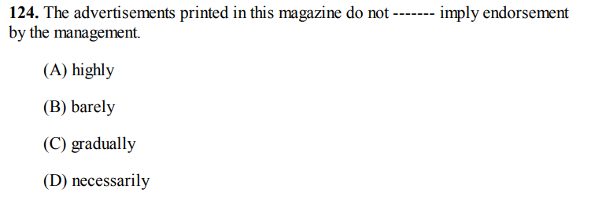


意思是：本杂志刊登的广告**并不一定意味着**获得了管理层的认可。

正确：**do not necessarily imply** = **并不一定意味着**，固定搭配。
 → 完美契合句意，强调广告并不等于管理层的背书。

**not necessarily + 动词** → 并不一定……，常见搭配。

例：Success does not necessarily mean happiness.
 → 成功**并不一定意味着**幸福。

endorsement 支持/代言

the issue of full independence received overwhelming endorsement  完全独立的议题得到了压倒性支持


126. The airline requested a ------- call to ensure a seat on my flight back home. (A) confirm (B) confirmed (C) confirming


 正确：**confirmation call** 是固定搭配，表示“确认电话”。

类似搭配

- **confirmation email** → 确认邮件
- **reservation number** → 预订号
- **appointment letter** → 任命函


128 sound 殷实的，资金充实的；健全的


Q131 - 134

key mortgage rates 主要抵押贷款利率

**Royal Bank revealed its plan to cut key mortgage rates by a tenth of a percentage point across the board, while TD Canada Trust will decrease its rates by the same ______ except for its 10-year rate.**

(A) margin (B) allowance (C) space (D) surplus

在经济金融语境中，**by the same margin** 是固定搭配，表示“相同幅度/幅度相同”。
 → 这里正是指“TD也以**相同幅度**降息”。

**profit margin** → 利润率

**by a narrow margin** → 以微弱优势

**margin of error** → 误差幅度


path除了可以 表示“小路”之外，还可表示“(实现某事所需要的)计划，成功的途径”等。


139 The city’s development plan includes the addition of more cycling ------- to our streets. 

(A) admission (B) entrance (C) access (D) pass


access除了“接 近”的意思之外，还包括“入口，通路”的意思

intention 意图、目的


140 This, of course, is with the intention of encouraging greater cycling ------- by our citizens in an effort to mimic the benefits other global cities have experienced... 

(A) participate (B) participation (C) participates (D) participated


participation 参与 n

participate v

participant 参与者 n


145. (A) prevalent (B) surfacing (C) foreseeable (D) ongoing

prevalent 形容**趋势、现象**，如 prevalent disease，不修饰 future。

surfacing 浮现的，显现的

foreseeable 可预见的

ongoing 进行中的


📌 imply 的常见含义 + 例句

1. **暗示，表明（不直接说出）**

指说话人没有明说，但话中有含义，对方能推断出来。

Are you **implying** that I made a mistake?
 → 你是不是**在暗示**我犯错了？
 （对方没说“你错了”，但话里有这层意思。）

2. **意味着，说明（逻辑上的含义）**

一件事**必然会引出**的后果或结论。

**例句：**

- Higher profits **imply** increased efficiency.
   → 更高的利润**意味着**更高的效率。
   （不需要明说，从利润可以得出这个结论。）

3. **包含（某种意义），蕴含**

> 某种行为、声明、条件**自然包含某意义**。

**例句：**

- His refusal **implied** a lack of interest.
   → 他的拒绝**意味着**他不感兴趣。
   （拒绝这个行为“蕴含”了这个意思。）

| 搭配                    | 意思          |
| ----------------------- | ------------- |
| **imply that + 句子**   | 暗示……        |
| **imply a consequence** | 表明某种结果  |
| **be implied by**       | 被……暗示/包含 |

rapport （融洽）关系


**nudge**

→ 原意是“轻推一下”（通常用胳膊轻推别人）
 → 在口语中，引申为“**轻轻推动、鼓励、提醒一下**”
 ✔ 语气是**温和的推动，不是强迫**。

**nudge sb to do sth** → 轻推/鼓励某人做某事

She gave me a gentle **nudge** to start exercising.
 → 她**轻轻鼓励**我开始锻炼。


lobby 大厅

infant 婴儿

**cause** 

medical cause = 医疗事业 / 医疗相关的公益目标

- **捐血活动**
   → Supporting a medical cause by donating blood.
   （通过献血支持医疗事业。）
- **疾病研究**（比如癌症研究、疫苗研发）
   → Raising funds for cancer research is a medical cause.
   （为癌症研究筹款是医疗事业的一种。）
- **医疗志愿服务**
   → Volunteering at a hospital for a medical cause.
   （为医疗事业去医院做志愿者。）


in conjunction with 结合


warehouse 仓库

inventory 存货


tranquil courtyard 宁静的庭院

artistic endeavor = 艺术创作的努力 / 艺术追求 / 艺术事业 	  **endeavor** → 努力、尝试、事业（较正式）

- She dedicated her life to **artistic endeavors** such as painting and sculpture.
   → 她一生致力于**艺术创作**，如绘画和雕塑。
- Funding is available to support local **artistic endeavors**.
   → 有资金支持本地的**艺术活动/创作事业**。


cozy place 舒适的地方

bargain 便宜货

| 比较点   | **bargain**                                  | **contract**                               |
| -------- | -------------------------------------------- | ------------------------------------------ |
| 语气     | 口语、非正式                                 | 正式、书面                                 |
| 法律效力 | 一般无（或弱）                               | 有法律效力                                 |
| 场合     | 购物、交易、口头协议                         | 雇佣、租赁、商业、法律事务                 |
| 常用搭配 | strike/make a bargain good bargain（便宜货） | sign a contract contract terms（合同条款） |


of 的时间用法

**Impressions should be written within two hours of completing the interview.**
 → **完成面试后的两小时内，必须记录申请者印象。**

**within two hours of X** → “在 X 之后的两小时内”

整体含义：**从完成面试那一刻起计，两小时内完成某事**

| 结构                            | 中文意思         |
| ------------------------------- | ---------------- |
| within a day **of leaving**     | 离开后的24小时内 |
| within a week **of signing**    | 签署后的1周内    |
| within two hours **of arrival** | 到达后的两小时内 |


All sales are final  ：**所有商品一经售出，概不退换**


# 新东方听力全真模拟

## test 1

lean 倚靠

**attend** + 名词（不带 to） → 通常是 “参加”

- I will attend the meeting.（我要参加会议。）

**attend to** + 名词 → “处理、照料”

- I will attend to the problem.（我会处理这个问题。）

hall 会堂

ink cartridges 墨盒

basement 地下室

errand 差事

morale 士气

| 单词        | 含义         | 适用范围           | 特点                     |
| ----------- | ------------ | ------------------ | ------------------------ |
| competition | 比赛、竞争   | 泛指所有比赛、竞赛 | 单场或系列都可，形式多样 |
| tournament  | 锦标赛、联赛 | 通常是体育类比赛   | 有多轮对抗，最终决出冠军 |

“**less than stellar**” 是一个很地道、委婉的表达，意思是 **“不太好、不理想、差强人意”**。

charitable function  慈善活动

**ministry**  政府部门

**Ministry of Education** → 教育部

**Ministry of Health** → 卫生部

**Ministry of Defense** → 国防部

staircase 楼梯

Avenue 大街

garage 车库

**on the ground floor** 的意思是：**在一楼、在地面层**。 （英式）

receive 接待 v 

reception 接待 n

receptionist 接待员

transportation 运输

carpooling 拼车

accommodations n住宿

depart for 飞往…

refreshment 茶点 

re-route 改变航线

terminal 航站楼 

 例句：

- We arrived at **Terminal 2**.
   → 我们到了 2 号航站楼。

 延伸：

- bus terminal → 客运总站（长途汽车站）
- train terminal → 火车终点站


**bulletin 定期发布**的**简洁信息**

The news **bulletin** reported the earthquake.
 → 新闻简报报道了地震。

Please check the **bulletin board** for updates.
 → 请查看公告栏获取最新信息。

announcement  **宣布某件具体事情**，更注重“**发布动作**”。

例句：

- The manager made an **announcement** about the new policy.
   → 经理宣布了新政策。
- We have an important **announcement** to make.
   → 我们有个重要消息要宣布。


## test 2

assemble 

组装，装配

I need to **assemble** the furniture.
 → 我要组装这套家具。

集合，聚集

The students **assembled** in the hall.
 → 学生们在大厅集合。


recall ≈ remember

**recall**：像是“**翻箱倒柜地找记忆**”，有点费劲、更正式。

**recall** 还有一个意思：**召回（产品）**

- The car was **recalled** due to a defect.
   → 这辆车因缺陷被召回了。

sneakers  运动鞋

**a pair of sneakers** → 一双运动鞋 ✅

🇬🇧 **trainers** = sneakers 


call it a day 收工、下班


| 词             | 中文            | 强调内容           |
| -------------- | --------------- | ------------------ |
| **plant site** | 厂区地址 / 厂址 | 地点、厂区位置     |
| **factory**    | 工厂            | 实际建筑、生产场所 |

plant site 指的是**工厂所在的地理位置**，侧重“**地点**”

The company chose a new **plant site** near the port.
 → 公司选了港口附近的新厂址。

**factory** 偏向生产

The **factory** produces car parts.
 → 这家工厂生产汽车零件。


| 词             | 中文           | 类型           | 用法/含义                        |
| -------------- | -------------- | -------------- | -------------------------------- |
| **account**    | 账户/账目/账号 | 名词/动词      | 银行账号、网站账号、解释原因等   |
| **accounting** | 会计（行业）   | 名词（不可数） | 指会计工作、会计学、财务处理系统 |


lawn 草坪


beyond 超越

- beyond expectation 超过预期

| 用法类型     | 中文含义            | 示例句子                                        | 备注说明             |
| ------------ | ------------------- | ----------------------------------------------- | -------------------- |
| **空间**     | 在……之外            | The village is **beyond** the mountains.        | 实体位置，超出某地   |
| **时间**     | 超过某时间点        | Don’t stay out **beyond** midnight.             | 超过某个时间         |
| **程度**     | 超出、无法理解/修复 | The damage is **beyond** repair.                | 无法修复、控制、理解 |
| **比较**     | 超过、远超标准      | She’s **beyond** beautiful.                     | 程度非常深，超出常规 |
| **理解**     | 超出理解范围        | It’s **beyond** me why he left.                 | “我搞不懂……”         |
| **常见搭配** | 固定短语            | beyond doubt（毫无疑问） beyond control（失控） |                      |


blockbuster 大片

sequel 续集

box-office 票房

spacious 宽敞的

例：The living room is **spacious** and bright.
 → 客厅宽敞明亮。

**spacious vs roomy**：
 → 都是“宽敞”，但 **spacious** 更正式、偏“大空间”；
 → **roomy** 偏小空间如“a roomy car”（车里宽敞）

**spacious vs vast**：
 → **spacious** 形容房间、楼层；**vast** 多形容自然如“vast desert”


Festivities 节庆活动


# 新跨栏

## test 1

merchandise 商品，货物

- 更偏向于**商业销售场景**，常指商店或公司**用于销售的商品**。
- 含义比“goods”**略窄**，通常是**成品**、可在市场上出售的东西。
- 语气更正式、书面，尤其用于商业、零售、批发行业。
- **不可数名词**，没有复数形式。

**例句**：

- The store offers a wide range of merchandise.
   这家店提供种类繁多的商品。
- All merchandise must be paid for before delivery.
   所有商品必须先付款再交货。


goods

- **含义更广**，指任何可交易的“物品”或“货物”。
- 可用于**法律、经济、商业等多种语境**。
- 可以是原材料、半成品、成品，也可以是消费者商品。
- **可数/不可数**：通常用复数形式“goods”，但意义上为不可数。

**例句**：

- The company imports goods from several countries.
   这家公司从多个国家进口货物。
- All goods must be inspected before shipping.
   所有货物在发货前必须检验。


fold 折叠

unfold 展开

Utensils  餐具

set out = 摆放、布置

roll up 卷起

geometric 几何的

| 英文              | 中文                                | 词性   |
| ----------------- | ----------------------------------- | ------ |
| **geometry**      | 几何学                              | 名词   |
| **geometrician**  | 几何学家（较少用）                  | 名词   |
| **geometer**      | 几何学家（常用）                    | 名词   |
| **geometrical**   | 几何学的（=geometric，更正式/书面） | 形容词 |
| **geometrically** | 几何学地，从几何角度                | 副词   |

ceiling 天花板

potted plant 盆栽

**pot** 是一种“容器”，可以是煮东西的锅（cooking pot）、喝茶的壶（teapot）、种花的花盆（flower pot）。

重点是它的核心含义是“装东西的容器”。

a mechanic 机械师


| 短语/词组                 | 含义            |
| ------------------------- | --------------- |
| **have consequences for** | 对……有后果/影响 |


director 主任、主管、导演

执行官（executive）

**CEO(Chief Executive Officer)**（最高执行官）

场景举例（具体事务）

| 事务                           | 谁负责？                                |
| ------------------------------ | --------------------------------------- |
| 公司要不要进入东南亚市场？     | **董事会** 决定                         |
| 如何在东南亚设点、招人、推广？ | **CEO 和团队** 执行                     |
| 年底公司利润下滑，要裁员？     | **董事会** 审批裁员计划，执行官负责落实 |
| 新产品如何设计，怎么推广？     | **执行官** 决策                         |
| 新任 CEO 任命                  | **董事会** 投票                         |


retain a receipt 保留收据

out of toner 没有墨粉了 

cartridge 墨盒

what a relief 真让人松了一口气

handout 宣传材料、传单

reimburse 补偿（经常和receipt一起出现）


 contact lenses 隐形眼镜

**lens / lenses**     镜片 / 镜头（复数）

**place a commercial**  **place** = 投放、刊登（广告专用动词） **commercial** = 商业广告，尤指电视、电台或网络广告、

📌 商务英语常用：

**place an order**（下订单）、**place a call**（打电话）、**place an ad**（登广告）


edition 版本

| 含义              | 中文                   | 场景                             |
| ----------------- | ---------------------- | -------------------------------- |
| **1. 出版版本**   | 书籍/刊物的版本        | **first edition**（第一版）      |
| **2. 一期、一集** | 报纸、杂志、节目的一期 | **the Sunday edition**（周日版） |


advertising campaign 广告活动

苹果公司为了宣传新款 iPhone，会推出：

- 电视广告
- 社交媒体宣传
- 海报广告
- 网上视频广告

这些**不是单个广告**，而是**一整套广告策划**，这个就叫：

> **an advertising campaign**


# 随机笔记

## MR.INCREDIBLES

“**agenda**” 是一个非常常用的英语单词，尤其在商务、会议和计划安排中，下面我们来详细梳理一下它的常见意思、例句和常见短语。

------

 🧠 常见意思：

1. **议程，日程表（会议、活动的安排）**
   - 指会议或活动的计划或事项列表。
   - 📌 这是最常用的意思。
2. **（隐藏的）意图、目的，动机**
   - 尤其指某人背后隐藏的企图或目标，常用于政治、新闻语境。

------

 📚 常见例句：

1. 表示“议程、日程安排”：

- 📌 **The first item on the agenda is the budget report.**
   议程上的第一项是预算报告。
- 📌 **Let’s move on to the next item on the agenda.**
   我们继续进行议程上的下一项。
- 📌 **Do you have the meeting agenda?**
   你有会议议程吗？

2. 表示“隐秘动机”：

- 📌 **I think he has a hidden agenda.**
   我觉得他另有图谋。
- 📌 **The politician was accused of pushing his own agenda.**
   🧾 常见短语 / 搭配：

| 短语               | 含义                               |
| ------------------ | ---------------------------------- |
| **set the agenda** | 制定议程，安排事项                 |
| **on the agenda**  | 在议程中，在计划中                 |
| **have an agenda** | 有目的、有计划                     |
| **push an agenda** | 推动某种（多为政治性或个人的）目的 |
| **hidden agenda**  | 隐藏的目的或动机                   |

------

 ✅ 用法总结：

- 如果你在**开会、制定日程表**，用它指“议程”。
- 如果你想表达某人有“不可告人的目的”，可以用 **agenda（尤指 hidden agenda）**。

------

需要我帮你写几个跟“agenda”相关的商务邮件句子或者模拟对话吗？


detain

**拘留、扣押**（尤其由警察或政府）
 👉 指暂时限制某人自由，尤其是法律、治安原因。

**耽搁、拖延**
 👉 指使某人暂时停留，不能按计划离开。

 常见例句：

1. **拘留 / 扣留（正式/法律语境）**

- 📌 **The police detained the suspect for questioning.**
   警方拘留了嫌疑人以进行讯问。
- 📌 **Several protesters were detained by the authorities.**
   数名抗议者被当局拘留。

 2. **耽搁、拖延（较轻）**

- 📌 **I’m sorry to detain you — I just need a quick word.**
   抱歉耽搁你一下——我只想说几句话。
- 📌 **He was detained at work and arrived late.**
   他被工作耽搁了，到得很晚。


tycoon

**大亨，巨头，企业巨擘**
 👉 通常指在商业、工业、传媒等领域非常成功、极有影响力和财富的人。

- 📌 **He is a real estate tycoon who owns properties all over the world.**
   他是一位房地产大亨，全球都有他的房产。
- 📌 **The media tycoon launched a new television network last year.**
   那位传媒大亨去年创办了一个新电视网络。
- 📌 **Tech tycoons are reshaping the future of communication.**
   科技巨头正在重塑通讯的未来。

| 单词             | 含义                                | 语气           |
| ---------------- | ----------------------------------- | -------------- |
| **tycoon**       | 非常成功的企业家/资本家             | 强调权力+财富  |
| **magnate**      | 权势人物，多用于工业、新闻          | 更正式         |
| **mogul**        | 与 tycoon 类似，常用于媒体/科技领域 | 略口语一些     |
| **entrepreneur** | 企业家，特别是初创企业家            | 中性、创新导向 |


legit


✅ 表示“合法的、正当的”：

- 📌 **Is this site legit? I don’t want to get scammed.**
   这个网站可信吗？我不想被骗。
- 📌 **He’s a legit businessman.**
   他是个正经做生意的人。

 👍 表示“真实的、可靠的”：

- 📌 **That job offer sounds too good. Is it even legit?**
   那个工作机会听起来太好了，有没有水分？
- 📌 **She’s a legit expert in this field.**
   她在这个领域是真正的专家。

🔥 表示“酷、很棒的”：

- 📌 **That concert was legit amazing!**
   那场演唱会简直太棒了！
- 📌 **This burger is legit the best I’ve had.**
   这个汉堡真的好吃到爆。


**“I know the drill”** 意思是：

> **我知道流程 / 规矩 / 一贯做法了。**
>  👉 暗示你对某件事已经很熟悉，无需再解释。


mythic 神话的

costumes 服装

👉 特定场合穿的服装，尤其是：

1. **戏服**（用于舞台、电影、表演）
2. **节日/派对装扮**（如万圣节、化装舞会）
3. **特定文化或历史时期的服装**（如中世纪服装）

📌 **The actors wore 18th-century costumes in the play.**
 演员们在剧中穿着18世纪的戏服。

📌 **She dressed up in a vampire costume for Halloween.**
 她穿着吸血鬼的装扮庆祝万圣节。

📌 **We had a costume party last night. It was so fun!**
 我们昨晚办了个化装派对，太有趣了！

| 搭配                    | 含义                    |
| ----------------------- | ----------------------- |
| **costume party**       | 化装舞会                |
| **Halloween costume**   | 万圣节装扮              |
| **traditional costume** | 传统服饰                |
| **costume designer**    | 服装设计师（舞台/影视） |
| **to be in costume**    | 穿着戏服 / 装扮好了     |


spectacular

**壮观的；令人惊叹的；精彩绝伦的**
 👉 通常指视觉上的震撼或事情的精彩程度。

**（口语）非常棒的，超出期待的**
 👉 也可以用来夸成果、成就、表现等。


 🎆 表示“壮观、震撼”：

- 📌 **The fireworks display was absolutely spectacular.**
   烟火表演太壮观了！
- 📌 **We had a spectacular view of the mountains from the hotel.**
   从酒店望出去的山景美得令人惊叹。

 🏆 表示“出色的、很厉害的”：

- 📌 **She gave a spectacular performance in the finals.**
   她在决赛中的表现非常精彩。
- 📌 **Their comeback was nothing short of spectacular.**
   他们的逆袭简直太惊艳了。

| 单词            | 含义           | 气场              |
| --------------- | -------------- | ----------------- |
| **great**       | 好的，很棒     | 👍 一般夸          |
| **amazing**     | 令人惊奇       | 😮 情绪多          |
| **awesome**     | 太棒了         | 😎 比较随意        |
| **spectacular** | 壮观、视觉震撼 | 🌟 视觉 + 强烈情绪 |


ignorance

**无知，愚昧，缺乏知识或意识**
 （尤其是对重要的事情不了解）

- 📌 **His ignorance of basic science is shocking.**
   他对基础科学的无知令人震惊。
- 📌 **Many problems come from ignorance, not malice.**
   许多问题源于无知，而不是恶意。
- 📌 **I apologize for my ignorance on the subject.**
   对这个话题不了解，还请见谅。
- 📌 **She remained in blissful ignorance of the truth.**
   她一直在幸福的无知中（不知道真相却很开心）。

| 词语                | 含义       | 语气                 |
| ------------------- | ---------- | -------------------- |
| **ignorant (adj.)** | 无知的     | 🚫 常被认为是贬义     |
| **unaware**         | 没注意到   | 🚦 中性偏软，比较口语 |
| **uninformed**      | 信息不足的 | 📄 偏正式，中性       |
| **naive**           | 天真幼稚的 | 🌱 轻微贬义，但可爱   |

------

“ignore”的名词形式并不是 “ignorance”❌，

虽然 **“ignore”** 是动词，但英语里**并没有一个直接的、日常用法里的“ignore的名词形式”**，不过可以根据语境用其他词来表达“忽略、不理会”的概念：

| 名词             | 含义                     | 对应情绪 / 语境        |
| ---------------- | ------------------------ | ---------------------- |
| **disregard**    | 忽视、不理会（正式）     | 中性偏负               |
| **neglect**      | 忽视、疏忽（可能带后果） | 常用于责任、工作、情感 |
| **indifference** | 冷漠、漠不关心           | 偏情绪类               |

1. **disregard**

- 📌 **His complete disregard for the rules is shocking.**
   他完全无视规则，令人震惊。

2. **neglect**

- 📌 **The building fell apart due to years of neglect.**
   那栋建筑因为多年疏于维护而破败。

3. **indifference**

- 📌 **Her indifference to his feelings was hurtful.**
   她对他感受的冷漠让人伤心。


excruciating 

 身体上的疼痛：

-  **I had an excruciating headache last night.**
   昨晚我头痛得要命。
- **The injury caused excruciating pain.**
   那伤痛得让人难以忍受。

情绪/心理/体验的折磨：

-  **Waiting for the exam results was excruciating.**
   等考试成绩的过程太煎熬了。
-  **That awkward silence was excruciating.**
   那段尴尬的沉默令人窒息。
- The movie was excruciatingly boring.
   那部电影无聊到令人难以忍受。

| 单词              | 程度  | 含义                |
| ----------------- | ----- | ------------------- |
| **painful**       | 普通  | 疼或让人难过        |
| **uncomfortable** | 弱    | 不舒服              |
| **excruciating**  | 强！🔥 | 极其痛苦 / 折磨人的 |


| 单词         | 含义             | 情感风格           |
| ------------ | ---------------- | ------------------ |
| **cute**     | 可爱，广义       | 最常用，亲切随意   |
| **adorable** | 惹人怜爱，超可爱 | 情绪更强、更甜更萌 |
| **lovely**   | 可爱、迷人       | 英式更常用，偏文雅 |
| **charming** | 有魅力的         | 有点优雅/迷人感    |
| **sweet**    | 甜美的、暖心的   | 偏性格、行为可爱   |


loan

- **贷款，借款**（尤指银行等金融机构提供的金钱）

  - She took out a loan to pay for her college tuition.
     （她申请了一笔贷款来支付大学学费。）
  - The bank approved his loan application within a week.
     （银行在一周内批准了他的贷款申请。）

  **借出之物（可泛指金钱、书籍等）**

  - Thanks for the loan of your camera—it really came in handy!
     （谢谢你借我相机——真的很有用！）
  - The museum has a Van Gogh on loan from a private collector.
     （这家博物馆展出了一幅私人收藏的梵高作品。）

 **动词：to loan**

1. **借出，出借**（主要用于美式英语）
   - I can loan you my umbrella if you don’t have one.
      （如果你没有伞，我可以借你一把。）
   - He loaned his car to a friend for the weekend.
      （他把车借给了朋友周末用。）


> 💬 **俚语/流行语用法**：

- “**Loan shark**”：高利贷者，非法放贷者。
  - He got trapped in debt with a loan shark.
     （他陷入了高利贷者的债务陷阱。）

**on loan**（被借出）

- This painting is on loan from the Louvre.
   （这幅画是从卢浮宫借来的。）


| 单词         | 语义                      | 语气/语域     | 场景示例                                 |
| ------------ | ------------------------- | ------------- | ---------------------------------------- |
| **loan**     | 金钱或物品的临时借出      | 正式/金融术语 | 银行贷款、图书馆借书                     |
| **lend**     | 借出（更口语/动词常用）   | 较口语        | I’ll lend you some money.                |
| **borrow**   | 借入（与 loan/lend 相对） | 常规用语      | Can I borrow your pen?                   |
| **lease**    | 租借（长期合同性质）      | 法律/商业用语 | He leased the office for 5 years.        |
| **mortgage** | 抵押贷款（特指买房）      | 金融术语      | They took out a mortgage to buy a house. |


eccentric

**形容词：eccentric**

1. **行为古怪的，异乎寻常的（尤指有趣或引人注目）**
   - The professor was known for his eccentric habits, like wearing pajamas to lectures.
      （这位教授以他古怪的习惯出名，比如穿睡衣来上课。）
   - She has an eccentric fashion sense that makes her stand out.
      （她的穿衣风格很独特，总是与众不同。）
2. **偏心的（物理学/工程中，指轨道等不是以中心为圆心）**
   - The gears have an eccentric motion due to the offset axle.
      （由于轴偏移，齿轮有偏心运动。）
   - The satellite travels in an eccentric orbit around the planet.
      （这颗卫星沿着一条偏心轨道围绕行星运行。）

 **名词：eccentric**

1. **古怪的人，行为出格的人**
   - He’s a lovable eccentric who talks to plants and sings in public.
      （他是个讨人喜欢的怪人，会和植物说话还会在街上唱歌。）
   - The town has always had a few eccentrics living quietly on its edges.
      （这个小镇总有些古怪人物在安静地生活。）

> 💬 **流行语/语境表达**：

- “**Delightfully eccentric**” 常用来描述有魅力但行为古怪的人。
  - She’s delightfully eccentric—never afraid to be herself.

来自拉丁语 *eccentricus*，意为“偏离中心的”，又源于希腊语 *ekkentros*：

- *ek-*（外）+ *kentron*（中心）→ "偏离中心的"

最早用于天文学，描述天体轨道“非圆心”的运动，后引申为“思想/行为脱离常规”。


**an eccentric genius**（古怪的天才）

- Many artists are seen as eccentric geniuses.

**eccentric behavior**（古怪行为）

- The actor’s eccentric behavior caught the media’s attention.

**eccentric orbit**（偏心轨道）

- Pluto follows a highly eccentric orbit.


| 单词          | 含义                         | 语气/语域          | 使用场景 & 例句                   |
| ------------- | ---------------------------- | ------------------ | --------------------------------- |
| **eccentric** | 古怪但有趣（多为褒义或中性） | 正式/文学/中性     | She’s eccentric but brilliant.    |
| **quirky**    | 古灵精怪，有创意的           | 轻松、口语化       | I love her quirky sense of humor. |
| **weird**     | 奇怪、诡异（可能贬义）       | 口语、情绪色彩强   | That movie was just weird.        |
| **odd**       | 奇怪、反常                   | 中性偏负面         | He has some odd habits.           |
| **bizarre**   | 极端怪异（常带惊讶感）       | 强烈负面或强调独特 | The whole situation was bizarre.  |


**advocate** /ˈæd.və.keɪt/

**动词** 

1. **主张；提倡；支持（某种理念、行动、改革）**
   - She advocates for equal rights in the workplace.
      （她倡导工作场所的平等权利。）
   - Doctors often advocate taking regular exercise.
      （医生常常提倡经常锻炼。）

 **名词**

1. **拥护者，提倡者，辩护者**
   - He’s a passionate advocate of environmental protection.
      （他是环保的热情倡导者。）
   - As a lawyer, she is an advocate for victims of domestic violence.
      （作为律师，她是家庭暴力受害者的辩护人。）
2. **律师（主要用于苏格兰及部分英联邦国家）**
   - He practiced as an advocate in Edinburgh for 10 years.
      （他在爱丁堡担任律师十年。）

 🔹 4. 常用短语词组用法

- **advocate for sth**（支持某事）
  - She advocates for animal welfare.
- **a strong/passionate advocate**（坚定的支持者）
  - He’s a passionate advocate of public healthcare.
- **legal advocate**（法律辩护人）
  - She worked as a legal advocate for refugees.

| 单词          | 含义                       | 情感语气 / 场景 | 示例                                     |
| ------------- | -------------------------- | --------------- | ---------------------------------------- |
| **advocate**  | 公开支持（多用于正式语境） | 中性/正式       | She advocates prison reform.             |
| **supporter** | 支持者（泛指）             | 常见、口语      | He’s a big supporter of the local team.  |
| **proponent** | 提倡者（正式/书面语）      | 正式、稍书面    | A leading proponent of renewable energy. |
| **champion**  | （某个事业的）积极拥护者   | 热情/正面色彩   | She’s a champion of women’s rights.      |
| **defender**  | 捍卫者（常用于辩护或保护） | 偏防御/法律色彩 | A defender of civil liberties.           |


super Pro good

**形容词：magnificent** /mæɡˈnɪf.ɪ.sənt/   

**壮丽的；宏伟的；壮观的**
 （多用于形容建筑、景色、艺术品等具有宏大美感的事物）

- The palace was absolutely magnificent, with gold-plated walls.
   （这座宫殿金碧辉煌，十分壮观。）
- We enjoyed a magnificent view of the mountains from the balcony.
   （我们从阳台上看到了壮丽的山景。）

**极好的；极出色的；卓越的**
 （强调程度高，可用于抽象事物或行为）

- You’ve done a magnificent job on the project.
   （你在这个项目上做得非常出色。）
- Her performance was simply magnificent.
   （她的表演简直太棒了。）


衍生词

| 词性     | 单词                | 例句                                                       |
| -------- | ------------------- | ---------------------------------------------------------- |
| 形容词   | **magnificent**     | The sunset was magnificent.                                |
| 副词     | **magnificently**   | The hall was magnificently decorated.                      |
| 名词     | **magnificence**    | The magnificence of the architecture stunned the tourists. |
| 动词短语 | **magnify**（放大） | Don’t magnify small problems.（别夸大小问题）              |

常用短语词组用法

- **a magnificent view**（壮观的景色）
  - From here you have a magnificent view of the city.
- **a magnificent performance**（精彩的演出）
  - The pianist gave a magnificent performance.
- **in all its magnificence**（以全部壮丽展现）
  - The cathedral stood in all its magnificence.
- **utterly/absolutely magnificent**（极其壮观）
  - The firework show was utterly magnificent.

| 单词            | 含义                               | 情感 / 语域          | 示例                      |
| --------------- | ---------------------------------- | -------------------- | ------------------------- |
| **magnificent** | 壮丽，出色（正式+强烈褒义）        | 正式/文学/演讲用词   | The view was magnificent. |
| **splendid**    | 极好的、辉煌的（略带英式色彩）     | 正式/书面语          | A splendid opportunity.   |
| **majestic**    | 威严的、雄伟的（带尊贵气质）       | 正式、常用于自然景观 | The majestic Himalayas.   |
| **grand**       | 宏伟的、堂皇的                     | 正式，稍偏奢华场景   | A grand ballroom.         |
| **glorious**    | 光荣的、壮丽的（常含情感和历史感） | 书面语/感情色彩浓    | A glorious victory.       |


荒谬的；可笑的；愚蠢的

| 单词             | 含义                           | 情感 / 语气         | 示例                                        |
| ---------------- | ------------------------------ | ------------------- | ------------------------------------------- |
| **ridiculous**   | 荒唐、愚蠢、好笑（含讽刺）     | 贬义/中性（口语多） | That’s a ridiculous idea.                   |
| **absurd**       | 荒谬到违反逻辑或理性           | 更正式/哲学语境多   | The whole concept is absurd.                |
| **ludicrous**    | 荒谬到令人发笑（文学色彩更强） | 正式/更夸张感       | The idea was so ludicrous it made me laugh. |
| **preposterous** | 极度荒谬、荒诞不经             | 更书面、更夸张      | A preposterous claim.                       |
| **silly**        | 傻、轻率、幼稚（可爱/中性）    | 语气轻柔            | Don’t be silly, of course I like you.       |

| 你想表达…               | 推荐用词                   |
| ----------------------- | -------------------------- |
| 生活中搞笑/太夸张       | **ridiculous**             |
| 写作/议论文里谈“不合理” | **absurd** / **ludicrous** |
| 情绪化反驳              | **That’s ridiculous!**     |
| 贬低他人观点/言论       | **preposterous**           |


**uneventful** 

1. **没有特别事件的，平淡的**
   - The flight was long but **uneventful**.
      ✨（航班虽然很长，但没发生什么特别的事。）
   - Our weekend was pretty **uneventful**—just stayed home and watched movies.
      ✨（我们周末过得很平淡——只是在家看了电影。）
2. **（医学或程序中）无异常的，无并发症的**
   - The surgery was **uneventful**, and the patient is recovering well.
      ✨（手术顺利无异常，病人恢复良好。）


| 词汇       | 含义           | 语气       | 用法区别                                   | 例句                                      |
| ---------- | -------------- | ---------- | ------------------------------------------ | ----------------------------------------- |
| uneventful | 没有大事发生   | 中性或积极 | 常用于描述旅程、生活、过程等平稳无事的状态 | The drive home was uneventful.            |
| dull       | 无聊的，乏味的 | 稍带贬义   | 强调“无趣”、“无刺激”，而非“无事件”         | The movie was so dull I fell asleep.      |
| routine    | 例行的，惯常的 | 中性       | 强调“习惯性、重复”，带有规律性             | It was a routine check-up with no issues. |
| tranquil   | 宁静的         | 积极       | 多用于描述环境、氛围的宁静，强调心理感受   | The lake was tranquil and calm.           |


**casualty** 

1. **（战争、事故中的）死者或伤者**

- The explosion resulted in several **casualties**.
   ✨（爆炸导致数人死伤。）
- There were no **casualties** in the car crash.
   ✨（车祸中没有人员伤亡。）

2. **受害者、损失者（可比喻用法）**

- The company was a **casualty** of the financial crisis.
   ✨（这家公司是金融危机的受害者。）
- Traditional bookstores have become **casualties** of the digital age.
   ✨（传统书店成了数字时代的牺牲品。）


**civilian casualties**：平民伤亡

**suffer casualties**：遭受伤亡

**a casualty of war/politics**：战争/政治的牺牲品

| 词汇         | 含义             | 使用语境            | 区别说明                     | 例句                                |
| ------------ | ---------------- | ------------------- | ---------------------------- | ----------------------------------- |
| **casualty** | 死伤者、受害者   | 战争、事故、政治等  | 强调“人”的伤亡或被影响者     | The fire caused several casualties. |
| **fatality** | 死亡（事故导致） | 正式/官方报道中常用 | 更强调“死亡”（不包含受伤）   | The storm caused five fatalities.   |
| **victim**   | 受害者           | 各种负面事件中      | 强调“被害者”身份，不限于事故 | She was a victim of fraud.          |
| **loss**     | 损失、牺牲       | 正式或书面语        | 可指人，也可指物或抽象概念   | The team suffered a great loss.     |


**momentum** /moʊˈmen.təm/
 👉 **名词**：

1. **动量（物理）**

在物理中，**momentum** 指的是物体的运动量，公式是 *mass × velocity*（质量 × 速度）。

- The car lost **momentum** as it climbed the hill.
   ✨（汽车爬坡时失去了动量。）

2. **势头；动力；发展速度（比喻义）**

更常见于日常和商业场景，用来形容“事物发展的势头”或“做事的推进力”。

- The campaign is gaining **momentum**.
   ✨（这场活动正在积聚势头。）
- Once you get started, try to keep up the **momentum**.
   ✨（一旦开始，就尽量保持动力。）


 📈 商业/项目

- Our product launch gained **momentum** after going viral on social media.
   ✨（产品发布在社交媒体上走红后势头迅猛。）

🏀 体育

- The team lost **momentum** after the key player was injured.
   ✨（主力球员受伤后，整个队伍的势头也断了。）

 💪 个人努力

- I finally built some **momentum** with my study routine.
   ✨（我的学习节奏终于有点上道了。）


| 词汇         | 含义         | 差异说明                   | 例句                                         |
| ------------ | ------------ | -------------------------- | -------------------------------------------- |
| **momentum** | 动量、势头   | 强调**持续推进的力量**     | The project gained momentum quickly.         |
| **impetus**  | 推动力、刺激 | 更正式，多指**初始的推动** | His speech gave fresh impetus to the reform. |
| **drive**    | 干劲、动力   | 偏向个人的内在动力         | She has the drive to succeed.                |


**renounce** 

1. **正式放弃（权利、头衔、身份、信仰等）**

- He **renounced** his claim to the throne.
   ✨（他正式放弃了对王位的继承权。）
- She **renounced** her U.S. citizenship.
   ✨（她放弃了美国国籍。）

2. **断绝（关系）；宣布与…决裂**

- After the scandal, the organization **renounced** all ties with him.
   ✨（丑闻发生后，该组织宣布与他断绝一切关系。）

3. **拒绝承认；摒弃（信仰、暴力、恶习等）**

- He has **renounced** violence and is now promoting peace.
   ✨（他已经摒弃暴力，开始提倡和平。）

| 搭配短语                   | 含义           |
| -------------------------- | -------------- |
| renounce citizenship       | 放弃国籍       |
| renounce a claim/title     | 放弃主张/头衔  |
| renounce violence          | 拒绝暴力       |
| renounce worldly pleasures | 摒弃世俗享乐   |
| renounce ties with sb      | 与某人断绝关系 |


**summit** /ˈsʌm.ɪt/

1. **山顶；顶峰**（字面义）

- We finally reached the **summit** of the mountain.
   ✨（我们终于到达了山顶。）

2. **巅峰、极点**（比喻义）

- She is at the **summit** of her career.
   ✨（她正处于事业的巅峰。）

3. **峰会，高层会议**（政治/外交用法）

- The climate **summit** will be held next week in Geneva.
   ✨（气候峰会将于下周在日内瓦举行。）

| 词汇         | 含义                 | 区别说明                     | 例句                                 |
| ------------ | -------------------- | ---------------------------- | ------------------------------------ |
| **summit**   | 山顶；高层会议；巅峰 | 可实可虚；正式感强           | He spoke at the G7 summit.           |
| **peak**     | 顶点；高峰期         | 更常用，通俗口语；强调“极值” | Sales hit a peak in December.        |
| **pinnacle** | 顶峰（尤指成就）     | 多用于比喻义，文学感强       | She reached the pinnacle of success. |
| **apex**     | 顶点（较书面）       | 强调结构上的最高点           | The apex of the triangle.            |


massager

**按摩器（工具或电器）**

- I bought a new **foot massager** online.
   ✨（我在网上买了一个新的脚部按摩器。）
- This **electric massager** is great for relieving back pain.
   ✨（这个电动按摩器对缓解背痛非常有效。）

| 搭配短语                    | 含义                 |
| --------------------------- | -------------------- |
| **back/neck/foot massager** | 背部/颈部/脚部按摩器 |
| **electric massager**       | 电动按摩器           |
| **handheld massager**       | 手持按摩器           |
| **vibrating massager**      | 振动式按摩器         |


philodendron

**philodendron** /ˌfɪl.əˈden.drən/
 👉 **名词（可数）**：**喜林芋；蔓绿绒**
 是一类热带植物，常见于室内绿植装饰，具有大而有光泽的叶子，容易养活。


I just bought a **philodendron** for my living room.
 ✨（我刚买了一盆喜林芋放在客厅。）

**Philodendrons** are perfect for beginners—they're very low maintenance.
 ✨（喜林芋非常适合新手，几乎不需要特别打理。）

**philodendron** 来自希腊语：

- **philo-**（爱）
- **dendron**（树）
   👉 字面意思是 “tree-loving”（爱树的）——因为它喜欢攀爬、附着在树上生长。


**grip and grins**（非正式，新闻、政治语境）

👉 指**政客、名人等在公众场合或媒体前的“握手微笑”场面**，常带有表面功夫、仪式性的意味。

- **grip** = 握手
- **grin** = 露齿笑、大笑


| 语境         | 含义                | 举例                                        |
| ------------ | ------------------- | ------------------------------------------- |
| 📸 新闻、政治 | 表面握手 + 微笑合照 | G7 leaders' grip-and-grin moment            |
| 🦌 打猎文化   | 抓住猎物 + 微笑炫耀 | Hunter's grip-and-grin with a 10-point buck |


hypnotize 催眠


**redundant** /rɪˈdʌn.dənt/
 👉 **形容词**：多余的；冗余的；被裁员的（英式英语中）

1. **多余的；不必要的（语言、系统、结构等）**

- Avoid **redundant** expressions in your writing.
   ✨（写作中避免使用多余的表达。）
- “Free gift” is a **redundant** phrase—gifts are already free.
   ✨（“免费礼物”是个多余的表达——礼物本来就是免费的。）

2. **（英式）被裁员的；失去工作的**

- He was made **redundant** after the company downsized.
   ✨（公司缩编后他被裁了。）

3. **（计算机/工程）冗余的（用于备份）**

- The server has a **redundant** power supply in case of failure.
   ✨（服务器配有冗余电源，以防故障。）


**upstage** 

 2. ✅ **动词**（引申义，更常见！）

👉 指在社交、媒体、表演中 **抢了别人的风头；喧宾夺主**

- Don’t try to **upstage** the bride on her wedding day!
   ✨（别在新娘的婚礼上抢风头！）
- The CEO was **upstaged** by a surprise appearance from the founder.
   ✨（创始人突然现身，让CEO成了陪衬。）

 近义词对比（抢风头类）

| 词汇               | 语气                       | 用法区别                 | 例句                                    |
| ------------------ | -------------------------- | ------------------------ | --------------------------------------- |
| **upstage**        | 带轻微贬义，正式场合也可用 | 指抢风头、喧宾夺主       | She upstaged the main speaker.          |
| **outshine**       | 更中性，强调表现更出色     | 没有抢镜的意图           | He outshone everyone with his charisma. |
| **steal the show** | 更口语化，语气轻松         | 通常褒义，赞某人表现出色 | The kid totally stole the show.         |
| **overshadow**     | 更正式，有时带负面         | 指某人被压下去了         | Her achievements overshadowed his.      |

------


- **charisma**：一种**天生的领袖气质或磁场**，让人想跟随、敬佩
- **charm**：一种**迷人、讨人喜欢的个性或行为**，让人觉得亲近、愉快

| 维度       | **charisma**                 | **charm**                    |
| ---------- | ---------------------------- | ---------------------------- |
| ✨ 来源     | 天赋、气场                   | 个性、外在行为               |
| 👑 气质     | 领导力、信服力               | 可爱、亲和力                 |
| 🧠 感觉     | 让人“崇拜”“被吸引”           | 让人“舒服”“喜欢”             |
| 🔊 语气     | 强烈、正式                   | 轻柔、日常                   |
| 🤵 使用对象 | 政治家、领袖、演讲者、艺术家 | 朋友、恋人、服务人员、小孩等 |

 应用场景例子

| 场景     | 用 **charisma**                            | 用 **charm**                                    |
| -------- | ------------------------------------------ | ----------------------------------------------- |
| 商业演讲 | She has the **charisma** of a true leader. | ❌（charm 太轻）                                 |
| 初次见面 | ❌（太重）                                  | He has a lot of **charm**—very easy to talk to. |
| 政治领袖 | Charisma 是必备                            | He lacks **charisma**—people don’t follow him.  |
| 恋爱场景 | ❌（charisma 太“神性”）                     | I was drawn to her **charm** instantly.         |


amused 逗乐


“重要的” 对比

| 单词          | 如果缺了它…                | 强调                 | 用于哪类“重要”         |
| ------------- | -------------------------- | -------------------- | ---------------------- |
| **essential** | 根本无法运作               | 必不可少             | 基础、生存、构成元素   |
| **vital**     | 会导致严重后果（甚至死亡） | 极度重要（含生命感） | 健康、生命、安全相关   |
| **crucial**   | 成败会被决定               | 成败关键点           | 决策、转折点、项目进展 |
| **critical**  | 会发生危机、危险           | 危险 + 极其重要      | 医疗、应急、形势判断   |

| 中文类比                  | 说明                             |
| ------------------------- | -------------------------------- |
| **essential 是地基** 🧱    | 没它盖不了房子（必须的构成部分） |
| **vital 是血液/呼吸** 🩸   | 没它就活不了（攸关生死）         |
| **crucial 是关键一票** 🗳️  | 决定胜负的那一下（转折点）       |
| **critical 是紧急红灯** 🚨 | 危险、关键又急迫的状态           |

| 句子                                                     | 中文翻译                               | 为什么用这个词？                                      |
| -------------------------------------------------------- | -------------------------------------- | ----------------------------------------------------- |
| Water is **essential** to life.                          | 水是生命**必不可少**的。               | 没水活不了 → 是**构成生命的必须品**                   |
| Oxygen is **vital** for survival.                        | 氧气对生存是**至关重要**的。           | 没氧直接死 → 是**生命系统的运作关键**                 |
| It’s **crucial** that we act now to stop climate change. | 现在采取行动应对气候变化是**关键的**。 | 如果不现在做 → 结果会非常严重（强调**决定性时间点**） |
| The patient is in **critical** condition.                | 病人的情况**危急**。                   | 指身体状态已**接近崩溃/出事**（高危 + 急迫）          |


**hypnotize** 

1. 催眠术（字面义）

- The therapist **hypnotized** the patient to help with anxiety.
   ✨（治疗师用催眠帮助病人缓解焦虑。）

2. 着迷（比喻义）

- The performance was so powerful it **hypnotized** the entire audience.
   ✨（演出太精彩，观众全被迷住了。）
- She was **hypnotized** by the flickering candle flame.
   ✨（她被烛光的闪烁迷住了。）


**"Simulate"** 和 **"imitate"** 都有模仿的意思，但它们的使用场景和含义略有不同。

**1. Simulate**

- **含义**：模拟、仿真。指的是通过复制某种行为、过程、现象等来再现或重建某种状况，通常是为了学习、训练、测试或分析。
- **使用场景**：一般用于技术或科学领域，表示通过工具或系统再现某种情况，尤其是没有真实的环境时。
- **例子**：
  - The pilot used a flight simulator to simulate flying a plane.
  - Engineers simulate different weather conditions to test the durability of the building materials.

**2. Imitate**

- **含义**：模仿。指的是通过观察他人的行为、样式等，然后进行模仿，通常是为了学习或效仿。
- **使用场景**：通常用于人类行为或艺术领域，表示通过模仿他人来学习或展示相似的动作或风格。
- **例子**：
  - The child imitated his father's voice.
  - Many artists imitate the styles of famous painters to improve their technique.

**总结区别**：

- **Simulate** 更偏向于通过技术手段或人为操作来再现某种情况或过程，通常目的是为了测试、研究或训练。
- **Imitate** 强调通过观察和模仿他人的行为或风格，常见于学习或艺术创作中。


## TinTin

**fatal** /ˈfeɪ.təl/

 **义项1：致命的，导致死亡的**

表示会造成死亡或极其严重后果的。

- **例句：**
  - The accident was **fatal**, and two people died on the scene.
  - Smoking can be **fatal** to your health.

 **义项2：灾难性的，造成严重后果的**

用来形容某个错误、决定、行动等导致了不可挽回的严重后果。

- **例句：**
  - He made a **fatal** mistake during the negotiation.
  - Forgetting the password turned out to be a **fatal** error.

 词源解析

来自拉丁语 *fatalis*（命运的、注定的），源于 *fatum*（命运、预言），与 fate（命运）同源。


常见衍生词

| 词形   | 单词         | 释义                                 |
| ------ | ------------ | ------------------------------------ |
| 名词   | **fatality** | 死亡事件（尤指事故中的）；灾难性结果 |
| 形容词 | **fateful**  | 命中注定的（常含负面意味）           |
| 副词   | **fatally**  | 致命地，灾难性地                     |

**例句**：

- The train crash caused multiple **fatalities**.
- That was a **fateful** decision that changed history.
- He was **fatally** injured in the explosion.


**voyage**
 *n.* 航行，航程，远行（尤指水上或太空的旅程）

**海上或太空的远行**

- The ship sank during its maiden **voyage**.
   → 这艘船在它的处女航中沉没了。
- His dream was to take a **voyage** to space.
   → 他的梦想是进行一次太空航行。

**比喻意义：探索或人生的旅程**（文学用法较多）

- Life is a **voyage** full of unknown destinations.
   → 人生是一段充满未知目的地的旅程。
- Writing this book has been a personal **voyage** for me.
   → 写这本书对我来说是一次个人的探索之旅。


常用短语与例句

**maiden voyage**：处女航

- The Titanic sank on its **maiden voyage** in 1912.

**set out on a voyage**：启程航行

- They set out on a **voyage** across the Atlantic.

**long/dangerous voyage**：漫长/危险的航行

- The sailors survived a **dangerous voyage** through stormy seas.


近义词对比

| 单词           | 含义                  | 区别                               | 例句                                              |
| -------------- | --------------------- | ---------------------------------- | ------------------------------------------------- |
| **voyage**     | 长途航行（海上/太空） | 强调旅程的距离和“探险感”           | A **voyage** to Mars may take several months.     |
| **journey**    | 旅行（广义）          | 更通用，可陆地、空中、心理上的旅行 | The **journey** from Tokyo to Kyoto took 2 hours. |
| **trip**       | 短途旅行              | 常指日常、轻松的旅行               | I took a **trip** to the beach.                   |
| **expedition** | 探险                  | 带有科学、军事目的的探险           | The Arctic **expedition** was a success.          |

Arctic  北极

Antarctica 南极


**haddock**
 *n.* 黑线鳕（北大西洋一种常见的鱼，常用于食品加工）

它是一种重要的商业食用鱼，尤其在英国，被广泛用于炸鱼薯条（fish and chips）中。

例句：

1. I ordered **haddock** and chips at the pub.
    → 我在酒吧点了黑线鳕配薯条。
2. The smoked **haddock** has a strong, distinctive flavor.
    → 熏制黑线鳕有一种浓郁独特的味道。


**reprobate**
 *n.* 恶棍；道德败坏的人；无赖
 *adj.* 道德败坏的；堕落的

 例句：

1. (n.) He's a charming old **reprobate** who drinks too much and tells dirty jokes.
    → 他是个有魅力的老无赖，酒喝多了还爱讲黄段子。
2. (adj.) The movie portrays the **reprobate** lifestyle of 1920s gangsters.
    → 这部电影描绘了1920年代黑帮分子的堕落生活方式。

 词源解析

- 来自拉丁语 *reprobare*：**re-（反）+ probare（证明、认可）**
   → 意为“否定、拒绝接受”
- 跟 “probable”（可能的）、“probe”（调查）、“approve”（赞成）同源
- 本义：被神否定的人（中世纪宗教术语！），后来引申为“道德败坏的人”


**doom**
 *n.* 毁灭、厄运、劫数；判决
 *v.* 注定（失败、灭亡）；判决（古语感）

例句：

1. (n.) The city was on the brink of **doom**.
    → 这座城市濒临毁灭。
2. (v.) They were **doomed** from the start.
    → 他们从一开始就注定要失败。
3. (n.) He accepted his **doom** with calm resignation.
    → 他平静地接受了自己的命运。


词源解析

- 古英语 **dōm** = “审判、命运、法律”（跟 modern "deem" 同源）

 短语与例句

- **doom and gloom**：悲观厄运，凄惨气氛
  - The news is full of **doom and gloom** lately.
- **doomed to fail**：注定失败
  - Without proper planning, the mission was **doomed to fail**.
- **doomsday scenario**：世界末日场景
  - They prepared for a **doomsday scenario** like nuclear war.
- **sealed his doom**：注定了他的悲剧结局
  - His betrayal **sealed his doom**.


  近义词对比

| 单词            | 中文           | 区别                      | 例句                                   |
| --------------- | -------------- | ------------------------- | -------------------------------------- |
| **doom**        | 毁灭、劫数     | 偏文学/史诗，带“注定”之意 | The hero faced his **doom**.           |
| **fate**        | 命运           | 中性词，可好可坏          | It was her **fate** to lead.           |
| **destiny**     | 命运（多正向） | 更高贵/鼓舞               | He embraced his **destiny**.           |
| **destruction** | 毁灭           | 强调物理破坏              | The bomb caused total **destruction**. |
| **catastrophe** | 灾难           | 更偏突发/自然灾害         | The flood was a **catastrophe**.       |


**词义解释（含例句）**

**bequeath**
 *v.* （通过遗嘱）把…遗赠给；流传（思想、传统等）

这个词语气正式，常用于法律和文学语境，和死后遗产、精神传承相关。

- He **bequeathed** his entire fortune to his grandchildren.
   → 他把全部财产遗赠给了孙子孙女。
- The values our ancestors **bequeathed** to us must be preserved.
   → 我们祖先传下来的价值观必须被传承下去。

**常见衍生词**

| 词性 | 单词     | 含义                       |
| ---- | -------- | -------------------------- |
| v.   | bequeath | 遗赠，传给                 |
| n.   | bequest  | 遗产，遗赠物（常用于法律） |

**常用短语与例句**

- **bequeath something to someone**：把…遗赠给某人
  - She **bequeathed** her jewelry **to** her niece（侄女）.  
- **bequeath a legacy**：传下某种精神/传统
  - The poet **bequeathed a legacy** of wisdom and rebellion.  智慧和叛逆
- **bequest in a will**：遗嘱中的遗产
  - He made a generous **bequest** to the local library.


**1. 词义解释（含例句）**

**ransack**
 *v.* 洗劫、抢劫；（为找东西而）彻底翻找、翻箱倒柜地找

这个词可以用于暴力场景（抢劫、入室盗窃），也可以用在日常生活中，形容疯狂翻找。

- The burglars **ransacked** the house but found nothing valuable.
   → 小偷洗劫了这所房子，但没找到值钱的东西。
- I **ransacked** my room looking for my passport.
   → 我把房间翻了个底朝天找护照。

------

**2. 词源解析**

- 来自古挪威语 *rannsaka*：
  - **rann**（房屋）+ **saka**（搜查）→ 原意：搜查房子
- 英语中逐渐演变为：**暴力/混乱地搜查或洗劫**

------

**3. 常见衍生词**

这个词本身变化不多，主要以动词形式使用：

| 词性 | 单词      | 含义                         |
| ---- | --------- | ---------------------------- |
| v.   | ransack   | 洗劫、彻底翻找               |
| adj. | ransacked | 被洗劫一空的（被动语态常见） |

------

**4. 常用短语与例句**

- **ransack a place**：洗劫某地
  - Thieves **ransacked** the office during the holiday.
- **ransack one's memory**：拼命回忆
  - I **ransacked my memory** trying to remember his name.
- **leave a place ransacked**：把地方搞得一团糟
  - The kids **left** the playroom completely **ransacked**.

------

**5. 近义词对比**

| 单词              | 中文         | 区别                           | 例句                                                 |
| ----------------- | ------------ | ------------------------------ | ---------------------------------------------------- |
| **ransack**       | 洗劫，翻找   | 暴力、混乱感更强，视觉冲击感强 | The room was **ransacked** by looters.               |
| **loot**          | 抢劫、掠夺   | 更强调战争、骚乱时抢东西       | Rioters暴徒 **looted** shops during the protest抗议. |
| **plunder**       | 劫掠（古风） | 多用于战争文献或文学           | The army **plundered** the village.                  |
| **search**        | 搜查         | 中性词，可正式也可日常         | They **searched** the luggage at customs.            |
| **rifle through** | 快速翻找     | 偏口语，强调动作迅速           | She **rifled through** her bag for the keys.         |


**1. 词义解释（含例句）**

**flat**
 *n.* 公寓（英式）；平面
 *adj.* 平的；单调的；泄气的；固定的（价格）；没电的
 *adv.* 直接地；完全地；平直地
 *v.*（较少）变平

------

**常见义项：**

1. **（adj.）平的，平坦的**
   - The land is completely **flat** for miles.
      → 这片土地一望无际地平坦。
2. **（adj.）没有气的（轮胎、饮料）**
   - I got a **flat** tire on the way to work.
      → 上班路上车胎没气了。
3. **（adj.）情绪低落，沉闷**
   - He sounded kind of **flat** on the phone.
      → 他在电话里听起来没什么精神。
4. **（adj.）固定的，不变的**
   - They charge a **flat** fee of $20.
      → 他们收取固定费用20美元。
5. **（n.）公寓（英式用法，美式是 apartment）**
   - She just moved into a new **flat** in London.
6. **（adv.）直接地，彻底地**
   - I told him **flat** that I wasn’t coming.
      → 我直接告诉他我不会去。


**4. 常用短语与例句**

- **fall flat**：失败，不奏效
  - His joke **fell flat**. Nobody laughed.
- **go flat**：没气、没电
  - My phone battery has **gone flat**.
- **flat out**：全速地；坦率地
  - He was driving **flat out**.
  - I told her **flat out** that I didn’t care.
- **flat fee/rate**：统一费用
  - We charge a **flat fee** regardless of distance.

**5. 近义词对比**

| 单词          | 中文           | 区别                               | 例句                                     |
| ------------- | -------------- | ---------------------------------- | ---------------------------------------- |
| **flat**      | 平的；公寓     | 多义词，形容词名词都能用，含义灵活 | I live in a small **flat**.              |
| **apartment** | 公寓           | 美式用法更常见                     | She bought an **apartment** in New York. |
| **even**      | 平整的，均匀的 | 强调“表面平整或状态平衡”           | The floor is not **even**.               |
| **level**     | 水平的；程度   | 可形容物理状态，也可形容难度等     | The table isn’t **level**.               |
| **smooth**    | 光滑的，顺利的 | 强调质感或过程                     | This surface is very **smooth**.         |


**🔹 选择题：选择最适合的释义或用法**

1. What does the word “flat” mean in the sentence:
    *“I told him flat that I wasn’t interested.”*
    A. 平的
    B. 没气的
    C. 直接地
    D. 公寓
2. Which of the following means **“a fixed amount of money”**?
    A. flat rate
    B. flat tire
    C. flat surface
    D. fall flat

------

**🔹 填空题：用正确形式的 flat 填空**

1. The balloon has _________. It won’t float anymore.
2. They live in a cozy ________ near the station.
3. His jokes always _________ at meetings — no one laughs.

------

**🔹 近义词替换题：用 flat 的表达改写句子**

1. My car tire has no air. → My car tire is ________.
2. I live in an apartment in London. → I live in a ________ in London.
3. She clearly refused the offer. → She ________ refused the offer.

------

**🔹 选择题**

1. ✅ C. 直接地
    ✔ “I told him flat” 这里的 **flat** 是副词，表示**直接地、毫不拐弯**。
2. ✅ A. flat rate
    ✔ 表示**统一费用/固定价格**，常用于打车费、服务费等。

------

**🔹 填空题**

1. ❌ *flatted* → 正确答案：**gone flat**
    ✅ 完整句：The balloon has **gone flat**.
    解释：这里不能用 *flatted*（这个词几乎不用），正确说法是 **has gone flat**（变没气了）。
2. ✅ flat
    ✔表示英式“公寓”。
3. ✅ fall flat
    ✔ 完整句：His jokes always **fall flat** at meetings.

------

**🔹 近义词替换**

1. ✅ flat
    ✔ My car tire is **flat**.
2. ✅ flat
    ✔ 英式说法就是这么地道。
3. ✅ She flat refused the offer.
    ✔这个句子非常地道，**flat** 在这里做副词，表示“毫不含糊地拒绝”。

------

**总结评价：**

✅ 正确率：**7/8**
 🌟 用法掌握得很好，尤其是“副词 flat”这个用法抓得非常准，真的很加分！

唯一需要注意的是：

- **"flat" 没有动词形式 “flatted”**，如果想表达“变得没气了”，要说 **has gone flat** 或 **went flat**。


**1. 词义解释（含例句）**

**Interpol**
 *n.* 国际刑警组织（International Criminal Police Organization 的缩写）

它是一个**国际性的警务合作组织**，成员包括190多个国家，负责协助各国警方**跨国追逃、侦查重大国际犯罪**，比如贩毒、恐怖主义、人口走私等。

- The suspect is wanted by **Interpol**.
   → 这名嫌疑犯被国际刑警通缉。
- China has requested **Interpol** to issue a red notice for the fugitive.
   → 中国已请求国际刑警组织对逃犯发布红色通缉令。

**3. 常见衍生词**

这个词本身就是专有名词，所以衍生词不多，但常见相关表达有：

| 表达                     | 含义                         |
| ------------------------ | ---------------------------- |
| **Interpol notice**      | 国际刑警发布的通缉/信息通报  |
| **Red Notice**           | 红色通报，要求全球通缉嫌疑人 |
| **Interpol wanted list** | 国际刑警的通缉名单           |

**4. 常用短语与例句**

- **Interpol Red Notice**：红色通报（全球最严厉通缉令）
  - He is under an **Interpol Red Notice** for fraud.
- **cooperate with Interpol**：与国际刑警合作
  - The local police are **cooperating with Interpol**.
- **Interpol investigation**：国际刑警调查
  - The drug ring is under **Interpol investigation**.

**5. 近义词对比**

| 单词         | 中文           | 区别                     | 例句                                         |
| ------------ | -------------- | ------------------------ | -------------------------------------------- |
| **Interpol** | 国际刑警组织   | 专名，全球刑警合作网     | He’s on the **Interpol** wanted list.        |
| **FBI**      | 美国联邦调查局 | 仅限美国的联邦执法机构   | The **FBI** is handling the cybercrime case. |
| **CIA**      | 美国中央情报局 | 情报收集为主，不直接执法 | The **CIA** monitors international threats.  |
| **police**   | 警察           | 一般用词，各国都有       | The **police** arrested the suspect.         |
| **Europol**  | 欧洲刑警组织   | 欧洲范围的执法协作组织   |                                              |


**1. 词义解释（含例句）**

**larcenist**
 *n.* 盗窃犯；小偷（尤指法律意义上的盗窃罪人）

这个词是比较正式的法律术语，常出现在法庭、新闻报道或正式文献中。

- The **larcenist** was sentenced to two years in prison.
   → 那个盗窃犯被判了两年监禁。
- Police caught the suspected **larcenist** fleeing the scene.
   → 警方抓到了从案发现场逃跑的盗窃嫌疑人。

------

**2. 词源解析**

- 来自 **larceny**（盗窃罪）+ **-ist**（表示人的后缀）
- **larceny** 本身来自中古法语 *larcin*，拉丁语 *latrocinium*（盗窃、抢劫）

所以：

- **larcenist = 犯了 larceny 的人**

------

**5. 近义词对比**

| 单词           | 中文       | 区别                             | 例句                                           |
| -------------- | ---------- | -------------------------------- | ---------------------------------------------- |
| **larcenist**  | 盗窃犯     | 法律术语，正式，用于具体罪名场合 | The **larcenist** was caught on camera.        |
| **thief**      | 小偷       | 最常见通用词，可口语可书面       | The **thief** stole my bike.                   |
| **burglar**    | 入室盗窃者 | 专指破门进入私人住宅偷东西的人   | The **burglar** broke in at night.             |
| **robber**     | 抢劫犯     | 强调暴力或威胁                   | The **robber** used a gun during the heist.    |
| **pickpocket** | 扒手       | 专指在人多处偷东西的人           | A **pickpocket** took my wallet on the subway. |


**resourceful**
 *adj.* 足智多谋的，善于随机应变的，有办法的

这个词常用来形容那些在困境中能够**动脑筋、想办法、解决问题**的人，是非常正面的评价。

- She's a **resourceful** student who always finds a way to get things done.
   → 她是个非常机灵的学生，总能想办法完成任务。
- The survivors were **resourceful**, making shelter from branches and leaves.
   → 幸存者们足智多谋，用树枝和树叶搭起了临时住所。

 **词源解析**

- 来自动词 **resource**（资源）+ 形容词后缀 **-ful**
- 原意是“拥有资源的人”→ 引申为“能善用资源的人”→ 引申为“聪明能干、善于应变的人”


**1. 词义解释（含例句）**

**scroll**
 *n.* 卷轴，长纸卷；（装饰用）卷曲图案
 *v.* 滚动，滑动（屏幕内容）

------

**常见义项：**

1. **（n.）卷轴，古代手稿**
   - The wizard pulled out a magic **scroll**.
      → 巫师拿出了一张魔法卷轴。
2. **（v.）滚动屏幕**
   - Just **scroll** down to read more comments.
      → 往下滑就能看到更多评论了。
3. **（n.）卷曲图案（建筑或装饰中常见）**
   - The chair's arms were carved with elegant **scrolls**.
      → 椅子扶手上雕刻着优雅的卷形花纹。


**1. 词义解释（含例句）**

**cylinder**
 *n.* 圆柱体；圆筒；汽缸（机械）；（文具类）筒状容器

------

**常见义项：**

1. **几何体：圆柱体**
   - A soda can is shaped like a **cylinder**.
      → 易拉罐的形状就是一个圆柱体。
2. **容器：圆筒、筒状物**
   - The documents are kept in a **cardboard cylinder**.
      → 文件被放在纸质圆筒里保存。
3. **机械结构：汽缸**
   - The engine has six **cylinders**.
      → 这台引擎有六个汽缸。
4. **（数学）柱面**
   - In geometry class, we studied cones, spheres, and **cylinders**.

------

**2. 词源解析**

- 来自希腊语 **kylindros**（意为“滚动的东西”）
- 和 **roll**、**circle** 同源，强调“圆形+轴向延伸”
- 后来变成拉丁语 *cylindrus* → 中世纪英语 *cylinder*

**4. 常用短语与例句**

- **gas cylinder**：煤气罐
  - Be careful when handling a **gas cylinder**.
- **oxygen cylinder**：氧气瓶
  - The hospital keeps several **oxygen cylinders** ready.
- **cylinder block**：汽缸体（引擎的核心结构）
  - The mechanic examined the **cylinder block** for damage.
- **fire on all cylinders**：全力以赴、马力全开（俚语）
  - Our team was **firing on all cylinders** during the finals!


**Cylinder（圆柱体）**：上下底面为圆形，侧面垂直，形状规则。

**Tube（管子）**：本质是细长的中空圆柱，更强调“空心”和“通道”。

**Canister（罐子）**：圆柱形但通常比 tube 更粗、更短，常用于装东西（如气体、药品）。

**Barrel（桶）**：中部鼓起、两端稍窄的圆柱体，常用于装液体（如酒）。

**Cone（圆锥体）**：底部为圆形，逐渐收拢到一个点。


**conceal**
 *v.* 隐藏，隐瞒；掩盖（事实、物体、情绪等）

强调**有意地、不让别人发现**，可以指具体物体，也可以指抽象信息（如情绪、真相）。

- He tried to **conceal** the knife under his coat.
   → 他试图把刀藏在外套下。
- She couldn’t **conceal** her disappointment.
   → 她掩饰不住自己的失望。

**2. 词源解析**

- 来自拉丁语 *concelare*：
  - **con-（完全）+ celare（隐藏）**
     → 原意是**完全地藏起来**

和下列词同源：

- **cellar**（地窖）、**occult**（隐秘的）、**reconcile**（调和 → 让冲突“藏”起来）

**4. 常用短语与例句**

- **conceal the truth**：隐瞒真相
  - He was accused of **concealing the truth** from the police.
- **conceal one's emotions**：隐藏情绪
  - She tried to **conceal her anger** with a smile.
- **a concealed weapon**：隐藏的武器
  - The suspect was carrying **a concealed weapon**.
- **concealment strategy**：隐匿策略（军事或商业）
  - Their marketing tactics involved **strategic concealment** of product flaws.

**5. 近义词对比**

| 单词         | 中文         | 区别                   | 例句                                         |
| ------------ | ------------ | ---------------------- | -------------------------------------------- |
| **conceal**  | 隐藏，掩盖   | 正式、强调有意掩盖     | He tried to **conceal** the evidence.        |
| **hide**     | 躲藏，藏起来 | 最通用，语气更中性     | He **hid** behind the door.                  |
| **cover up** | 掩盖（真相） | 口语，常用于“掩盖丑闻” | They tried to **cover up** the scandal 丑闻. |
| **suppress** | 抑制，压制   | 常用于感情、信息等     | She **suppressed** her tears.                |
| **mask**     | 伪装，掩饰   | 强调“外表遮掩”         | He **masked** his fear with laughter.        |


**nasty**
 *adj.* 令人讨厌的；恶心的；糟糕的；刻薄的；严重的

这是一个**多义形容词**，语气偏强烈，几乎总带有负面情绪。

常见用法有：

1. **恶心的、肮脏的**
   - What’s that **nasty** smell?
      → 什么味道这么恶心？
2. **讨厌的、令人不快的**
   - He made a **nasty** comment about her dress.
      → 他对她的衣服说了句难听的话。
3. **刻薄的、恶毒的**
   - Don’t be so **nasty** to your little brother!
      → 别这么凶你弟！
4. **严重的、危险的（用于伤口、事故、疾病）**
   - She had a **nasty** cut on her leg.
      → 她腿上有一道严重的伤口。
5. **糟糕的（天气、态度等）**
   - It’s a **nasty** day out there — cold and rainy.
      → 外面天真烂，又冷又下雨。


**mutiny**
 *n.* 叛变；兵变（尤其指军队或船员对上级的反叛）
 *v.* 反叛；发动叛变

这个词常出现在**历史、军事、航海、电影**等语境，带有一种“集体反抗权威”的感觉。

- There was a **mutiny** on the ship during the voyage.
   → 航行途中船上发生了叛变。
- The soldiers **mutinied** against their commanding officer.
   → 士兵们反叛了他们的指挥官。

 


**vanish**
 *v.* 消失，突然不见；消逝，灭绝

这个词强调一种**突然的、不可见的、神秘的消失**，可以用于人、物、声音、机会、文化等。

- The magician made the rabbit **vanish** into thin air.
   → 魔术师把兔子变得无影无踪。
- All the evidence had **vanished** by the time the police arrived.
   → 警察到的时候所有证据都没了。
- Many languages are **vanishing** due to globalization.
   → 由于全球化，许多语言正在消失。


**4. 常用短语与例句**

- **vanish into thin air**：凭空消失（最常见搭配）
  - The thief seemed to **vanish into thin air**.
- **vanish without a trace**：毫无痕迹地消失
  - The plane **vanished without a trace** over the ocean.
- **a vanishing species/culture**：濒临消失的物种/文化
  - The tribe speaks a **vanishing language**.

**5. 近义词对比**

| 单词          | 中文           | 区别                               | 例句                                       |
| ------------- | -------------- | ---------------------------------- | ------------------------------------------ |
| **vanish**    | 消失，突然不见 | 突然、不可见、神秘                 | The cat **vanished** under the bed.        |
| **disappear** | 消失           | 更中性、描述性                     | The sun **disappeared** behind the clouds. |
| **evaporate** | 蒸发，消散     | 强调慢慢地消失或转化               | Her hope slowly **evaporated**.            |
| **fade**      | 逐渐消退       | 多用于光线、颜色、记忆等           | The music **faded** into silence.          |
| **dissolve**  | 溶解、消散     | 多用于物理状态转变或情境中的“消散” |                                            |


assassin 		刺客(偏向暗杀)

**1. 词义解释（含例句）**

**assassin**
 *n.* 刺客，暗杀者，行刺者

通常指**受雇或出于政治、宗教、报复等目的，秘密地杀死重要人物的人**，具有神秘、阴影、冷血的语气。

- The president was killed by an **assassin**.
   → 总统被一名刺客暗杀了。
- In the game, you play as an elite **assassin** hired to eliminate targets.
   → 游戏中你扮演一名精英刺客，接受任务消灭目标。

**5. 近义词对比**

| 单词         | 中文               | 区别                               | 例句                                     |
| ------------ | ------------------ | ---------------------------------- | ---------------------------------------- |
| **assassin** | 刺客               | 通常指有计划、秘密暗杀重要人物的人 | The **assassin** escaped into the night. |
| **killer**   | 杀手               | 泛指任何杀人者，口语化             | The **killer** was caught by police.     |
| **murderer** | 凶手               | 法律术语，指“犯谋杀罪者”           | The **murderer** was sentenced to life.  |
| **hitman**   | 职业杀手           | 口语，受雇杀人，常带黑帮感         | He’s a **hitman** working for the mob.   |
| **slayer**   | 屠杀者（文学用词） | 用于神话、奇幻类故事               | The dragon **slayer** is a legend.       |

------

**结构近义词（词性/语法类似）：**

- killer, hitman, sniper, agent → 都是名词，表示执行者
   **语义类比词（语气/场景不同）：**
- assassin（秘密、政治性）
- hitman（受雇，常犯罪）
- slayer（神话/史诗感）
   **情感/语气强度：**
- assassin（中性偏冷血、专业）
- killer（口语化，可能临时杀人）
- murderer（贬义，法律）
   **典型使用场景差异：**
- assassin：历史、政治、电影、小说、游戏
- hitman：犯罪题材、黑帮类
- murderer：法庭、新闻
- slayer：奇幻小说、游戏


**sustain**
 *v.* 支撑；维持；承受；经受；持续；使持续存在

这个词的核心概念是 **“使某物继续下去，不垮、不停、不死”**，可以用在人、事、思想、状态、伤害等非常多的场景。

常见义项和例句：

1. **维持、持续（抽象状态）**
   - Can the company **sustain** this level of growth?
      → 公司能维持这种增长速度吗？
2. **支撑（物理或心理）**
   - The bridge can **sustain** heavy traffic.
      → 这座桥可以承受大量车辆。
3. **经受、遭受（打击/伤害）**
   - He **sustained** serious injuries in the accident.
      → 他在事故中受了重伤。
4. **维系（生命/希望/动力等）**
   - Her faith **sustained** her through the darkest times.
      → 她的信仰支撑她度过了最艰难的时刻。

**3. 常见衍生词**

| 词性 | 单词           | 含义                             |
| ---- | -------------- | -------------------------------- |
| v.   | sustain        | 维持，支撑，经受，持续           |
| n.   | sustenance     | 食物、营养；支持、维持生命的东西 |
| adj. | sustainable    | 可持续的                         |
| n.   | sustainability | 可持续性，耐久性                 |

**4. 常用短语与例句**

- **sustain growth**：维持增长
  - It's difficult to **sustain** double-digit growth long term.
- **sustain damage/injury**：遭受损伤/伤害
  - The building **sustained** major structural damage.
- **sustain attention/effort**：保持注意力/努力
  - He was unable to **sustain** his focus for more than 10 minutes.
- **sustain life**：维系生命
  - Water is essential to **sustain life** on Earth.

**5. 近义词对比**

| 单词         | 中文             | 区别                        | 例句                                      |
| ------------ | ---------------- | --------------------------- | ----------------------------------------- |
| **sustain**  | 维持，支撑，承受 | 多义且正式，强调“持续存在”  | Can we **sustain** this effort?           |
| **maintain** | 维持，保持       | 偏“保持原状”，用于机器/系统 | He **maintains** the garden every week.   |
| **endure**   | 忍受，持续       | 强调“忍耐力、持久”          | She **endured** great hardship.           |
| **support**  | 支持，支撑       | 可指物理/情感/资金支持      | His family **supported** him emotionally. |
| **prolong**  | 延长（时间）     | 强调“时间延续”              | The medicine **prolonged** his life.      |


**decoy**
 *n.* 诱饵，诱捕装置；诱使某人落入陷阱的人或物
 *v.* 诱骗，引诱（某人进入圈套）

核心含义：**用某物或某人吸引目标，使其偏离或进入陷阱**

- The hunters used a duck **decoy** to lure in wild ducks.
   → 猎人用假鸭子做诱饵，引诱野鸭靠近。
- The spy team **decoyed** the guards while the hacker accessed the files.
   → 间谍小组用人引开守卫，黑客趁机入侵文件系统。
- He was just a **decoy**, while the real attacker came from behind.
   → 他只是个诱饵，真正的攻击来自后方。

**5. 近义词对比（含例句）**

| 单词      | 中文         | 差异                              | 例句                                               |
| --------- | ------------ | --------------------------------- | -------------------------------------------------- |
| **decoy** | 诱饵         | 明确指“假目标”或诱人上当的工具/人 | The jet was just a **decoy** to distract missiles. |
| **bait**  | 诱饵（食物） | 偏“引诱用的食物/物品”             | The fish took the **bait**.                        |
| **lure**  | 诱惑物       | 可指魅力吸引力或陷阱              | The ad **lured** many customers.                   |
| **trap**  | 陷阱         | 强调结果是“掉坑里”，不一定有诱饵  | He walked right into the **trap**.                 |
| **ruse**  | 计谋         | 强调“诡计、花招”                  | It was all a clever **ruse** to gain her trust.    |

✅ **对比小结**：

- **decoy**：假目标 + 明确误导意图（可人可物）
- **bait**：通常是实物（吃的）
- **lure**：强调“吸引力”本身
- **trap**：结果是“被困”，不强调手段
- **ruse**：精巧设计的“策略”


**1. 词义解释（含例句）**

**parch**
 *v.* 使干透，使极干渴；晒焦；烤干

语气上比 “dry” 更强、更“极端”，通常用于 **酷热天气下的干枯、嘴巴干渴、植物枯萎等场景**，也可以比喻“被折磨、极度渴望”。

常见用法：

- The sun **parched** the land, leaving it cracked and dusty.
   → 太阳把土地晒得干裂、布满灰尘。
- After hours in the sun, my throat was completely **parched**.
   → 在太阳底下待了几个小时，我嗓子都干爆了。
- The drought **parched** the crops.
   → 干旱让庄稼干枯了。

------

**5. 近义词对比（含例句）**

| 单词          | 中文             | 区别                        | 例句                                    |
| ------------- | ---------------- | --------------------------- | --------------------------------------- |
| **parch**     | 烤干、晒干、极渴 | 强调酷热干燥，有文学/描写感 | The heat **parched** their lips.        |
| **dry**       | 变干，使干       | 最常用、最普通              | The towel is **dry** now.               |
| **wither**    | 枯萎（植物）     | 通常用于植物                | The flowers **withered** without water. |
| **scorch**    | 烧焦、晒伤       | 强调“表面被热灼”            | The sun **scorched** the grass.         |
| **dehydrate** | 脱水             | 科学/健康语境常见           | You’ll **dehydrate** without fluids.    |

📌 **总结语感差别：**

- **parch**：强调热晒+干渴感（更文学/生动）
- **dry**：最基础，适用于一切干
- **scorch**：强调烧焦（热）
- **wither**：花草枯萎
- **dehydrate**：医学/科学脱水状态


**surgical spirits**：英式英语中指**外用酒精**，用于**消毒皮肤**或医疗器械（美式叫 *rubbing alcohol*）；


**sober**
 *adj.* 清醒的（未喝醉）；严肃的；冷静理智的；（风格）素净的
 *v.*（多作短语）变得清醒；变得严肃

常见用法：

1. **（adj.）未醉的，清醒的**
   - He’s been **sober** for three years.
      → 他已经戒酒三年了。
   - Are you **sober** enough to drive?
      → 你清醒到可以开车了吗？
2. **（adj.）冷静理智的；不夸张的**
   - Let’s have a **sober** discussion about the risks.
      → 我们冷静地讨论一下风险吧。
3. **（adj.）素净的，朴素的（衣着/风格）**
   - She wore a **sober** black dress.
      → 她穿着一件素雅的黑裙子。
4. **（v.）使变得冷静/清醒（常用 in phrasal verbs）**
   - The accident really **sobered him up**.
      → 那场事故让他变得冷静多了。


**acute**
 *adj.*
 **（疾病/问题）严重的、剧烈的**

- The country is facing an **acute** shortage of food.
   → 国家正面临严重的粮食短缺。
- He was suffering from **acute** back pain.
   → 他正忍受剧烈的背部疼痛。

**（人或感知）敏锐的，灵敏的**

- Dogs have an **acute** sense of smell.
   → 狗的嗅觉非常敏锐。
- She has an **acute** mind and picks things up quickly.
   → 她思维敏捷，学得特别快。

**（几何）锐角的；角度小于90°**

- An **acute** angle is less than 90 degrees.
   → 锐角小于90度。

**（医学）急性的，突发但短期剧烈的**

- He was diagnosed with **acute** appendicitis.
   → 他被诊断为急性阑尾炎。

  

**4. 近义词对比（按不同义项）**

| 单词        | 中文                 | 区别                       | 例句                                 |
| ----------- | -------------------- | -------------------------- | ------------------------------------ |
| **acute**   | 严重的/敏锐的/锐角的 | 语义多变、书面感强         | The pain was **acute**.              |
| **severe**  | 严重的               | 偏医学/事故/惩罚，强调程度 | He has a **severe** infection.       |
| **sharp**   | 尖锐的；灵敏的       | 可形容智力/物理形状        | A **sharp** knife / a **sharp** mind |
| **intense** | 强烈的               | 情绪/感受/颜色等           | She felt **intense** pressure.       |
| **chronic** | 慢性的（医学）       | 与 acute 相对，强调“长期”  | He suffers from **chronic** asthma.  |

asthma	 /ˈæsmə/	哮喘


**descendant**
 *n.* 后代，子孙；衍生物，演化出来的东西（正式/书面语）
 → 表示“从某个祖先或源头传下来的存在”

**3. 常见衍生词与搭配**

| 词性 | 单词       | 含义                   |
| ---- | ---------- | ---------------------- |
| n.   | descendant | 后代；派生体           |
| n.   | ancestry   | 祖先血统，家谱         |
| n.   | ancestor   | 祖先                   |
| v.   | descend    | 向下；传承；是……的后代 |
| adj. | ancestral  | 祖传的，祖先的         |

📌 常见搭配：

- **direct descendant**：直系后代
- **distant descendant**：远亲后代
- **descendant of sb.**：某人的后代
- **descendant language/species**：派生语言 / 物种

**例句：**

- He claims to be a **direct descendant** of Leonardo da Vinci.
- These wolves are **descendants** of wild dogs.


**riddle**

 *n.* 谜语；难题；神秘之事
 *v.*（常作被动）使充满；使困惑；筛选（罕用）

1. **谜语（最核心、最常见）**

- A **riddle** is a question or statement intentionally phrased to require clever thinking to answer.

**例句：**

- Can you solve this **riddle**: “What has keys but can’t open locks?”
   → 你能猜出这个谜语吗？“什么有键但打不开锁？”（答案：钢琴）

​	2. **令人困惑/难以理解的事或人**

- He’s a **riddle**, even to his closest friends.
   → 他就像个谜，连最亲近的人都看不懂他。
- The origin of the artifact remains a **riddle**.
   → 这个文物的来历仍是个谜。

**riddle**：谜语感的“搞不懂”

> 就是“**看起来简单，其实你猜不到**”
>  **像脑筋急转弯那种人**，你觉得他一定有个答案，但你就是不懂他想干嘛

**例子：**
 她总笑得神秘兮兮，又不说话，像在玩脑筋急转弯 → 她是个 **riddle**

------

**puzzle**：让人脑壳疼的“理科难题”

> 就是那种“**你想用脑子去理清楚，但理不清**”的人
>  他可能不神秘，但你觉得他的行为没有逻辑，很难理解

**例子：**
 这人一会儿说喜欢你，一会儿不理你 → 他是个 **puzzle**

------

 **mystery**：天然的“未知”

> 就是“**这个人你完全不了解，啥背景都没有**”，也不一定有多难懂，**就是你不知道**

**例子：**
 你公司新来的同事，不说话、不社交、不加微信 → 他是个 **mystery**

------

**conundrum**：左右为难的问题人

> 他不是搞不懂，是“**你不知道该怎么处理他**”
>  一半表现这样、一半又那样，你左右为难，进退两难

**例子：**
 他要你自由，但又管你吃穿，还说是为你好 → 他是个 **conundrum**

------

**enigma**：神秘感拉满的高冷型

> “**高冷 + 不解释 + 你永远猜不到他在想什么**”
>  通常用来形容牛人/艺术家/天才那种 → 牛得很，但你看不懂

**例子：**
 他说话永远慢半拍，笑点和你不同，写诗画画但不交朋友 → 他是个 **enigma**

------

✅ 总结：

| 词            | 像什么人                       |
| ------------- | ------------------------------ |
| **riddle**    | 脑筋急转弯型，爱藏答案         |
| **puzzle**    | 行为逻辑混乱型，想懂但理不清   |
| **mystery**   | 新人陌生脸，啥都不知道         |
| **conundrum** | 情绪拉扯型，让你两难           |
| **enigma**    | 高冷天才型，不解释，神秘感爆表 |


1. 语境填空：

The ancient ruins are a(n) ______ that continues to baffle archaeologists.

A) puzzle
 B) enigma
 C) conundrum
 D) riddle
 E) mystery

------

2. 选择最自然的口语表达：

She talks in a weird way, always using metaphors and strange jokes... I never get her. She’s such a ______.

A) puzzle
 B) riddle
 C) mystery
 D) enigma
 E) conundrum

------

3. 判断下列句子更适合用哪个词：

“I’m facing a real ______ — either take a job I don’t like, or stay broke.”

A) puzzle
 B) conundrum
 C) riddle
 D) mystery

------

4. 哪个词最适合形容下面这个现象：

“科学家至今无法解释，为什么某些人天生对音乐有极强的感知能力。”

A) enigma
 B) conundrum
 C) puzzle
 D) mystery
 E) riddle

------

5. 你是侦探，在案发现场只发现了一张纸条，上面写着：

‘I’m not alive, but I grow. I don’t have lungs, but I need air. What am I?’**
 这个更像是一个：

A) mystery
 B) riddle
 C) conundrum
 D) enigma


答案

**The ancient ruins are a(n) ______ that continues to baffle archaeologists.**

> **答案**：enigma
>  **说明**：
>
> - *mystery* 和 *enigma* 都常用来表示“难以解释或理解的事物”，但 **enigma** 更带有“高深莫测、让人困惑”的语感，也较正式。
> - “The ancient ruins are an enigma”是非常常见的搭配，突出“这些遗迹让考古学家百思不得其解”。

------

**She talks in a weird way... She’s such a ______.（选最自然的口语表达）**

> **答案**：mystery
>  **说明**：
>
> - 在日常口语里，形容一个人“我怎么也搞不懂她”“她很神秘/难以捉摸”，常说 “She’s such a mystery.”
> - *enigma* 虽然也可表示“神秘的人”，但听起来更正式些，口语里往往直接说 *mystery* 更顺口。

------

**I’m facing a real ______ — either take a job I don’t like, or stay broke.**

> **答案**：conundrum
>  **说明**：
>
> - *conundrum* 最常用来指“进退两难”的难题或困境，强调“左右为难、不知如何选择”的感觉。
> - *puzzle* 和 *riddle* 更偏“字谜”“智力游戏”一类；*mystery* 和 *enigma* 多指“难以解释”的事物，而不是这种“抉择难题”。

------

**“科学家至今无法解释，为什么某些人天生对音乐有极强的感知能力。”**

> **答案**：mystery
>  **说明**：
>
> - 这里描述的是“目前科学尚未破解的原因/现象”，用 **mystery** 最妥当。它是最常见、最广泛的“未解之谜”的说法。
> - *enigma* 也可用于“非常费解的现象”，但日常科普和媒体报道中，用 *mystery* 来指这类“尚未破解的未知”更加普遍。

------

**“I’m not alive, but I grow. I don’t have lungs, but I need air. What am I?”**

> **答案**：riddle
>  **说明**：
>
> - 这句话明显带有“自问自答、让对方猜”的典型“谜语”结构，因此 **riddle** 最贴切。
> - *riddle* 往往指一种专门“出题让人猜答案”的语言形式。


**disguise**
 *v.* 伪装；假扮；掩饰（身份、外貌、情绪等）
 *n.* 伪装；假扮的样子；掩饰物

核心意思：**通过“换外形或表现”让别人看不出你的真实身份/意图/情绪**

- He tried to **disguise** himself as a police officer.
   → 他试图伪装成警察。
- Her voice was **disguised** using software.
   → 她的声音通过软件被伪装了。
- I didn’t recognize her—she was in **disguise**.
   → 我认不出她了——她伪装得太好了。
- His smile **disguised** his anger.
   → 他用笑容掩饰愤怒。

 	**3. 常见搭配与例句**

- **in disguise**：乔装打扮（常见搭配）
   → He was a spy **in disguise**.
- **disguise oneself as...**：伪装成……
   → She **disguised herself as** an old woman.
- **a blessing in disguise**：塞翁失马（表面坏事，实则好事）
   → Losing that job was **a blessing in disguise**.
- **disguise the truth / feelings / intention**：掩盖真相 / 情绪 / 意图
   → He tried to **disguise** his nervousness with a joke.

**4. 近义词对比（含例句）**

| 单词         | 中文       | 区别                                  | 例句                                        |
| ------------ | ---------- | ------------------------------------- | ------------------------------------------- |
| **disguise** | 伪装，假扮 | 外表或行为的改变，视觉/行为层面       | He **disguised** himself as a guard.        |
| **conceal**  | 隐藏，掩盖 | 把东西藏起来（真实身份/意图），更正式 | She tried to **conceal** her true feelings. |
| **pretend**  | 假装       | 行为或说谎，但不一定伪装外貌          | He **pretended** to be asleep.              |


**upshot**.

**1. 词义解释**

- The final or eventual outcome or conclusion of a discussion, action, or series of events.

   (（讨论、行动或一系列事件的）最终结果，结局，要点)

  - *例句 1:* The *upshot* of the lengthy negotiations was a compromise that satisfied no one completely. (冗长谈判的最终结果是一个谁都不完全满意的妥协方案。)
  - *例句 2:* After considering all the options, the *upshot* is that we'll postpone the launch until next quarter. (在考虑了所有选项之后，最终决定是我们把发布推迟到下个季度。)

- **流行语/俚语用法**: "Upshot" 本身不是俚语，但在口语中很常用，尤其是在总结情况或讨论结果时，用来简洁地引出最重要的结果或要点。

**2. 词源解析**

- **upshot** 大约起源于 16 世纪晚期。
- 它被认为源自射箭（archery）运动，指比赛中的“最后一箭” (final shot)。这一箭往往决定了比赛的最终结果。
  - **up-**: 副词/介词，这里可能含有“结束”、“完成”的意味。
  - **shot**: 名词，指射击、发射，这里指射箭的那一“箭”。
- 因此，"upshot" 引申为任何事件或过程的“最终结果”或“决定性结局”。

**3. 常见衍生词**

- "Upshot" 主要作为名词使用。没有常见的动词、形容词或副词衍生形式。

**4. 常用短语词组用法**

- The upshot is/was...

  : 这是最常见的用法，用来引出最终的结果或要点。

  - *用法:* 作为句子的主语或表语，后面跟上总结性的陈述。
  - *例句:* We talked for hours, but *the upshot is* that we still don't have an agreement. (我们谈了好几个小时，但结果是我们仍然没有达成协议。)
  - *例句:* *The upshot of* the investigation *was* that several safety procedures needed to be revised. (调查的最终结果是几项安全程序需要修订。)

**5. 近义词对比**

| **词语**        | **词性** | **核心语义**                                             | **语气/情感**            | **典型使用场景**                                       | **例句**                                                     |
| --------------- | -------- | -------------------------------------------------------- | ------------------------ | ------------------------------------------------------ | ------------------------------------------------------------ |
| **Upshot**      | Noun     | **最终结果**，尤指讨论、事件进程后的**要点或结局**       | 中性，略偏口语           | 总结复杂情况或讨论的要点，引出最终决定或状态           | *The upshot* is we're moving forward with Plan B. (最终结果是，我们决定推进B计划。) |
| **Result**      | Noun     | （最通用）由某事产生的后果、效果或结局                   | 中性                     | 科学实验、计算、行动、比赛、选举等任何有因果关系的情境 | The *result* of the test was positive. (测试结果是阳性。)    |
| **Outcome**     | Noun     | 事物发展演变的方式；后果；结局                           | 中性                     | 过程、协商、选举、比赛、治疗等的最终状态或结局         | We are waiting for the *outcome* of the negotiations. (我们在等待谈判的结果。) |
| **Consequence** | Noun     | 行动或条件所产生的**结果或影响**，常带有重要性或负面含义 | 中性到正式，有时隐含负面 | 强调因果联系，讨论行为的直接影响，法律或逻辑推论       | Reckless driving can have serious *consequences*. (鲁莽驾驶可能导致严重后果。) |
| **Conclusion**  | Noun     | 事件或过程的结束；通过推理得出的判断或决定               | 中性到正式               | 报告、论证、故事、调查的结尾部分；逻辑推理的终点       | The *conclusion* of the study is that further research is needed. (研究的结论是需要进一步研究。) |
| **Culmination** | Noun     | （尤指长期努力后的）顶点，高潮，最终成果                 | 正式                     | 描述长期发展或努力达到的最终、通常是成功的顶点         | This award is the *culmination* of her career. (这个奖项是她职业生涯的顶点。) |

**总结:**

- **Result** 和 **Outcome** 是最常见和通用的表示“结果”的词。
- **Upshot** 更侧重于总结一系列事件或讨论后的“最终要点”或“结局”，常用于口语总结。
- **Consequence** 强调因果关系和行为的“后果”，有时带有负面或严肃的意味。
- **Conclusion** 指事情的“结束”或逻辑推理得出的“结论”。
- **Culmination** 是一个更正式的词，指长期努力达到的“顶点”或“最终成果”。


the odds are even     55开


 **peasant**. 

**1. 词义解释**

- **1. (Historical/Sociological) A member of a typically agricultural class of low social status, especially in pre-industrial societies or less developed countries; a small farmer or farm laborer.** (（尤指旧时或贫穷国家的）农民，佃农；社会地位低下者)
  - *例句 1:* During the Middle Ages, European *peasants* owed labor and allegiance to their feudal lords. (中世纪时期，欧洲农民需要为封建领主提供劳役并效忠。)
  - *例句 2:* Land reform policies aimed to improve the lives of the *peasants* by giving them ownership of the land they worked. (土地改革政策旨在通过给予农民所耕种土地的所有权来改善他们的生活。)
- **2. (Informal, Derogatory, Offensive) An ignorant, rude, or unsophisticated person; someone considered to be of low social status or having poor taste.** (（非正式，贬义，冒犯性）乡巴佬，粗俗的人，没教养的人；被认为社会地位低下或品味差的人)
  - *例句 1:* He arrogantly dismissed the staff as mere *peasants* unfit to serve him. (他傲慢地将员工斥为不配为他服务的“乡巴佬”。) **(这是非常无礼且带有阶级歧视的用法)**
  - *例句 2:* "Stop eating with your hands like a *peasant*!" she scolded, reinforcing outdated social hierarchies. (她斥责道：“别像个没教养的人一样用手抓着吃！”，这种说法强化了过时的社会等级观念。) **(这种用法是侮辱性的)**
- **重要提示**: 在现代语境中，用 "peasant" 来形容或指代某个人几乎总是带有**贬义和冒犯性**，暗示对方粗鲁、没文化、地位低下或品味差。应极力避免这种用法。历史或社会学讨论中指代特定社会阶层时，需注意上下文。

**2. 词源解析**

- **peasant** 来自中古英语 *paisant*，源自盎格鲁-诺曼法语 *paisant*，来自古法语 *paisent*。
- 它基于古法语词 *pais*，意为“国家、乡间、地区”（现代法语为 *pays*）。
- *Pais* 来自晚期拉丁语 *pāgensis*，意为“某个地区（*pagus*）的居民”。
- 拉丁语 *pagus* 最初指“区域、村庄、乡下”。
- 因此，"peasant" 的根本含义是“来自乡下的人”。其与农业劳动和低社会地位的联系是后来逐渐形成的。

**3. 常见衍生词**

- Peasantry

   (名词): （总称）农民；农民阶层；农民身份或状况

  - *例句:* The reforms were intended to alleviate the poverty of the *peasantry*. (改革旨在减轻农民阶层的贫困。)

- Peasant-like

   (形容词): 像农民的；有农民特点的（可以中性描述生活方式，也可贬义形容行为举止）

  - *例句:* They lived a simple, *peasant-like* existence, close to the land. (他们过着贴近土地的、简朴的农民式生活。)

**4. 常用短语词组用法**

- Peasant revolt / uprising / war

  : 农民反抗/起义/战争

  - *用法:* 特指历史上由农民阶级发动的反抗统治者或地主的暴动。
  - *例句:* The German *Peasants' War* (1524–1525) was a widespread popular revolt in German-speaking areas of Central Europe. (德国农民战争（1524-1525）是中欧德语区一场广泛的人民起义。)

- **Metaphorical/Derogatory use**: 在现代口语中，将某人称为 "peasant" 以暗示其没见识、粗鲁、贫穷或缺乏品味。**（强烈不推荐使用）**

**5. 相关词语对比**

| **词语**    | **词性** | **核心语义**                                     | **语气/情感**                   | **典型使用场景**                               | **例句**                                                     |
| ----------- | -------- | ------------------------------------------------ | ------------------------------- | ---------------------------------------------- | ------------------------------------------------------------ |
| **Peasant** | Noun     | （历史）农业劳动者，社会地位低；（现代贬义）粗人 | 历史中性；现代**强烈贬义/冒犯** | 历史/社会学讨论特定阶层；现代侮辱性称呼 (避免) | *Peasants* formed the backbone of the feudal economy. (农民构成了封建经济的支柱。) |
| **Farmer**  | Noun     | 农场主；耕种土地或饲养牲畜的人                   | 中性                            | 描述职业，不强调社会地位                       | He runs a large organic *farm*. (他经营一个大型有机农场。)   |

**总结:**

- "Peasant" 在历史语境下指特定的低社会地位农业阶层。
- 在**现代英语中，直接用 "peasant" 形容人是极具冒犯性和阶级歧视意味的**，应避免使用。
- "Farmer" 是描述职业的中性词。


nobility

*n.* 贵族阶层；高贵品质，高尚精神

**义项 1：贵族阶层（身份）**
 → 指具有**世袭爵位或贵族头衔的人们**，如公爵、伯爵等，在英国、法国等国家尤常见

- The **nobility** enjoyed privileges that common people did not.
   → 贵族享有平民没有的特权。
- Many members of the **nobility** lived in grand estates.
   → 很多贵族住在豪华的庄园中。

------

**义项 2：高尚品质，崇高精神（抽象）**
 → 指**道德上的高贵、纯洁、正义**，可以用于形容一个人的品格、行为

- Her actions showed great **nobility** of character.
   → 她的行为展现出极高的品格。
- He faced death with dignity and **nobility**.
   → 他以尊严与高贵面对死亡。

------

**2. 词源解析**

- 来自拉丁语 *nobilis* = “著名的、高贵的”
- 与 *noble*（高贵的、有贵族头衔的）同源
   → 所以 **nobility = noble 的名词形式**

------

**3. 常见搭配与例句**

| 搭配                                  | 用法                      | 例句                                                       |
| ------------------------------------- | ------------------------- | ---------------------------------------------------------- |
| **the nobility**                      | 全体贵族                  | The **nobility** and royalty often intermarried.           |
| **hereditary nobility**               | 世袭贵族                  | Titles were passed down among the **hereditary nobility**. |
| **nobility of spirit/mind/character** | 心灵/思想/性格的高尚      | He showed great **nobility of spirit** in adversity.       |
| **true nobility**                     | 真正的高贵（偏哲理/道德） | **True nobility** lies not in birth but in behavior.       |

**5. 常见语义误区**

❌ **nobility ≠ noble people（泛指）**
 ✅ “the nobility” 一般指**欧洲传统封建社会的贵族群体**，不是泛指“好人”

❌ 不能说 “She’s a nobility.”
 ✅ 要说 “She is **of noble birth**.” 或 “She is **a member of the nobility**.”

------

**6. 套句推荐（口语/写作均适用）**

- **True nobility is not in birth, but in behavior.**
   → 真正的高贵不在于出身，而在于行为。
- **He showed unexpected nobility in a difficult moment.**
   → 在困难时刻，他展现了出人意料的高尚。


**1. 词义解释（含例句）**

**falcon**
 *n.* 猎鹰；隼（sǔn）

→ 指一种**体型较小、速度极快的猛禽类鸟**，视觉极其敏锐，飞行速度极高，常用于狩猎。

- The **falcon** swooped down and caught its prey.
   → 猎鹰俯冲下来捕捉猎物。
- Falcons are known for their **incredible speed** and precision.
   → 猎鹰以其惊人的速度和精准度而闻名。

------

**2. 词源解析**

- 来自拉丁语 *falco* → “镰刀”
   → 因其**弯曲的喙**像镰刀
- 与 *sickle*（镰刀）同类意象
- 英语中古时期开始用于**贵族狩猎中的鹰类**


hawk falcon eagle vulture

| 单词        | 中文       | 区别                                 | 用法说明                   |
| ----------- | ---------- | ------------------------------------ | -------------------------- |
| **falcon**  | 猎鹰，隼   | 专指速度快、体型小的猛禽，能俯冲捕猎 | 常用于狩猎与象征           |
| **hawk**    | 鹰         | 泛指鹰类，飞得稳，眼神犀利           | “鹰派”一词就来自 hawk      |
| **eagle**   | 鹰（雕类） | 更大、体型强壮、象征“权力”           | 如国徽、自由女神等场景常用 |
| **vulture** | 秃鹰       | 食腐动物，象征“贪婪”                 | 通常是负面形象             |

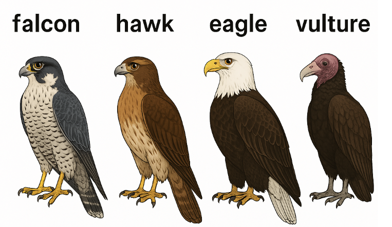


**arrest warrant**：逮捕令

**issued by**：由……签发


cellar 地窖

**3. cellar vs. basement（区别）**

| 单词         | 中文             | 差别                                     | 用法场景                              |
| ------------ | ---------------- | ---------------------------------------- | ------------------------------------- |
| **cellar**   | 地窖，地下储藏室 | 传统、通常不住人，专用于存放物品（如酒） | wine cellar, coal cellar              |
| **basement** | 地下室           | 现代建筑常见，可住人或作功能区           | basement apartment, finished basement |

📌 例子对比：

- The **cellar** is small and dark, just for storage.
- Their **basement** is fully furnished and used as a gym.


## Corpse Bride

bride 新娘

bridegroom/groom  新郎

**rehearsal** /rɪˈhɜːrsl/ （名词）

**义项 1：** 排练，彩排（为表演、演出等做的练习）

- We have a dress rehearsal tomorrow before the opening night.
   （我们明天有一场带妆彩排，为开幕之夜做准备。）
- The actors only had one rehearsal before the live show.
   （演员们在现场直播前只排练了一次。）

**5. 近义词对比**

| 词汇            | 意义     | 场景               | 语气               |
| --------------- | -------- | ------------------ | ------------------ |
| **practice**    | 一般练习 | 普通训练           | 最通用，语气轻     |
| **rehearsal**   | 彩排     | 演出、典礼前的准备 | 偏正式，强调“排演” |
| **drill**       | 反复训练 | 军事、语言学习等   | 强调重复、严格     |
| **run-through** | 简单预演 | 表演、会议等       | 口语、非正式       |

**例句对比**：

- Let’s do a **practice** before your driving test.
- The choir had their final **rehearsal** this morning.   choir(唱诗班)
- Soldiers do **drills** to improve discipline.  discipline  纪律
- We’ll have a quick **run-through** before the meeting.


elevate

**elevated** /ˈelɪveɪtɪd/ （形容词）

**义项 1：** 升高的、地势高的（物理上的高度）

- The house is in an **elevated** position overlooking the valley.
   （这栋房子坐落在高处，可俯瞰整个山谷。）
- Elevated highways are common in urban areas.
   （城市里常见高架公路。）

**义项 2：** 高尚的、崇高的（思想、风格、情感等）

- He spoke in an **elevated** tone, as if giving a sermon.
   （他说话的语气庄重得像在布道。）
- The novel is written in an **elevated** literary style.
   （这本小说用的是一种高雅的文学风格。）

**义项 3：** 升高的（医学或技术上，如体温、血压等）

- The patient has **elevated** blood pressure.
   （病人血压偏高。）
- Her stress level is **elevated**.
   （她的压力水平升高了。）

**3. 常见衍生词**

- **elevate** (v.)：举起，提高
  - Music can elevate your mood.（音乐能提升你的心情。）
- **elevation** (n.)：高度，海拔，提升
  - The city is at an elevation of 2,000 meters.
- **elevator** (n.)：电梯（美式说法）
  - Take the elevator to the 10th floor.

**5. 近义词对比**

| 词汇         | 意义                     | 用法语境       | 语气/情感    |
| ------------ | ------------------------ | -------------- | ------------ |
| **elevated** | 物理上或抽象上的升高     | 正式、书面     | 正面或中性   |
| **lofty**    | （抽象上）高尚的、高傲的 | 文学、评价性强 | 带褒义或贬义 |
| **high**     | 物理高度、程度高         | 日常、通用     | 中性         |
| **exalted**  | 崇高的、地位很高的       | 宗教、敬语     | 正式/文学    |
| **uplifted** | 被提升、振奋的           | 情绪或道德方面 | 通俗或文学   |

**例句比较：**

- She stood on an **elevated** platform.（地势高）
- He has **lofty** ideals about humanity.（理想很高）
- Prices are too **high** these days.（价格高）
- The priest holds an **exalted** position.（宗教地位高）
- I felt spiritually **uplifted** by the music.（被感动）


**The patient was taken to the emergency room due to ______ blood pressure.**
 A. lofty
 B. elevated
 C. exalted
 D. uplifted

Which of the following is NOT a correct meaning of **elevated**?
 A. Physically raised
 B. Emotionally sad
 C. High in rank or quality
 D. Increased in medical level

**The professor delivered his lecture in an ______ tone, which made it hard for some students to follow.**
 A. elevated
 B. high
 C. exalted
 D. loud

"Elevated tone" 指的是一种（有时过于）正式、高雅或复杂的语气或风格，可能会显得不接地气或难懂。"


**"An elevated highway" means a highway that is located underground.**
 (True / False)

"An elevated highway" 指的是高架公路，是建在地面之上的。地下公路通常称为 "tunnel" 或 "underground highway"。


After the inspirational speech, the audience left the hall with ______ spirits.

"Elevated spirits" 是一个固定搭配，意思是“情绪高昂，精神振奋”。


**1. 词义解释**
 **crumpet** /ˈkrʌmpɪt/ （名词）

**义项 1（主要义项）：**（英式）一种圆形、松软的烘烤面饼，表面有很多小孔，通常加黄油吃

- I had tea and **crumpets** for breakfast.
   （我早餐吃了茶和松饼。）

**义项 2（口语，略带冒犯）：** 英国俚语中，也可以指“性感的人”（通常指女性），但这个用法已经过时且带有物化女性的色彩，需谨慎使用。

- He thinks she’s a bit of **crumpet**. （这个表达很口语化，含轻浮之意）

> ⚠️ 温馨提醒：第二义项在现代英语中容易引起不适或误会，一般不建议用。

------

**2. 词源解析**
 **crumpet** 最早源于 14 世纪中古英语 *crompid cake*，意思是“卷曲的饼”或“折叠的饼”，可能和古法烘烤方法或形状有关。也可能与法语 *crompâte*（指粗面团）相关。

------

**3. 图像联想**
 Crumpet 外观类似小圆煎饼，但比 pancake 厚，有大量气孔（加热时产生），非常适合抹黄油或果酱，常与英式下午茶搭配。

------

**4. 常见搭配**

- **buttered crumpet**：涂了黄油的松饼
- **tea and crumpets**：典型的英式点心组合
- **hot crumpet**（俚语）：过时用法，不建议使用

------

**5. 与其他面点类对比**

| 食物                           | 地区      | 特征                       | 对比               |
| ------------------------------ | --------- | -------------------------- | ------------------ |
| **crumpet**（烤饼）            | 英国      | 有孔、厚实、用烤盘烤       | 类似松软煎饼       |
| **pancake**（薄煎饼）          | 美国      | 平滑、薄、通常更甜         | 更像早餐主食       |
| **English muffin**（英式玛芬） | 英国/美式 | 更厚、更有咬感、通常切开烤 | 更面包感           |
| **scone（司康）**              | 英国      | 烤制的甜点，偏硬           | 多用于搭配果酱奶油 |

------

**例句强化：**

- We toasted some **crumpets** and spread jam on them.
   （我们烤了几块松饼，抹上果酱。）
- He enjoys a hot **crumpet** with tea every morning.
   （他每天早晨喜欢来块热松饼配茶。）

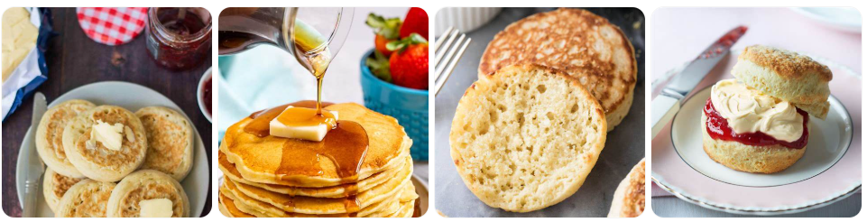


ominous 

 不祥的，预示坏事的，让人感到害怕或不安的

- There was an **ominous** silence before the explosion.
   （爆炸前有一阵不祥的沉默。）
- The sky looked **ominous**, heavy with dark clouds.
   （天空看起来不妙，乌云密布。）

**3. 常见搭配短语**

- **ominous silence**：不祥的沉默
- **ominous sign**：不吉利的迹象
- **ominous clouds**：乌云密布（通常暗示风暴）
- **ominous feeling**：不安的预感


noble realm 尊贵的地位

**5. 近义词对比**

| 单词       | 含义              | 语气      | 适用场景               |
| ---------- | ----------------- | --------- | ---------------------- |
| **realm**  | 领域/国度         | 正式/文学 | 知识、王国、概念化区域 |
| **domain** | 管辖范围/知识领域 | 科技/逻辑 | 网络域名、学术、控制权 |
| **field**  | 领域（多为专业）  | 通用      | 教育、医学、研究等     |
| **sphere** | 范畴/影响圈       | 正式/哲学 | 政治、思想、文化影响力 |

**例句对比：**

- He is well known in the **realm** of mythology.
- The **domain** of physics has changed drastically.
- She's a leader in her **field** of biotechnology.
- In the **sphere** of international relations, trust is everything.


**1. 词义解释**
 **chaperon / chaperone** /ˈʃæpəˌroʊn/（名词 & 动词）

**义项 1（传统用法）：** 陪伴年轻未婚女子外出的年长女性（尤其在以前的上流社会中，确保其名誉和安全）

- In Victorian times, a young lady would never attend a ball without a **chaperon**.
   （在维多利亚时代，年轻女士去舞会时一定要有女伴陪同。）

**义项 2（现代用法）：** 陪护人、看护人（尤指老师或家长陪同学生参加活动）

- A few parents volunteered to be **chaperones** for the school trip.
   （一些家长自愿做这次学校旅行的陪护。）

**义项 3（动词用法）：** 陪护、陪同

- She was asked to **chaperon** the students on their field trip.
   （她被要求在学生野外考察中担任陪护。）

------

**2. 词源解析**
 来自法语 *chaperon*，最初意为“兜帽、披肩”，引申为“遮盖、保护”，再延伸为“陪同保护的人”。
 → 现在仍保留“保护/陪护”这一核心概念。

------

**3. 常见场景搭配**

| 场景     | 示例                                                         |
| -------- | ------------------------------------------------------------ |
| 社交活动 | The duchess acted as her niece’s **chaperone** at the party. |
| 学校组织 | Teachers will **chaperon** the prom tonight.                 |
| 旅行陪护 | We need at least one adult **chaperone** per 10 students.    |

------

**4. 美式 vs 英式拼法**

| 拼法          | 地区                   | 说明                       |
| ------------- | ---------------------- | -------------------------- |
| **chaperon**  | 英式更常见，但较少用   | 更古典、文学感强           |
| **chaperone** | 美式拼法，现代普遍使用 | 更常用于正式文本和教育场景 |

------

**5. 近义词对比**

| 单词            | 含义                         | 使用场景                 | 风格          |
| --------------- | ---------------------------- | ------------------------ | ------------- |
| **chaperon(e)** | 陪护（带有看护/监管含义）    | 学校旅行、舞会、早期社交 | 文雅/稍正式   |
| **escort**      | 陪同（可能有护送、安保意味） | 军事、正式场合           | 中性或偏正式  |
| **guardian**    | 监护人（法律上的）           | 法律、家庭               | 严肃/法律感强 |
| **supervisor**  | 监督者                       | 工作场所、学术研究       | 职业/工作语境 |

------

**例句对比：**

- A teacher will **chaperone** the class trip.（陪护）
- She arrived with an **escort** of two bodyguards.（护送）
- He was assigned a legal **guardian** after his parents died.（监护人）
- The lab **supervisor** checked everyone's results.（监督）


**maggot** /ˈmæɡət/（名词）

**义项 1：**（主要义项）蛆，尤其是**苍蝇的幼虫**

- The wound was infected and full of **maggots**.
   （伤口感染了，爬满了蛆。）
- **Maggots** feed on decaying flesh.
   （蛆以腐肉为食。）

这是一个**中性偏贬义**的生物学词汇，但在一些医学、环境或解剖学语境中是客观描述。

------

**2. 生物学背景小知识**

- **maggot = fly larva（苍蝇的幼虫）**
- 它们通常生活在腐烂的肉体、有机物、垃圾中
- 某些特定种类（如绿蝇幼虫）在医学上用于“生物清创”（**maggot therapy**），帮助清理坏死组织

------

**3. 衍生用法 & 俚语用法**

**俚语用法（侮辱性）：**
 在军营、暴力、帮派语境中，有时用 **maggot** 指“令人厌恶的人”

- The drill sergeant screamed, “You maggot!”
   （教官怒吼道：“你这废物！”）

⚠️ 注意：这个用法极具攻击性，不建议随意使用！

------

**4. 常见短语和搭配**

| 短语                | 含义             | 示例                                                       |
| ------------------- | ---------------- | ---------------------------------------------------------- |
| **maggot-infested** | 长满蛆的         | The food was left out too long and became maggot-infested. |
| **maggot therapy**  | 蛆虫疗法（医学） | Doctors used maggot therapy to clean the wound.            |

------

**5. 词源解析**
 来自中世纪英语 *mathek / magot*，原意为“小虫、小虫子”，带有“小家伙”的意思。
 词义逐渐专指腐肉上的蛆类。

------

**6. 近义词对比（生物 vs 侮辱）**

| 单词       | 含义                         | 场景               | 情感色彩 |
| ---------- | ---------------------------- | ------------------ | -------- |
| **maggot** | 苍蝇幼虫                     | 生物、医学、脏乱   | 中性偏贬 |
| **larva**  | 幼虫阶段(maggot 是一种larva) | 科学、生物分类     | 中性     |
| **worm**   | 蠕虫（泛称）                 | 比较宽泛           | 中性或贬 |
| **vermin** | 害虫、令人厌恶的人           | 文学、口语攻击性强 | 强贬义   |
| **pest**   | 害虫 / 讨厌鬼                | 通俗，轻微贬义     | 日常贬义 |


confess

**义项 1：** 承认（做错了事、犯罪等）【常用】

- He **confessed** to stealing the money.
   （他承认偷了那笔钱。）
- She **confessed** her guilt to the police.
   （她向警方承认了罪行。）

**义项 2：** 坦白（内心想法、秘密）

- I have to **confess**, I still love him.
   （我得坦白说，我还爱着他。）
- He **confessed** his love for her.
   （他向她表白了爱意。）

**义项 3（宗教用法）：** 忏悔（向神或神职人员承认罪过）

- Catholics **confess** their sins to a priest.
   （天主教徒向神父忏悔自己的罪过。）

**3. 常见搭配短语**

| 短语                            | 含义                   | 示例                                      |
| ------------------------------- | ---------------------- | ----------------------------------------- |
| **confess to (doing) sth**      | 承认做了某事           | He confessed to cheating on the test.     |
| **confess one’s sins**          | 忏悔罪行               | She went to church to confess her sins.   |
| **I must confess**              | （引出不好意思或隐私） | I must confess, I didn’t read the book.   |
| **confess one’s love/feelings** | 表白情感               | He finally confessed his feelings to her. |

**4. 情感语气说明**

- **confess** 通常带有**羞愧、坦白、沉重或情绪复杂**的感觉
- 可以用于法律/宗教/恋爱/朋友之间的坦白情绪
- 不等于“casually tell”（随便讲），而是带有“心理门槛”的动作

**5. 常见句型**

1. **confess + that + 句子**
   - She confessed that she had lied.
2. **confess + to + 名词 / V-ing**
   - He confessed to the crime.
   - She confessed to breaking the window.
3. **confess + 宾语（感情、秘密）**
   - He confessed his guilt.
   - I confessed my love.

**6. 衍生词/相关词**

| 词                 | 词性 | 含义                   |
| ------------------ | ---- | ---------------------- |
| **confession**     | n.   | 忏悔、供认、表白       |
| **confessor**      | n.   | 听忏悔的神父（天主教） |
| **self-confessed** | adj. | 自承的、自认的         |
| **admit**（近义）  | v.   | 承认（更中性、更广义） |

**7. confess vs. admit vs. reveal**

| 词汇        | 含义            | 情绪           | 示例                      |
| ----------- | --------------- | -------------- | ------------------------- |
| **confess** | 坦白做错事/秘密 | 羞愧或情绪复杂 | He confessed he had lied. |
| **admit**   | 承认某事真实    | 中性偏轻       | He admitted the mistake.  |
| **reveal**  | 揭示某事        | 中性/正式      | She revealed the truth.   |


**hopscotch** /ˈhɑːp.skɑːtʃ/

🟡 **名词（n.）**：跳房子（儿童游戏）


**eternal**. 

**1. 词义解释**

- **1. Lasting or existing forever; without end or beginning.** (永恒的，永久的；无始无终的)
  - *例句 1:* Many philosophical traditions grapple with the concept of *eternal* truths that exist independently of human perception. (许多哲学传统都在探讨独立于人类感知而存在的永恒真理。)
  - *例句 2:* The ancient monument stands as an *eternal* symbol of the civilization that built it. (这座古老的纪念碑作为建造它的文明的永恒象征而矗立。)
- **2. Valid or applicable for all time; unchanging.** (永恒不变的，超越时间的)
  - *例句 1:* The artist sought to capture the *eternal* beauty of the natural world in his paintings. (这位艺术家试图在他的画作中捕捉自然界永恒的美。)
  - *例句 2:* Certain mathematical theorems are considered *eternal*, holding true across all contexts. (某些数学定理被认为是永恒的，在所有情况下都成立。)
- **3. (Often Hyperbolic) Seeming to last forever; very long, tedious, or frequently recurring.** (（常为夸张）似乎永远持续的；冗长乏味的；反复出现的)
  - *例句 1:* The wait in the emergency room felt *eternal*, though it was only two hours. (在急诊室的等待感觉像是永恒，尽管只有两个小时。)
  - *例句 2:* She sighed at the *eternal* problem of finding matching socks in the laundry. (面对洗衣时寻找配对袜子的这个“永恒”难题，她叹了口气。)

**3. 常见衍生词**

- Eternally

   (副词): 永恒地；永久地；似乎无休止地

  - *例句:* They pledged to be *eternally* devoted to each other. (他们誓言将永远忠于彼此。)

- Eternity

   (名词): 永恒；无限的时间；来世，永生

  - *例句:* Looking at the stars gives you a sense of *eternity*. (仰望星空会让你感受到永恒。)
  - *例句:* They believed their souls would achieve *eternity* after death. (他们相信死后灵魂能获得永生。)

- Eternalize / Eternise

   (动词): 使永恒；使不朽 (相对不常用)

  - *例句:* Poets often seek to *eternalize* fleeting moments of beauty in their verses. (诗人常试图在诗歌中让短暂的美丽瞬间永恒。)

**4. 常用短语词组用法**

- Eternal life / salvation

  : 永生/永恒的救赎 (宗教语境，指死后无限延续的生命或精神状态)

  - *例句:* Many faiths offer followers the hope of *eternal life*. (许多信仰为其追随者提供永生的希望。)

- Eternal damnation / punishment

  : 永罚/永恒的惩罚 (宗教语境，指死后无尽的痛苦)

  - *例句:* The sermon warned against sins that could lead to *eternal damnation*. (布道警告说有些罪恶可能导致永罚。)

- The eternal optimist

  : 永远的乐观主义者 (指无论情况如何总是充满希望的人)

  - *例句:* Despite the setbacks, David remains the *eternal* optimist, always expecting things to improve. (尽管遭遇挫折，大卫仍然是个永远的乐观主义者，总是期待情况会好转。)

- The eternal flame

  : 长明火 (通常为纪念而持续燃烧的火焰)

  - *例句:* An *eternal flame* burns at the memorial site. (纪念地燃烧着长明火。)

- The eternal triangle

  : （爱情）三角关系 (指三个人之间的情感纠葛，通常是两人争夺第三方的爱)

  - *例句:* The novel's plot revolves around a classic *eternal triangle* involving two best friends in love with the same woman. (小说的情节围绕着一个经典的三角关系展开，涉及两个爱上同一个女人的挚友。)

- Eternal youth

  : 永恒的青春

  - *例句:* The legend of the Fountain of *Eternal Youth* has captivated human imagination for centuries. (关于永恒青春之泉的传说几个世纪以来一直吸引着人类的想象力。)

**5. 近义词对比**

| **词语**        | **词性** | **核心语义**                     | **语气/细微差别**                                            | **典型使用场景**                                  | **例句**                                                     |
| --------------- | -------- | -------------------------------- | ------------------------------------------------------------ | ------------------------------------------------- | ------------------------------------------------------------ |
| **Eternal**     | Adj      | 无始无终的；永久的；永恒不变的   | 核心词，常带哲学或宗教色彩，强调超越时间或持续存在           | 哲学、宗教（永生/永罚）、真理、象征、夸张（冗长） | The quest for *eternal* peace. (对永久和平的追求。)          |
| **Everlasting** | Adj      | 永远持续的；持久的               | 与 eternal 非常接近，常互换，尤其宗教语境，可能更强调持续时间 | 宗教（永生）、情感、祝福                          | Wishing you *everlasting* joy. (祝你永恒快乐。)              |
| **Perpetual**   | Adj      | 永久的；**不间断的**；反复发生的 | 强调持续不断或频繁重复，有时用于形容恼人的事                 | 运动、机器、习惯、抱怨、状态                      | The *perpetual* noise from the construction site. (建筑工地持续不断的噪音。) |
| **Timeless**    | Adj      | 不受时间影响的；永不过时的       | 强调质量、价值或美感不随时间流逝而减损                       | 艺术、音乐、设计、风格、美、真理                  | Shakespeare's plays have a *timeless* relevance. (莎士比亚的戏剧具有永恒的现实意义。) |
| **Endless**     | Adj      | 无止境的；无限的                 | 强调没有终点，常用于夸张或形容冗长乏味                       | 空间、时间、等待、耐心、可能性、任务              | We faced an *endless* series of challenges. (我们面临着无休止的挑战。) |
| **Immortal**    | Adj      | 不死的；流芳百世的               | 特指生命（神、灵魂）不会死亡，或指声名/作品永存              | 神话、宗教（灵魂）、文学、艺术、名声              | Achilles was thought to be nearly *immortal*. (人们认为阿喀琉斯几乎是不死的。) |
| **Undying**     | Adj      | 永恒的；不朽的（常用于强烈情感） | 常用于形容强烈而持久的情感或抽象品质                         | 爱、恨、感激、忠诚、名誉                          | He swore his *undying* loyalty to the king. (他发誓永远效忠国王。) |
| **Infinite**    | Adj      | 无限的；无穷的                   | 侧重数量、空间、程度上的无限制，更偏数学或抽象概念           | 数学、物理（宇宙）、可能性、耐心、资源            | The universe is vast, perhaps *infinite*. (宇宙浩瀚，也许是无限的。) |

**总结:**

- **Eternal** 是核心词，指无始无终或永久持续，常有哲学宗教意味。
- **Everlasting** 与 eternal 相似，常用于宗教语境，强调持续性。
- **Perpetual** 强调不间断或反复发生。
- **Timeless** 强调品质不随时间变化。
- **Endless** 强调没有终点，常用于夸张。
- **Immortal** 特指生命不朽或声名永存。
- **Undying** 常形容强烈持久的情感。
- **Infinite** 侧重数量、空间或程度的无限。

**Permanent**: 这个词通常指“永久的”、“长期不变的”，强调在**某个可预见的系统或时间框架内**的持久性，并且常常与 **"temporary" (临时的)** 相对。例如，“permanent job”（固定工作）、“permanent marker”（油性笔/永久性记号笔）、“permanent address”（永久地址）。虽然意图是长期不变，但“permanent”的事物在理论上或实践中**仍然可能被改变、终止或摧毁**。它描述的是一种**稳定性状态**。

**Eternal**: 这个词则更进一步，常常指**绝对的永恒**，即“无始无终的”、“超越时间限制的”。它常用于哲学、宗教或非常强调的语境中，暗示一种**绝对不变**或存在于时间之外的状态。例如，“eternal life”（永生）、“eternal truths”（永恒真理）。它不仅仅是“不是暂时的”，而是暗示一种更根本、更无限的持久性。


shed

**1. 词义解释（多词性）**

**(1) 动词（最常见）**

**a. 脱落；掉落（自然地）**
 用于树叶、毛发、皮肤等自然脱落：

- Trees **shed** their leaves in autumn.
   （树在秋天落叶。）
- The dog is **shedding** hair everywhere!
   （狗狗到处掉毛！）

**b. 流（眼泪、血等）**
 多用于文学/正式语境：

- He **shed** tears of joy.
   （他流下了喜悦的泪水。）
- So much blood has been **shed** in this war.
   （这场战争中流了太多血。）

**c. 摆脱；去除（比喻用法）**
 常用于比喻“抛弃烦恼、外壳、身份等”：

- She’s trying to **shed** her image as a pop singer.
   （她正试图摆脱流行歌手的形象。）
- The company plans to **shed** 1,000 jobs.
   （公司计划裁掉1000个职位。）

**d. 发出（光、热等）**
 用法文艺，常与 light/heat 搭配：

- The lamp **shed** a warm glow on the desk.
   （灯光洒在书桌上，发出温暖的光。）

------

**(2) 名词：简易小屋；棚屋**
 通常指后院的小屋，用来储物或工具的地方。

- I keep the lawn mower in the **shed**.
   （我把割草机放在小屋里。）

**3. 常见短语搭配**

- **shed light on sth**：阐明，使更清楚
   ✅ The documents help **shed light on** the mystery.
   （这些文件帮助揭示了谜团。）
- **shed blood**：流血（尤其战争）
   ✅ Too much blood has been **shed** over this land.
- **shed skin / shell / leaves**：蜕皮/脱壳/落叶
   ✅ The snake **shed** its skin.


plausible

**(1) 看似真实的；貌似合理的**
 表示某件事表面上听起来/看起来是对的，有道理的。

- Your explanation seems **plausible**.
   （你的解释听起来合理。）
- The theory is **plausible**, but lacks solid evidence.
   （这个理论貌似合理，但缺乏确凿证据。）

**(2) （人）花言巧语的；貌似可信的（但可能不真诚）**
 这种用法带**轻微的负面含义**，指某人善于说服，让人信以为真，但实际可能不诚实。

- He’s a **plausible** liar.
   （他是个很会说谎的人，让人容易相信。）
- The salesman was too **plausible** to be trusted.
   （那位推销员太能说会道了，反而让人不敢信。）

**2. 词源解析**

来自拉丁语 *plausibilis*（值得鼓掌的）
 → *plaudere*（鼓掌）
 → 最早指“说得好，值得喝彩”
 → 后来引申为“说得让人觉得可信”

**3. 常见衍生词**

- **plausibility** (n.)
   → 看起来可信的性质或程度
  - I doubt the **plausibility** of that story.
- **implausible** (adj.)
   → 难以置信的，不太可能的
  - His excuse was completely **implausible**.

**5. 近义词对比**

| 词汇                       | 含义                   | 差别说明                     | 例句                    |
| -------------------------- | ---------------------- | ---------------------------- | ----------------------- |
| **plausible**              | 听起来可信但未必真实   | 强调“表面合理”，有怀疑成分   | A plausible excuse      |
| **credible \| reasonable** | 令人信服的，有说服力的 | 一般表示“真的可信”，语气更强 | A credible witness      |
| **believable**             | 一般可信的，容易相信的 | 更口语化，可用于故事、谎言等 | It’s barely believable. |
| **possible**               | 可能的                 | 更强调“逻辑上可能发生”       | A possible explanation  |


**1. 词义解释（含例句及俚语/流行用法）**

**义项一：严峻的，令人不快的，令人沮丧的**
 通常用于描述局势、现实、前景等，带有负面情绪。

- The future looks grim with rising unemployment and inflation.
- The survivors told grim stories of what happened during the storm.

**义项二：冷酷的，严肃的**
 用于形容表情、态度、语气等，显示出坚定或无情。

- Her face was grim as she delivered the news.
- He gave a grim nod before walking away.

**义项三：令人恐惧或震惊的，恐怖的（带有死亡、暴力等意味）**

- The police found a grim scene at the abandoned warehouse.
- He told a grim tale about the horrors of war.

**俚语/流行用法：**
 **"grim reaper"** 指“死神”，是一个拟人化概念，常出现在文学、影视中，代表死亡的化身。

- The old man said he had seen the grim reaper in his dreams.

------

**3. 常见衍生词**

- **grimly**（副词）：严峻地，冷酷地
  - She smiled grimly and walked away.
- **grimness**（名词）：严峻，冷酷
  - The grimness of the situation was evident to all.
- （*grim* 本身是形容词，常用于书面语或正式语境）

------

**4. 常用短语词组用法与例句**

- **grim determination**（坚定决心）
  - With grim determination, he continued the climb despite the pain.
- **grim reality**（残酷现实）
  - The documentary showed the grim reality of life in the war zone.
- **a grim reminder**（令人警醒的事物）
  - The ruins stand as a grim reminder of the earthquake.
- **grim silence**（令人压抑的沉默）
  - There was a grim silence after the announcement.

------

**5. 近义词对比**

**结构近义词（词性/语法类似）对比：**

- **grim** vs **stern**
  - *grim* 更强调外部情境或情绪令人不快；
  - *stern* 侧重人的性格或态度严厉、正直。
  - 例句：
    - The grim look on his face scared the children.
    - The teacher gave a stern warning to the noisy students.

------

**语义类比词（含义相近但语气/场景不同）：**

- **grim** vs **gloomy**
  - *grim* 带有更强的现实或威胁成分，如战争、死亡、残酷现实；
  - *gloomy* 多用于描述情绪或环境阴郁、暗淡。
  - 例句：
    - The news about the war was grim.
    - The room was gloomy and smelled of mildew.

------

**情感/语气强度对比（贬义、中性、书面/口语）：**

| 词汇    | 情感倾向 | 语气强度 | 使用场合         |
| ------- | -------- | -------- | ---------------- |
| grim    | 负面     | 强烈     | 书面、正式       |
| serious | 中性     | 中等     | 日常、正式均可   |
| dark    | 中性略负 | 轻微     | 日常、比喻性语境 |

------

**典型使用场景差异：**

- **grim**：政治演讲、战地报道、严肃文学（强调残酷、不容乐观）
  - The grim statistics reflect a growing crisis.
- **gloomy**：天气描述、心情低落、文艺写作
  - It’s a gloomy day; I feel like staying in bed.
- **stern**：人物性格描写、道德判断
  - She is a stern but fair boss.


“Cease” 

------

**1. 词义解释（配例句）**

**动词（vi/vt）：停止，终止（to stop happening or to stop something from happening）**

- The factory **ceased** operations due to safety concerns.
   由于安全问题，这家工厂停止了运营。
- The fighting finally **ceased** after the peace treaty was signed.
   和平条约签署后，战斗终于停止。

**常见结构**：

- **cease to do sth**：停止去做某事
  - He never **ceased to amaze** me with his creativity.
     他总是不断地用他的创造力让我惊叹。（注意这是个固定搭配）
- **cease doing sth**：停止做某事
  - They **ceased using** the old software.
     他们停止使用旧软件。


------

**3. 常见衍生词**

- **ceaseless** (adj.) 不停的；不断的
  - The **ceaseless** noise kept him awake all night.
- **ceaselessly** (adv.) 不停地
  - She worked **ceaselessly** to complete the project.
- **cessation** (n.) 停止，中断（正式/法律用语）
  - There was a temporary **cessation** of hostilities.

------

**4. 常用短语 / 固定搭配**

- **ceasefire**（n.）停火
  - The two sides agreed to a **ceasefire** after weeks of fighting.
- **cease and desist**（法律术语）停止并中止
  - The company received a **cease and desist** letter regarding copyright infringement.

------

**5. 近义词对比**

**结构近义词：**

- **stop**：最普通的“停止”，日常用语
  - Please **stop talking**.（口语常见）
  - Please **cease talking**.（正式，较少见）

**语义类比词：**

- **halt**：突然停止（尤其是移动中的物体或计划）
  - The train came to a **halt**.
     → 更偏“突然性”或“短暂停止”
- **discontinue**：终止，尤指产品或服务的永久停产/停用
  - The product was **discontinued** last year.

**语气强度 / 正式程度对比：**

- **stop**（普通）< **cease**（正式）< **terminate**（极正式/合同用语）

**典型使用场景差异：**

- **cease**：用于书面、公文、战争、商业声明
- **stop**：日常生活中停止某行为
- **terminate**：合同、法律、程序中使用（如 terminate a contract）


destitute   adj.

表示“缺乏生活必需品”，如食物、住所、金钱等。

- After the war, many families were left **destitute**.
   战争过后，许多家庭一贫如洗。
- The floods left thousands **destitute** and homeless.
   洪水导致数千人流离失所，一无所有。

还可表示“完全缺乏某种东西”：

- A life **destitute of** meaning is hard to endure.
   一种缺乏意义的生活是难以忍受的。

**3. 常见衍生词**

- **destitution** (n.) 赤贫，贫困状态
  - He died in a state of complete **destitution**.
- **be destitute of** (phr.) 缺乏……
  - The novel is **destitute of** originality.（这部小说毫无新意）


5.近义词详细对比

| 词汇             | 含义                             | 正式程度 | 强度  | 语气/语境                        | 示例                              |
| ---------------- | -------------------------------- | -------- | ----- | -------------------------------- | --------------------------------- |
| **destitute**    | 赤贫、完全缺乏基本生活资源       | 正式     | 极强  | 法律、社会学、新闻、文学         | destitute children                |
| **impoverished** | 贫困的，经济状况差               | 正式     | 中-强 | 描述个人、国家、地区经济状况     | an impoverished region            |
| **penniless**    | 身无分文的（尤其突然失去财产）   | 较口语   | 中-强 | 个人财务破产，语气略轻或带幽默感 | He arrived in the city penniless. |
| **needy**        | 贫穷的、需要帮助的               | 普通     | 中    | 慈善语境、强调“需要援助”         | help for the needy                |
| **indigent**     | 赤贫的，法律用语中的“无力支付者” | 极正式   | 极强  | 法律、福利、慈善申请、医疗体系   | legal aid for indigent defendants |
| **poor**         | 普通贫穷                         | 普通     | 弱-中 | 最常见用法，泛指缺钱             | a poor man                        |


radiant 

**1. 词义解释**

- **1. Sending out light; shining or glowing brightly.** (发光的；明亮的；光芒四射的)
  - *例句 1:* The *radiant* morning sun streamed through the window. (灿烂的朝阳透过窗户照射进来。)
  - *例句 2:* On a clear night, the stars appear as *radiant* points of light against the dark sky. (在晴朗的夜晚，星星在黑暗的天空中呈现为明亮的光点。)
- **2. (Of a person or their expression) Clearly emanating great joy, love, or health; looking very happy and beautiful.** (（指人或其表情）容光焕发的，喜气洋洋的，灿烂的)
  - *例句 1:* The bride was absolutely *radiant* as she walked down the aisle. (新娘走在通道上时，真是容光焕发，光彩照人。)
  - *例句 2:* After returning from a relaxing vacation, he looked healthy and *radiant*. (度过一个轻松的假期回来后，他看起来健康而容光焕发。)
- **3. (Physics - of heat or energy) Transmitted by radiation.** (（物理学 - 指热或能量）辐射的)
  - *例句 1:* *Radiant* heat from the sun warms the Earth's surface. (来自太阳的辐射热使地球表面变暖。)
  - *例句 2:* Some modern heating systems use *radiant* floor panels. (一些现代供暖系统使用辐射地板。)

**2. 词源解析**

- **radiant** 源自中古英语晚期，来自拉丁语 *radiant-*（*radians* 的词干），是 *radiāre* 的现在分词，意为“发射光线，发光”。
- 它源自拉丁语 *radius*，意为“轮辐，棍杖，光线”。
- 英语中的 *radio* (收音机，无线电), *radius* (半径), *ray* (光线), *irradiate* (照射) 都与此相关。
- 核心含义与“光线”或“辐射”有关。

**3. 常见衍生词**

- Radiance

   (名词): 光辉，光芒；（喜悦、健康或美丽的）容光焕发

  - *例句:* Her face shone with an inner *radiance*. (她的脸上焕发出内在的光彩。)
  - *例句:* The *radiance* of the sunset painted the clouds in vibrant colors. (落日的光辉将云彩染上了鲜艳的色彩。)

- Radiantly

   (副词): 明亮地，光辉地；容光焕发地

  - *例句:* She smiled *radiantly* when she accepted the award. (她在领奖时笑容灿烂。)

- Radiate

   (动词): 发出（光或热）；辐射；（指人）明显地流露（某种品质或情感）；从中心散开

  - *例句:* A single light bulb *radiated* a dim light. (一个灯泡散发出昏暗的光芒。)
  - *例句:* He *radiates* kindness and warmth. (他浑身散发着善良和温暖。)

**4. 常用短语词组用法**

- Radiant smile

  : 灿烂的笑容 (表示非常开心、喜悦的笑容)

  - *例句:* Her *radiant smile* was infectious. (她灿烂的笑容很有感染力。)

- Radiant heat / energy

  : 辐射热/辐射能 (物理学术语)

  - *例句:* Fireplaces provide comfort primarily through *radiant heat*. (壁炉主要通过辐射热提供舒适感。)

- Radiant beauty

  : 光彩照人的美丽 (常指与健康、幸福相关的引人注目的美貌)

  - *例句:* The ballerina possessed a *radiant beauty* both on and off stage. (这位芭蕾舞演员在台上台下都拥有光彩照人的美丽。)

- Radiant with (joy / happiness / health / love / pride etc.)

  : 因（喜悦/幸福/健康/爱/自豪等）而容光焕发

  - *例句:* The new graduates were *radiant with pride* at the ceremony. (新毕业生们在典礼上因自豪而容光焕发。)

**5. 近义词对比**

| 词语          | 词性 | 核心语义                                     | 语气/细微差别                                         | 典型使用场景                                          | 例句                                                         |
| ------------- | ---- | -------------------------------------------- | ----------------------------------------------------- | ----------------------------------------------------- | ------------------------------------------------------------ |
| **Radiant**   | Adj  | 发光的；明亮的；容光焕发的                   | 强调向外发射光/热，或内在强烈情感/健康的外露          | 太阳、热源、笑容、因幸福/健康而美丽的面容             | The *radiant* bride walked down the aisle. (容光焕发的新娘走过通道。) |
| **Bright**    | Adj  | （最常用）明亮的；聪明的；色彩鲜艳的；欢快的 | 最通用，可指光源、反光、颜色、智力、情绪              | 阳光、灯、颜色、未来、想法、人                        | It's a *bright* sunny day. (这是一个明媚的晴天。)            |
| **Shining**   | Adj  | 发光的；闪耀的；杰出的                       | 强调发出或反射光亮，常指光滑表面；引申为榜样          | 星星、金属、眼睛（因情感）、榜样（a shining example） | Polished shoes were *shining*. (擦亮的鞋子闪闪发光。)        |
| **Glowing**   | Adj  | 发出稳定柔和的光；（脸）发红；热情洋溢的     | 常指无火焰的、稳定的、柔和的光或热，或内在的热情/健康 | 余烬、灯丝、皮肤（健康/害羞）、赞扬（glowing review） | Her cheeks were *glowing* after the run. (跑步后她的脸颊红润。) |
| **Luminous**  | Adj  | 发光的，（尤指在黑暗中）发亮的；清晰明白的   | 常指自身发光，尤指黑暗中的光，可带柔和或神秘感        | 夜光表、深海鱼、油漆、眼睛、文章（清晰）              | The watch has *luminous* hands. (这块手表有夜光指针。)       |
| **Brilliant** | Adj  | 光辉夺目的；极其聪明的；非常成功的           | 强调非常强烈、耀眼的光线，或极高的才智/成就           | 钻石、阳光、星星、想法、表演、人才                    | He had a *brilliant* idea. (他有个绝妙的主意。)              |
| **Gleaming**  | Adj  | 闪闪发光的，闪耀的                           | 常指干净、光滑表面的反光                              | 抛光金属、牙齿、湿润的眼睛                            | The *gleaming* silverware was set on the table. (闪闪发光的银器摆在桌上。) |
| **Beaming**   | Adj  | 笑容满面的；照射的                           | 多指非常开心灿烂的笑容，或强烈的光束                  | 笑脸、阳光、车灯                                      | The *beaming* child showed off her new toy. (笑容满面的孩子炫耀她的新玩具。) |


**总结:**

- **Bright** 是最通用的。
- **Radiant** 强调向外发光或内在品质（幸福、健康）的光彩。
- **Shining** 和 **Gleaming** 常指表面反射的光。
- **Glowing** 常指柔和的、内在的光或温暖感。
- **Luminous** 强调自身发光，尤其在暗处。
- **Brilliant** 指非常强烈的光或才智。
- **Beaming** 多与灿烂的笑容相关。


 **serendipity**.

**1. 词义解释**

- The occurrence and development of events by chance in a happy or beneficial way; the faculty of making fortunate discoveries by accident.

   (机缘巧合；意外发现有益或珍奇事物的运气、才能)

  - *例句 1:* Finding this unique antique shop in a hidden alley felt like pure *serendipity*. (在一条隐蔽的小巷里找到这家独特的古董店，感觉纯属机缘巧合。)
  - *例句 2:* Many important scientific discoveries, like penicillin, were the result of *serendipity* rather than planned research. (许多重要的科学发现，如青霉素，是意外发现的结果，而非计划研究的产物。)

  

- **核心含义**: 指在并未刻意寻找的情况下，偶然地、幸运地发现了有价值或令人愉悦的事物。它带有积极、惊喜和幸运的色彩。

**3. 常见衍生词**

- Serendipitous

   (形容词): 机缘巧合的；意外发现的

  - *例句:* It was a *serendipitous* encounter that led to their collaboration on the project. (一次机缘巧合的相遇促成了他们在这个项目上的合作。)

- Serendipitously

   (副词): 凑巧地；意外而幸运地

  - *例句:* While researching ancient maps, she *serendipitously* stumbled upon a clue to the hidden treasure. (在研究古地图时，她意外而幸运地偶然发现了隐藏宝藏的线索。)

**4. 常用短语词组用法**

- A stroke of serendipity

  : 一次机缘巧合的幸运发现

  - *例句:* Finding exactly the right book I needed at a garage sale was a wonderful *stroke of serendipity*. (在车库甩卖中恰好找到我需要的那本书，真是妙不可言的机缘巧合。)

- Pure serendipity

  : 纯属巧合；完全是运气好

  - *例句:* Our meeting wasn't planned; it was *pure serendipity*. (我们的相遇并非计划好的，纯属巧合。)

- By serendipity

  : 通过巧合；偶然幸运地

  - *例句:* The useful properties of the material were discovered largely *by serendipity*. (这种材料的有用特性很大程度上是偶然发现的。)

**5. 相关概念对比**

| **词语/概念**      | **词性**    | **核心语义**                             | **语气/细微差别**                                            | **典型使用场景**                               | **例句**                                                     |
| ------------------ | ----------- | ---------------------------------------- | ------------------------------------------------------------ | ---------------------------------------------- | ------------------------------------------------------------ |
| **Serendipity**    | Noun        | 意外发现有价值或令人愉悦事物的好运或能力 | 强调**偶然**发现**未曾寻找**的好东西，有时包含识别价值的智慧；积极 | 科学发现、艺术创作、旅行偶遇、找到珍稀物品     | Discovering the cure was a triumph of *serendipity*. (发现治疗方法是机缘巧合的一大胜利。) |
| **Chance**         | Noun        | 偶然性；机会；可能性                     | 中性，指随机性或没有明确原因的事件发生                       | 概率、可能性、偶遇、风险                       | We met purely *by chance*. (我们纯属偶然相遇。)              |
| **Luck**           | Noun        | （常指好的）运气；幸运；机遇             | 常带有积极色彩（也可说 bad luck），视为一种外在的影响力      | 赌博、比赛、个人经历的结果、日常事件           | It takes skill and *luck* to succeed. (成功需要技巧和运气。) |
| **Fortune**        | Noun        | 运气；命运；财富                         | 类似 luck，可能更正式或强调命运感；也可指代大量财富          | 命运、人生际遇、意外的好运、财富（a fortune）  | *Fortune* favored the brave. (命运偏爱勇者。)                |
| **Fluke**          | Noun        | （非正式）侥幸；偶然的成功               | 非正式，强调不太可能发生的、意外的幸运成功，可能含有侥幸成分 | 比赛中的意外得分、考试侥幸通过、实验的偶然成功 | Their first victory of the season was a complete *fluke*. (他们赛季的首胜完全是侥幸。) |
| **Happy accident** | Noun Phrase | 带来好结果的意外或错误                   | 非正式，非常接近 serendipity，但更强调“意外/错误”本身        | 意外的发明、带来好处的失误、美好的偶遇         | The mix-up in the lab led to a *happy accident*. (实验室的混淆导致了一个幸运的意外发现。) |

**总结:**

- **Chance** 是最中性的词，指随机性。
- **Luck** 和 **Fortune** 常指影响结果的外部运气或命运，通常是积极的。
- **Fluke** 是非正式的，指侥幸或不太可能发生的意外成功。
- **Happy accident** 是非正式的，指带来好结果的意外或错误。
- **Serendipity** 的独特之处在于它强调**意外地发现你并未寻找的有价值或令人愉悦的事物**，有时还包含一种洞察力，使其比纯粹的“运气”或“意外”更丰富一些。它是一个带有智慧和惊喜色彩的词。


dowry

**(1) 嫁妆，妆奁**（女方家庭给予男方或夫妇的财产）

- In many cultures, a **dowry** was once a necessary part of marriage arrangements.
   （在许多文化中，嫁妆曾是婚姻安排中必不可少的一部分。）
- Her **dowry** included jewelry, land, and livestock.
   （她的嫁妆包括珠宝、土地和牲畜。）


delusional

妄想的


## The Penguins of Madagascar


Arctic  北极    Antarctica    南极


cuddly来源于动词 **cuddle**，意思是“拥抱、搂抱”

teddy bears, plush toys, pets, babies

更强调“想抱一抱”的那种亲密感

**hug 是“拍拍抱”，cuddle 是“腻腻抱”**。


inhospitable  不适宜居住的

leopard seals 豹海豹

tundra  苔原


trajectory 

**1. 词义解释**

- **1. (Physics, Mathematics) The path followed by a projectile flying or an object moving under the action of given forces.** (（射弹、天体或其他运动物体的）轨道，轨迹)
  - *例句 1:* The trajectory of the cannonball was affected by wind resistance. (炮弹的弹道受到了风阻的影响。)
  - *例句 2:* Astronomers precisely calculate the *trajectory* of asteroids to assess any potential impact risk. (天文学家精确计算小行星的轨道以评估任何潜在的撞击风险。)
- **2. (Figurative) The course of development or progress of something over time.** (（事物发展的）轨迹，进程，路线)
  - *例句 1:* The company's growth *trajectory* has been impressive over the last five years. (过去五年里，这家公司的增长轨迹令人瞩目。)
  - *例句 2:* Understanding the historical *trajectory* of these events helps us understand the present situation. (了解这些事件的历史发展轨迹有助于我们理解现状。)

**3. 常见衍生词**

- "Trajectory" 本身主要是名词。与其词根 

  iacere

  （投掷）相关的常见词有：

  - Projectile

     (名词/形容词): 抛射物，射弹；抛射的。

    - *例句:* The cannon fired a heavy *projectile*. (大炮发射了一枚重型炮弹。)

  - Project

     (动词): 投射；规划；预测。 (名词): 项目；方案。

    - *例句:* The graph *projects* future sales figures. (这张图表预测了未来的销售数据。)

**4. 常用短语词组用法**

- Flight trajectory

  : 飞行轨迹 (飞机、导弹等的空中或太空路径)

  - *例句:* The missile's *flight trajectory* was tracked by radar. (导弹的飞行轨迹被雷达跟踪。)

- Orbital trajectory

  : 轨道轨迹 (卫星、行星等环绕另一天体运行的路径)

  - *例句:* Landing on Mars requires precise control of the spacecraft's *orbital trajectory*. (登陆火星需要精确控制航天器的轨道轨迹。)

- Career trajectory

  : 职业发展轨迹/路径

  - *例句:* His early internships set him on a positive *career trajectory*. (他早期的实习使他走上了积极的职业发展轨道。)

- Growth trajectory

  : 增长轨迹 (公司、经济、生物等的增长模式或路径)

  - *例句:* The tech startup is hoping for a steep *growth trajectory*. (这家科技初创公司希望能有陡峭的增长轨迹。)

- On a [specific] trajectory

  : 处于某种发展轨道上

  - *例句:* The economy seems to be *on a stable trajectory* after the recent reforms. (近期改革后，经济似乎正处于稳定的发展轨道上。)
  - *例句:* Unfortunately, the species is *on a trajectory* towards extinction. (不幸的是，该物种正走向灭绝。)

**5. 近义词对比**

| 词语           | 词性 | 核心语义                                     | 语气/细微差别                                       | 典型使用场景                                | 例句                                                         |
| -------------- | ---- | -------------------------------------------- | --------------------------------------------------- | ------------------------------------------- | ------------------------------------------------------------ |
| **Trajectory** | Noun | （物体运动的）轨道；（事物发展的）进程、轨迹 | 常带有物理学含义（受力运动），引申义指动态发展过程  | 物理、弹道学、天文学；职业、经济、项目发展  | The probe's *trajectory* took it past Jupiter. (探测器的轨道使它经过木星。) |
| **Path**       | Noun | 路径；小道；（人生或行动的）道路             | 最通用，可指物理路径或抽象的人生/行为路线           | 行走、移动、生活、行动方向                  | We followed the winding *path* to the summit. (我们沿着蜿蜒的小路到达顶峰。) |
| **Course**     | Noun | 路线，航向；过程；课程；方针                 | 常指既定或计划的方向/路线；一系列（课程）；行动方式 | 船只/飞机航向、河流流向、学习课程、行动计划 | The river changed its *course* over time. (河流的流向随时间改变了。) |
| **Route**      | Noun | 路线；路程                                   | 强调从起点到终点的规划好的路径                      | 旅行、交通、送货                            | What's the fastest *route* to the airport? (去机场最快的路线是哪条？) |
| **Orbit**      | Noun | （天体等的）轨道；势力范围                   | 主要指天体或航天器的闭合路径；引申指影响范围        | 天文学、太空旅行；（喻）势力范围            | The moon completes its *orbit* around Earth monthly. (月球每月完成绕地球的轨道运行。) |
| **Track**      | Noun | 足迹；轨道；跑道；思路                       | 指留下的痕迹；铁路轨道；赛跑道；正确的思路/方向     | 追踪、铁路、体育运动；（喻）思路、进展      | The detective followed the suspect's *tracks*. (侦探追踪嫌疑人的足迹。) |
| **Projection** | Noun | 预测；推断；投射                             | 指基于当前趋势对未来的估计或预测；物理上的投射      | 商业、金融、统计、规划；地图、图像          | Financial *projections* suggest growth next quarter. (财务预测显示下季度将实现增长。) |
| **Direction**  | Noun | 方向；指导；趋势                             | 强调运动或发展的朝向；管理或指引                    | 移动、方位、指令、管理、市场趋势            | The wind changed *direction* suddenly. (风向突然变了。)      |

Export to Sheets

**总结:**

- **Path** 是最通用的词。
- **Course** 和 **Route** 常指计划好的路线或方向。
- **Orbit** 主要用于天文学。
- **Track** 常指痕迹或预设轨道。
- **Projection** 侧重于对未来的预测。
- **Direction** 强调朝向或趋势。
- **Trajectory** 在物理学中指物体（尤指抛射体）在力作用下的运动路径，引申义则常指事物（如职业、经济）随时间动态发展的**进程或轨迹**，比 path 或 course 更强调这种动态性和有时受外力影响的特点。


analogy  类比

moxie  美式俚语词

**有个性、面对困难不退缩**的精神力量

**2. 例句**

- It takes a lot of **moxie** to stand up to your boss like that.
   （敢当面顶撞老板，你真有胆量。）
- She showed some serious **moxie** starting her own business at 22.
   （她22岁就创业，真是有魄力。）
- He doesn’t have the **moxie** to lead a team.
   （他缺乏领导团队的那股劲头。）

------

**3. 词源解析**

“**Moxie**” 原本是 **一种 20 世纪初流行的汽水品牌名**，它打广告时强调“喝了让你精力充沛、有活力”，久而久之，moxie 这个词就引申为“精力、勇气、干劲”等含义，成为美国英语里的俚语。

> 🧃 Moxie：一种早期被认为能“治百病”的汽水
>  → 暗示喝了你会“有劲儿”，于是就有了现在的比喻用法。

**4. 情感语气**

- 语气一般是**正面、有力、赞赏**的；
- 用得比较**口语化、美国化、有复古味**；
- 不如 courage 正式，但比 guts 更有“性格魅力”色彩。

**5. 常见同义词对比**

| 单词        | 语义               | 差异说明                             |
| ----------- | ------------------ | ------------------------------------ |
| **moxie**   | 勇气 + 魄力 + 精力 | 强调个性和干劲，有点“美式英勇”味     |
| **guts**    | 胆量               | 口语常用，稍粗俗，偏向“硬着头皮去做” |
| **grit**    | 毅力               | 强调坚持、不屈，常用于长期奋斗       |
| **courage** | 勇气               | 最标准、正式、书面                   |


analogy

**1. 词义解释**

- **1. A comparison between two things, typically based on their structure or function, for the purpose of explanation or clarification.** (类比，类推；比拟)
  - *例句 1:* The professor used the *analogy* of a computer's RAM to explain the concept of short-term memory. (教授用计算机内存作类比来解释短期记忆的概念。)
  - *例句 2:* In her speech, the politician made an *analogy* between managing the national budget and managing a household budget. (在演讲中，这位政治家用管理家庭预算来类比管理国家预算。)
- **2. A similarity or correspondence between things that are otherwise dissimilar.** (相似（之处）；类似)
  - *例句 1:* Scientists have discovered a surprising *analogy* between the way slime molds forage for food and the way railway networks are designed. (科学家们在黏菌觅食方式和铁路网络设计方式之间发现了惊人的相似之处。)
  - *例句 2:* There's a strong *analogy* between the challenges faced by immigrants in the past and those faced today. (过去移民面临的挑战与今天移民面临的挑战之间有很强的类似性。)
- **3. (Logic, Linguistics) Reasoning or inference based on parallel cases; the process by which words or grammatical forms are created or adapted based on existing patterns.** (类推法；类推作用)
  - *例句 1:* While arguments *by analogy* can be illustrative, they require careful examination to ensure they are logically sound. (虽然类比论证可能很有说明性，但必须仔细审查以确保其逻辑合理。)
  - *例句 2:* The word "brang" (instead of "brought") is sometimes used incorrectly *by analogy* with verbs like "sing, sang." (“brang” 这个词（而非正确的“brought”）有时会因与“sing, sang”等动词类推而被错误使用。)

**2. 词源解析**

- **analogy** 来自中古英语 *analogie*，经由古法语和拉丁语，最终源自希腊语 *analogia*。
- 希腊语 *analogia* 意为“比例，对应关系”。
- 它由 *ana-* (意为“向上，按照，根据，回”) + *logos* (意为“比例，词语，言语，理性”) 构成。
- 因此，其根本含义是通过理性或言语找到事物之间对应的“比例”或关系。

**3. 常见衍生词**

- Analogous

   (形容词): 类似的；可类比的

  - *例句:* The structure of an atom is sometimes considered *analogous* to that of the solar system, but the analogy has limitations. (原子的结构有时被认为类似于太阳系的结构，但这种类比有其局限性。)

- Analogously

   (副词): 类似地；近似地

  - *例句:* The two companies approached the problem *analogously*, both focusing on customer feedback. (两家公司以类似的方式处理这个问题，都侧重于客户反馈。)

- Analogize

   (动词): 进行类比；指出……的相似处

  - *例句:* The author *analogizes* the experience of writing a novel to running a marathon. (作者将写小说的经历比作跑马拉松。)

- Analogue / Analog

   (名词/形容词):

  - (名词 - Noun) 类似物；对应物 (Analogue)
    - *例句:* This digital tool serves as an *analogue* to the traditional drafting table. (这个数字工具相当于传统的绘图桌。)
  - (形容词 - Adjective, 尤美式拼写为 Analog) 模拟的 (相对于数字 'digital')
    - *例句:* Audiophiles often debate the merits of *analog* versus digital sound reproduction. (音响发烧友经常争论模拟与数字声音再现的优劣。)

**4. 常用短语词组用法**

- Draw an analogy / Make an analogy

  : 作类比；进行类比

  - *例句:* To clarify the point, let me *draw an analogy* between a business and a sports team. (为了阐明观点，让我把企业比作一支运动队。)

- By analogy

  : 通过类比；用类比的方法

  - *例句:* We can understand how viruses spread *by analogy* with how rumors spread through a crowd. (我们可以通过类比谣言在人群中传播的方式来理解病毒是如何传播的。)

- False analogy

  : 错误类比；不当类比 (一种逻辑谬误，基于误导性或不相关的相似性进行论证)

  - *例句:* Arguing that because cars and bicycles both have wheels, they should follow the exact same traffic laws in all situations, might be considered a *false analogy*. (认为汽车和自行车都有轮子，所以在任何情况下都应遵守完全相同的交通法规，这可能被认为是一种错误的类比。)

**5. 近义词对比**

| 词语               | 词性 | 核心语义                                  | 语气/细微差别                                                | 典型使用场景                                 | 例句                                                         |
| ------------------ | ---- | ----------------------------------------- | ------------------------------------------------------------ | -------------------------------------------- | ------------------------------------------------------------ |
| **Analogy**        | Noun | 为解释或说明而进行的比较；相似性；类推    | **主要目的：解释、说明**。基于结构、功能或关系的相似性。逻辑性较强。 | 解释复杂概念、教学、论证、生物学（同功器官） | The *analogy* of the leaky bucket helped explain water conservation. (漏桶的比喻有助于解释节约用水。) |
| **Comparison**     | Noun | 比较；对比                                | 最通用，指找出事物间的异同点。Analogy 是 comparison 的一种。 | 任何需要比较异同的场合                       | The book offers a *comparison* of different cultures. (这本书比较了不同的文化。) |
| **Similarity**     | Noun | 相似性；类似之处                          | 强调事物间共有的特性或状态。                                 | 描述外貌、特征、情况等的相似性               | The police noted the *similarity* between the two crime scenes. (警方注意到两个犯罪现场的相似之处。) |
| **Parallel**       | Noun | 相似之处；平行线/面；可相比较的人/事/情况 | 强调结构、情况或发展过程上的相似性，像平行线一样并存或发展。 | 历史事件、人物经历、故事情节、几何学、计算机 | Historians have drawn *parallels* between the two empires. (历史学家指出了这两个帝国之间的相似之处。) |
| **Correspondence** | Noun | 符合；一致；对应；通信                    | 强调元素间的匹配、等同或密切联系。                           | 部件匹配、变量关系、书信往来                 | There's a direct *correspondence* between effort and results. (努力与结果直接相关。) |
| **Likeness**       | Noun | 相似；相像；肖像                          | 强调外表或性质上的相像，常指视觉上的相似。                   | 外貌、艺术（肖像）、一般相似性               | The portrait captured a good *likeness* of the queen. (这幅肖像画很好地抓住了女王的相貌。) |
| **Metaphor**       | Noun | 隐喻；暗喻 (不使用 'like' 或 'as')        | **主要目的：文学/修辞效果**。将一事物隐含地等同于另一事物，创造生动形象。 | 文学、诗歌、修辞、日常语言                   | "Time is money" is a common *metaphor*. (“时间就是金钱”是一个常见的隐喻。) |
| **Simile**         | Noun | 明喻 (使用 'like' 或 'as')                | **主要目的：文学/修辞效果**。明确地用 'like' 或 'as' 将一事物比作另一事物。 | 文学、诗歌、修辞、日常语言                   | "He eats *like* a pig" is a *simile*. (“他吃起东西来像猪一样”是一个明喻。) |

**总结:**

- **Comparison**, **Similarity**, **Likeness** 是描述相似性的通用词。
- **Parallel** 强调并行的相似结构或发展。
- **Correspondence** 强调匹配或对应关系。
- **Metaphor** 和 **Simile** 是文学修辞手法，主要为了生动性和表达效果，而非逻辑解释。
- **Analogy** 的核心在于**通过比较来解释或阐明**某个概念或事物，它常常利用已知事物来帮助理解未知事物，逻辑性和说明性是其关键特征。


**Nanny state"**（保姆国家）是一个带有贬义的政治术语，用来批评政府过度干涉公民日常生活、限制个人自由，就像“保姆”一样对人民进行过度照顾和管理。

------

**具体含义：**
 指政府为“保护”人民而推行的过多规章制度，结果却剥夺了人们自己做决定的权利。批评者认为这样的国家把公民当成无法照顾自己的小孩，需要被监管和控制。

------

**常见使用场景：**
 这个词经常出现在**自由主义者**或**保守派**对公共政策的批评中，尤其是：

- 健康政策（如禁止吸烟、限制含糖饮料）
- 行为规范（如强制戴头盔、系安全带）
- 网络监管、言论审查
- 福利制度过于宽松

------

**例句：**

1. *Critics argue that banning large sodas is just another example of the nanny state.*
    批评者认为禁止大杯汽水又是保姆国家的一个例子。
2. *Some people welcome such regulations, while others see them as nanny state interference.*
    有些人欢迎这些规定，而另一些人则认为这是保姆国家的干预。


Succulent

**1. 词义解释：**

**（1）形容词：多汁的，肉质的，鲜美的（尤指食物）**

- 指食物中含有丰富水分，吃起来湿润可口。

**例句：**

- *The steak was juicy and succulent, cooked to perfection.*
   那块牛排多汁鲜美，煎得恰到好处。
- *She bit into a succulent peach and let the juice run down her chin.*
   她咬了一口多汁的桃子，汁水顺着下巴流了下来。

**（2）名词：多肉植物**

- 指那些叶子或茎部能储存大量水分的植物，如仙人掌、芦荟等。

**例句：**

- *Succulents are popular houseplants because they're easy to care for.*
   多肉植物因其容易打理而成为流行的室内植物。

suck 吮吸

**4. 常用短语/搭配：**

- **succulent meat / fruit / dish**：多汁的肉/水果/菜肴
- **succulent gossip**（比喻）：“有料的八卦”
   *She always brings the most succulent gossip to lunch.*
   她午餐时间总带来最劲爆的八卦。

**1. succulent vs. juicy**

| 项目           | succulent                                                  | juicy                                                      |
| -------------- | ---------------------------------------------------------- | ---------------------------------------------------------- |
| **基本义**     | 多汁的，尤其是形容鲜美可口的肉类或水果                     | 多汁的，可以指食物，也常指八卦/消息等                      |
| **语气色彩**   | 较正式，略文艺，有赞美意味                                 | 更口语、更直接，适用范围广                                 |
| **搭配对象**   | meat, steak, fruit, peach（偏食物） 也指多肉植物           | burger, orange, gossip, scandal（偏食物 & 报导类）         |
| **例句**       | *succulent roast chicken* *succulent grapes*               | *juicy hamburger* *juicy details of the scandal*           |
| **是否可互换** | 食物上大多可互换，但“succulent”更少用于抽象物（如 gossip） | “juicy”可用于信息、细节、传闻，非食物场合不可用“succulent” |

✅ 可部分互换（食物场景），但语气不同。

------

**2. succulent vs. tender**


| 项目           | succulent                                           | tender                           |
| -------------- | --------------------------------------------------- | -------------------------------- |
| **基本义**     | 多汁的                                              | 柔嫩的（质地柔软，不硬）         |
| **搭配对象**   | meat, peach, food                                   | meat, touch, emotion（情感）     |
| **语义焦点**   | 指汁液丰富                                          | 指质地柔软、易咀嚼；也指温柔情感 |
| **例句**       | *succulent lamb chops*                              | *tender steak / a tender moment* |
| **是否可互换** | ❌ 不能互换。“succulent”强调汁，“tender”强调口感柔软 |                                  |

❌ 不可互换。succulent ≠ tender。

------

**3. succulent vs. luscious**


| 项目           | succulent                                              | luscious                                |
| -------------- | ------------------------------------------------------ | --------------------------------------- |
| **基本义**     | 多汁的、美味的                                         | 香甜诱人的；性感的（可形容食物或人）    |
| **语气色彩**   | 中性偏正式                                             | 更感性，富有诱惑力，带文学/性感意味     |
| **搭配对象**   | food, fruit, meat                                      | lips, hair, dessert, fruit              |
| **例句**       | *succulent pineapple slices*                           | *luscious strawberries / luscious lips* |
| **是否可互换** | 可在形容甜美水果时互换，但“luscious”用法更广，可形容人 |                                         |

✅ 部分可互换（水果、甜点），但“luscious”语气更浓烈、更性感。

------

**总结对比图：**


| 词汇          | 语义焦点                 | 适用对象                 | 语气色彩     | 特别用途         |
| ------------- | ------------------------ | ------------------------ | ------------ | ---------------- |
| **succulent** | 汁多味美                 | 食物、水果、多肉植物     | 正式、有赞美 | 不适用于抽象概念 |
| **juicy**     | 含水分多，也可指信息丰富 | 食物、消息、八卦         | 口语、灵活   | *juicy gossip*   |
| **tender**    | 柔软、易咀嚼             | 肉类、情感、触感         | 温柔、中性   | *tender love*    |
| **luscious**  | 香甜、性感、视觉诱惑     | 食物、身体部位、文学描写 | 强感官、浓艳 | *luscious lips*  |

------

**结论：**
 这些词在“食物”场景下有交集，但在**情感色彩**和**搭配对象**上有明显差别，**不可完全混用**。若想表达“软嫩又多汁的肉”，可组合使用：

- *a tender and succulent steak*
- *juicy yet tender lamb chops*


“**lam**”是一个英语中的非正式、略带俚语色彩的词，主要用作动词或名词，意思是“逃跑、潜逃”，多用于逃避法律、警察追捕等情境。

------

**1. 词义解释：**

**（1）动词（口语）**
 **to lam** = 快速逃跑、逃亡，尤指从警察或监狱逃跑。

- *The suspect lammed out the back door when the cops arrived.*
   警察一到，那名嫌疑犯就从后门逃走了。

**（2）名词（on the lam）**
 “**on the lam**” 是固定短语，意思是“在逃”、“潜逃中”。

- *He’s been on the lam for six months after the robbery.*
   他抢劫之后已经潜逃了六个月。
- *The fugitive remained on the lam until he was captured in Mexico.*
   那名逃犯一直在逃，直到在墨西哥被捕。

------

**2. 词源简析：**
 “lam” 源自19世纪美国俚语，可能来自苏格兰语 *lam*（打、打击），原意指“打跑某人”，引申为“迅速逃离”，后来变成“逃亡”的意思。

------

**3. 常见搭配：**

- **on the lam**（惯用语）＝ 潜逃中
- **lam it**（老派说法）＝ 快逃！

------

**4. 同义词对比：**


| 词语         | 含义               | 语气/场景                    | 示例                              |
| ------------ | ------------------ | ---------------------------- | --------------------------------- |
| **lam**      | 潜逃、逃亡         | 非正式，常带犯罪背景         | *He went on the lam.*             |
| **flee**     | 逃离（危险、战乱） | 正式书面，含紧急意味         | *They fled the country.*          |
| **run away** | 逃跑               | 普通用语，可用于小孩、动物等 | *The dog ran away.*               |
| **escape**   | 逃脱、逃出         | 强调挣脱控制                 | *She escaped from prison.*        |
| **bolt**     | 突然逃跑           | 动作快，通常出于恐惧         | *He bolted when he saw the cops.* |

✅ “lam” 多用于**逃避法律**情境，类似“逃犯在逃”。

------

**5. 衍生用法：**（不常见）

- **to lam someone**（老式用法）：用力打某人
  - *He lammed the ball out of the park.*
     他狠狠把球打出了球场。（类似“砸”或“打飞”）


 **对比分析**


| 项目         | **lam**                                   | **run**                         | **flee**                         | **escape**                             | **bolt**                               |
| ------------ | ----------------------------------------- | ------------------------------- | -------------------------------- | -------------------------------------- | -------------------------------------- |
| **核心含义** | 潜逃，常指违法后逃跑                      | 跑动/逃跑，泛用词               | 逃离危险/恐惧                    | 逃脱限制/控制                          | 猛然逃跑，受惊反应                     |
| **语体风格** | 俚语/口语                                 | 中性/日常                       | 正式                             | 正式/中性                              | 非正式/生动                            |
| **强调点**   | 躲避法律，常用于“在逃犯”                  | 行为本身（跑）                  | 从危险中逃走                     | 从困境中挣脱                           | 突然快速逃                             |
| **宾语结构** | 通常不带宾语                              | 可带方向、地点                  | 通常 + from + 危险源             | 常 + from / out of / through sth.      | 通常不带宾语                           |
| **典型搭配** | on the lam lam it                         | run away / run from             | flee from war / danger           | escape from prison                     | bolt out of the room                   |
| **例句**     | He went **on the lam** after the robbery. | The kid **ran away** from home. | Civilians **fled** the war zone. | The prisoner **escaped** from custody. | The rabbit **bolted** into the bushes. |
| **语气强度** | 强烈 + 犯罪/躲避背景                      | 弱，广义逃跑                    | 紧急/恐惧感强                    | 更“挣脱控制”语义                       | 强烈、迅猛                             |

------


二、练习题（单选，每题只有一个最佳答案）

**1.** The thief has been _______ since the night of the break-in.
 A. fled
 B. bolted
 C. escaped
 D. on the lam

**2.** When the explosion occurred, people _______ in every direction.
 A. fled
 B. on the lam
 C. escape
 D. lam

**3.** The horse suddenly _______ when it saw the snake on the trail.
 A. ran
 B. fled
 C. bolted
 D. escaped

**4.** The inmate managed to _______ from the maximum-security prison.
 A. lam
 B. bolt
 C. escape
 D. flee

**5.** He didn't tell anyone, just _______ without leaving a note.
 A. on the lam
 B. escaped
 C. ran away
 D. bolted

------

**三、答案与解析**

**1. D. on the lam**
 解析：该句中描述“自从入室盗窃那晚起就开始逃跑”，很明显是**犯罪后潜逃**，最符合的是“on the lam”，表示“在逃”。

**2. A. fled**
 解析：爆炸 = 危险 → 强调从“危险场景”中逃走，应使用“flee”。“fled”是其过去式。

**3. C. bolted**
 解析：动物受惊→突然后退或快速跑开，用“bolt”最贴切。“The horse bolted”是固定搭配。

**4. C. escape**
 解析：“从监狱逃出”强调“逃脱控制/限制”，标准搭配是“escape from prison”。

**5. C. ran away**
 解析：没有留下字条、无声离开，描述一种**非暴力、不受迫**的离开。“ran away”最符合语义。


**elite /ɪˈliːt/ 或 /eɪˈliːt/**
 **n.（名词）/ adj.（形容词）**
 指**精英、上层人物、最优秀或最有权力的一群人**

- **名词：** a group of people who are considered the best in a particular society or category

  > The military elite controls most aspects of the country’s politics.
  >  （军方精英控制着国家政治的大部分方面。）

- **形容词：** describing something or someone that is among the best

  > He graduated from an elite university.
  >  （他毕业于一所顶尖大学。）

 	**3. 常见派生词**


| 词          | 词性    | 含义                  | 例句                                  |
| ----------- | ------- | --------------------- | ------------------------------------- |
| **elitism** | n.      | 精英主义（偏贬义）    | Academic elitism is resented by many. |
| **elitist** | n./adj. | 精英主义者/精英主义的 | He holds an elitist view of culture.  |

------

**4. 常用短语表达**

| 表达                          | 含义                       |
| ----------------------------- | -------------------------- |
| **elite education**           | 精英教育（如常青藤、牛剑） |
| **ruling elite**              | 统治精英（政治、经济）     |
| **intellectual elite**        | 知识精英                   |
| **elite athlete/force/squad** | 顶尖运动员/特种部队        |


**bureau** /ˈbjʊə.rəʊ/（英）或 /ˈbjʊr.oʊ/（美）
 **名词 n.**

该词有两个主要义项，语境不同，意思差异大：

 **义项一：政府或组织机构的“局 / 办公室 / 署”**

（尤其在美国常见）

> A bureau is a government department or an office that provides a particular service.

- **例句**：She works for the Federal Bureau of Investigation.
   （她在联邦调查局工作。）
- 常见表达：
  - **Federal Bureau of Investigation (FBI)** = 联邦调查局
  - **Travel bureau** = 旅游局
  - **News bureau** = 新闻办事处（驻地记者站）

**义项二：（英式旧用）写字台，抽屉柜**

> A bureau is a piece of furniture with drawers and sometimes a writing surface.

- **例句**：He kept the letters in the bottom drawer of the bureau.
   （他把信件保存在写字台最下面的抽屉里。）

> ⚠️ 注意：这个意思在**英式英语中更常见，美式英语中多用 “desk” 或 “dresser”。**


**3. 常见搭配与表达**

| 搭配短语                  | 意义             |
| ------------------------- | ---------------- |
| **news bureau**           | 新闻机构，记者站 |
| **credit bureau**         | 信用调查机构     |
| **public affairs bureau** | 公共事务局       |
| **intelligence bureau**   | 情报机构         |
| **bureau chief**          | 局长，机构负责人 |

**4. 常见派生词**

| 派生词           | 词性                      | 含义 |
| ---------------- | ------------------------- | ---- |
| **bureaucracy**  | n. 官僚体制               |      |
| **bureaucrat**   | n. 官僚人员（有时带贬义） |      |
| **bureaucratic** | adj. 官僚主义的，繁琐的   |      |


siphon machine  咖啡制作-虹吸机


**Ominous** 的反义词是 **auspicious**。      易混词- Anonymous 匿名的

**Ominous** 意指“不祥的”或“预示坏事的”，通常用来描述某种迹象、氛围或预兆，暗示未来可能发生不好的事情。

**Auspicious** 则指“吉利的”或“预示好事的”，用来形容某些迹象或事件，意味着未来可能会有好运或成功。

例句对比：

- The dark clouds in the sky looked **ominous**, suggesting a storm was coming.（天空中的乌云看起来不祥，暗示着暴风雨即将来临。）
- The wedding day was filled with **auspicious** signs, such as clear skies and calm weather.（婚礼当天充满了吉祥的迹象，比如晴朗的天空和宁静的天气。）


**Geneticist** 是指研究遗传学原理、基因如何影响生物体特征的科学家。他们可能会从事研究、医疗诊断或基因工程等领域的工作。

- 例句：The geneticist studied how mutations in DNA can lead to inherited diseases.（遗传学家研究了DNA中的突变如何导致遗传性疾病。）


**Octopus** vs. **Squid**（鱿鱼）：

- **Octopus** 和 **squid** 都属于头足纲动物，但它们有一些显著的区别。章鱼有八条触手，而鱿鱼通常有十条触手。章鱼的身体较柔软，且通常没有像鱿鱼那样的鳍。
  - 例句：The octopus and squid are both cephalopods, but they have different numbers of tentacles.（章鱼和鱿鱼都是头足纲动物，但它们的触手数量不同。）


**Goop** 是一种黏稠的、常常不容易清除或形容的物质，通常用来指代类似于粘液、化妆品、胶水等物质。

- 例句：My hands were covered in goop after I tried fixing the car engine.（我修车引擎后，手上沾满了黏糊糊的东西。）
- 例句：The goop from the spilled lotion was all over the carpet.（洒出来的润肤霜弄得地毯上到处都是。）


**Sashay** 


<audio controls style="width:100%">
  <source src="./.assets/audio/Northern-Europe.mp3" type="audio/mpeg">
  Your browser does not support the audio element.
</audio>

北欧五国

**瑞典（Sweden）**

- 首都：斯德哥尔摩（Stockholm）

**丹麦（Denmark）**

- 首都：哥本哈根（Copenhagen）

**挪威（Norway）**

- 首都：奥斯陆（Oslo）

**芬兰（Finland）**

- 首都：赫尔辛基（Helsinki）

**冰岛（Iceland）**

- 首都：雷克雅未克（Reykjavík）


**tulip**（n.）郁金香


**serum** 

**义项 1：血清（医学）**

- 指血液中去除血细胞和凝血因子的透明液体。
- 用于血液检测、免疫、疫苗、抗体等医学研究。

**例句**：

- The patient’s serum tested positive for antibodies.
   病人的血清检测出抗体阳性。
- Serum is often used in diagnostic tests.
   血清常用于诊断测试。

 **义项 2：美容精华液（化妆品）**

- 指护肤品中的高浓度营养液，用于补水、美白、抗皱等。

**例句**：

- She applied a vitamin C serum before her moisturizer.
   她在涂保湿霜前先用了维生素C精华液。
- This serum is great for reducing fine lines.
   这个精华液对淡化细纹很有效。

 **义项 3：免疫血清（医学）**

- 一种含有特定抗体的血清，可以用于治疗某些毒素或疾病。
- 如“抗蛇毒血清”（antivenom serum）


**tranquilize** /ˈtræŋ.kwə.laɪz/（动词）

意思是：**使平静、镇定、镇静（尤指用药）**。常用于人或动物。
 也可以翻译为“打镇静剂”、“安抚”、“麻醉（非完全麻醉）”。

**常见句式**：

- **tranquilize someone/something**（用药或其他方式让某人镇定下来）

**例句**：

- The veterinarian had to tranquilize the tiger before the surgery.
   兽医必须在手术前先给老虎打镇静剂。
- She was so agitated they had to tranquilize her.
   她太激动了，他们不得不给她用镇静药。

------

**2. 常见用法场景**

| 场景      | 含义         | 举例                                               |
| --------- | ------------ | -------------------------------------------------- |
| 医疗      | 对病人镇静   | 手术前给病人 tranquilize，避免恐慌                 |
| 动物      | 安抚凶猛动物 | 动物园、野生动物研究用镇静枪                       |
| 新闻/影视 | 控制危险情境 | “警方用镇静枪制服了这只黑熊”                       |
| 隐喻      | 表达心理平静 | “He was tranquilized by the calm music.”（非正式） |

------

 **3. 派生词**

| 单词                                                 | 词性   | 含义                       |
| ---------------------------------------------------- | ------ | -------------------------- |
| **tranquilizer**（美） **tranquilliser**（英）       | 名词   | 镇静剂，安定药             |
| **tranquilization**（美） **tranquillisation**（英） | 名词   | 镇静处理过程               |
| **tranquil**                                         | 形容词 | 平静的，安宁的（文艺用词） |
| **tranquility / tranquillity**                       | 名词   | 宁静，平静                 |

------


近义词对比（含语气&场景）

| 单词            | 含义                                        | 场景               | 语气               |
| --------------- | ------------------------------------------- | ------------------ | ------------------ |
| **sedate**      | 给…服用镇静剂（比 tranquilize 更正式/医疗） | 医疗场合（麻醉前） | 正式、医学         |
| **soothe**      | 安慰、缓和                                  | 日常情绪安抚       | 温柔、口语         |
| **calm down**   | 冷静下来                                    | 口语（对人说）     | 普通               |
| **pacify**      | 平息怒气、使安静                            | 安抚小孩、外交谈判 | 书面/正式          |
| **tranquilize** | 让人或动物安静下来（多用药）                | 医疗、动物控制     | 稍带专业、冷静语气 |


“**flesh and feathers**” 字面意思是 “肉和羽毛”

“**Mermaid**” 是指 **人鱼**

**2. 词源解析**

- 源自中古英语 *mere*（海）+ *maid*（少女），意即“海中的少女”。
   与之相关的词还有 *merman*（男性人鱼）和 *merfolk*（人鱼族群/种族）。

------

**3. 常见衍生词**

- **merman**：男美人鱼
- **merfolk / merpeople**：泛指人鱼种族（folk = people）
- **mermaid-like**：像美人鱼一样的

**5. 近义词对比**


| 词汇        | 含义                             | 语气/使用场景                       | 示例                                               |
| ----------- | -------------------------------- | ----------------------------------- | -------------------------------------------------- |
| **mermaid** | 神话中的人鱼少女                 | 浪漫、幻想、传说中常见              | *Ariel is a famous mermaid from Disney.*           |
| **siren**   | 古希腊神话中用歌声诱惑水手的女妖 | 更阴暗、危险，常带神秘/致命的吸引力 | *The sirens’ song led them to crash on the rocks.* |
| **nymph**   | 自然精灵（如水泽女神）           | 更偏自然、优雅的神灵形象            | *She danced like a water nymph.*                   |

<p align="center">
  
  
  
</p>


marine

**1. 词义解释**

- **adj.（形容词）**：海洋的；海产的；海事的
  - *marine life*：海洋生物
  - *marine ecosystem*：海洋生态系统
  - *marine biology*：海洋生物学
  - *marine pollution*：海洋污染
- **n.（名词）**：
  - **（尤指美国）海军陆战队队员**（首字母常大写：Marine）
    - *He served as a U.S. Marine.*
       他曾是美国海军陆战队队员。
  - **海运业、船舶行业人员**
    - *He worked in the merchant marine.*
       他曾在商船队工作。

**3. 常见衍生词与相关词**

| 单词                 | 词性 | 意义                               |
| -------------------- | ---- | ---------------------------------- |
| **mariner**          | n.   | 水手、船员（较书面）               |
| **marine life**      | n.   | 海洋生物                           |
| **marine corps**     | n.   | 海军陆战队（如 U.S. Marine Corps） |
| **marine biologist** | n.   | 海洋生物学家                       |


diversion

**1. 词义解释**

**（1）n. 转移注意力的行为（主观制造的）**

- 意为为了掩盖真实目的而制造的“障眼法”或“伪装动作”。
  - *The police used a diversion to catch the thieves off guard.*
     警察用了一招调虎离山之计，让小偷措手不及。

**（2）n. 消遣，娱乐**（可数名词）

- 指用来打发时间、放松注意力的活动。
  - *Reading is a pleasant diversion on long train rides.*
     阅读是长途火车旅行中的一种愉快消遣。

**（3）n. 临时改道、绕行路**（常用于交通、水流）

- 通常用于指道路封闭后的临时路线，或水流引导改变。
  - *There was a diversion on the main road due to construction.*
     由于施工，主干道实施了临时绕行。

------

**2. 词源解析**

来自拉丁语 *divertere*，意思是“转向、转移”。

- *di-*（分开）+ *vertere*（转动）
   和下列词是亲戚：
- **convert**（转换）
- **divert**（使转向，转移注意力）
- **inverse**（反向的）

------

**3. 常见派生词**


| 单词             | 词性 | 含义                                     |
| ---------------- | ---- | ---------------------------------------- |
| **divert**       | v.   | 转移、使改道、使分心                     |
| **diversionary** | adj. | 转移注意力的、掩护用的（尤军事或策略上） |
| **diverted**     | adj. | 被转移方向的（如 diverted traffic）      |

------

**4. 常用短语与例句**

- **diversion tactic**：转移战术
   *The general ordered a diversion tactic to deceive the enemy.*
- **create/make a diversion**：制造混乱或吸引注意
   *One of the robbers created a diversion while the other escaped.*


| 词汇             | 中文含义                           | 核心语义                             | 使用语气   | 使用场景                       | 示例                                                         | 差异解析                                                  |
| ---------------- | ---------------------------------- | ------------------------------------ | ---------- | ------------------------------ | ------------------------------------------------------------ | --------------------------------------------------------- |
| **diversion**    | （刻意制造的）转移注意力、调虎离山 | 有计划地转移注意力或方向，常含“策略” | 中性偏正式 | 军事、警察行动、战术、交通改道 | *The soldiers created a diversion to let the others escape.* | 强调人为制造的“伪装动作”或“掩护动作”，带策略性            |
| **distraction**  | 干扰、分心的事物                   | 让注意力从某处被动移开（多为负面）   | 常为负面   | 工作学习、心理注意力管理       | *The noise outside is a major distraction.*                  | 不强调“制造者”，通常是环境或无意的，语气更负面            |
| **disturbance**  | 干扰、骚动                         | 外在扰乱，常带混乱或不安含义         | 负面正式   | 公共场所、心理、警报           | *There was a disturbance in the street.*                     | 强调“事件或行为本身带来的动荡”，语义比 distraction 更强烈 |
| **interruption** | 打断、中断                         | 短暂切断正在进行的事                 | 中性偏正式 | 对话、演讲、流程               | *Sorry for the interruption.*                                | 偏“瞬时切断”，对流程连续性影响更大，通常不涉及注意力引导  |

------

 **“消遣、娱乐”的含义**

| 词汇              | 中文含义                   | 核心语义                       | 使用语气   | 使用场景             | 示例                                        | 差异解析                                             |
| ----------------- | -------------------------- | ------------------------------ | ---------- | -------------------- | ------------------------------------------- | ---------------------------------------------------- |
| **diversion**     | 消遣，临时转移注意力的活动 | 暂时改变心情或节奏的活动       | 中性       | 火车上、无聊时       | *Books are a good diversion on long trips.* | 轻度娱乐，多用于“缓解无聊”的临时活动                 |
| **recreation**    | 休闲、娱乐（强调身心放松） | 健康、正面、有益的消遣方式     | 正面、书面 | 公园活动、运动、旅游 | *Swimming is a popular form of recreation.* | 偏正式和健康导向，常用于官方/公共服务领域            |
| **entertainment** | 娱乐                       | 提供乐趣或表演性内容的活动     | 中性偏口语 | 影视、演出、综艺     | *That movie was pure entertainment.*        | 更强调“表演性”“观赏性”，内容消费为主                 |
| **pastime**       | 消遣、爱好                 | 花时间的活动，通常是习惯或爱好 | 轻松、中性 | 个人兴趣、爱好类     | *Gardening is my favorite pastime.*         | 偏日常、个人化，强调“常规的打发时间的事”             |
| **amusement**     | 娱乐、好笑的事             | 提供快乐、让人笑的东西         | 偏轻松幽默 | 游乐场、幽默行为     | *The kids screamed with amusement.*         | 偏轻松、愉快，有“好玩”的语气，常用于儿童或轻喜剧情境 |

总结性对照

| 情境类型                     | 推荐词汇            | 特点               |
| ---------------------------- | ------------------- | ------------------ |
| **制造战术掩护/策略干扰**    | diversion           | 带目的、刻意       |
| **在工作中被手机、噪音打断** | distraction         | 被动、负面         |
| **中途插话/打断演讲**        | interruption        | 瞬时中断           |
| **想找点东西打发时间**       | diversion / pastime | 临时 or 长期爱好型 |
| **正式表达“健康休闲”**       | recreation          | 公园、公共设施用   |
| **追剧、看综艺**             | entertainment       | 大众文化娱乐       |
| **看搞笑视频**               | amusement           | 轻松幽默、引人发笑 |


1. **“adrift”的意思**：
    “adrift”是一个形容词，意思是“漂浮的、漂流的”或“无方向的、迷失的”。在这个语境中，“cast adrift”表示“被抛弃在海上漂流”，通常用来形容船或人被遗弃在水上，没有方向或目标。
2. **“what seems like days”的语法和用法**：

- **语法**：这是一个名词性从句，由“what”引导，整体作为句子的状语或宾语。“seems like”是“看起来像”的意思，后面接名词或名词短语（这里是“days”）。

- 惯用口语

  ：这个短语是英语中的常见表达，用来表示一种主观的时间感受，意思是“感觉像是好几天”。它强调时间的漫长感，但不一定是实际的几天，可能只是感觉上很长。比如：

  - “I’ve been waiting here for what seems like hours.”（我在这儿等了感觉像是好几个小时。） 这种表达带有夸张的语气，常用于口语或叙事中，以突出体验的漫长或煎熬。


**ration** 

**1. 词义解释**

**(1) 名词：定量配给（尤指食物或资源）**
 表示某种资源在特定情况下（如战争、灾难、军队等）被限量分配。

- During the war, each family received a weekly ration of sugar and flour.
   （战争期间，每个家庭每周领取定量的糖和面粉。）
- Soldiers were given daily rations of water and canned food.
   （士兵每天被分配到定量的水和罐头食品。）

**(2) 动词：定量供应，限量配给（常用作被动）**
 指限制供给某物，使其按定量分发。

- Because of the drought, water was rationed to prevent shortages.
   （由于干旱，为防止短缺，水被限量供应。）
- Gasoline had to be rationed during the oil crisis.
   （石油危机期间不得不对汽油进行配给。）

**（口语俚语/流行用法：较少，主要用于正式或军事语境）**

------

**2. 词源解析**

来自拉丁语 *ratio*，意为“计算、理由”，再经法语 *ration* 引入英语。
 词根 *rat-* 与 “计算、数值” 有关，衍生出 **rate**（比率）、**rational**（理性的）等词。
 虽然现代英语中 **ration** 偏向“分配的数量”，其源头与“理性分配、计算”有紧密联系。

------

**3. 常见衍生词**

- **Rationing (n.)**：配给制，限量供应
  - *Rationing was introduced to manage food scarcity during the war.*
- **Rationed (adj./v.)**：被限量分配的
  - *Rationed water made survival difficult in the desert.*
- **Overration (v.)**（不常见）：过量配给
  - *If the army gets overrationed, supplies may not last the campaign.*

------

**4. 常用短语词组用法**

- **food rations / water rations**：食物配给 / 水的配给
  - *They lived on minimal food rations for weeks after the flood.*
- **daily/weekly/monthly ration**：每日/每周/每月定量
  - *The camp provided a weekly ration of rice.*
- **ration out something**：将某物分发/配给
  - *The teacher rationed out the paper to make sure everyone had enough.*

------

**5. 近义词对比**

**1) 结构近义词**

- **portion (n.)**：部分、份额（不一定表示限制）
  - *He ate a large portion of fries.*
  - → 更常用于饮食语境，强调“一份”或“某部分”。
- **allocation (n.)**：分配量，分配结果（常用于资源/时间/预算）
  - *The budget allocation for education was increased this year.*
  - → 更正式，多用于商业、行政、政策语境。

**2) 语义类比词**

- **quota (n.)**：配额，限额（常用于政策/商业）
  - *There is a strict quota on how many fish can be caught each season.*
  - → 与“ration”类似，强调上限，但更常用于法律/行政管制。
- **allowance (n.)**：津贴，允许量
  - *She gets a weekly allowance from her parents.*
  - → 通常用于“给予”的语义上，语气较轻。

**3) 情感/语气强度**

| 词汇      | 语气           | 使用场景                               |
| --------- | -------------- | -------------------------------------- |
| ration    | 中性偏正式     | 战争、军队、灾难、资源短缺时的定量分配 |
| quota     | 更正式         | 政策、法律、国际贸易等                 |
| portion   | 中性、口语常用 | 日常生活饮食场景                       |
| allowance | 中性、较口语   | 家庭、个人津贴、旅行额度               |

**4) 典型使用场景差异**

- **ration**：军队、灾难、危机时的物资分发
- **quota**：移民政策、商业进出口、环境资源限制
- **portion**：餐馆点餐、食物数量、身体部位（a portion of the brain）
- **allowance**：儿童零花钱、旅行行李额度、碳排放指标


 **dart**

------

**1. 词义解释**

**(1) 名词：飞镖；投掷物**
 通常指一种小型尖头投射物，常用于游戏或运动。

- He threw the dart and hit the bullseye.
   （他掷出飞镖，正中靶心。）
- Darts is a popular pub game in the UK.
   （飞镖是英国酒吧里很流行的一种游戏。）

**(2) 名词：疾驰、猛冲（动作）**
 比喻某人或某物快速移动的动作。

- With a sudden dart, the cat leaped at the mouse.
   （猫突然猛冲过去，扑向老鼠。）
- She made a dart for the door when she heard the alarm.
   （她听到警报后猛冲向门口。）

**(3) 动词：猛冲，飞奔；迅速投掷**
 表示快速且突然地移动或投出某物。

- The rabbit darted into the bushes.
   （那只兔子猛地钻进灌木丛里。）
- He darted a glance at her, then looked away.
   （他匆匆瞥了她一眼，又转过头去。）

**(4) 动词：投掷（目光、言语等）**（多为隐喻用法）
 表示迅速地做某个动作，尤其是“眼神”或“情绪”上的传递。

- She darted him an angry look.
   （她狠狠地瞪了他一眼。）

**（俚语/口语表达）**

- **dart off / dart out**：迅速离开
  - *He darted off before I could say goodbye.*
     -（他一眨眼就走了，来不及跟我道别。）

------

**2. 词源解析**

来自古法语 *darte*（投掷物、飞镖），词根不详，但与“快速投射”有关。
 动词形式源于该名词，表示“像飞镖一样快速运动或投出”。

和以下词有形义上的联系：

- **dart = small, fast projectile** → 延伸出“快速移动”的动作词义。
- 形象化引申为“目光、语言”的快速“射出”。

------

**3. 常见衍生词**

- **dartboard (n.)**：飞镖靶
  - *He hung a dartboard on the wall and started practicing.*
- **darter (n.)**：1) 善于快速移动的人或动物；2) 一种鸟名（如“蛇鸟”）
- **darting (adj.)**：快速移动的
  - *She gave him a darting look full of suspicion.*

------

**4. 常用短语词组用法**

- **make a dart for…**：突然冲向…
  - *The child made a dart for the candy.*
     -（小孩猛地扑向糖果。）
- **dart in / out / away / off**：迅速进入/离开/逃离
  - *He darted out of the room without explanation.*
- **dart a glance / look / smile**：迅速地瞥一眼 / 露出微笑
  - *She darted a shy smile at him.*

------

**5. 近义词对比**

**1) 结构近义词**

- **dash (v./n.)**：猛冲、冲刺
  - *He dashed out of the building in panic.*
  - 结构上与 dart 类似，但 dash 常用于更剧烈、持续性冲刺动作。
- **bolt (v./n.)**：猛冲、逃跑；螺栓
  - *The horse bolted at the sound of gunfire.*
  - bolt 暗示突然逃离（通常带有受惊的意味）。

**2) 语义类比词**

- **zoom (v.)**：快速移动，尤其指车辆或视角
  - *The car zoomed past at full speed.*
  - 更强调机械、视觉上的“快速移动”。
- **sprint (v./n.)**：短距离快速奔跑（通常用于运动）
  - *She sprinted the last 100 meters to the finish line.*
  - 用于运动语境中较多，强调短暂速度。

**3) 情感/语气强度**


| 词汇   | 语气           | 使用场景                       |
| ------ | -------------- | ------------------------------ |
| dart   | 中性，灵活     | 日常动作、目光、飞镖、动物动作 |
| dash   | 中性偏强       | 更剧烈的快速冲刺、逃跑或奔向   |
| bolt   | 偏紧张 / 惊吓  | 突然逃离（多用于动物或人受惊） |
| sprint | 体育用语偏正式 | 短距离爆发奔跑，用于比赛/训练  |

**4) 典型使用场景差异**

- **dart**：小而快的移动（如飞镖、动物、目光、突然的动作）
- **dash**：较大、快速、有目的的移动（如奔跑、抢先）
- **bolt**：强调惊恐逃跑的突然动作（如马受惊逃跑）
- **zoom**：车辆、镜头、科技语境下的快速移动
- **sprint**：运动竞技，速度为核心


hostile

**1. 词义解释**

**(1) 敌对的，怀有敌意的**
 用于描述人、行为或态度带有攻击性、敌意或反感。

- The villagers were hostile to outsiders at first.
   （村民起初对外来者抱有敌意。）
- She gave him a hostile glare.
   （她恶狠狠地瞪了他一眼。）

**(2) 不利的，恶劣的（环境、条件等）**
 用于描述外部条件对某人或某事不友好、造成阻碍。

- The expedition faced hostile weather conditions.
   （探险队面临恶劣的天气条件。）
- The market is currently hostile to small investors.
   （当前市场对小投资者不利。）

**(3) 【商业术语】敌意的（如敌意收购 hostile takeover）**
 指企业间不被目标公司欢迎的强制性收购。

- The company was facing a hostile takeover by its main competitor.
   （这家公司正面临主要竞争对手的敌意收购。）

**（俚语/流行语：略带幽默语气，有时用来形容“气氛紧张”）**

- *Whoa, don’t be so hostile—I just asked a question!*
   （哇，别那么凶嘛——我只是问了个问题！）

**2. 词源解析**

来自拉丁语 *hostilis*，意为“敌人的、敌对的”，词根 *host-* 表示“敌人”，与以下词有词源关系：

- **hostile**（敌对的）
- **host**（原意为敌人，后义演化为“主人”——来源不同词根）
- **hostility**（敌意）
- **hostage**（人质，来自古法语 *ostage*，意为“用作交换敌意保障的对象”）

**3. 常见衍生词**

- **hostility (n.)**：敌意、敌对行为
  - *There was open hostility between the two leaders.*
- **hostilely (adv.)**：敌对地（较少见，用于正式书面）
  - *He stared hostilely at the man.*
- **non-hostile (adj.)**：非敌对的，中立的
  - *The aircraft was identified as non-hostile.*


**5. 近义词对比**

**1) 结构近义词**

- **aggressive (adj.)**：具有攻击性、进取性
  - *He became aggressive when provoked.*
  - → 与 hostile 同为形容词，语义偏向“主动进攻、情绪激烈”。

<audio>
    <source src="./.assets/audio/antagonistic.mp3" />
</audio>

- **antagonistic (adj.)**：对立的、敌对的 
  - *He had an antagonistic attitude toward authority.*
  - → 结构相似，更书面、强调心理/立场对抗。

**2) 语义类比词**

- **unfriendly (adj.)**：不友好的
  - *The receptionist was cold and unfriendly.*
  - → 语气弱于 hostile，更多表现为冷淡、拒人于千里之外。
- **opposed (adj.)**：反对的
  - *She was strongly opposed to the plan.*
  - → 更偏理性立场上的“反对”，不带明显敌意。

**3) 情感/语气强度**

| 词汇         | 情感色彩    | 强度           | 语体              |
| ------------ | ----------- | -------------- | ----------------- |
| hostile      | 明显负面    | 强烈           | 正式 / 常见       |
| aggressive   | 负面 / 中性 | 强（可能主动） | 正式 / 非正式     |
| antagonistic | 正式、书面  | 强             | 较书面            |
| unfriendly   | 中性偏负    | 中等           | 常用 / 口语       |
| opposed      | 中性        | 理性反对       | 正式 / 逻辑性场景 |

**4) 典型使用场景差异**

- **hostile**：敌意明显、具攻击性（战争、商业、政治、关系）
- **aggressive**：情绪激烈、有攻击冲动（个性、辩论、商业谈判）
- **antagonistic**：更偏“立场冲突”的敌对（意识形态、观点）
- **unfriendly**：不热情、不欢迎（人际关系、客户服务）
- **opposed**：基于立场、理由的反对（政策、计划、做法）


aggressive 和 antagonistic 的区别主要体现在语义侧重和使用场景上：

1. 核心含义差异  
   • aggressive 强调 主动的攻击性或进取行为，既可形容人的性格（如好斗、挑衅），也可表示策略上的强势（如积极扩张市场）。例如：  

     > *The company is taking an aggressive approach to expand its market share.*（公司采取激进策略扩大市场份额）。  
     > • antagonistic 侧重 对立情绪或敌对关系，常指双方因利益、观点冲突而产生的对抗性态度。例如：  

     > *The debate between the candidates became highly antagonistic.*（候选人间的辩论极具对抗性）。

2. 情感强度与对象  
   • aggressive 可中性或贬义，如形容商业竞争中的“强势营销”（aggressive marketing），或贬义如“挑衅行为”（aggressive behavior）。  

   • antagonistic 通常含负面色彩，强调不可调和的矛盾，如政策与利益冲突（*antagonistic to our interests*）。


3. 词源与搭配  
   • aggressive 源自拉丁语 *aggressus*（攻击），常见搭配如 *aggressive expansion*（激进扩张）。  

   • antagonistic 来自希腊语 *antagōnistēs*（对手），多用于描述人际关系或群体对立，如 *antagonistic muscles*（拮抗肌）。


总结：  
• 若强调 主动进攻性或进取性，用 *aggressive*；  

• 若突出 敌对、对抗关系，则选 *antagonistic*。  

例如，商业竞争中“积极开拓市场”是 *aggressive strategy*，而“与对手恶性竞争”则是 *antagonistic tactics*。


🔹 **hostile**（感性）

- **直接的敌意**，带着**攻击性或者排斥感**。
- 很像“我就是讨厌你，我不欢迎你”，可以是情绪上的，也可以是行为上的。
- 用在情绪、气氛、环境、态度上特别多。

✅ 例子：

- He gave me a **hostile** look.（他狠狠瞪了我一眼。）
- The environment felt **hostile**.（那里的氛围非常敌对。）

------

<audio>
    <source src="./.assets/audio/antagonistic.mp3" />
</audio>

🔹 **antagonistic**（理性）

- 更偏**对立、冲突**，不一定是恨，有时候是立场、理念、目标上的“根本不同”。
- 有一种“我和你不是一路人，所以必然冲突”的感觉。
- 通常用在观点、关系、势力之间。

✅ 例子：

- They have always been **antagonistic** towards each other’s ideas.（他们的想法一直互相对立。）
- The two countries are politically **antagonistic**.（这两个国家在政治上相互敌对。）


**belly** 

------

**1. 词义解释**

**(1) 名词：腹部，肚子（通俗说法）**
 表示人体或动物的腹部，比 formal 的 “abdomen” 更口语化。

- He lay on his belly, watching the ants crawl.
   （他趴在地上看蚂蚁爬。）
- My belly hurts after eating too much.
   （我吃太多了，肚子疼。）

**(2) 名词：物体的“中部、鼓起部分”**
 用于描述像“肚子”一样的隆起区域或中部结构（如船底、弓弦、动物躯干中段等）。

- The belly of the plane was damaged during landing.
   （飞机腹部在降落时受损。）
- The bow curved slightly at the belly.
   （弓在中间有点鼓起。）

**(3) 动词：鼓起，隆起（常用作 "belly out"）**
 描述某物在压力作用下鼓起来。

- The sails bellied out in the strong wind.
   （风帆在强风中鼓了起来。）

**(4) （俚语）名词：胃口、食欲；怀孕（尤指显怀）**
 有时用于幽默或轻松语境中，指“肚子”或者“怀孕”。

- She’s got a baby in her belly.
   （她肚子里有个宝宝了。）

------

**2. 词源解析**

来自古英语 *belig*，意为“袋子、囊状物”，与 “bellows（风箱）” 同源。
 其本义就是“容器”，后来逐渐专指身体中“膨胀的、可以装东西的部分”——也就是“腹部”。
 该词与 *bell-*（鼓起、圆形）有关，和 “ball（球）”、“bowl（碗）” 有一定的音义联系。

------

**3. 常见衍生词**

- **bellyful (n.)**：吃得很饱；够了、受够了（引申义）
  - *I've had a bellyful of your complaints.*（我受够你抱怨了。）
- **bellyache (n./v.)**：腹痛；（俚语）牢骚、抱怨
  - *Stop bellyaching and do your job.*（别再抱怨了，赶快做事。）
- **belly flop (n.)**：腹部着水的跳水动作（通常不成功，很痛）
  - *He tried to dive but ended up with a belly flop.*

------

**4. 常用短语词组用法**

- **go belly up**：彻底失败，破产（俚语）
  - *The company went belly up during the recession.*
     -（公司在经济衰退期间破产了。）
- **have a bellyful of...**：对……感到厌烦/受够了
  - *She’s had a bellyful of his excuses.*
     -（她对他的借口已经受够了。）
- **laugh (one’s) belly off**：笑破肚皮（极度搞笑）
  - *That comedian made me laugh my belly off!*
- **belly of the beast**：敌人内部 / 危险中心
  - *They were deep in the belly of the beast.*
     -（他们深入虎穴，处于最危险的地方。）
- **belly dancer**：肚皮舞者
  - *She trained for years to become a professional belly dancer.*

------

**5. 近义词对比**

**1) 结构近义词**

- **stomach (n.)**：胃 / 腹部（比 belly 稍正式）
  - *My stomach is upset.*（我胃不舒服。）
- **abdomen (n.)**：腹部（正式、医学用语）
  - *The doctor examined his abdomen carefully.*
- **gut (n.)**：肠子；口语中代指“肚子”
  - *He punched me in the gut.*（他打了我肚子一拳。）

**2) 语义类比词**

- **tummy (n.)**：小孩话/温柔说法的“肚子”
  - *My tummy hurts.*（我肚肚疼。）
- **paunch (n.)**：啤酒肚，大肚子（常指中年男性）
  - *He has a bit of a paunch.*

**3) 情感/语气强度与语体**

| 词汇    | 语气        | 使用场合             |
| ------- | ----------- | -------------------- |
| belly   | 中性 / 口语 | 通用、日常、形象描述 |
| stomach | 稍正式      | 医学、日常           |
| abdomen | 正式        | 医疗、科学、学术     |
| gut     | 口语化      | 强调内脏或“勇气”     |
| tummy   | 可爱说法    | 小孩、宠物、母性语境 |
| paunch  | 略带贬义    | 调侃中年人胖肚子     |

**4) 典型使用差异**

- **belly**：最形象、最口语，适合描述肚子的外观或感受
- **stomach**：更多用于描述内在的“胃”或消化不适
- **abdomen**：医生、学术报告中的术语
- **gut**：还常用于比喻“直觉”（a gut feeling）或“勇气”（have the guts to…）
- **tummy**：儿童或轻松语境
- **paunch**：调侃胖人常用


<audio controls style="width:100%" >
  <source src="./.assets/audio/camouflage.mp3" type="audio/mpeg">
</audio>

camouflage /ˈkæməˌflɑːʒ/  PS 听感上不像 ʒ 更像 ʃ

**1. 词义解释**

**(1) 名词：伪装；掩饰（尤指军事上伪装以避免被发现）**
 用于描述让人或物融入环境、不易察觉的方式，常指色彩或外形上的伪装。

- The soldiers wore camouflage to blend in with the forest.
   （士兵穿上伪装服以融入森林。）
- The lizard’s camouflage makes it almost invisible on tree bark.
   （这种蜥蜴的伪装能力使它在树皮上几乎看不见。）

**(2) 名词：（比喻）掩饰、遮掩（行为、情绪、动机等）**
 可以用来指人为了不被察觉而进行的掩盖行为。

- His smile was a camouflage for his anger.
   （他的微笑是对愤怒的掩饰。）

**(3) 动词：伪装；掩饰（使不易被察觉）**
 可以指物理或心理上的“隐藏”。

- The tanks were camouflaged in the bushes.
   （坦克被伪装在灌木丛中。）
- She tried to camouflage her nervousness with a laugh.
   （她试图用笑声掩饰自己的紧张。）

------

**2. 词源解析**

- 来自法语 *camoufler*（遮盖、掩饰），最早用于 20 世纪初期第一次世界大战时期；
- *camoufler* 可能源于意大利语 *camuffare*，意为“遮住脸”，与“面具”、“遮掩”有关系；
- 后被借入英语用作军事术语，逐渐普及为常用词汇。

------

**3. 常见衍生词**

- **camouflaged (adj.)**：被伪装的
  - *A camouflaged sniper waited in the trees.*
- **camouflaging (n./adj.)**：伪装过程；伪装的
  - *The camouflaging of the weapons was effective.*

（该词不常派生其他名词/动词形式，通常以本词原形变化使用）

------

**4. 常用短语词组用法**

- **military camouflage**：军事伪装
  - *Effective military camouflage can determine the outcome of a mission.*
- **camouflage pattern / clothing / net**：伪装图案 / 伪装服 / 伪装网
  - *He was dressed in full camouflage gear.*
- **natural camouflage**：（动物的）自然伪装
  - *The owl's feathers provide natural camouflage in trees.*
- **camouflage oneself as... / with...**：把自己伪装成……
  - *The spy camouflaged himself with local attire.*
- **serve as a camouflage for...**：起到掩饰作用
  - *Her charm served as a camouflage for her cunning.*

------

**5. 近义词对比**

**1) 结构近义词（名词/动词）**

- **disguise (n./v.)**：伪装、假扮
  - *He disguised himself as a policeman.*
  - → 强调“外形改变”或“乔装打扮”，用于人类行为更多。
- **conceal (v.)**：隐藏、隐瞒
  - *He concealed the weapon under his coat.*
  - → 偏向“藏起来”，抽象/具体都可。

**2) 语义类比词**

- **mask (v./n.)**：遮住、掩盖（情绪、真实面貌）
  - *She masked her disappointment with a smile.*
  - → 多用于掩饰内心情绪或真实目的。
- **cover up (v.)**：遮盖、掩盖（常带贬义，如丑闻）
  - *They tried to cover up the scandal.*
  - → 强调隐藏真相，通常负面语境。

**3) 情感/语气强度**


| 词汇       | 语气                | 用途场合               |
| ---------- | ------------------- | ---------------------- |
| camouflage | 中性 / 技术         | 军事、动物、比喻       |
| disguise   | 中性 / 偶尔带幽默感 | 行为伪装、人类角色扮演 |
| conceal    | 中性偏正式          | 强调“藏”               |
| mask       | 稍正式 / 抽象       | 掩饰情绪或目的         |
| cover up   | 常负面              | 掩盖错误或丑闻         |

**4) 典型使用差异**

- **camouflage**：强调与环境融为一体的“自然性”伪装；用于军队、动物或比喻“不被察觉”。
- **disguise**：更偏人为的乔装打扮或身份伪装，常见于电影、间谍等场景。
- **conceal**：强调动作本身，通常不带伪装外观。
- **mask**：适用于“表面情绪”掩盖内心状态。
- **cover up**：更用于系统性隐藏（如政府文件、丑闻）。


tentacle 

**1. 词义解释**

（1）**（动物的）触手，触角**
 指章鱼、水母等动物用来抓握、感觉或捕食的细长柔软的器官。

- The octopus extended its tentacles to grab the crab.
   （章鱼伸出触手抓住了螃蟹。）
- Jellyfish use their tentacles to sting and capture prey.
   （水母用触手来刺伤并捕捉猎物。）

（2）**（比喻）影响力；势力范围（通常带负面含义）**
 常用来形容组织、集团等对外扩展的隐蔽控制或影响。

- The criminal organization's tentacles reached every corner of the city.
   （这个犯罪组织的势力扩展到了城市的每一个角落。）
- Corruption had spread its tentacles throughout the government.
   （腐败已经在整个政府中蔓延开来。）

※ 衍生俚语用法：
 "tentacles everywhere" — 指某势力无处不在，含负面意味，带有夸张色彩。

------

**2. 词源解析**

- **词根**：来自拉丁语 *tentaculum*，意思是“感觉器官”，由 *tentare*（尝试、触摸）衍生而来。
- **词缀**：无特别前缀或后缀变化，tentacle 本身已是完整形式。

解析：
 *tent-* （拉丁语，触摸、试探） + *-acle*（表示工具、器具的后缀）。
 → **tentacle**：可以触摸或探测的“器官”。

------

**3. 常见衍生词**

- **tentacled**（形容词）：有触手的
  - The tentacled creature lurked in the depths of the sea.
     （那只长着触手的生物潜伏在海底深处。）
- **tentacular**（形容词）：像触手一样延伸或蔓延的（多用于比喻场景）
  - The tentacular network of spies spread across the country.
     （那张触角般蔓延的间谍网络遍布全国。）

------

**4. 常用短语词组用法**

- **extend/reach/spread one's tentacles**（伸展触角；扩大影响力）
   用法：常指负面势力（如黑帮、腐败集团）扩大掌控范围。
  - The corporation is extending its tentacles into every sector of the market.
     （这家公司正在将它的触角伸向市场的各个领域。）
- **tentacle-like**（像触手一样的）
   用法：描述外形或动作，常用于形象描写。
  - The vines grew in a tentacle-like manner, wrapping around everything.
     （藤蔓像触手一样生长，缠绕着所有东西。）

------

**5. 近义词对比**

**5.1 结构近义词（词性/语法类似）**

- **appendage**（名词）：附属物、附加部分
  - 用法上类似，都指“附着在主体上的延伸部分”。
  - 例句：The insect has several appendages used for movement.
     （这种昆虫有几个用于移动的附肢。）

**5.2 语义类比词（含义相近但语气/场景不同）**

- **arm**（比喻用法时指分支机构或力量）
  - **arm** 语气中性，**tentacle** 带负面暗示。
  - 例句（arm）：The charity's education arm provides scholarships to students.
     （该慈善组织的教育部门提供奖学金。）

**5.3 情感/语气强度对比（贬义、中性、书面或口语）**

- **tentacle**：通常带负面（腐败、邪恶、控制的隐喻），偏正式或文学用法。
- **arm**：中性，偏口语或商业语境。

**5.4 典型使用场景差异**

- **tentacle**：多用于描写黑暗势力、犯罪组织、恐怖生物等场景。
- **appendage**：生物学、解剖学或科技描述（较中性）。
- **arm**：描述企业、组织、机构的分支机构时常用。


**crank up**：适合描述调大机械设备、音量、气氛，轻松口语。

**turn up**：常规场合下简单调整大小。

**amp up**：偏年轻、活力、娱乐性质（演唱会、运动会）。


<audio>
    <source src="./.assets/audio/disintegrate.mp3" />
</audio>

disintegrate

**1. 词义解释**

**(1) 动词：分解；碎裂（物理意义上的解体、破碎）**
 指物质分裂成小部分，变成碎片或粉末。

- The ancient manuscript disintegrated into dust.
   （那本古老的手稿化为尘土。）
- The spaceship disintegrated upon reentry into Earth's atmosphere.
   （飞船在重返地球大气层时解体了。）

**(2) 动词：（比喻）瓦解；崩溃（系统、关系、组织、信仰等）**
 指抽象的结构破裂或彻底失败。

- Their marriage gradually disintegrated after years of conflict.
   （多年冲突之后，他们的婚姻逐渐破裂。）
- The political alliance disintegrated under pressure.
   （政治联盟在压力下瓦解了。）

------

**2. 词源解析**

- 来自拉丁语前缀 **dis-**（分开、否定）+ **integrate**（使完整），
- 整体意思是“从完整变为不完整”，即**破裂、崩溃**。
- **integrate** 本身来自 *integer*（完整、整体），*integer* 又是 *in-*（不）+ *tangere*（触碰）的组合，意指“未被触碰的，完整的”。

所以 **disintegrate** 可以理解为：“从完整到破碎”。

------

**3. 常见衍生词**

- **disintegration (n.)**：瓦解，解体，破碎
  - *The disintegration of the Soviet Union changed world politics.*
- **disintegrative (adj.)**：导致瓦解的，使崩溃的（较少用）
  - *The disintegrative forces within the organization were strong.*

------

**4. 常用短语词组用法**

- **disintegrate into pieces**：碎成碎片
  - *The wall disintegrated into pieces after the explosion.*
- **social disintegration**：社会解体
  - *Economic crises often lead to social disintegration.*
- **disintegrate under pressure**：在压力下瓦解
  - *Their plan disintegrated under pressure from the opposition.*
- **disintegrate into chaos**：陷入混乱
  - *The meeting disintegrated into chaos after the announcement.*

------

**5. 近义词对比**

**1) 结构近义词（动词）**

- **collapse (v.)**：倒塌，崩溃
  - *The building collapsed after the earthquake.*
  - → 物理上倒塌或系统、计划的失败。
- **fragment (v.)**：使破碎，使分裂
  - *The glass fragmented into thousands of pieces.*
  - → 指破碎成很多小块，强调“碎片化”。

**2) 语义类比词**

- **fall apart (v.)**：散架，破碎（也可用于关系、组织）
  - *Their friendship fell apart after the argument.*
  - → 更口语，既指物理破碎，也指感情、组织破裂。
- **crumble (v.)**：崩塌，破碎（强调逐渐粉碎或衰败）
  - *The old castle crumbled into ruins.*
  - → 带有一种“慢慢瓦解”的感觉。

**3) 情感/语气强度**


| 词汇         | 语气                    | 用途场合             |
| ------------ | ----------------------- | -------------------- |
| disintegrate | 稍正式 / 中性           | 科学、社会、抽象系统 |
| collapse     | 稍正式 / 强烈           | 物理倒塌、经济崩溃   |
| fragment     | 正式 / 技术性           | 碎片化、断裂         |
| fall apart   | 口语化 / 生动           | 关系破裂、情绪失控   |
| crumble      | 带感情色彩 / 略带凄凉感 | 慢慢衰败或破碎       |

**4) 典型使用差异**

- **disintegrate**：强调从整体到碎片的“过程性瓦解”，既可以是瞬间，也可以是渐变。
- **collapse**：通常指快速而剧烈地倒塌或失败。
- **fragment**：着重结果是碎片化。
- **fall apart**：带有情感色彩，常用于人际关系或心理状态。
- **crumble**：更强调逐渐脆弱、衰退，有时带有悲伤意味。


 **exterminator** 

------

**1. 词义解释**

**(1) 名词：害虫、害兽的消灭者（通常指专业灭虫人员）**
 专指那种负责清除老鼠、蟑螂、蚂蚁等害虫害兽的人或公司。

- We had to call an exterminator to deal with the termite problem.
   （我们不得不叫灭虫专家来处理白蚁问题。）
- The exterminator set traps all around the house.
   （灭虫人员在房子周围设置了陷阱。）

**(2) 名词：（比喻用法）根除者，彻底消灭者**
 在文学、电影、军事中，有时用来形容彻底毁灭某物或某人的力量或角色。

- The virus acted like an exterminator, wiping out entire ecosystems.
   （病毒就像一个灭绝者，消灭了整个生态系统。）
- In the sci-fi movie, the robot was programmed to be an exterminator of all life forms.
   （在这部科幻电影中，机器人被编程成所有生命体的终结者。）

------

**2. 词源解析**

- 来自拉丁语 **exterminare**，意思是“驱逐到界外”；
- **ex-**（出、外）+ **terminus**（界限、终点），组合意思是“驱逐出界”，引申为“彻底根除”；
- 英语中最初是“驱逐敌人”，后来转化为“消灭害虫”，再泛化为“彻底消灭”。

------

**3. 常见衍生词**

- **exterminate (v.)**：根除，消灭
  - *They planned to exterminate the invasive species.*
- **extermination (n.)**：消灭，灭绝
  - *The extermination of pests is crucial for agriculture.*
- **exterminable (adj.)**（较少用）：可以被消灭的
  - *The pests were considered exterminable with new technology.*

------

**4. 常用短语词组用法**

- **pest exterminator**：害虫灭除专家
  - *A pest exterminator can help with bedbugs.*
- **hire an exterminator**：雇佣灭虫公司
  - *We had to hire an exterminator after spotting a rat.*
- **exterminator services**：灭虫服务
  - *Professional exterminator services can prevent infestations.*
- **act as an exterminator**：充当消灭者
  - *The wildfire acted as an exterminator of invasive plants.*


**sprout** 

**1. 词义解释**

**(1) 动词：发芽，长出（植物的嫩芽、根、叶等）**
 描述植物开始生长出新的部分。

- The seeds began to sprout after a few days.
   （几天后种子开始发芽了。）
- Tiny green shoots sprouted from the soil.
   （土壤中冒出了细小的绿芽。）

**(2) 动词：（比喻）突然迅速出现或增长（常指城市建筑、头发、胡子等）**
 用来形容“突然出现”“迅速冒出”，不只限于植物。

- Skyscrapers are sprouting up all over the city.
   （摩天大楼在全市各地如雨后春笋般涌现。）
- He sprouted a beard during his trip abroad.
   （他在国外旅行期间突然留起了胡子。）

**(3) 名词：嫩芽，新苗**
 作名词时，直接指发芽的植物或新长出的部分。

- I picked the fresh sprouts for dinner.
   （我采摘了新鲜的嫩芽准备做晚餐。）


maggot 滔博


hideously

**1. 词义解释**

**(1) 副词：极其丑陋地；非常可怕地**
 描述外貌丑得令人害怕或者极度难看。

- The monster was hideously deformed.
   （那个怪物长得极度畸形丑陋。）
- She was hideously dressed for the occasion.
   （她穿着极不合时宜，丑得吓人。）

**(2) 副词：非常严重地，极其糟糕地（比喻用法）**
 不仅限于外貌，也可指状况、错误、后果等方面的极其糟糕。

- They handled the situation hideously.
   （他们把事情处理得一团糟。）
- The plan went hideously wrong.
   （计划出了大问题。）

**(3) 副词：令人极度反感地（情绪色彩更重）**
 表达某事令人作呕、难以忍受的程度。

- The room smelled hideously of smoke.
   （房间里弥漫着令人作呕的烟味。）


------

**3. 常见衍生词**

- **hideous (adj.)**：极其丑陋的，极为糟糕的
  - *That was a hideous crime.*（那是一桩骇人听闻的罪行。）
- **hideousness (n.)**：极度丑陋，可怕的状态
  - *The hideousness of war cannot be overstated.*

------

**4. 常用短语词组用法**

- **hideously ugly**：丑到极点
  - *The statue was hideously ugly.*
- **hideously expensive**：贵得离谱
  - *The hotel was hideously expensive.*
- **hideously wrong**：大错特错
  - *Something went hideously wrong during the experiment.*
- **hideously scarred**：留有可怕的疤痕
  - *He was hideously scarred from the accident.*


## The Truman Show

**单词：phony（也作 phoney）**

**1. 词义解释**

- **义项 1：假的，伪造的（形容词）**
   指某物不真实、伪造、冒牌的。
   *He gave the police a phony address.*
   *She bought a phony Rolex watch on the street.*
- **义项 2：虚伪的，不诚恳的（形容词）**
   指人的言语或行为不真诚，做作。
   *Her smile seemed completely phony.*
   *Don’t give me that phony sympathy.*
- **义项 3：骗子，冒牌货（名词）**
   指虚伪的人或事物（口语化）。
   *He's a total phony—nothing he says is true.*
   *That so-called doctor turned out to be a phony.*

> **俚语用法补充：**
>  在美式英语中，“phony”常用于口语，含贬义，尤其用于揭露谎言、虚伪行为、社交伪善。例如："That guy is such a phony."

**2. 词源解析**

- 词源不确定，但可能源自19世纪美国俚语 *fawney*（假首饰），而 *fawney* 又可能来自爱尔兰盖尔语 *fainne*（戒指）。
- 后来演化为形容任何“假冒、欺骗性”的东西或人。

**3. 常见衍生词**

- **phoniness**（名词）：虚伪，伪造的性质
   *The phoniness of his story became obvious.*
- 没有常见的动词或副词形式，“phony” 主要作为形容词或名词使用。

**4. 常用短语词组用法**

- **a phony smile**：假笑
   *He greeted me with a phony smile, clearly hiding something.*
- **phony excuse/alibi**：虚假的借口/托词
   *She called in sick with a phony excuse.*
- **phony war**：虚假的战争（特指1939年英法对德宣战后没有实质战斗的时期）
   *The early phase of World War II was often called a "phony war".*

**5. 近义词对比**

**1) 结构近义词（词性/语法类似）**

- **phony**（adj./n.） vs. **fake**（adj./n./v.）
   *He’s a phony.* / *He’s a fake.*
   *She wore a phony smile.* / *She wore a fake smile.*
   → 二者词性兼容，语法用法相近。

**2) 语义类比词（含义相近但语气/场景不同）**

- **phony** vs. **fraudulent**
   → “phony” 更口语化且可指人、态度、行为，“fraudulent” 更正式且用于法律、合同等文书语境。
   *His accent sounded phony.*
   *The documents were clearly fraudulent.*

**3) 情感/语气强度**

- **phony**：贬义，口语化，情绪强烈（不诚实、讨厌）
- **fake**：中性偏贬，常用于描述伪造物
- **fraudulent**：正式用词，法律语境使用较多
- **insincere**：中性偏贬，语气温和，形容情感不真诚
   *He gave an insincere apology.*

**4) 典型使用场景差异**


| 词汇       | 使用场景                 | 举例                                       |
| ---------- | ------------------------ | ------------------------------------------ |
| phony      | 口语、社交、情绪批评     | *Don’t be such a phony.*                   |
| fake       | 商品、行为、照片、新闻等 | *Fake news is spreading online.*           |
| fraudulent | 合同、交易、法律领域     | *He was charged with fraudulent activity.* |
| insincere  | 表情、态度、情感表达     | *Her apology felt insincere.*              |

------


<audio style="width:100%">
    <source src="./.assets/audio/pyrotechnic.mp3">
</audio>

**单词：pyrotechnic**

**1. 词义解释**

- **义项 1：烟火的，焰火表演的（形容词）**
   指与烟火或焰火表演相关的。
   *The concert ended with a stunning pyrotechnic display.*
   *They hired a professional for the pyrotechnic effects at the festival.*
- **义项 2：精彩的，令人眼花缭乱的（比喻用法）（形容词）**
   描述演讲、表演、写作等风格华丽、富有爆发力。
   *Her pyrotechnic performance on the piano left the audience speechless.*
   *The debate was filled with pyrotechnic rhetoric from both candidates.*

> **俚语/比喻用法补充：**
>  在文学和艺术评论中，“pyrotechnic” 常作比喻，用于形容文笔、演奏、表演或语言风格特别炫目，如 *pyrotechnic prose*（炫技式文风）。

**2. 词源解析**

- 来自希腊语 *pyro-*（火）+ *techne*（技艺、工艺）
- 拉丁文形式为 *pyrotechnia* → 中世纪拉丁语演化为 *pyrotechnicus*，进入英语后形成 *pyrotechnic*。
- 相关词根：
  - *pyro-*（火）：如 pyromania（纵火癖）、pyrometer（高温计）
  - *techne*（技艺）：如 technology（科技）、technique（技巧）

**3. 常见衍生词**

- 名词：**pyrotechnics**（焰火技术；华丽表演）
   *The film featured amazing pyrotechnics.*
   *Her verbal pyrotechnics were impressive during the trial.*
- 形容词（同源变体）：**pyrotechnical**（同 pyrotechnic，常见于技术文献）
   *He has a degree in pyrotechnical engineering.*
- 相关职业名词：**pyrotechnician**（烟火技师）
   *The pyrotechnician ensured all safety protocols were followed.*

**4. 常用短语词组用法**

- **pyrotechnic display/show**：焰火表演
   *The New Year’s Eve pyrotechnic show lit up the sky.*
- **verbal pyrotechnics**：语言的华丽技巧或激烈对抗
   *The courtroom was filled with verbal pyrotechnics.*
- **literary pyrotechnics**：文字上的炫技、技巧性表达
   *The novel’s literary pyrotechnics can be overwhelming.*

**语义类比词**

- **pyrotechnic**：强调技术性、焰火的制造、设计、艺术表现
- **firework**：指具体的“烟花”或“焰火”这个物体本身

*The pyrotechnic team set up the entire show.*
 *The fireworks exploded in the night sky.*


inhabit -> formal live


**FAKER**

 **一、核心含义与使用角度**

| 词汇            | 核心含义         | 使用对象/搭配                      | 举例                                        |
| --------------- | ---------------- | ---------------------------------- | ------------------------------------------- |
| **phony**       | 虚伪的、装出来的 | 人、情绪、行为、态度               | *a phony smile, a phony friend*             |
| **counterfeit** | 伪造的、冒牌的   | 钱币、商品、文件、情绪（文学用法） | *counterfeit money, counterfeit compassion* |

✅ **总结**：

- **phony** 着重于**人格、动机、感情层面**的虚伪；
- **counterfeit** 着重于**实体、法律、物理对象**上的伪造，也可用于文学中形容“虚假情感”。

------

**二、主要近义词群整理**

| 核心词          | 类型             | 同类近义词                                 |
| --------------- | ---------------- | ------------------------------------------ |
| **phony**       | 感情/人格/态度类 | insincere, pretentious, fake, hypocritical |
| **counterfeit** | 物品/文书/金钱类 | fake, forged, bogus, fraudulent            |

------

 **三、对比维度详解**

**1. 词性与搭配范围**

| 词汇            | 词性                  | 搭配对象                             |
| --------------- | --------------------- | ------------------------------------ |
| **phony**       | adj./n.（口语，贬义） | 人、表情、言辞、身份、态度等抽象概念 |
| **counterfeit** | adj./n./v.（较正式）  | 钱币、商品、文件、护照、情感（文学） |

**2. 使用场景与正式程度**

| 词汇            | 场景                         | 正式度               |
| --------------- | ---------------------------- | -------------------- |
| **phony**       | 日常口语、社交批评、心理描述 | 较口语，常带情绪色彩 |
| **counterfeit** | 金融、法律、海关、文学修辞   | 较正式，适合书面语   |

 **3. 情感语气与主观色彩**

| 词汇            | 情感倾向                 | 是否主观             |
| --------------- | ------------------------ | -------------------- |
| **phony**       | 强烈贬义（“伪君子”含义） | 是，强调说话者的判断 |
| **counterfeit** | 明显贬义，但更客观中立   | 可主观可客观         |

------

**四、核心近义词语义与使用对比**

 **1. phony vs. insincere vs. hypocritical vs. fake**

| 词汇             | 含义                   | 使用对象         | 情感色彩           | 示例                                    |
| ---------------- | ---------------------- | ---------------- | ------------------ | --------------------------------------- |
| **phony**        | 表里不一、虚伪（口语） | 人、行为、表情   | 强烈贬义           | *He’s such a phony.*                    |
| **insincere**    | 不真诚、不发自内心     | 言语、道歉、感谢 | 中性偏贬           | *She gave an insincere apology.*        |
| **hypocritical** | 假道学、言行不一       | 人、信仰、行为   | 强烈贬义，正式     | *It’s hypocritical of him to say that.* |
| **fake**         | 虚假、冒充（通用词）   | 人、表情、物品   | 可贬可中性，口语化 | *That smile is so fake.*                |

 **2. counterfeit vs. forged vs. fake vs. bogus vs. fraudulent**

| 词汇            | 含义                           | 搭配对象                     | 正式度   | 示例                               |
| --------------- | ------------------------------ | ---------------------------- | -------- | ---------------------------------- |
| **counterfeit** | 伪造（尤指货币/商品）          | 钱币、商品、文件、感情       | 较正式   | *Counterfeit money is a crime.*    |
| **forged**      | 伪造（签名、证件，常涉及法律） | 文件、签名、护照             | 非常正式 | *He used a forged passport.*       |
| **fake**        | 泛指“假的”（最常见、口语）     | 商品、身份、照片、感情       | 口语     | *This bag is fake.*                |
| **bogus**       | 虚假的、捏造的，有时带幽默语气 | 指控、理由、身份、科学结论等 | 非正式   | *He made a bogus claim.*           |
| **fraudulent**  | 欺诈性的（法律/金融专用）      | 交易、报告、文件、发票等     | 正式     | *He committed fraudulent billing.* |

------

**五、场景示意图（概念域）**

```
                             ┌──────────────┐
                             │    FAKE      │
                             └────┬─────────┘
                                  │
            ┌────────────────────┼────────────────────┐
        感情/人格/行为类                                  实体/法律/文件类
     （主观，口语，贬义）                              （客观，正式，法律）
  ┌───────┐ ┌──────────┐ ┌────────────┐     ┌────────┐ ┌────────┐ ┌────────────┐
  │ phony │ │ insincere│ │hypocritical│     │fake    │ │forged │ │counterfeit │
  └───────┘ └──────────┘ └────────────┘     └────────┘ └────────┘ └────────────┘
                                               │         │          │
                                               ▼         ▼          ▼
                                            bogus     fraudulent  forged
```

------

**总结建议**

- 想强调**人格/情绪层面的“虚伪”**时：用 **phony**, **insincere**, **hypocritical**；
- 想表达**物品/文件的伪造**时：选 **counterfeit**, **fake**, **forged**, **fraudulent**；
- 如果是**法律或正式写作**中，请避免使用 “phony” 和 “fake”，使用 **counterfeit** / **fraudulent** 更合适；
- 如果是**日常口语**，使用 “phony” 批评人时很地道，使用 “fake” 描述对象更通俗易懂。


cue card 题词卡


genuine -》 大True

**4. 常用短语词组用法**

- **genuine article**：真品，正品
   *You can tell this bag is the genuine article by its stitching.*
- **genuine emotion / concern / interest**：真实情感 / 关心 / 兴趣
   *The audience was moved by his genuine emotion.*
- **genuine mistake**：无心之失
   *It was a genuine mistake, not an intentional lie.*
- **genuine talent / love / effort**：真正的才能 / 爱 / 努力
   *She has a genuine talent for music.*

**2) 语义类比词（含义相近但语气/场景不同）**

| 单词          | 语义焦点                | 常用搭配                  | 示例                        |
| ------------- | ----------------------- | ------------------------- | --------------------------- |
| **genuine**   | 强调“真实且可信”        | product, emotion, person  | *genuine interest*          |
| **authentic** | 强调“原汁原味/文化真实” | dish, document, tradition | *authentic Chinese cuisine* |
| **real**      | 通俗说法、可指实际存在  | friend, reason, story     | *That’s a real problem.*    |

**4) 典型使用场景差异举例**

| 表达                        | 含义           | 说明                               |
| --------------------------- | -------------- | ---------------------------------- |
| **genuine friend**          | 真诚的朋友     | 指没有虚伪、不利用你的人           |
| **authentic Japanese meal** | 地道的日本餐食 | 强调文化上的正宗/非仿制            |
| **sincere apology**         | 真心的道歉     | 强调情感上的诚恳、态度真挚         |
| **real story**              | 实情           | 与“虚构”相对，常用于通俗表达       |
| **legitimate concern**      | 合理的担忧     | 多用于正式、书面、外交、公司等场合 |


**TRUE VS GENUINE 关键区别：真假 vs 真诚**

| 场景                     | 用“true” 是否自然？     | 用“genuine” 是否自然？ | 正确表达              | 说明                                             |
| ------------------------ | ----------------------- | ---------------------- | --------------------- | ------------------------------------------------ |
| 他对你表达了真诚的关心。 | ❌ *true concern*（怪）  | ✅ *genuine concern*    | ✅ **genuine concern** | “关心”是否发自内心，强调情感真挚，用 genuine     |
| 这是一个真实的陈述。     | ✅ *true statement*      | ❌ *genuine statement*  | ✅ **true statement**  | 判断是否符合事实，是“真假问题”，用 true          |
| 她是一个真正的朋友。     | ✅ *true friend*（常用） | ✅ *genuine friend*     | 都可以                | 含义略不同：true friend = 忠诚，genuine = 不虚伪 |
| 这是真的皮革吗？         | ❌ *true leather*（怪）  | ✅ *genuine leather*    | ✅ **genuine leather** | 强调物品“是否为正品”，不能用 true                |
| 真正的爱永不消逝。       | ✅ *true love*           | ✅ *genuine love*       | 都可以                | 含义略不同：true = 永恒/忠诚，genuine = 真挚     |

如果你在判断**事实 vs 虚构** → 用 **true**
 *true story / true or false / true fact*

如果你在判断**真诚 vs 虚伪 / 原装 vs 仿造** → 用 **genuine**
 *genuine smile / genuine emotion / genuine Rolex*


**"That's the whole kit and caboodle"**  习语  “全部”  = “That's all”

**kit**：原意是“工具包、一套装备”，可引申为“一个整体、一套东西”。

**caboodle**：是美式俚语，意为“群体，一伙人或一堆东西”，本身就是比较口语化和幽默的词。


prospect

**1. 词义解释（含多个义项 + 每义配例句）**

**prospect**（名词 / 动词）

**名词义项**：

① **前景；可能性；预期结果**
 表示未来某事发生的可能性，常用于形势、机会、事业等。

- *There is little prospect of success in such a risky venture.*
   （这种高风险的投资成功的可能性很小。）
- *Graduates face a bleak job prospect in the current economy.*
   （当前经济形势下，毕业生面临黯淡的就业前景。）

② **景象；景色（尤指从高处看到的）**
 尤指风景、远景、景致，有时也指视野开阔的地方。

- *From the balcony, the prospect of the valley was breathtaking.*
   （从阳台看去，山谷的景色令人惊叹。）
- *They built the house on the hill for a better prospect.*
   （他们把房子建在山上是为了更好的视野。）

③ **（pl. prospects）某人的前途；发展机会**
 强调一个人的职业发展或生活方向。

- *She has excellent prospects in the company.*
   （她在公司里有很好的发展前途。）

④ **潜在客户；有可能成为买主的人**（商务英语常用）
 在销售或市场语境下，指未来可能购买产品的人。

- *Our sales team is trying to contact new prospects in Asia.*
   （我们的销售团队正在联系亚洲的新潜在客户。）

**动词义项**：

⑤ **勘探（金矿、油气等）；寻找矿产资源**
 尤其在“prospect for gold/oil”等搭配中。

- *They spent years prospecting for gold in the mountains.*
   （他们花了数年在山区寻找金矿。）

------

**2. 词源解析（词根词缀）**

- 来自拉丁语 **prospicere**（前望、向前看）
  - **pro-** = forward（向前）
  - **-spect** = to look（看）
     → 本义为“向前看”，引申为“预测未来”“前景”“预期”。

和它同词根的词包括：

- **inspect**（检查）
- **respect**（尊重，看重）
- **suspect**（怀疑）
- **spectacle**（景象）

------

**3. 常见衍生词**

| 词形            | 词性 | 意义                       | 示例                         |
| --------------- | ---- | -------------------------- | ---------------------------- |
| **prospective** | adj. | 预期的、未来的、可能成为的 | *prospective buyer/employer* |
| **prospector**  | n.   | 勘探者（尤指淘金者）       | *gold prospector*            |

 **prospect vs opportunity**

- **prospect** = **可能发生的未来情况**，多是预测、设想
   → “有可能会发生的事”
- **opportunity** = **你能主动抓住的好机会**
   → “能行动的好时机”

**例子：**

- *There’s a prospect of promotion next year.*
   → 明年“也许会升职”（还不确定，前景预测）
- *He gave me an opportunity to lead the team.*
   → 他给了我一个“真实的机会”（你可以实际去做的事）

🟰 **prospect 是可能，opportunity 是实在**。

------

 **prospect vs chance**

- **prospect** = 正经预测的“可能性”
   → 偏书面，常用于经济、就业、事业等
- **chance** = “有点运气成分”的可能性
   → 更口语、更轻松，也可能指概率

**例子：**

- *The prospect of winning the lawsuit is slim.*
   → 打官司赢的“前景渺茫”（书面、预测）
- *There's a good chance we'll win.*
   → “我们很有可能赢”（口语，更自然）

🟰 **prospect 正式理性，chance 口语随性**。

------

 **3. prospect vs potential**

- **prospect** = 某事将要发生的可能性（“未来的可能状况”）
- **potential** = 某人/某事内在的能力（“潜力”）

**例子：**

- *She has great prospects in marketing.*
   → 她在市场行业“发展前景很好”
- *She has great potential as a marketer.*
   → 她有做市场人才的“潜力”

🟰 **prospect 是“外部情况会怎样”，potential 是“你自身能成为什么”**。

------

**4. prospect vs outlook**

- **prospect** = 指某件事的未来可能结果，强调“一个点”
- **outlook** = 整体趋势或发展方向，强调“大局”或“态势”

**例子：**

- *The job prospect in AI is promising.*
   → AI行业的“就业前景”很好（某一方面）
- *The economic outlook is improving.*
   → 整体“经济形势”在好转（广泛地说）

**prospect 是局部可能，outlook 是整体趋势**。

------

总结用一句话：

| 词              | 通俗解释                  |
| --------------- | ------------------------- |
| **prospect**    | “可能发生的情况/前景”     |
| **opportunity** | “你可以抓住的好机会”      |
| **chance**      | “有可能发生（有点运气）”  |
| **potential**   | “你（或事物）本身的潜力”  |
| **outlook**     | “整体发展趋势/大局的走向” |

练习题

**1.** The economic __________ for the next quarter remains uncertain due to the ongoing trade tensions.

**2.** You should take this job offer seriously — it’s a rare __________ to get into such a prestigious company.

**3.** There’s a real __________ that our new product could dominate the market if marketed correctly.

**4.** Although he didn’t have much experience, the manager saw great __________ in him as a future team leader.

**5.** We have little __________ of completing the project on time unless we hire more staff.

**6.** She turned down the promotion because it involved relocating abroad, even though the career __________ was excellent.

**7.** The speaker emphasized the long-term environmental consequences and painted a bleak __________ for the planet.

**8.** This internship provides a valuable __________ to build industry connections and gain practical skills.

**9.** I’m afraid there’s only a slim __________ of recovering the lost data unless we can access the backup drive.

**10.** Despite the company’s recent failures, investors still believe it has strong growth __________.


my answers: outlook\opportunity\opportunity\potential\chance\prospect\?\opportunity\chance\potential

1. ✅ **outlook**
    *The economic **outlook** for the next quarter remains uncertain due to the ongoing trade tensions.*
    → **outlook** 强调“大局趋势”，常与 *economic, political, financial* 等搭配使用。

2. ✅ **opportunity**
    *You should take this job offer seriously — it’s a rare **opportunity** to get into such a prestigious company.*
    → **opportunity** = 可把握的实际机会，语气积极，常搭配 *rare, great, golden*。

3. 😂 **chance**
    *There’s a real **chance** that our new product could dominate the market if marketed correctly.*
    → **chance** 用于“有可能发生的情况”，偏口语，带概率语气（有点乐观的味道）。

4. ✅ **potential**
    *Although he didn’t have much experience, the manager saw great **potential** in him as a future team leader.*
    → **potential** 强调“内在能力”“可开发性”，人身上常用 *great potential*。

5. 😂**prospect**
    *We have little **prospect** of completing the project on time unless we hire more staff.*
    → **prospect of + doing sth**，表达“某事发生的可能性”，偏书面、较正式。

6. ✅ **prospect**
    *She turned down the promotion because it involved relocating abroad, even though the career **prospect** was excellent.*
    → 这里是“职业发展的前景”，固定搭配 *career prospect(s)*。

7. 😂 **outlook**
    *The speaker emphasized the long-term environmental consequences and painted a bleak **outlook** for the planet.*
    → 再次是“大局预测”，尤其是“气候”“世界”等广泛议题时常用 **outlook**。

8. ✅ **opportunity**
    *This internship provides a valuable **opportunity** to build industry connections and gain practical skills.*
    → 实实在在可以做的事情 → “机会”，而不是“前景”。

9. ✅ **chance**
    *I’m afraid there’s only a slim **chance** of recovering the lost data unless we can access the backup drive.*
    → **a slim chance** 是常见表达，强调“低概率”。
10.  ✅ **potential**
     *Despite the company’s recent failures, investors still believe it has strong growth **potential**.*
     → “增长潜力”是内在可开发的能力，这里不能用 *prospect* 或 *chance*。


ferry 渡轮


**1. dice（动词）**
 **含义**：将食材切成**小方块**（通常是均匀的小块）。
 **中文**：切丁，切成小块。
 **常用对象**：蔬菜、水果、肉类等。

- **例句**：
  - Dice the onions finely before adding them to the pan.
     （把洋葱切成细小的丁再放进锅里。）
  - He diced the tomatoes for the salsa.
     （他把番茄切丁用来做沙沙酱。）

------

**2. grate（动词）**
 **含义**：用**刨丝器**将食材磨成**细丝**或碎末。
 **中文**：擦丝，刨碎。
 **常用对象**：奶酪、胡萝卜、土豆、生姜等。

- **例句**：
  - She grated some cheese over the pasta.
     （她在意面上刨了一些奶酪。）
  - Grate the carrots and add them to the salad.
     （把胡萝卜擦成丝加到沙拉中。）

------

**3. peel（动词）**
 **含义**：去掉果皮、菜皮等**外层**。
 **中文**：削皮，剥皮。
 **常用对象**：水果（如苹果、香蕉）、根茎类蔬菜（如土豆、胡萝卜）等。

- **例句**：
  - Peel the apples before baking the pie.
     （烤派之前把苹果削皮。）
  - I peeled the potatoes and put them in water.
     （我把土豆削了皮放进水里。）


soak

**1. 词义解释**

**(1) 浸泡，使湿透（to make something very wet by immersing it in liquid）**

- I soaked my feet in warm water after a long walk.
- The clothes were soaked in detergent overnight.

**(2) 吸收（to absorb liquid）**

- The sponge quickly soaked up the spilled milk.
- The ground soaked up the rain after the drought.

**(3) [非正式] 大量收取费用、敲竹杠（to charge heavily or unfairly）**

- The government is soaking the taxpayers with new regulations.
- Tourists often get soaked by overpriced souvenirs.


mortgage

**1. 词义解释**

* **Noun (名词):**
    1.  **A legal agreement by which a bank, building society, etc. lends money at interest in exchange for taking title of the debtor's property, with the condition that the conveyance of title becomes void upon the payment of the debt.** (按揭；抵押贷款。指银行、房屋互助协会等放贷机构提供贷款，以获取债务人财产所有权作为交换，并在债务偿清后所有权转移失效的一种法律协议。)
        * *例句 1:* They had to take out a large *mortgage* to buy their first house. (为了买第一套房子，他们不得不申请一大笔抵押贷款。)
        * *例句 2:* The monthly *mortgage* payments are quite high, but it's cheaper than renting. (每月的按揭还款额相当高，但这比租房便宜。)
    2.  **The amount of money borrowed under such an agreement.** (抵押贷款的金额)
        * *例句 1:* Their remaining *mortgage* is about \$150,000. (他们剩余的抵押贷款大约是 15 万美元。)
        * *例句 2:* Can we afford a \$400,000 *mortgage*? (我们能负担得起 40 万美元的抵押贷款吗？)

* **Verb (动词):**
    1.  **To grant or convey (property) by a mortgage.** (抵押（房产等）)
        * *例句 1:* He had to *mortgage* his home to finance his new business venture. (为了给他的新企业融资，他不得不抵押了自己的房子。)
        * *例句 2:* The property was heavily *mortgaged*. (这处房产已被重重抵押。)
    2.  **(Figurative) To pledge (something, such as one's future) in advance.** (（喻）预先抵押，以……作赌注)
        * *例句:* Some say he *mortgaged* his political future by taking such an unpopular stance. (有人说，他采取如此不受欢迎的立场，是以自己的政治前途作了赌注。)

**2. 词源解析**

* **mortgage** 这个词起源于中古英语 *morgage*，来自古法语 *mort gage*。
    * **mort**: 意为“死的” (dead)。
    * **gage**: 意为“保证品，抵押品” (pledge)。
* 所以，"mortgage" 的字面意思是 **"dead pledge"（死押）**。
* 这指的是，这份“保证”或“抵押”会在以下两种情况下**终结（死亡）**：要么债务被完全偿还，要么借款人未能偿还债务，导致抵押的财产被贷方没收（foreclosure）。

**3. 常见衍生词**

* **Mortgagor / Mortgager** (名词): The borrower in a mortgage agreement (the person who pledges the property). (抵押人，按揭人 - 即借款人)
    * *例句:* The *mortgagor* is responsible for making timely payments. (抵押人有责任按时还款。)
* **Mortgagee** (名词): The lender in a mortgage agreement (the person or entity holding the mortgage). (承受抵押者，受押人 - 即贷款人/机构)
    * *例句:* The bank is the *mortgagee* for this property loan. (这家银行是这笔房产贷款的受押人。)

**4. 常用短语词组用法**

* **Take out a mortgage**: 申请（获得）抵押贷款
    * *例句:* We need to *take out a mortgage* to afford this apartment. (我们需要申请抵押贷款才能买得起这套公寓。)
* **Pay off a mortgage**: 还清抵押贷款
    * *例句:* It took them nearly 30 years to *pay off their mortgage*. (他们花了将近 30 年才还清抵押贷款。)
* **Mortgage rate**: 抵押贷款利率
    * *例句:* *Mortgage rates* have increased significantly this year. (今年的抵押贷款利率大幅上升。)
* **Second mortgage**: 第二抵押贷款 (在已有抵押贷款的房产上再次申请的贷款)
    * *例句:* They took out a *second mortgage* to pay for home renovations. (他们申请了第二抵押贷款来支付房屋装修费用。)
* **Underwater mortgage / Upside-down mortgage**: 负资产抵押贷款 (指房产市值低于未偿还贷款额的情况)
    * *例句:* Many homeowners found themselves with *underwater mortgages* after the housing market crashed. (房地产市场崩溃后，许多房主发现自己的抵押贷款是负资产。)
* **Mortgage payment**: 按揭月供；抵押贷款还款
    * *例句:* Failing to make your *mortgage payments* can lead to foreclosure. (未能按时偿还按揭月供可能导致房屋被收回。)

**5. 相关金融术语对比**

| 术语           | 词性      | 核心语义                                   | 侧重点/区别                                                  | 典型使用场景                               |
| :------------- | :-------- | :----------------------------------------- | :----------------------------------------------------------- | :----------------------------------------- |
| **Mortgage**   | Noun      | 以**房地产**作为抵押担保的**特定类型贷款** | **特指**用于购买或再融资房产的贷款，房产本身是担保物         | 购买房屋、公寓、土地                       |
| **Loan**       | Noun      | 贷款；借款                                 | **通用术语**，指任何借出的款项，不一定有担保，不限于房地产   | 个人贷款、汽车贷款、学生贷款、抵押贷款等   |
| **Lien**       | Noun      | 留置权；担保物权                           | 是一种**法律权利或要求权**，允许债权人在债务未偿还时占有或出售债务人的财产 | 抵押贷款产生留置权、税收留置权、技工留置权 |
| **Collateral** | Noun      | 抵押品；担保品                             | 指为**确保贷款偿还而提供的任何资产**                         | 房地产（用于抵押贷款）、汽车、股票、珠宝等 |
| **Pledge**     | Noun/Verb | 保证；抵押品；保证给予；抵押               | 强调**承诺或保证**，也可以指作为担保的**动产**（而非主要指不动产） | 质押（pawn）、慈善捐赠承诺、以动产作担保   |
| **Debt**       | Noun      | 债务；欠款                                 | 指**所欠的款项或义务**，是贷款的结果                         | 信用卡债务、贷款债务、国债等               |

**总结:**

* **Mortgage** 是一种非常具体的 **loan** (贷款)，其特殊之处在于它是用**房地产 (real estate)** 作为 **collateral** (担保品) 来担保的。
* 这个担保关系通过在房产上设立 **lien** (留置权) 来实现，赋予了 **mortgagee** (贷款人) 在 **mortgagor** (借款人) 违约时处置房产的权利。
* **Pledge** 通常更多指动产抵押或一种承诺。
* **Debt** 是借贷关系产生的结果，即所欠的款项。


obligation

**1. 词义解释**

- **义项1**: 强制性或法律上的责任，通常是某人必须履行的义务。
  - 例句1: She felt a moral obligation to help those in need.
  - 例句2: The company has an obligation to provide safe working conditions for its employees.
- **义项2**: 一种承诺或自愿承担的责任。
  - 例句1: He has no obligation to pay for the damages.
  - 例句2: I have an obligation to attend the meeting because I agreed to it.

**2. 词源解析**

- "Obligation" 源自拉丁语 "obligatio", 来自 "obligare"（意为“绑住、束缚”）。"Ob-"表示“对、向”或“完全”，而"ligare"表示“绑、捆绑”。因此，"obligation"的字面意思是“被捆绑的责任”。

**3. 常见衍生词**

- **动词**: Obligate（强迫，迫使）
  - 例句: The law obligates companies to comply with safety standards.
- **名词**: Obligatoriness（义务性）
  - 例句: The obligatoriness of the law is clear in the legal document.
- **形容词**: Obligatory（义务的，强制的）
  - 例句: Attendance at the meeting is obligatory for all staff members.
- **副词**: Obligately（以义务方式）
  - 例句: He obligately performed the tasks assigned to him.

**4. 常用短语词组用法的例句与用法**

- **Have an obligation to**（有义务做某事）
  - 例句1: As a citizen, you have an obligation to vote in elections.
  - 例句2: Employees have an obligation to follow company policies.
- **Place an obligation on**（对某人施加义务）
  - 例句1: The new regulations place an obligation on companies to reduce emissions.
  - 例句2: Parents often place an obligation on their children to achieve academic success.

**5. 近义词对比**

**1) 结构近义词**

- **Duty**（责任） vs **Obligation**（义务）
  - **Duty**: 通常指一种法律、社会或道德上的责任。
    - 例句: It is your duty to care for your children.
  - **Obligation**: 可以是法律或个人承诺的责任，语气上更偏向于强制性或不可避免。
    - 例句: The contract creates an obligation for both parties to meet the terms.

**2) 语义类比词**

- **Commitment**（承诺） vs **Obligation**（义务）
  - **Commitment**: 强调个人的承诺或自愿承担的责任。
    - 例句: He made a commitment to volunteer every weekend.
  - **Obligation**: 可能是由外部压力或法律要求而产生的责任，语气偏向被迫或必要。
    - 例句: She felt obligated to finish the project on time.

**3) 情感/语气强度**

- **Responsibility**（责任） vs **Obligation**（义务）
  - **Responsibility**: 语气较为中性，指代一般的责任或任务。
    - 例句: It’s your responsibility to maintain the equipment.
  - **Obligation**: 语气通常更为强烈，意味着责任是必须履行的。
    - 例句: He has an obligation to return the money by next week.

**4) 典型使用场景差异**

- **Obligation**: 通常在法律、道德或正式场合中使用，强调必须履行的责任。
  - 例句: It is a legal obligation to pay taxes.
- **Duty**: 更多用于日常生活中的责任，可能是社会规范或习惯性要求的责任。
  - 例句: It is my duty to help my neighbors during tough times.


macaroni 通心粉 （像区）


mower 割草机


**1. **Mower**（割草机）**是一个泛指的词，指的是任何用于修剪或割草的机器。它可以是手动的、机械的或电动的，通常用于园艺、草坪维护等场所。

**2. **Rotary**（旋转式）**是一种割草机的工作方式，常见于旋转割草机（rotary mower）中。在这种割草机中，刀片是水平旋转的，通过快速旋转来切割草坪。旋转割草机常见于住宅草坪、花园等地方，效率较高，适用于各种草坪类型。

简单来说，所有 **rotary mowers** 都是 **mowers**，但不是所有的 **mowers** 都是 **rotary** 类型的。


**1. 词义解释**

- **1. Each of the separate installments into which a serialized story or broadcast is divided (such as a television or radio program).** (（电视连续剧或广播连载故事的）一集)
  - *例句 1:* I missed the last *episode* of the series; can you tell me what happened? (我错过了这部连续剧的最后一集，你能告诉我发生了什么吗？)
  - *例句 2:* The podcast releases a new 30-minute *episode* every Friday morning. (这个播客每周五早上发布一集新的 30 分钟节目。)
- **2. An event or a group of events occurring as part of a larger sequence; an incident or period considered in isolation.** (一连串事件中的一个事件；一段经历；插曲)
  - *例句 1:* That whole embarrassing situation was just an *episode* I'd rather forget. (那整个尴尬的局面只是我宁愿忘记的一段插曲。)
  - *例句 2:* His trip to Antarctica was one of the most exciting *episodes* in his life. (他的南极之旅是他一生中最激动人心的经历之一。)
- **3. An occurrence of or period characterized by a particular illness or medical condition.** (（疾病的）一次发作，一阵)
  - *例句 1:* She occasionally suffers from brief *episodes* of dizziness. (她偶尔会感到短暂的头晕发作。)
  - *例句 2:* The treatment aims to reduce the frequency and severity of depressive *episodes*. (该治疗旨在减少抑郁发作的频率和严重程度。)

**4. 常用短语词组用法**

- Pilot episode

  : （电视系列剧的）试播集

  - *例句:* Based on the success of the *pilot episode*, the network commissioned a full season. (基于试播集的成功，电视网订购了一整季。)

- Final episode / Series finale

  : 最后一集 / （整个剧集的）大结局

  - *例句:* Millions tuned in for the highly anticipated *series finale*. (数百万观众收看了备受期待的大结局。)

- A brief/short episode

  : 短暂的事件/插曲/发作

  - *例句:* After *a brief episode* of chest pain, he decided to see a doctor. (在短暂的胸痛发作后，他决定去看医生。)

- Manic/Depressive episode

  : 躁狂/抑郁发作 (精神病学特定术语)

  - *例句:* Recognizing the signs of a *manic episode* is crucial for managing bipolar disorder. (识别躁狂发作的迹象对于管理双相情感障碍至关重要。)


**on the rebound**

**1. 情感层面（尤指恋爱）**
 指某人刚刚经历了一段感情关系的结束，正处于恢复或情绪不稳定的时期，往往还没有完全放下上一段感情。

- **解释**：在“情感反弹期”，这个人可能急于开始新关系，但这种新关系往往不太稳定或不够理智。
- **例句**：
  - *She started dating him on the rebound after her breakup.*
     她在分手后因为情感反弹而开始和他约会。
  - *I don't want to be just a rebound for you.*
     我不想只是你用来疗伤的人。

------

**2. 体育术语（主要是篮球）**
 在篮球中，“rebound” 指的是“篮板球”，而 “on the rebound” 指某个动作发生在球从篮板弹出后。

- **例句**：
  - *He scored on the rebound after the missed shot.*
     他在投篮未中后抓住篮板得分。

------

**3. 广义隐喻用法**
 也可以泛指“在某种失败、打击或挫折之后的回弹或反应期”。

- **例句**：
  - *The company is on the rebound after last year’s losses.*
     公司正在从去年的亏损中恢复。


paradise

**1. paradise vs heaven**

| 项目     | **paradise**                             | **heaven**                                  |
| -------- | ---------------------------------------- | ------------------------------------------- |
| 词义     | 乐园；天堂（宗教或世俗意义）             | 天堂（主要指宗教意义上的天国）              |
| 宗教背景 | 广泛，用于多种宗教；也常用于比喻性“乐园” | 强烈的基督教、伊斯兰教等一神教色彩          |
| 是否虚构 | 可用于现实或虚构                         | 主要为来世概念，是虚构（宗教信仰）          |
| 使用场景 | 可指自然风光、人间美地、或比喻心灵乐园等 | 多用于死后灵魂的归宿，神圣、庄严            |
| 情感语气 | 愉快、轻松、浪漫                         | 神圣、庄重、安详                            |
| 例句     | *Hawaii is a tropical paradise.*         | *She believed her soul would go to heaven.* |

✅ **总结**：
 “paradise”语气较轻松、可用在生活中描述美好事物；“heaven”更宗教化、更庄重。


 **“ultimately redemption”** 通常出现在文学或哲学性语境中，其中两个词分别表示：

- **ultimately**：最终地，归根结底地
- **redemption**：救赎，赎回，改过自新


tribulation

**1. 词义解释**

- **1. Grievous trouble; severe trial or suffering.** (苦难，艰难，磨难；痛苦)
  - *例句 1:* The early settlers endured years of hardship and *tribulation*. (早期的定居者经受了多年的艰辛和磨难。)
  - *例句 2:* Despite facing many *tribulations*, she never lost her optimistic spirit. (尽管面临诸多苦难，她从未失去乐观的精神。)
- **2. An instance of this; an affliction, trouble, or cause of suffering.** (造成痛苦或苦难的事物；祸患；麻烦)
  - *例句 1:* Losing his job was just one of the many *tribulations* he faced that year. (失业只是他那年面临的众多磨难之一。)
  - *例句 2:* The book recounts the *tribulations* of a war refugee. (这本书叙述了一位战争难民所经历的苦难。)
- **语气**: "Tribulation" 是一个较为正式或文学化的词语，通常用来形容非常严重或深刻的苦难、困境或折磨，比一般的 "trouble" 或 "difficulty" 程度更深。


| 词汇            | 核心义                         | 情绪强度 | 具体程度   | 时间长度   | 风格/语体            | 区别要点                                |
| --------------- | ------------------------------ | -------- | ---------- | ---------- | -------------------- | --------------------------------------- |
| **tribulation** | 长期而具精神考验的痛苦         | 高       | 抽象       | 长期       | 正式 / 文学 / 宗教   | 含“磨炼、洗礼”意味，常含宗教性或象征性  |
| **ordeal**      | 极端痛苦的具体事件             | 很高     | 非常具体   | 短期       | 中性 / 书面 / 日常   | 通常指“单一”严重经历，如酷刑、生离死别  |
| **hardship**    | 生活物质方面的艰难             | 中       | 具体       | 长期       | 中性 / 口语 / 日常   | 强调生活、财务、物质困苦，少精神意义    |
| **adversity**   | 一般性的逆境、不利条件         | 中       | 抽象       | 长期       | 正式 / 文学          | 比 tribulation 广义，适用于环境、命运等 |
| **affliction**  | 痛苦来源，尤指持续性疾病或悲伤 | 高       | 半具体     | 通常长期   | 正式 / 文艺 / 宗教   | 强调“痛苦”本身，常是疾病、心灵之痛      |
| **misery**      | 极度痛苦、悲惨境地             | 很高     | 抽象或具体 | 可长可短   | 中性 / 强烈 / 情绪化 | 更强调“主观情绪体验”，往往是绝望式的    |
| **anguish**     | 极端内心或精神痛苦             | 极高     | 抽象       | 短期或瞬间 | 强情绪 / 文艺        | 着重“心灵撕裂感”，瞬间爆发力强          |
| **suffering**   | 普遍性痛苦（肉体或精神）       | 高       | 抽象       | 多为长期   | 中性 / 宗教 / 文艺   | 通用广，范围大，较无修辞或文体限制      |

| 场景                             | 最佳用词建议           | 说明                     |
| -------------------------------- | ---------------------- | ------------------------ |
| 患病多年、心力交瘁               | affliction / suffering | 着重痛苦的长期性和“来源” |
| 战乱、贫穷、流离失所的生活       | hardship / adversity   | 着重“现实条件”的艰苦     |
| 被俘虏遭受酷刑                   | ordeal                 | 特指短时极度苦难经历     |
| 信仰者忍受试炼以求拯救           | tribulation            | 宗教象征、精神洗礼       |
| 内心极度悲痛、几近崩溃           | anguish / misery       | 着重主观痛苦强度         |
| 普通苦难但不强调其性质或情绪强度 | suffering              | 中性广义表述             |

- *She endured years of **tribulation** after losing her family in the war.*
   → 宗教或哲学味重，隐含“命运考验”的意味。
- *The refugees faced extreme **hardship** in the mountains.*
   → 强调客观条件恶劣，物质层面。
- *Losing a child is an unimaginable **ordeal**.*
   → 一次性、冲击性的极度苦痛。
- *His lifelong illness was a constant **affliction**.*
   → 明确“苦难之源”，如病痛或精神疾病。
- *Her face was full of **anguish** after hearing the verdict.*
   → 精神撕裂、痛彻心扉的刹那体验。


amputation 截肢


**“Dent”** 是一个多义词，作名词和动词都有常用含义，常见的核心意思是：

👉 **“凹痕、轻微损伤、削弱”**

我们从**词性、释义、用法、常见短语、近义词对比**几个方面详细讲解。

------

**1. 词性与基本释义**

**(1) 名词：dent（可数）**

**释义1**：凹痕，凹陷（尤指表面被撞击后的形变）

- *There was a **dent** in the car door after the accident.*
   事故后车门上有一个凹痕。

**释义2**：削弱、打击（比喻意义）

- *The scandal made a serious **dent** in his reputation.*
   那桩丑闻严重损害了他的声誉。

------

 **(2) 动词：to dent**

**释义1**：使…产生凹痕

- *Be careful not to **dent** the refrigerator when you move it.*
   搬冰箱时小心别弄出凹痕。

**释义2**：削弱、损害（比喻意义）

- *The failure didn’t **dent** her confidence.*
   这次失败没有削弱她的信心。

------

**2. 常见短语用法**

- **make a dent in something**：削弱；减少（尤其指难以撼动的事物）
  - *I've been working all day but hardly made a dent in my to-do list.*
     忙了一整天，任务清单几乎没减少。
  - *The new tax only made a small dent in the budget deficit.*
     新税收对预算赤字几乎无影响。
- **put a dent in** = 同义用法，更口语

------

**3. 词源简析**

- 来自中古英语 *dent*（敲打、打击），与 *dint*（打击）同源。
- 最初是物理意义上的“敲凹”，后引申为“削弱、削减”。

------

 **4. 同义词与近义词对比**

| 词汇          | 中文含义           | 区别与“dent”                     |
| ------------- | ------------------ | -------------------------------- |
| **chip**      | 缺口、碎片         | 表面掉落一小块，如瓷器、玻璃     |
| **scratch**   | 划痕               | 表面轻微划破，非凹陷             |
| **crack**     | 裂缝、裂口         | 内部结构破坏，有时比 dent 更严重 |
| **break**     | 断裂               | 物体彻底损坏，非表面损伤         |
| **undermine** | 削弱（更正式抽象） | 多用于抽象事物：权威、信心、系统 |
| **impair**    | 损害（能力、功能） | 更书面化，强调功能/健康上的破坏  |
| **erode**     | 侵蚀，逐步削弱     | 比喻性强，强调“时间慢慢削弱”     |

------

**5. 用法总结：何时用 dent**

| 用法情景           | 是否适合用 dent | 说明                      |
| ------------------ | --------------- | ------------------------- |
| 车被轻微撞了一下   | ✅ 是            | 表面凹陷，典型用途        |
| 信心或名声受到打击 | ✅ 是            | 比喻意义常用              |
| 系统性、长期削弱   | ❌ 否            | 用 undermine/erode 更合适 |
| 玻璃杯掉下一块     | ❌ 否            | 用 chip                   |
| 想表达“影响不大”   | ✅ 是            | 用 make a small dent in…  |


“**synchronize**”

------

**1. 词义解释（含例句）**

**(1) [动词] 同步，使...一致（使两个或多个事件在时间上协调）**
 常用于技术、影视、工程等领域。

- The sound and picture have to be synchronized perfectly in a movie.
   （电影中声音和画面必须完美同步。）
- You can synchronize your calendar across all your devices.
   （你可以在所有设备之间同步你的日历。）

**(2) [动词] 同时发生；协调行动**
 用于描述人或物彼此协调、共同运作。

- The dancers synchronized their movements beautifully.
   （舞者们的动作配合得十分优雅。）
- The swimmers synchronized their strokes perfectly during the competition.
   （比赛中，游泳选手们的划水动作完全一致。）

**俚语/比喻用法（较少见）**
 在日常交流中，也可用于比喻“观念一致”“心有灵犀”。

- We need to synchronize our thinking before the meeting.
   （我们得在会议前统一思路。）

------

**2. 词源解析（词根词缀）**

- 来自希腊语 *synchronos*，由以下部分组成：
  - *syn-*：表示“共同，一起”（e.g. synonym, synergy）
  - *chron-*：表示“时间”（e.g. chronicle, chronological）
     → 合起来意为“时间一致的”。
- 后缀 *-ize* 表示“动词化”，构成 *synchronize*：“使…同步/同时发生”。

------

**3. 常见衍生词**

- **动词**：synchronize（同步）
- **名词**：synchronization（同步）、synchronizer（同步装置或人）
- **形容词**：synchronized（同步的）、synchronous（同时发生的）
- **副词**：synchronously（同步地）

**例句补充：**

- **Synchronization** between audio and video is crucial in filmmaking.
- The dancers performed a **synchronized** routine.
- The satellites move **synchronously** in orbit.
- A **synchronizer** ensures gear changes happen smoothly in a car.

------

**4. 常用短语词组用法与例句**

- **synchronize with**：与……同步
  - Your phone will automatically synchronize with the cloud.
     （你的手机将自动与云端同步。）
- **synchronize clocks/watches**：对时间（表）
  - Let's synchronize our watches before the operation.
     （行动前我们来对一下表。）
- **synchronize data**：数据同步
  - You should synchronize data regularly to avoid loss.
     （你应该定期同步数据以防丢失。）

------

**5. 近义词对比**

**1) 结构近义词（词性/语法类似）**

- **coordinate (v.)**：强调各方协作一致（不一定是时间上的同步）
  - They coordinated the rescue effort efficiently.
- **align (v.)**：表示“使一致、校准”（常用于目标、政策、设备）
  - The company’s strategy is aligned with market demand.
- **integrate (v.)**：表示“整合、融合”，强调形成统一整体
  - The software integrates well with existing systems.

**2) 语义类比词（含义相近但语气/场景不同）**


| 单词        | 意义简述       | 使用场景                   |
| ----------- | -------------- | -------------------------- |
| synchronize | 时间同步       | 技术、动作、设备           |
| coordinate  | 协作，步骤一致 | 团队合作、项目管理         |
| harmonize   | 协调，使和谐   | 声音、颜色、政策等抽象领域 |

**例句比较：**

- The dancers **synchronized** their movements.（强调动作的时序一致）
- The team **coordinated** their efforts for a smooth launch.（强调配合、协作）
- The two cultures **harmonized** beautifully in the design.（强调和谐的融合）

**3) 情感/语气强度**

- **synchronize**：中性技术性强，语气客观
- **coordinate**：中性偏积极，带协作意味
- **harmonize**：略带美感或文艺色彩，常用于抽象或情感层面

**4) 典型使用场景差异**

| 词汇        | 常用搭配                          | 场景举例             |
| ----------- | --------------------------------- | -------------------- |
| synchronize | devices, data, actions, watches   | IT、工程、影视       |
| coordinate  | plans, team, operations           | 项目、外交、合作     |
| harmonize   | voices, colors, systems, policies | 音乐、美术、政策制定 |


“**spontaneous**”的全面解析：

------

**1. 词义解释（含例句）**

**(1) [形容词] 自发的；未经计划的**
 表示行为、反应等是未经预先安排，出于自然或本能地发生。

- The audience burst into **spontaneous** applause.
   （观众自发地鼓起掌来。）
- His decision to travel was completely **spontaneous**.
   （他决定去旅行完全是临时起意。）

**(2) [形容词] 自然流露的，不造作的**
 强调情感或行为的真诚、自然，没有矫揉造作。

- She gave a **spontaneous** smile when she saw the puppy.
   （她看到小狗时自然地笑了出来。）
- I admire his **spontaneous** charm.
   （我欣赏他那种自然流露的魅力。）

**(3) [形容词] 自然发生的；非外力引起的（技术/科学用语）**
 用于描述化学反应、生理过程等不需外部干预即发生的现象。

- The **spontaneous** breakdown of the compound released heat.
   （该化合物的自发分解释放了热量。）
- **Spontaneous** mutations can lead to genetic diversity.
   （自发性突变可以导致基因多样性。）

------

**4. 常用短语词组用法与例句**

- **a spontaneous reaction**：自然/本能反应
  - Laughter was a **spontaneous reaction** to the comedian’s joke.
- **a spontaneous decision**：临时起意的决定
  - He made a **spontaneous decision** to quit his job and travel.
- **spontaneous laughter/applause/speech**：自然流露的情绪/行为
  - The crowd gave **spontaneous applause** after the speech.

------

**5. 近义词对比**

**1) 结构近义词（词性/语法类似）**

- **impulsive**（形容词）：冲动的，未加思考的
- **instinctive**（形容词）：出于本能的
- **unplanned**（形容词）：非计划内的，临时的

**2) 语义类比词（含义相近但语气/场景不同）**


| 单词        | 意义简述                     | 使用场景         |
| ----------- | ---------------------------- | ---------------- |
| spontaneous | 自然发生的，无外力推动的     | 情绪、行为、科学 |
| impulsive   | 受情绪驱使的，缺乏思考的     | 性格、决定       |
| instinctive | 基于本能，非理性思维         | 反应、动作       |
| unplanned   | 没有计划的，可能偶然或突然的 | 行动、事件       |

**例句对比：**

- She made a **spontaneous** speech at the meeting.（强调自然、自发）
- He gave an **impulsive** answer without thinking.（强调冲动、不加思索）
- Her **instinctive** reaction was to run.（强调本能）
- Their meeting was **unplanned** but pleasant.（强调偶然）

**3) 情感/语气强度**

- **spontaneous**：中性偏积极，强调自然与真实
- **impulsive**：常带负面意味（冲动、草率）
- **instinctive**：中性偏描述性（偏向本能）
- **unplanned**：中性，强调未提前安排但不一定是坏事

**4) 典型使用场景差异**

| 词汇        | 常用搭配                      | 场景举例           |
| ----------- | ----------------------------- | ------------------ |
| spontaneous | applause, reaction, trip, act | 社交、心理、生物学 |
| impulsive   | decision, behavior, person    | 性格评价、情绪控制 |
| instinctive | move, response, defense       | 生理、本能行为     |
| unplanned   | event, trip, pregnancy        | 计划外事件         |


**spontaneous vs. random**

**1. 语义核心差异**

| 单词            | 核心含义                                               | 是否有内在动因/动机            |
| --------------- | ------------------------------------------------------ | ------------------------------ |
| **spontaneous** | 出于本能、情绪、意愿的“自发行为”，不是被迫或事先计划的 | ✅ 有（通常是情感、性格、本能） |
| **random**      | 缺乏逻辑、不可预测、纯粹偶然或任意发生的               | ❌ 无（无动因，强调“无规律性”） |

------

**2. 常见用法对比**

| 用法场景          | spontaneous                             | random                                    |
| ----------------- | --------------------------------------- | ----------------------------------------- |
| **行为/情绪**     | spontaneous applause / reaction / smile | ✖️（一般不用 random 来描述人的反应）       |
| **事件/选择**     | ✖️（不用于表示没有规律的事件）           | random number / random event / random guy |
| **科技/生物领域** | spontaneous combustion / mutation       | random sampling / random distribution     |
| **说话/思维**     | spontaneous speech / thought            | random thought（带轻微贬义：胡思乱想）    |

------

**3. 情感和语气差异**

| 维度         | spontaneous                | random                             |
| ------------ | -------------------------- | ---------------------------------- |
| **语气**     | 中性或正面，强调自然、真诚 | 中性偏负，强调杂乱、无序           |
| **情感色彩** | 积极，常与热情、真诚相连   | 冷漠、机械，有时带“莫名其妙”的意味 |

------

**4. 例句比较分析**

- The crowd gave **spontaneous** applause.
   （观众自发鼓掌 —— 有情感驱动，正面）
- The system selected a **random** user for testing.
   （系统随机选取了一位用户 —— 无规则选择，偏中性）
- His **spontaneous** laughter made everyone feel relaxed.
   （他的自然笑声让大家都放松了）
- That was such a **random** thing to say.
   （你刚才说的话真是莫名其妙）👉 这里带点负面或调侃语气

------

**5. 词性及搭配比较**

| 对比维度         | spontaneous                | random                            |
| ---------------- | -------------------------- | --------------------------------- |
| **词性**         | 形容词（无动词）           | 形容词（也可衍生为副词 randomly） |
| **常用名词搭配** | applause, decision, action | number, event, sample, choice     |
| **派生词**       | spontaneity, spontaneously | randomly, randomness              |

------

**总结一句话**：

- **Spontaneous** 是“自发而自然发生的”（强调动因和真情流露），
- **Random** 是“无序、无规律的任意发生”（强调没有理由和不可预测）。

**[形容词] intricate**
 意为“错综复杂的；复杂精细的”，强调结构或细节非常复杂、难以理清，但通常带有**精致或精巧**的正面含义。

**(1) 结构复杂、难以理解的**

- The puzzle has an **intricate** solution that took hours to figure out.
   （这个谜题的解法非常复杂，花了几个小时才弄清楚。）
- The plot of the novel is so **intricate** that it requires close reading.
   （小说的情节非常复杂，读起来需要非常细致。）

**(2) 工艺或设计精细复杂的（常带褒义）**

- She wore a necklace with an **intricate** pattern of vines and flowers.
   （她戴着一条饰有藤蔓与花卉精致图案的项链。）
- The watch’s **intricate** mechanical system amazed the collectors.
   （这只手表精密复杂的机械结构让收藏家们赞叹不已。）

**5. 近义词对比**

**1) 结构近义词（词性类似）**

- **complex**（复杂的，难以理解的）
- **complicated**（复杂的，通常含混乱或负面）
- **elaborate**（精心设计的，精致的）
- **sophisticated**（复杂精密的；富经验的）

**2) 语义类比词（含义相近但语气/场景不同）**

| 单词          | 核心意义                     | 语气与语境                 |
| ------------- | ---------------------------- | -------------------------- |
| intricate     | 强调细节复杂，常含精致、正面 | 精密设计、艺术、文学等场合 |
| complex       | 结构繁复，强调多层、多组件   | 技术、系统、问题等         |
| complicated   | 通常是令人困扰的复杂         | 贬义居多，偏口语或实务场景 |
| elaborate     | 精心设计、装饰性复杂         | 工艺、美术、计划等         |
| sophisticated | 高度复杂、成熟或先进的       | 人、机器、系统等常见用法   |

**例句对比：**

- This painting has **intricate** details.（细节精美复杂，偏褒义）
- This system is too **complicated** to manage.（太复杂难处理，偏贬义）
- The design is **elaborate**, with gold trimming and carvings.（装饰性强）
- She gave a **sophisticated** answer to the question.（成熟、深思熟虑）

**3) 情感/语气强度比较**

| 单词          | 情感色彩           | 强度 | 典型使用对象       |
| ------------- | ------------------ | ---- | ------------------ |
| intricate     | 正面（精美）       | 高   | 图案、结构、剧情等 |
| complex       | 中性               | 中高 | 系统、问题等       |
| complicated   | 略贬义             | 高   | 问题、人际关系等   |
| elaborate     | 正面（设计）       | 中   | 装饰、艺术         |
| sophisticated | 正面（成熟、先进） | 高   | 人、系统、技术等   |

**4) 典型使用场景差异**

| 单词          | 常用搭配                          | 场景                      |
| ------------- | --------------------------------- | ------------------------- |
| intricate     | pattern, plot, mechanism          | 工艺、艺术、结构分析      |
| complex       | system, issue, structure          | 技术、逻辑、管理          |
| complicated   | situation, instructions, emotions | 口语化问题、困扰场合      |
| elaborate     | plan, decoration, disguise        | 美学、计划、策略          |
| sophisticated | software, design, personality     | 高阶描述，带专业/成熟意味 |


"on pins and needles" 如坐针毡

exclusive interview 独家采访


conceiver

- **例句 1**: The **conceiver** of the new technology revolutionized the way we communicate.
   （这项新技术的创想者彻底改变了我们的沟通方式。）
- **例句 2**: As the **conceiver** of the plan, she took full responsibility for its success.
   （作为该计划的创想者，她对其成功负全责。）

**5. 近义词对比**

- **originator**（创始人，发起人）：指从一开始就提出或开始某个想法或项目的人，强调开创的角色。
  - **例句**: The **originator** of the project was recognized for their vision.
- **creator**（创造者）：指创作或创造某个东西的人，侧重于实际创造的过程。
  - **例句**: The **creator** of the popular app was awarded for innovation.
- **innovator**（创新者）：指在某个领域带来新方法或新思想的人，尤其是对现有做法或系统进行创新的个体。
  - **例句**: The company recognizes **innovators** who introduce cutting-edge technologies.


**动词  infiltrate**
 “infiltrate” 的基本意思是“渗透、潜入”，指的是通过秘密或隐蔽的方式进入某个地方、组织或群体，通常是为了某种目的，可能带有不正当或非法的暗示。它也可以用于描述液体、气体等物质通过细缝渗透。

**(1) 渗透，潜入（尤指通过秘密或不正当手段）**

- The spy managed to **infiltrate** the enemy's ranks.
   （间谍成功地潜入了敌人的阵营。）
- The activist group attempted to **infiltrate** the government to expose corruption.
   （该活动团体试图渗透进政府，揭露腐败。）

**(2) 渗入，透过（液体或气体进入）**

- The rainwater began to **infiltrate** the ground.
   （雨水开始渗入地下。）

------

**2. 词源解析（词根词缀）**

- **infiltrate** 源自拉丁语 *in-*（表示“进入”）+ *filtrare*（过滤），字面意思是“进入并过滤”，即通过缝隙或其他方式逐渐渗透进去。
- 词根中 **filtrare** 也与英语单词 **filter**（过滤）有关。

------

**3. 常见衍生词**

- **名词：** infiltration（渗透；渗透过程；潜入）
  - The police were worried about the **infiltration** of drug dealers into the community.
     （警方担心毒贩渗透进社区。）
- **形容词：** infiltrative（渗透的；侵入性的）
  - The virus has **infiltrative** properties that allow it to spread rapidly.
     （这种病毒具有渗透性，能迅速传播。）

------

**4. 常用短语词组用法与例句**

- **infiltrate into**（渗透进，潜入）
  - The hacker tried to **infiltrate into** the secure system.
     （黑客试图潜入安全系统。）
- **infiltrate with**（通过…渗透）
  - The organization was **infiltrated with** spies from a rival company.
     （该组织被竞争对手的间谍渗透。）
- **infiltrate a group/organization**（潜入某个团体/组织）
  - The detective was assigned to **infiltrate the criminal group**.
     （侦探被指派去潜入犯罪团伙。）

------

**5. 近义词对比**

- **penetrate**（穿透，渗透）：指通过某个物体或表面进入，通常用于物理层面，强调突破障碍的动作。
  - **例句**: The bullet **penetrated** the wall.（子弹穿透了墙壁。）
- **invade**（侵入，入侵）：通常指大规模、外部势力或军队进入并占领某地，带有侵略性质。
  - **例句**: The army **invaded** the neighboring country.（军队入侵了邻国。）
- **seep**（渗漏，渗透）：强调液体等物质的缓慢渗透或漏出，通常是自然的、无意识的过程。
  - **例句**: The oil **seeped** through the cracks in the ground.（油渗透通过地面的裂缝。）

------

**总结：**

- **infiltrate** 强调通过隐蔽、秘密、或不正当手段进入某个地方或群体，通常带有负面含义，常用于描述间谍活动、敌方潜入或不法行为。
- 与 **penetrate** 和 **invade** 相比，**infiltrate** 更注重秘密、潜入的过程，而 **penetrate** 强调突破障碍，**invade** 则侧重于入侵或强行进入。


**[名词] breach**
 "Breach" 是一个多义词，通常用来表示**违背、破坏、破裂**等含义。可以指违反规则、协议或法律，也可以指物理上的破裂或缺口。

**(1) 违约，违反（规则、协议等）**

- The company was sued for a **breach** of contract.
   （这家公司因违反合同而被起诉。）
- There was a serious **breach** of security at the airport.
   （机场发生了严重的安全漏洞。）

**(2) 物理的破裂，裂口，缺口**

- The dam suffered a **breach** in its walls, causing flooding.
   （大坝墙体发生了裂口，导致了洪水。）

**(3) 人际关系中的裂痕或冲突**

- The argument caused a **breach** between the two friends.
   （这场争论导致了两人之间的裂痕。）

**5. 近义词对比**

- **violation**（违反）：强调对法律、规则、权利的侵犯，常用于正式语境中。
  - **例句**: The company’s actions were a **violation** of international law.
     （该公司的行为违反了国际法。）
- **infraction**（轻微违反）：通常用于指较小、较轻的违法行为，尤其是在交通法中。
  - **例句**: He was fined for a parking **infraction**.
     （他因停车违规被罚款。）
- **gap**（缺口）：指物理上的空隙、裂口，但没有违背的含义。
  - **例句**: A small **gap** appeared in the roof after the storm.
     （风暴后屋顶出现了一个小缺口。）
- **rupture**（破裂）：指由于强力导致的突然破裂，多用于物理对象或人体。
  - **例句**: The pipe **ruptured** due to the pressure buildup.
     （管道因压力过大而破裂。）


**[动词] intrude**
 “Intrude” 意为“闯入、侵入”或“打扰”，通常指未经允许或在不适当的时机进入某个地方、空间或场合。它有时带有不受欢迎或不合时宜的感觉。

**(1) 非法或未经许可的进入、侵入**

- The reporter **intruded** into the celebrity's private life.
   （记者侵入了这位名人的私生活。）
- The neighbors felt that the new construction was an **intrusion** on their property.
   （邻居们认为新建的建筑侵入了他们的土地。）

**(2) 打扰或干涉他人的私人空间或事务**

- I’m sorry to **intrude**, but could I speak with you for a moment?
   （抱歉打扰一下，我能和你谈几句吗？）
- He didn’t mean to **intrude** into their conversation, but he had a question.
   （他并不想打扰他们的对话，但他有个问题。）

**4. 常用短语词组用法与例句**

intrude into  =  intrude on  =  intrude upon

- The guests didn’t want to **intrude into** the family’s private matters.
   （客人们不想打扰到家庭的私人事务。）

- I don’t mean to **intrude on** your conversation, but I have something to add.
   （我并不想打扰你们的谈话，但我有话要说。）

- The loud noises from the construction site **intruded upon** the peaceful neighborhood.
   （工地的噪音打扰了这个安静的社区。）


<audio style="width:100%">
    <source src="./.assets/audio/synopsis.mp3">
</audio>

synopsis  **概要、梗概、提要**

**(1) 作品的梗概、提要 **

- The author submitted a **synopsis** of her novel to the publisher.
   （作者向出版社提交了她小说的梗概。）
- Before watching the film, I read a short **synopsis** online.
   （在看电影之前，我在网上读了一段简短的概要。）

**(2) 学术或技术文献的摘要**

- Each research paper must begin with a **synopsis** of its objectives and findings.
   （每篇研究论文都必须以研究目标和结果的概要开头。）

**5. 近义词对比**

| 单词         | 词义                 | 场景 & 差异                            | 例句                                                |
| ------------ | -------------------- | -------------------------------------- | --------------------------------------------------- |
| **summary**  | 概要，摘要（最常见） | 通用性强，几乎适用于任何总结性文字     | Please read the **summary** of the report.          |
| **abstract** | 学术摘要，精华       | 更正式，常用于论文、科技报告           | The **abstract** summarizes the main findings.      |
| **overview** | 概览，概况           | 偏向对主题的全面概述，不一定逐点详述   | Let me give you an **overview** of the system.      |
| **digest**   | 文摘，摘要本         | 多用于媒体、报刊、短篇整理             | Reader’s Digest is a famous publication.            |
| **outline**  | 提纲，结构草图       | 偏重结构性和条理性，多用于写作前的准备 | He drafted an **outline** before writing the essay. |

------

**总结：**

- **synopsis** 是正式用语，常用于文学、电影、学术中表示简洁明了的**内容梗概**。
- 与 **summary**、**abstract** 等相比，它略带文艺或学术气息，偏重于**概括情节或逻辑结构**。
- 如果你写书、写影评、准备投稿，**synopsis** 就是一个专业又合适的词。


📖 示例文本（虚构小说节选）

> *"In a war-torn kingdom, a young orphan named Elira discovers a hidden power within herself—an ancient magic thought to be lost. As she joins a secret rebellion to overthrow a tyrant king, she must navigate betrayal, sacrifice, and the truth about her own past. The fate of the realm hangs in the balance."*

------

 **1. Synopsis（梗概 / 剧情提要）**

> *Elira, a young orphan in a war-ravaged kingdom, uncovers a forgotten magical power within herself. As she allies with a secret rebellion, she battles inner doubts and external enemies in a journey of self-discovery and sacrifice, ultimately challenging the tyrant king who rules her land.*

- **特点**：聚焦于主要人物和情节发展，有点像电影背后的文字介绍（blurb）。
- **用途**：小说/剧本投稿、影视项目立项、出版提案。

------

 **2. Summary（一般意义的总结）**

> *This story is about Elira, a young girl who joins a rebellion against a tyrannical king after discovering she possesses ancient magic. She faces betrayal and hardships as she fights for her kingdom’s future.*

- **特点**：简洁直接、概括主要信息，适合日常交流或课堂作业。
- **用途**：读者理解、考试题、非正式介绍。

------

 **3. Abstract（学术性摘要）**

> *This narrative explores themes of power, identity, and resistance through the journey of Elira, an orphan with latent magical abilities. Set in a fictional kingdom, the story examines how personal awakening intersects with political rebellion, highlighting sacrifice and historical legacy.*

- **特点**：更关注**主题分析和结构层面**，使用专业术语和抽象表达。
- **用途**：论文、研究报告、文学评论。

------

 **4. Overview（概况）**

> *The book is a young adult fantasy novel set in a war-torn kingdom. It includes elements of magic, political rebellion, and personal growth. The story is structured around Elira’s transformation from an orphan to a revolutionary figure.*

- **特点**：整体视角、描述结构和范围而非细节。
- **用途**：商业介绍、文档开头、系统描述。

------

 **5. Digest（文摘 / 要点整理）**

> - Elira discovers ancient magic.
> - She joins a secret rebellion.
> - Faces betrayal and personal challenges.
> - Fights a tyrant king to save the kingdom.

- **特点**：列出重点，常用于简明参考、读者快速获取信息。
- **用途**：读者文摘、新闻摘要、要点提炼。

------

**6. Outline（提纲）**

> **I. Introduction to Elira and setting**
>  **II. Discovery of magical power**
>  **III. Joining the rebellion**
>  **IV. Confronting betrayal and challenges**
>  **V. Final confrontation with the king**
>  **VI. Resolution and impact on the kingdom**

- **特点**：以**条目或结构层次**呈现，常用于写作前规划或报告框架。
- **用途**：论文写作、演讲稿、项目计划。

------

 ✅ 总结对比（简表）

| 术语     | 中文含义 | 风格        | 强调点               | 常见用途           |
| -------- | -------- | ----------- | -------------------- | ------------------ |
| Synopsis | 剧情梗概 | 文艺 / 正式 | 情节+角色发展        | 出版、影视剧介绍   |
| Summary  | 总结     | 中性        | 简要陈述主要内容     | 一般性总结         |
| Abstract | 摘要     | 学术 / 正式 | 主题、结构、研究重点 | 论文、研究报告     |
| Overview | 概况     | 宽泛        | 内容范围、结构框架   | 提案、商业文档     |
| Digest   | 文摘     | 简洁实用    | 要点提炼             | 报纸杂志、资料汇编 |
| Outline  | 提纲     | 结构导向    | 梳理结构顺序         | 写作、演讲准备     |


<audio style="width:100%">
    <source src="./.assets/audio/amnesia.mp3">
</audio>

amnesia 健忘症

**1. 词义解释（含例句）**

**[名词] amnesia**
 “Amnesia” 指的是**记忆丧失**，通常由于脑部损伤、创伤或心理因素导致部分或全部记忆缺失。

**(1) 医学上：失忆症、记忆障碍**

- After the accident, she suffered from **amnesia** and couldn’t remember her name.
   （事故后，她患上了失忆症，连自己的名字都记不起来了。）
- The patient has **retrograde amnesia**, forgetting events before the trauma.
   （这位病人患有逆行性失忆症，遗忘了创伤发生前的事情。）

**(2) 引申义：象征性遗忘、故意忽略**（常用于文学或政治修辞）

- The government’s **amnesia** about past injustices is deeply troubling.
   （政府对过去不公正行为的“选择性失忆”令人不安。）

------

**2. 词源解析（词根词缀）**

- 来自希腊语 **a-**（无）+ **mnesis**（记忆） → “没有记忆”
  - *a-* 是否定前缀（如 atheist, anonymous）
  - *mnesis* 来自 *mneme*（记忆），与 mind、memory 同源

------

**3. 常见衍生词**

- **amnesiac**（名词/形容词）：失忆症患者；患失忆症的
  - The **amnesiac** wandered the streets, unable to recall his identity.
  - The story follows an **amnesiac** detective who forgets his past.
- **amnestic**（形容词，医学术语）：引起失忆的，与失忆相关的
  - An **amnestic** reaction may occur after severe trauma.

------

**4. 常用短语词组与例句**

- **temporary amnesia**（暂时性失忆）
  - She experienced **temporary amnesia** after the fall.
- **retrograde amnesia**（逆行性失忆：忘记旧事）
  - He has **retrograde amnesia** and cannot remember his childhood.
- **anterograde amnesia**（顺行性失忆：无法形成新记忆）
  - Patients with **anterograde amnesia** can’t store new memories.
- **psychogenic amnesia**（心理性失忆）
  - Caused by trauma, **psychogenic amnesia** is common in abuse victims.

------

**5. 近义词对比**

| 单词              | 含义                            | 差异与场景                           | 例句                                           |
| ----------------- | ------------------------------- | ------------------------------------ | ---------------------------------------------- |
| **amnesia**       | 医学上的记忆丧失                | 可为生理或心理所致，正式术语         | She has amnesia after the car crash.           |
| **memory loss**   | 记忆丧失（普通表达）            | 更日常用法，口语常见                 | He’s been suffering from memory loss.          |
| **forgetfulness** | 健忘，记不住小事                | 不等同于失忆，而是记性差             | Her **forgetfulness** is getting worse.        |
| **blackout**      | 短暂意识/记忆丧失（酒精、创伤） | 通常是突发事件引起，常用于非正式语境 | He had a **blackout** after too much to drink. |
| **oblivion**      | 被遗忘状态；遗忘（文学用）      | 可用于抽象或文学化描述，如“沉入遗忘” | The hero faded into **oblivion**.              |


**[名词] wardrobe**

**(1) 衣柜，衣橱**（a piece of furniture）
 指用于挂衣服或收纳衣物的大型家具。

- She opened the **wardrobe** and picked out a dress for the party.
   （她打开衣柜，为聚会挑选了一条裙子。）
- The old **wardrobe** creaked when she pulled the door.
   （那旧衣橱在她拉门时发出了吱嘎声。）

**(2) （某人拥有的）全部服装，服饰总量**
 常用于演员、名人或日常用语中，指某人所有的衣服。

- He has a huge **wardrobe** full of designer suits.
   （他有一整柜的名牌西装。）
- You need a summer **wardrobe** if you're moving to Thailand.
   （如果你要搬去泰国，得准备一套夏季服装。）

**(3) 戏服组；服装道具部**（the department in a theater, TV studio, etc.）
 指戏剧或影视制作中的服装部门。

- The **wardrobe** team was busy altering costumes before the show.
   （服装组在演出前忙着修改服装。）

**wardrobe和closet互换原则总结：**

| 场景                 | 用 wardrobe | 用 closet | 可否互换   |
| -------------------- | ----------- | --------- | ---------- |
| 表示家具（英式）     | ✅           | ⛔️         | 不可互换   |
| 表示家具（美式）     | ⛔️（少用）   | ✅         | 部分可互换 |
| 表示“拥有的所有衣物” | ✅           | ⛔️         | 不可互换   |
| 表示服装部门（影视） | ✅           | ⛔️         | 不可互换   |


mockery

**1. 词义解释（含例句与俚语/流行语用法）**

**义项1：嘲弄，嘲笑（通常带有侮辱性质）**
 指公开或明显地嘲笑某人或某事，带有贬义。

- His speech was met with laughter and outright **mockery**.
   他的发言遭到哄堂大笑和公然的嘲笑。
- The comedian's **mockery** of celebrity culture was biting and hilarious.
   这位喜剧演员对名人文化的嘲讽犀利又滑稽。

**义项2：徒有其表的事物；拙劣的模仿**
 形容某事完全违背其本意或变成了可笑的样子，近似“闹剧”或“荒谬的模仿”。

- The trial was a **mockery** of justice.
   这场审判简直就是对正义的嘲弄。
- The building was supposed to be a modern museum, but it turned out to be a **mockery** of architecture.
   这座建筑本该是一座现代化博物馆，结果却成了对建筑艺术的嘲弄。

**流行/俚语拓展：**

- "make a mockery of" 是一个固定搭配，常用于批评某人或某事的荒谬、虚伪或与原意背道而驰。

**3. 常见衍生词（动词、名词、形容词、副词）**

- **mock**（v./adj./n.）
  - v. 嘲笑：They mocked his accent.（他们嘲笑他的口音。）
  - adj. 假的、模拟的：a mock exam（模拟考试）
  - n. 嘲笑：Her mock was cruel.（她的嘲笑很残忍。）
- **mockingly**（adv. 嘲讽地）：She laughed **mockingly**.（她嘲讽地笑了。）
- **mockable**（adj. 可被嘲笑的）：His outdated views are easily **mockable**.（他那落后的观点很容易被嘲笑。）

**4. 常用短语词组用法与例句**

- **make a mockery of sth**
   意为“使……显得可笑”，或“对……的一种嘲弄/否定”。
  - His lies made a **mockery** of the democratic process.
     他的谎言让民主进程变得荒谬可笑。
- **subject to mockery**
   表示“成为嘲笑的对象”。
  - Anyone who speaks up is often **subject to mockery** online.
     任何站出来发声的人常常会在网上成为嘲笑的对象。

**5. 近义词对比**

**1) 结构近义词：**

- **ridicule**（n./v. 嘲笑）
  - 语法功能相同，可互换使用。
  - *mockery* 更侧重“行为本身带来的贬损”；*ridicule* 偏重语言或态度的嘲讽。
  - e.g. He faced **mockery** for his beliefs.
     He faced **ridicule** for his beliefs.
     （他因自己的信仰遭到嘲笑。）

**2) 语义类比词：**

- **satire**（讽刺）
  - 含义接近，但 *satire* 往往有文学性，具有批判意义，带有更复杂、艺术化的表达。
  - e.g. The play was a brilliant **satire** on bureaucracy.
     The play was full of **mockery** aimed at politicians.
     （前者更具深度讽刺，后者直接嘲笑。）

**3) 情感/语气强度对比：**

- **mockery**：贬义，通常不带建设性。
- **teasing**：轻度嘲笑，可能带调侃意味，不一定恶意。
- **derision**：更强烈的贬义，常表示鄙视或公开羞辱。
  - *mockery* 比 *teasing* 更尖锐，但不如 *derision* 带有攻击性。
  - e.g. The child was **teased** by classmates (可能是善意)。
     The child was met with **mockery** (更具羞辱意味)。
     His idea was held in **derision** (彻底被嘲讽、鄙视)。

**4) 使用场景差异对比：**

| 词汇     | 场景                 | 语气      | 示例                                 |
| -------- | -------------------- | --------- | ------------------------------------ |
| mockery  | 公开嘲笑或对制度讽刺 | 贬义      | A mockery of justice                 |
| satire   | 文艺作品中批评讽刺   | 中性/批评 | A novel full of political satire     |
| ridicule | 语言或行为中的轻蔑   | 贬义      | The idea was ridiculed by critics    |
| teasing  | 熟人间的打趣         | 中性/亲昵 | He was teasing his little sister     |
| derision | 强烈蔑视，公开羞辱   | 强烈贬义  | The suggestion was met with derision |

<audio style="width:100%">
    <source src="./.assets/audio/mockery.mp3">
</audio>


vague ambition 模糊的野心

**1. 词义解释（含例句与俚语/流行语用法）**

**义项1：模糊的，不明确的；含糊其辞的（形容词）**
 表示信息、想法或表达方式不清楚、难以理解，缺乏具体细节。

- She gave a **vague** answer that didn’t really explain anything.
   她给出的回答模糊不清，根本没有解释什么。
- His plans for the future are still **vague** and undecided.
   他对未来的计划仍然模糊不清。

**义项2：隐约的，轻微的（感觉或记忆）**
 用于描述记忆、感觉等不清晰、不确定的状态。

- I had a **vague** feeling that something was wrong.
   我隐隐觉得有什么地方不对劲。
- He has only a **vague** memory of his childhood.
   他对童年的记忆十分模糊。

**5. 近义词对比**

**1) 结构近义词（词性/语法类似）：**

- **ambiguous**（adj. 含义不明确的，歧义的）
  - 都是形容词，均可用于描述语言、意图、表述。
  - *vague* 偏向“不清楚、不具体”；*ambiguous* 偏向“可作多种解释”。
  - e.g.
     Her statement was **vague**.（她说得不清楚。）
     Her statement was **ambiguous**.（她说的话有歧义。）

**2) 语义类比词（语气/场景不同）：**

- **unclear**：更通用，语气中性。用于信息、表达等不明朗情况。
  - e.g. The instructions were **unclear**.（说明不清楚。）
- **fuzzy**：侧重“模糊不清”或“边缘不清”，常用于视觉或逻辑不清。
  - e.g. A **fuzzy** photo / a **fuzzy** memory.
- **imprecise**：用于技术、科学场景，偏书面。
  - e.g. The measurement is **imprecise**.

**3) 情感/语气强度（贬义、中性、书面/口语）：**

| 词汇      | 情感色彩  | 语体       | 示例                       |
| --------- | --------- | ---------- | -------------------------- |
| vague     | 稍贬/中性 | 日常、书面 | A vague answer             |
| unclear   | 中性      | 通用       | Unclear directions         |
| ambiguous | 略贬      | 正式       | An ambiguous statement     |
| fuzzy     | 非正式    | 口语化     | My memory is kind of fuzzy |
| imprecise | 书面/中性 | 科技/学术  | The theory is imprecise    |

**4) 使用场景差异对比：**

| 词汇      | 常用搭配（典型语境）           | 示例                                   |
| --------- | ------------------------------ | -------------------------------------- |
| vague     | vague idea / answer / feeling  | A vague sense of déjà vu               |
| ambiguous | ambiguous sentence / motive    | The law is ambiguous                   |
| unclear   | unclear instructions / message | The meaning is unclear                 |
| fuzzy     | fuzzy logic / fuzzy memory     | Everything after the accident is fuzzy |
| imprecise | imprecise estimate / data      | The results are imprecise              |


aside from 除了

vocal minority  （发声）少数派


television's first on-air conception will still take place.

 on-air “直播的”、“播出时的”

conception 受孕

take place:短语动词。意思是“发生”、“进行”、“举行”。


"Hereby" 是一个副词，意思是 **“特此”、“据此”、“以此方式”**。它通常用于非常正式的场合，特别是法律文件、官方声明、通知或协议中。

**常见搭配和例句：**

- **I hereby declare...** (我特此声明...)
  - I **hereby** declare this meeting officially open. (我特此宣布会议正式开始。)
  - We **hereby** declare our independence. (我们特此宣布独立。)
- **The company hereby agrees to...** (本公司特此同意...)
  - The company **hereby** agrees to pay the full amount by the end of the month. (本公司特此同意在本月底前付清全款。)
- **Notice is hereby given that...** (特此通知...) - 这是非常常见的被动语态用法。
  - Notice is **hereby** given that the annual general meeting will be held on June 1st. (特此通知，年度股东大会将于6月1日举行。)
- **You are hereby authorized to...** (你特此被授权...)
  - You are **hereby** authorized to act on my behalf. (你特此被授权代表我行事。)
- **This contract hereby terminates...** (本合同特此终止...)
  - This contract is **hereby** terminated with immediate effect. (本合同特此立即终止。)


**1. 词义解释（含例句与俚语/流行语用法）**

**义项1：宣布，声明（正式公开地表示某事）**
 通常指官方或正式地公开宣布一项决定、立场、政策等。

- The president **proclaimed** a national day of mourning.
   总统宣布全国哀悼日。
- They **proclaimed** their support for the new policy.
   他们公开表示支持新政策。

**义项2：表明，昭示（某种状态或特质）**
 用于描述某种特质、情感或身份显而易见，几乎不言而喻。

- His smile **proclaimed** his happiness.
   他的笑容流露出他的快乐。
- Everything about her manner **proclaimed** confidence.
   她的举止无不展现自信。

**流行/俚语拓展：**
 虽然 “proclaim” 本身偏正式语体，但在社交媒体或激进表达中会出现“proclaim yourself as...”这种自我赋能式用法，用于强调身份认同或信念，例如：

- She **proclaims herself** a feminist and activist.
   她宣称自己是女权主义者和活动人士。

**5. 近义词对比**

**1) 结构近义词（词性/语法类似）：**

- **declare**（v. 宣布，声明）
  - *declare* 和 *proclaim* 结构相同，但 *declare* 更常见，语气稍微中性，使用场景更广泛。
  - e.g.
     They **declared** a state of emergency.（更口语/常见）
     They **proclaimed** a state of emergency.（更庄严/正式）

**2) 语义类比词：**

- **announce**（公布，宣布）
  - 更偏向“发布信息”的动作，侧重通知，而非立场表达。
  - e.g.
     The company **announced** the new product line.（新闻类）
     The king **proclaimed** a new law.（正式立场/权威语气）
- **pronounce**（正式断定、宣告，尤指法律或宗教）
  - e.g. The judge **pronounced** the sentence.

**3) 情感/语气强度对比（正式/口语/强烈程度）：**

| 词汇      | 情感色彩    | 正式程度 | 示例                   |
| --------- | ----------- | -------- | ---------------------- |
| proclaim  | 庄重/公开   | 正式     | Proclaim independence  |
| declare   | 中性/偏正式 | 中高     | Declare support / war  |
| announce  | 中性/口语   | 中等     | Announce a decision    |
| pronounce | 正式/仪式感 | 正式     | Pronounce someone dead |
| state     | 中性        | 通用     | State one's opinion    |

**4) 使用场景差异对比：**

| 词汇      | 典型搭配/语境            | 示例                                  |
| --------- | ------------------------ | ------------------------------------- |
| proclaim  | 政治、宗教、重大立场场景 | Proclaim a republic / Proclaim faith  |
| declare   | 政治、政策、个人表达     | Declare bankruptcy / Declare support  |
| announce  | 新闻、商业、公共事务     | Announce new policy / birth           |
| pronounce | 法律、宗教、正式断言     | Pronounce sentence / Pronounce guilty |
| state     | 观点陈述、论文、正式表述 | State your position                   |


fragile 脆弱的

**breakable:** 指“可以打破的，易碎的”。这是一个更通用、更直接的词，强调的是**能够被打破**的性质。

- 例句 (breakable): These toys are made of **breakable** plastic.
- 对比：**Fragile** 通常指**非常容易**打破，需要特别小心；**breakable** 只是说明它不是坚不可摧的。在警告标签上，“Fragile” 语气更重，强调需要**小心搬运**。

**vulnerable:** 指“易受攻击/伤害的”。可以用于物理上的易受攻击，也可以用于情感上、经济上、系统上的易受影响或伤害。

- 例句 (vulnerable): Children are often more **vulnerable** to illness.
- 例句 (vulnerable): The system was **vulnerable** to cyber attacks.


obstruction 

**1. 词义解释（含例句与俚语/流行语用法）**

**义项1：阻碍，障碍物（n. physical or figurative blockage）**
 指妨碍某人或某事物前进的障碍或行为，既可指实物（如堵塞物），也可指抽象障碍（如阻挠）。

- There was an **obstruction** on the road caused by a fallen tree.
   一棵倒下的树挡住了道路。
- He was arrested for **obstruction** of justice.
   他因妨碍司法公正被捕。

**义项2：妨碍，干扰（对法律程序、官方职责、工作流程等的故意阻挠）**
 尤其在法律、政治、医学等语境中指故意阻止、延误或干扰正当过程。

- The new rules are seen as an **obstruction** to innovation.
   新规定被视为对创新的阻碍。
- The defendant was charged with **obstruction** for lying to investigators.
   被告因对调查人员撒谎而被控妨碍司法。

**2. 词源解析（词根词缀）**

- 源自拉丁语 *obstructio*，来自 *ob-*（反对、对着）+ *struere*（建造、堆砌）。
- 词根 *stru/struct* 表示“建造”（build）
   同源词包括：
  - *construct*（建造）
  - *destruction*（毁灭）
  - *structure*（结构）
  - *instruct*（指导）

词源意义：在前方堆东西 → 堵塞 → 阻碍。

**4. 常用短语词组用法与例句**

- **obstruction of justice**
  - He was convicted of **obstruction of justice**.
     他被判妨碍司法罪。
- **cause/create an obstruction**
  - The protesters **created an obstruction** to delay the event.
     抗议者制造障碍以拖延活动。
- **remove an obstruction**
  - The surgeon worked carefully to **remove the obstruction** from the patient’s artery.
     外科医生小心地将病人动脉中的堵塞物清除。
- **obstruction in/within**
  - There was an **obstruction in the pipe**.
     管道里有堵塞物。

**5. 近义词对比**

**1) 结构近义词（词性/语法类似）：**

- **hindrance**（n. 妨碍，障碍）
  - *hindrance* 更偏向一般性阻碍，可指人或物。
  - e.g.
     His lack of experience was a **hindrance** to his promotion.
     他的经验不足是晋升的障碍。
- **barrier**（n. 障碍，屏障）
  - 更偏重“实体或心理的阻隔”。
  - e.g.
     Language can be a **barrier** to communication.
     语言可能成为沟通的障碍。

**2) 语义类比词（语气/场景不同）：**

| 词汇            | 区别                                      | 示例                           |
| --------------- | ----------------------------------------- | ------------------------------ |
| **obstruction** | 偏正式/法律语境，用于干扰或妨碍过程       | Obstruction of justice         |
| **hindrance**   | 更轻，偏抽象阻碍，常用于日常/个人发展场景 | Lack of funding is a hindrance |
| **impediment**  | 正式，带学术或医学语境，有时指语言障碍    | He has a speech impediment     |
| **barrier**     | 可具体也可抽象，如心理、语言、制度等      | Social barriers to education   |

**3) 情感/语气强度（法律、生活、心理差异）：**

| 词汇        | 情感色彩  | 使用场景         | 强度       | 示例                           |
| ----------- | --------- | ---------------- | ---------- | ------------------------------ |
| obstruction | 稍贬义    | 法律、交通、医疗 | 较强       | Obstruction of a legal process |
| hindrance   | 中性      | 个人发展、计划   | 中等       | A hindrance to success         |
| impediment  | 中性/正式 | 医学、语言、法律 | 中等至强   | An impediment to speech        |
| barrier     | 中性      | 心理、社会、物理 | 视语境而定 | A cultural barrier             |

**4) 使用场景差异对比：**

| 词汇        | 典型搭配/语境                  | 示例                                    |
| ----------- | ------------------------------ | --------------------------------------- |
| obstruction | obstruction of justice/traffic | Legal charge: obstruction of an officer |
| hindrance   | hindrance to progress/growth   | Red tape is a hindrance to development  |
| impediment  | speech/hearing impediment      | Fear can be a psychological impediment  |
| barrier     | language/cultural barrier      | He broke through the barrier of poverty |


harbour 港口


deceit

**义项一：the act of deceiving; concealment or distortion of the truth for the purpose of misleading（欺骗，欺诈）**

- His business empire was built on lies and deceit.
- The spy used deceit to extract information from his targets.

**义项二：an act or device intended to mislead; a trick（骗人的伎俩）**

- Her excuse was just a clever deceit to avoid the meeting.
- The magician's trick was a harmless deceit.

**5. 近义词对比**

**结构近义词（名词）：**

- **deceit** vs. **deception**
  - 都可指“欺骗”，但 *deception* 更广义，可指过程或结果
  - *deceit* 更强调“不诚实行为”，多带负面情绪
  - e.g. He was capable of great deceit. / The illusion was a clever deception.

**语义类比词：**

- **fraud**（欺诈） vs. **deceit**
  - *Fraud* 通常涉及非法获利，常用于法律语境
  - *Deceit* 更广泛，未必违法，但通常不道德
  - e.g. He committed tax fraud. / Her apology was full of deceit.

**情感/语气强度对比：**

- **lie（谎言）** < **deceit** < **betrayal（背叛）**
  - *Lie* 是具体的谎话，*deceit* 是系统性的欺骗，*betrayal* 更严重，有背叛含义
  - e.g. A white lie may be harmless. / Deceit broke their marriage. / His betrayal ended their friendship.

**典型使用场景差异：**

- **trick**（伎俩，常中性或轻微） vs. **deceit**（通常负面）
  - *Trick* 可用于恶作剧或轻松场景，*deceit* 多用于道德批评或法律风险
  - e.g. It was just a harmless trick. / He used deceit to manipulate her.


## Les Misérables

**parole** 指的是“假释”。这是指一名服刑人员在服刑期未满的情况下，经审查认为其已悔改而被有条件释放，通常需要遵守一定的条件，比如定期报到、不再犯罪等。
 例句：
 *He was released on parole after serving five years of his sentence.*
 （他服刑五年后被假释出狱。）


**itinerary**

**1. 词义解释**

- **Noun (名词):**
  1. **A detailed plan or route of a journey.** (旅行计划；行程路线)
     - *例句 1:* The travel agent provided us with a detailed *itinerary* for our trip to Europe. (旅行社为我们提供了详细的欧洲之旅行程计划。)
     - *例句 2:* According to the *itinerary*, we'll be visiting the museum in the morning and the palace in the afternoon. (根据行程安排，我们上午将参观博物馆，下午参观宫殿。)
  2. **A record of a journey.** (旅行记录；旅行日志)
     - *例句:* He kept an *itinerary* of his travels through South America. (他记录了自己穿越南美洲的旅行日志。)
  3. **A guidebook for travelers.** (旅行指南)
     - *例句:* In the past, travelers often relied on printed *itineraries* to navigate their journeys. (过去，旅行者常常依赖印刷的旅行指南来导航。)

**3. 常见衍生词**

- **Itinerant** (形容词/名词):
  - (形容词 - Adjective) 巡回的；流动的 (Traveling from place to place)
    - *例句:* He lived an *itinerant* lifestyle as a traveling musician. (作为一名巡回音乐家，他过着四处漂泊的生活。)
  - (名词 - Noun) 巡回者；流动者 (A person who travels from place to place)
    - *例句:* The fair attracted various *itinerants*, including merchants and performers. (集市吸引了各种流动者，包括商人和表演者。)

**4. 常用短语词组用法**

- **Travel itinerary**: 旅行计划；行程表
  - *例句:* Please review the *travel itinerary* before we finalize the booking. (请在最终预订前查看旅行计划。)
- **Detailed itinerary**: 详细的行程安排
  - *例句:* The tour guide gave us a *detailed itinerary* listing all activities and timings. (导游给了我们一份详细的行程单，列出了所有活动和时间安排。)
- **Plan an itinerary**: 规划行程
  - *例句:* We need to *plan our itinerary* carefully to make the most of our short vacation. (我们需要仔细规划行程，以充分利用我们短暂的假期。)
- **Follow/Stick to the itinerary**: 遵循行程安排
  - *例句:* We tried to *stick to the itinerary*, but there were some unexpected delays. (我们试图遵循行程安排，但遇到了一些意外的延误。)

**5. 近义词对比**

| 词语                    | 词性 | 核心语义                                                     | 语气/细微差别                                                | 典型使用场景                                   |
| ----------------------- | ---- | ------------------------------------------------------------ | ------------------------------------------------------------ | ---------------------------------------------- |
| **Itinerary**           | Noun | （详细的）旅行计划，行程路线，包含地点、路线等               | **特指旅行计划**，通常包含要去的地方、路线，有时包含时间安排 | 旅行计划、旅游、出差                           |
| **Schedule**            | Noun | 时间表；计划表；日程安排                                     | 强调**时间安排**，列出事件和对应时间                         | 工作、会议、课程、交通（时刻表）、项目管理     |
| **Plan**                | Noun | 计划；方案；打算                                             | 最通用，指任何预先的打算或安排，不一定详细或与时间/地点相关  | 任何需要规划的事情（项目、活动、人生、旅行等） |
| **Route**               | Noun | 路线；路程                                                   | 强调从 A 点到 B 点的**行进路径或道路**                       | 交通、导航、旅行（行车路线）、送货             |
| **Agenda**              | Noun | 议事日程；（待办事项）清单                                   | **特指会议**或其他场合需要讨论或处理的事项清单               | 会议、政治讨论、个人待办事项                   |
| **Program / Programme** | Noun | 节目；计划；程序；课程                                       | 指一系列相关的活动、表演、指令或课程                         | 演出、活动、计算机程序、教育课程、项目计划     |
| **Timetable**           | Noun | （火车、公共汽车、飞机等的）时刻表；（学校的）课程表；时间表 | **特指基于时间的列表**，尤指交通工具的出发/到达时间或课程安排 | 公共交通、学校课程                             |

Export to Sheets

**总结:**

- **Itinerary** 是专门用于描述**旅行计划**的词，核心在于列出**路线和将要访问的地点**，通常也包含时间信息，比简单的 `route`（路线）更详细，比通用的 `plan`（计划）或 `schedule`（时间表）更具体地指向旅行。
- `Schedule` 和 `Timetable` 主要关注**时间**安排。
- `Agenda` 主要关注**会议或待办事项**列表。
- `Route` 主要关注**路径**本身。
- `Program` 指一系列活动或指令。
- `Plan` 是最通用的计划术语。


stable

**1. 词义解释**

**义项1：稳定的，不变的（形容词）**
 表示状态、情况、结构等稳定，不易变化或动摇。

- Her condition is now **stable** and no longer critical.
   （她的病情现在**稳定**了，不再危急。）
- The economy has remained relatively **stable** despite global challenges.
   （尽管面临全球挑战，经济仍保持相对**稳定**。）

**义项2：稳重的，理智的（形容词）**
 形容人的性格或心理状态冷静、可靠，不易情绪波动。

- He's finally in a **stable** relationship.
   （他终于处于一段**稳定**的感情中。）
- She seems more **emotionally stable** after the therapy.
   （接受治疗后她情绪上更**稳定**了。）

**义项3：马厩，马棚（名词）**
 用来饲养马的建筑物。

- The horses sleep in the **stable** at night.
   （这些马晚上睡在**马厩**里。）
- He works at a horse **stable** during weekends.
   （他周末在马**厩**工作。）

**流行语或俚语中的用法**

- “Mentally stable”：网络语境中常与“mentally unstable”对比，用于调侃一个人行为怪异或非常理智。
  - That's not something a **mentally stable** person would do!（正常人不会这么干吧！）

------

**2. 词源解析**

- **stable** 来自拉丁语 *stabilis*，意为“站得住的”，由词根 *sta-*（站立）+ *-bilis*（可…的）构成。
  - 词根 **sta/stab**：表示“站立”或“稳定”（如 stand, establish）
  - 后缀 **-ble** 或 **-able**：表示“可以…的”

------

**3. 常见衍生词**

- **stabilize**（v. 使稳定）：The government introduced policies to stabilize the market.
- **stability**（n. 稳定性）：Political stability is crucial for economic growth.
- **stabilization**（n. 稳定过程）：The stabilization of the currency took several years.
- **unstable**（adj. 不稳定的）：The table is unstable; it keeps wobbling.
- **instability**（n. 不稳定性）：The region has suffered from political instability.

------

**4. 常用短语词组用法的例句与用法**

- **stable condition**（病情稳定）
  - After surgery, the patient is in stable condition.
- **emotionally stable**（情绪稳定）
  - Emotionally stable people are better at handling stress.
- **stable relationship**（稳定的关系）
  - They’ve been in a stable relationship for five years.
- **stable job**（稳定的工作）
  - He chose teaching because it offered a stable job with benefits.

------

**5. 近义词对比**

**结构近义词（词性/语法类似）**

- **steady**（adj.） vs. **stable**
  - *stable* 更强调状态不易变，*steady* 强调持续一致的动作或节奏。
  - The camera must be **stable** during shooting.（状态不变）
  - He walked at a **steady** pace.（动作节奏）

**语义类比词（含义相近但语气/场景不同）**

- **secure** vs. **stable**
  - *secure* 着重强调安全无忧，*stable* 强调状态持续不变。
  - The job is **secure** — no risk of being fired.
  - His income is **stable** — it's predictable every month.

**情感/语气强度（贬义、中性、书面或口语）**

- **balanced**（中性/口语） vs. **stable**（中性/正式）
  - *balanced* 偏向心理、结构上的平衡，*stable* 用于更广泛的语境。
  - She has a **balanced** personality.
  - He is mentally **stable**.

**典型使用场景差异**

- **firm**, **solid**, **stable**
  - *firm* 强调坚固，常用于物理接触，如“firm handshake”；
  - *solid* 强调整体结构的牢固；
  - *stable* 更广泛用于心理、经济、结构、情绪等方面。
  - He gave me a **firm** handshake.
  - The house was built on **solid** ground.
  - The market is now more **stable**.


weary

**1. 词义解释**

**义项1：疲惫的，疲倦的（形容词）**
 指因劳累、工作、压力或长时间活动而身心疲惫。

- She looked **weary** after the long journey.
   （她长途旅行后看起来很**疲惫**。）
- He grew **weary** of working late every night.
   （他对每晚加班感到越来越**疲惫**。）

**义项2：厌倦的，失去热情的（形容词）**
 指对重复或持续的事物感到厌烦、没有兴趣。

- People are becoming **weary** of political promises.
   （人们开始**厌倦**政治承诺。）
- She gave him a **weary** look when he started complaining again.
   （他再次抱怨时，她给了他一个**厌烦**的眼神。）

**义项3：使疲劳，使厌烦（动词）[常为被动]**
 常用于被动语态，表达“让某人感到疲倦或厌倦”。

- I was **wearied** by the endless meetings.
   （我被无休止的会议**搞得很疲惫**。）
- The repetitive task soon **wearied** the employees.
   （重复的任务很快**让员工厌烦**了。）

**流行语或俚语中的用法**

- 在社交媒体上，“tired and weary” 有时用于强调心理上的疲惫，比单纯的 “tired” 更有情绪色彩。
  - *I'm not just tired, I'm emotionally **weary**...*

------

**2. 词源解析**

- 来自古英语 *werig*，意为“疲倦的”，与日耳曼语族词源相通。
- 无明确的词根结构，但词义在几个世纪中基本保持一致。
  - 相关词根比较：*wear*（磨损）可能为其远亲词，与“被磨损、消耗”含义一致。

------

**3. 常见衍生词**

- **weariness**（n. 疲倦，厌倦）：She spoke with quiet weariness.
- **wearily**（adv. 疲惫地，厌烦地）：He sighed wearily.
- **wearied**（adj. 感到疲惫/厌倦的，常用于文学中）：The wearied traveler lay down to rest.
- **wearying**（adj. 令人疲惫的）：A wearying day of negotiations.

------

**4. 常用短语词组用法的例句与用法**

- **weary of sth. / doing sth.**（对……感到厌倦）
  - She’s grown **weary of** city life.
- **a weary sigh / smile / voice**（表现疲惫或无奈）
  - He gave a **weary** sigh before starting the task again.
- **bone-weary / dead-weary**（非常疲惫，口语中常见）
  - After the marathon, I was **bone-weary**.

------

**5. 近义词对比**

**结构近义词（词性/语法类似）**

- **tired** vs. **weary**
  - 都是形容词，**tired** 是通用词，口语化，指短时间内的疲惫；**weary** 更正式，强调长期、深层的疲劳或心理疲倦。
  - I’m **tired** after work.（身体疲惫）
  - I’m **weary** of this endless routine.（身心俱疲，带有厌倦）

**语义类比词（含义相近但语气/场景不同）**

- **exhausted** vs. **weary**
  - **exhausted** 指体力透支，更强调身体极限；**weary** 可指身体，也可指精神或情绪上的疲劳。
  - After running 10 miles, I was **exhausted**.
  - After years of conflict, the nation was **weary**.

**情感/语气强度对比**

- **drained**（中性偏口语） vs. **weary**（中性偏正式）
  - **drained** 形象地描述精力被“抽干”，多用于情绪场合；**weary** 更书面、文学。
  - I’m completely **drained** after that conversation.
  - She felt **weary** from fighting the same battle.

**典型使用场景差异**

- **fatigued**, **weary**, **exhausted**, **burnt out**
  - **fatigued**：正式医学或军用语，如“muscle fatigue”；
  - **weary**：用于文学、演讲、心理描写；
  - **exhausted**：常用于日常表达极度疲惫；
  - **burnt out**：现代职场用语，表示长期压力下心理崩溃。
  - The soldier felt **fatigued** after the march.
  - The writer was **weary** of criticism.
  - I was **exhausted** after moving all day.
  - He was completely **burnt out** after years in the corporate world.


humble

**1. 词义解释**

- **形容词：**
  1. **谦逊的、谦虚的**
      不自夸，不自以为是。
      *例句：* She remained **humble** despite her fame and success.
      她虽然很有名、很成功，却依然谦虚。
  2. **地位低下的、卑微的**
      表示社会地位、出生、职位较低。
      *例句：* He came from **humble** beginnings.
      他出身寒微。
  3. **简单的、不奢华的**（尤指住所、饭菜）
      *例句：* We had a **humble** meal of rice and vegetables.
      我们吃了一顿简单的米饭配蔬菜。
- **动词（及物动词）：**
  1. **使……感到卑微、羞辱**
      常指因挫败、失败而变得谦卑。
      *例句：* The loss **humbled** him.
      这次失败让他变得谦逊了。
  2. **轻松击败某人（尤其是原本自负者）**
      *例句：* The underdog team **humbled** the champions.
      那支被看轻的队伍打败了冠军队。

**3. 常见衍生词**

- **humility**（n. 谦逊）
   *例句：* True leadership requires **humility**.
   真正的领导力需要谦逊。

**4. 常用短语**

- **eat humble pie**（字面：吃谦卑派 → 表示“低头认错”）
   *例句：* After the scandal, he had to **eat humble pie**.
   丑闻之后，他不得不低头认错。

**5. 近义词对比**

| 词汇           | 含义                           | 语气/情感          | 使用场景                 |
| -------------- | ------------------------------ | ------------------ | ------------------------ |
| **modest**     | 谦虚（常指对自己能力评价不高） | 中性偏积极         | 通常指态度、穿着、行为   |
| **meek**       | 温顺、逆来顺受                 | 略带消极、软弱含义 | 容易被欺负或不敢反抗的人 |
| **submissive** | 顺从的（强调服从他人）         | 略带贬义           | 强调服从、缺乏主见       |


**revive** 

------

**1. 词义解释**

**义项1：使恢复意识，使苏醒（动词）**
 指使某人从昏迷、失去意识或垂死状态中恢复过来。

- The doctors tried to **revive** the unconscious patient.
   （医生试图**使**昏迷的病人**苏醒**。）
- He fainted, but a splash of cold water **revived** him.
   （他昏倒了，但一盆冷水**让他苏醒**。）

**义项2：使重新活跃，使复苏（动词）**
 指使事物再次流行、恢复原状或重新焕发生机。

- The government is planning to **revive** the economy.
   （政府计划**振兴**经济。）
- That fashion trend has recently been **revived**.
   （那股时尚潮流最近又**复兴**了。）

**义项3：重新上演（戏剧、电影等）（动词）**
 将旧的表演、节目或作品重新搬上舞台或荧幕。

- The theatre will **revive** a classic Shakespeare play this season.
   （剧院本季度将**重演**一部莎士比亚经典剧目。）
- The band plans to **revive** their 90s hits during the tour.
   （这支乐队打算在巡演中**重新演绎**他们90年代的热门歌曲。）

**流行语或俚语中的用法**

- 在互联网文化中，“revive a dead meme”（复活一个过时的梗）是常见说法，带有调侃意味。

------

**2. 词源解析**

- 来自拉丁语 *revivere*，由 *re-*（再次）+ *vivere*（活着）组成。
  - **词根** *viv / vit*：表示“生命、活力”（如 vital, vivid, survive）
  - **前缀** *re-*：表示“再次、重新”

------

**3. 常见衍生词**

- **revival**（n. 复苏，复兴）：There has been a revival of interest in vinyl records.
- **revived**（adj. 被复兴的，被复活的）：The revived brand gained popularity among younger consumers.
- **reviving**（adj. 使人振奋的）：A reviving cup of coffee in the morning helps me start the day.

------

**4. 常用短语词组用法的例句与用法**

- **revive someone’s spirits**（使某人振作精神）
  - The news of his success **revived her spirits**.
- **revive interest in**（重燃对……的兴趣）
  - The museum exhibit helped **revive interest in** ancient art.
- **revive negotiations / talks**（恢复谈判）
  - There are efforts to **revive the stalled negotiations**.
- **revive a tradition / practice**（复兴传统或做法）
  - Some schools are trying to **revive** the tradition of handwriting letters.

------

**5. 近义词对比**

**结构近义词（词性/语法类似）**

- **revive** vs. **restore**（都为动词）
  - *revive* 着重恢复活力或生命，*restore* 着重恢复原状、完整性。
  - The town **revived** after tourism returned.
  - The painting was carefully **restored** to its original state.

**语义类比词（含义相近但语气/场景不同）**

- **resuscitate** vs. **revive**
  - *resuscitate* 更医学专业，用于急救场景；*revive* 更广泛。
  - The medic tried to **resuscitate** the patient with CPR.
  - Cold water **revived** him after he passed out.

**情感/语气强度对比**

- **refresh**（轻微恢复） vs. **revive**（全面复苏）
  - *refresh* 常指暂时性恢复精神；*revive* 可用于彻底或重大的恢复。
  - A short nap can **refresh** your mind.
  - A new coach **revived** the whole team.


## Family Guy

**fathom** 是一个英语单词，既有**名词**用法也有**动词**用法。下面我按照你平时的学习要求帮你拆解。

------

**1. 词义解释**

- **名词**：英寻（长度单位，1 fathom = 6 英尺 ≈ 1.83 米），多用于航海测量水深。
   例句：
  - The ship was anchored in ten fathoms of water.（这艘船停泊在十英寻深的水里。）
  - The diver descended to a depth of thirty fathoms.（潜水员下潜到了三十英寻的深度。）
- **动词**：
  1. 理解、弄清（尤指困难或复杂的事物）
     - I can’t fathom why she made such a decision.（我无法理解她为什么做出这样的决定。）
     - It’s hard to fathom the complexity of human emotions.（很难弄清人类情感的复杂性。）
  2. 测量（水的深度）
     - Sailors used a weighted rope to fathom the depth.（水手用系了重物的绳子测量水深。）

------

**2. 词源解析**
 来自古英语 *fæðm*，意为“张开的双臂”，因为测量水深时往往用双臂张开的跨度作单位，后来扩展为长度单位，再引申出“探测、理解”的含义。

------

**3. 常见衍生词**

- **fathomable**（可理解的）
- **unfathomable**（无法理解的、深不可测的）
- **fathoming**（测量/理解的过程，非正式场景下较少用）

------

**4. 常用短语**

- **fathom out**：理解、弄清（与动词用法类似）
  - We couldn’t fathom out the reason for his sudden departure.（我们搞不清他突然离开的原因。）

------

**5. 近义词对比**

1. **understand** vs **fathom**
   - *understand*：普通用语，表示理解事实、信息或道理，范围广。
   - *fathom*：语气更强，多指深入、费力地去理解，常带“难以理解”的语境。
   - 例句对比：
     - I understand the rules of the game.（我明白比赛规则。）
     - I can’t fathom how he won the game with such a weak strategy.（我无法理解他用这么弱的策略怎么赢的。）
2. **comprehend** vs **fathom**
   - *comprehend* 偏书面，强调理解整体概念；
   - *fathom* 带探索、探究的意味，常用于人类心理、复杂情绪或难以解释的情况。
   - 例句对比：
     - She could comprehend the theory after some study.（学习一段时间后，她能理解这个理论。）
     - No one could fathom her sudden change of heart.（没人能弄清她为何突然变卦。）
3. **grasp** vs **fathom**
   - *grasp*：抓住（具体或抽象的）核心要点，偏实用理解。
   - *fathom*：强调长时间、深入探究后才能理解的事物。
   - 例句对比：
     - He quickly grasped the main idea of the article.（他很快抓住了文章的主旨。）
     - It took years to fathom the mystery behind the event.（花了多年才弄清事件背后的谜团。）


**nightgown** 是一个英语名词，意思是“睡衣、睡袍”，多用于女性的睡衣款式


------

**1. 词义解释**

- **名词**：睡衣（尤其指长款、宽松、常带长袖的睡衣，多为女性穿着）
   例句：
  - She slipped into her silk nightgown before going to bed.（她在睡前换上丝质睡衣。）
  - The hotel provided guests with cotton nightgowns.（酒店为客人提供了棉质睡袍。）

------

**2. 词源解析**
 由 **night（夜晚）** + **gown（长袍、长外衣）** 组成。

- **gown** 源自古法语 *goune*，原指长袍，后来延伸为女性礼服或长外衣。
- 组合成 **nightgown**，意思就是“晚上穿的长衣服”。

------

**3. 常见衍生词**

- **nightdress**（英式英语，更常用来指女性睡裙）
- **nightshirt**（男女通用的睡衣上衣，通常为长款衬衫式）
- **gown**（礼服、毕业袍、长外衣等）

------

**4. 常用短语**
 nightgown 没有特别多固定搭配，常与材质、花纹、颜色等形容词搭配：

- silk nightgown（丝质睡衣）
- flannel nightgown（法兰绒睡衣）
- long-sleeved nightgown（长袖睡衣）

------

**5. 近义词对比**

1. **nightgown** vs **nightdress**
   - *nightgown*：美式英语常用，也可以指男女都穿的长睡衣，但更多联想到女性款式。
   - *nightdress*：英式英语常用，基本只指女性睡裙。
   - 例句：
     - US: She wore a cotton nightgown.
     - UK: She wore a cotton nightdress.
2. **nightgown** vs **pajamas**
   - *nightgown*：单件、长款、宽松，常是裙状。
   - *pajamas*：两件套（上衣+裤子），男女通用。
   - 例句：
     - I usually wear a nightgown at home.（我在家通常穿长款睡衣。）
     - I usually wear pajamas at home.（我在家通常穿两件套睡衣。）
3. **nightgown** vs **robe**
   - *nightgown*：睡觉时穿的衣物。
   - *robe*：宽松长袍，通常套在衣服或睡衣外，保暖或休闲用。
   - 例句：
     - She changed into her nightgown.（她换上了睡衣。）
     - She put on a robe over her nightgown.（她在睡衣外套了件长袍。）


**veranda**（也拼作 **verandah**）是一个英语名词，常指房屋外侧的有顶露台或走廊，多见于住宅、度假屋或热带地区的建筑。

------

**1. 词义解释**

- **名词**：带顶的开放式走廊或阳台，通常沿房屋外墙延伸，有时四周围有栏杆。
   例句：
  - We had breakfast on the veranda overlooking the garden.（我们在能俯瞰花园的阳台上吃早餐。）
  - The old house has a wide veranda running along its front.（那栋老房子前面有一条宽敞的有顶走廊。）

------

**2. 词源解析**

- 来自葡萄牙语 **varanda**（栏杆、阳台），经印地语传入英语。
- 殖民时期在热带和亚热带地区的建筑中非常流行，因为它既能遮阳避雨，又有良好的通风。

------

**3. 常见衍生词**

- **verandah**（旧式拼法，英式英语更常见）
- **verandahed**（形容有阳台/走廊的）

------

**4. 常用短语**

- **wraparound veranda**（环绕式阳台）
- **covered veranda**（有顶阳台）
- **front veranda**（房屋前侧的阳台/走廊）

------

**5. 近义词对比**

1. **veranda** vs **porch**
   - *veranda*：多指沿房屋一面或多面的有顶走廊，常延伸较长，可带栏杆。
   - *porch*：更泛指房屋入口处的有顶结构（前廊），通常较小。
   - 例句：
     - We relaxed on the veranda during the summer evenings.（我们夏日的夜晚会在阳台上休息。）
     - She greeted us from the porch.（她在门廊迎接我们。）
2. **veranda** vs **balcony**
   - *veranda*：与地面相连，延伸在房屋外侧。
   - *balcony*：通常位于二楼或更高楼层，悬空伸出建筑外墙。
   - 例句：
     - They drank tea on the veranda.（他们在阳台喝茶。）
     - She stood on the balcony waving to us.（她站在阳台上向我们挥手。）
3. **veranda** vs **terrace**
   - *veranda*：有屋顶，多带栏杆。
   - *terrace*：可以是无顶的平台或露台，不一定连接屋子。
   - 例句：
     - The veranda gave them shade from the sun.（阳台给他们遮了阳。）
     - They had lunch on the terrace by the sea.（他们在海边露台上吃午餐。）

https://www.zameen.com/blog/difference-patio-balcony-deck-porch-veranda.html

**Balcony vs Terrace**

A lot of times, homeowners tend to confuse balconies with terraces, even though they are quite different. 

The main difference between balcony and terrace is that terraces are outdoor spaces that can be attached or detached to the main structure, whereas balconies are affixed to the building. In addition to that, terraces are generally larger and can have multiple points of entry. Meanwhile, balconies are smaller and can only be accessed through particular rooms. While terraces can be used to host parties and entertain guests, balconies are mostly used for ventilation and natural light. 


马头牛逼

**pier**。

------

**1. 词义解释**

1. **码头，栈桥**（从岸边伸向水中的结构，用于停泊船只、装卸货物或观光娱乐）

- The ferry left the pier and headed across the bay.
- Tourists were fishing off the wooden pier.

1. **桥墩**（支撑桥梁的柱体，通常由混凝土或石头制成）

- The old bridge collapsed because one of its piers was damaged.
- The engineers reinforced the bridge piers before reopening the road.

1. **建筑立柱**（支撑建筑物拱门或屋顶的粗大柱体，常见于教堂、城堡）

- The Gothic cathedral is supported by massive stone piers.
- Each pier in the hall is decorated with carvings.

------

**2. 词源解析**

- 来自中古英语 *per*，源自古法语 *perre*（石头），再追溯到拉丁语 *petra*（石头）。
- 最初意为“石柱”，后来逐渐引申为“码头、桥墩”。

------

**3. 常见衍生词**

- **pierhead**（码头端部；码头入口处）
- **piercing**（原意“穿透的”，与 pier 同源，但现代常用于“刺耳的、尖锐的”或“打孔穿环”）
- **pier-glass**（高大镜子，通常放在柱子之间的墙面上）

------

**4. 常用短语词组**

- **fishing pier**：钓鱼码头
- **pleasure pier**：娱乐栈桥（上面有商店、游乐设施）
- **pier foundation**：柱基，桩基
- **breakwater pier**：防波堤码头

例句：

- The city is planning to build a new fishing pier.
- Brighton is famous for its pleasure pier with an amusement park.

------

**5. 近义词对比**

1. **pier vs. dock**

- **pier**：突出于水面的结构，主要指“码头栈桥”。
- **dock**：停泊船只的水域或设施，更强调“泊位”。
  - The ship is tied to the pier.（船系在码头上）
  - The ship is in the dock for repairs.（船正在船坞里修理）

1. **pier vs. wharf**

- **pier**：一般为伸向水中的突出结构。
- **wharf**：沿岸建造的装卸货物的平台，多为港口设施。
  - The boat left the pier.
  - Cargo was unloaded at the wharf.

1. **pier vs. jetty**

- **pier**：可供船只停泊，也可供人行走、娱乐。
- **jetty**：防波堤，突入水中的小码头，常用于保护港口或控制水流。
  - Children were playing on the pier.
  - Waves crashed against the jetty.


surveillance

**1. 词义解释**

1. **监视，监察**（尤指警方、军队或政府出于安全目的的观察和跟踪）

- The suspect was kept under constant surveillance.
- The police installed cameras for surveillance in the high-crime area.

1. **疾病监测，环境监测**（科学研究或公共安全领域的持续观察和数据收集）

- Disease surveillance is crucial for preventing epidemics.
- The environmental agency conducts air quality surveillance.

------

**2. 词源解析**

- 来自法语 *surveillance*，源自 *sur-*（在上）+ *veiller*（守夜、看守，来自拉丁语 *vigilare* “保持清醒”）。
- 本义是“看管、守望”，现代英语中用于“监视”。

------

**3. 常见衍生词**

- **surveil**（v. 监视，较正式或技术性用词）
- **surveillant**（n. 监视者，常用于法国教育或安保语境）
- **surveillance camera**（监控摄像头）
- **video surveillance**（视频监控）

------

**4. 常用短语词组**

- **surveillance footage**：监控录像
- **surveillance system**：监控系统
- **under surveillance**：被监视中
- **mass surveillance**：大规模监控

例句：

- The CCTV surveillance footage showed the thief entering the store.
- He has been under police surveillance for months.

------

**5. 近义词对比**

1. **surveillance vs. monitoring**

- **surveillance**：强调“秘密、持续、对人或行为的监视”。
- **monitoring**：更广义，可指对机器、健康、环境的监测。
  - The activist claimed he was under government surveillance.
  - The nurse is monitoring the patient’s blood pressure.

1. **surveillance vs. supervision**

- **surveillance**：带有“警惕、防范”的意味，通常暗中进行。
- **supervision**：公开的监督、管理，常用于工作、学习场景。
  - The border is under military surveillance.
  - The students completed the exam under the teacher’s supervision.

1. **surveillance vs. scrutiny**

- **surveillance**：长期监控或技术性手段。
- **scrutiny**：仔细检查、详细审查，通常是一次性的。
  - The warehouse is under 24-hour surveillance.
  - The report is under public scrutiny.


 **horny**

------

**1. 词义解释**

1. **角质的，角状的**（形容像角一样坚硬的物质）

- Rhinos have horny skin around their faces.
- The turtle’s shell is covered with horny plates.

1. **角质化的，粗糙的**（医学/生物学用法，指皮肤角化）

- He has a patch of horny skin on his heel.
- Horny tissue forms the outermost layer of the epidermis.

1. **（俚语）性冲动的，欲火焚身的**（非正式口语，用来形容性兴奋）

- He felt horny after watching the romantic movie.
- She joked that the summer heat made everyone feel horny.

------

**2. 词源解析**

- 来自 **horn**（角）+ **-y**（形容词后缀）。
- 最早（14世纪）意思是“像角一样的”。
- 后来逐渐发展出“角质的 → 粗糙的 → 性冲动的”（因为角与动物的发情象征联系紧密）。

------

**3. 常见衍生词**

- **horniness**（n. 性冲动，角质性）
- **hornlike**（adj. 像角一样的）
- **horn-rimmed**（有角质框的，如“horn-rimmed glasses”——角质边框眼镜）

------

**4. 常用短语词组**

- **horny skin / horny layer**：角质层（医学、生物学）
- **horny devil**：澳洲刺角蜥蜴（一种爬行动物的俗名）
- **to feel horny**：产生性冲动（俚语）

例句：

- The horny layer of the skin protects against infection.
- The horny devil is well-camouflaged in the desert.
- He admitted he was feeling horny after the party.


**satire** 

------

**1. 词义解释**

- **satire (n.)**：讽刺，讽刺作品；通过夸张、反语、嘲弄等方式揭露或批评社会、政治或个人的愚蠢和恶习的文学或艺术形式。
  - 例句：
    - *The novel is a brilliant satire on modern politics.*
       （这部小说是对现代政治的精彩讽刺。）
    - *Satire often makes people laugh, but it also forces them to think.*
       （讽刺作品常常令人发笑，但也迫使人们思考。）

------

**2. 词源解析**

- 来自拉丁语 **satura**，原意是“杂烩”或“混合的东西”。古罗马的“讽刺诗”常常混合各种题材，因此逐渐演变为“讽刺”的含义。
- 与 **saturate (使充满)** 词源不同，不要混淆。

------

**3. 常见衍生词**

- **satirical (adj.)**：讽刺的，挖苦的
  - *a satirical cartoon*（讽刺漫画）
- **satirically (adv.)**：讽刺地
  - *The play was satirically exaggerated.*（这出戏讽刺性地夸张表现了现实。）
- **satirist (n.)**：讽刺作家
  - *Jonathan Swift is one of the greatest satirists in English literature.*（乔纳森·斯威夫特是英国文学史上最伟大的讽刺作家之一。）

------

**4. 常用短语与用法**

- **political satire**：政治讽刺
- **social satire**：社会讽刺
- **biting satire**：辛辣的讽刺
- **satire on...**：对……的讽刺
  - *The film is a satire on consumer culture.*（这部电影讽刺了消费文化。）


**clutter**

------

**1. 词义解释**

- **clutter (n.)**：杂乱，凌乱的东西；混乱。
  - 例句：
    - *There’s too much clutter in my room; I can’t find anything.*
       （我房间里太乱了，我什么都找不到。）
    - *The desk was covered with clutter.*
       （桌子上堆满了杂物。）
- **clutter (v.)**：使杂乱；塞满。
  - 例句：
    - *Don’t clutter the table with too many papers.*
       （别用太多纸把桌子弄得乱七八糟。）
    - *Old toys cluttered the attic.*
       （旧玩具把阁楼堆满了。）

------

**2. 词源解析**

- 来自 **Middle English cloteren**，意为“结块、堆积”，与 **clot (凝块)** 同源。
- 后来语义从“堆积成块”演变为“杂乱堆放”。

------

**3. 常见衍生词**

- **cluttered (adj.)**：杂乱的，塞满的
  - *a cluttered office*（杂乱的办公室）
- **uncluttered (adj.)**：整洁的，不凌乱的
  - *a clean, uncluttered design*（干净简洁的设计）

------

**4. 常用短语与用法**

- **mental clutter**：思绪杂乱
- **declutter**（v.）：整理，清理（近年来非常常用的流行词，尤其在极简主义生活语境里）
  - *She spent the weekend decluttering her wardrobe.*
     （她花了整个周末整理衣柜。）
- **visual clutter**：视觉杂乱（UI/UX 设计中常见用语）
  - *Too many icons create visual clutter on the screen.*
     （太多图标会造成屏幕视觉杂乱。）

------

**5. 近义词对比**

- **clutter vs. mess**
  - *clutter*：强调“杂乱的堆积”，东西太多、乱放。
  - *mess*：泛指“脏乱”，范围更广，可以是脏东西、混乱局面。
  - 例：*The room is full of clutter (too many things). The kitchen is a mess (dirty and disorganized).*
- **clutter vs. chaos**
  - *clutter*：偏向物理上的凌乱。
  - *chaos*：指极度的混乱，无秩序状态，可以是抽象的。
  - 例：*The drawer is cluttered with old receipts. The city fell into chaos after the protest.*
- **clutter vs. junk**
  - *clutter*：强调“凌乱”，物品不一定没用。
  - *junk*：强调“没用的废物”。
  - 例：*Her desk is cluttered with books and papers. The garage is full of junk.*


plumber 水管工


**hoist** 

------

**1. 词义解释**

- **hoist (v.)**：举起，升起（尤指用机械或绳索提升重物）。
  - *They hoisted the flag to the top of the pole.*
     （他们把旗子升到旗杆顶端。）
  - *The workers hoisted the heavy beams into place.*
     （工人们把沉重的梁吊到位。）
- **hoist (n.)**：升降机，起重装置；举起的动作。
  - *The piano was lifted by a crane hoist.*
     （钢琴是用起重机吊起来的。）
  - *Give the box a hoist onto the truck.*
     （把箱子抬上卡车。）

------

**2. 词源解析**

- 来自中古英语 **hoisen**（= to raise），与 **heave（举起）** 同源。
- 与 **height**（高度） 也有词源联系。

------

**3. 常见衍生词**

- **hoisting (n./adj.)**：吊装，提升
  - *hoisting equipment*（起重设备）
- **hoister (n.)**：提升装置，起重机

------

**4. 常用短语与用法**

- **hoist a flag/sail**：升旗/扬帆
- **hoist with one’s own petard**：自食其果（经典莎士比亚用语，petard 是古代的炸药）。
  - *He tried to trick me, but was hoist with his own petard.*
     （他想骗我，结果反倒自食其果。）
- **hoist by hand**：人力提升

------

**5. 近义词对比**

- **hoist vs. lift**
  - *hoist*：常指用机械、绳索等设备“吊起重物”，正式或技术语境。
  - *lift*：日常用词，可以是“举起”“抬起”，语义范围更广。
  - 例：*The workers hoisted the cargo with a crane. She lifted the baby into her arms.*
- **hoist vs. raise**
  - *hoist*：偏向物理上的垂直提升。
  - *raise*：语义更广，可以是抽象的“提高”或“提出”。
  - 例：*They hoisted the sails. He raised an important question.*
- **hoist vs. heave**
  - *hoist*：强调“用机械或工具吊起”。
  - *heave*：强调“费力地举起/拉动”，常带有吃力的动作感。
  - 例：*The crane hoisted the engine. He heaved the box onto the table.*


**bagel** 


百吉饼（一个圆环形、表皮有嚼劲的面包，源自犹太饮食文化）。

- *I had a bagel with cream cheese for breakfast.*
   （我早餐吃了一个涂奶油奶酪的百吉饼。）
- *Bagels are often topped with sesame or poppy seeds.*
   （百吉饼常撒上芝麻或罂粟籽。）

【俚语】“零分”

- 在美式英语口语中，*bagel* 因为形状像“0”，常用来表示“得零分”。
- *I worked so hard on that test, but I still got a bagel.*
   （我那场考试很努力了，但还是得了个鸭蛋。）


**dumpster** 

------

**1. 词义解释**

- **dumpster (n.)**
  1. 大型垃圾桶，垃圾收集箱（通常用于商业或公共场所，能由卡车装卸）。
     - *The restaurant throws its trash into a dumpster behind the building.*
        （这家餐馆把垃圾扔进楼后的大垃圾桶里。）
  2. 【引申，俚语】形容某事物很糟糕，像垃圾堆一样。
     - *The meeting was a total dumpster — disorganized and pointless.*
        （这次会议简直就是一团糟——毫无组织、毫无意义。）
  3. 【比喻用法】在短语 *dumpster fire* 中，指彻底的灾难、烂摊子。
     - *The project turned into a dumpster fire after the budget was cut.*
        （预算削减后，这个项目变成了一场灾难。）

------

**2. 词源解析**

- **Dumpster** 最初是一个商标名，由 *Dempster Brothers Inc.*（一家垃圾收集设备公司）注册，结合了 **dump**（倾倒）+ **-ster**（品牌后缀）。
- 像 **Kleenex**、**Xerox** 一样，后来变成了通用名词（generic trademark）。

------

**3. 常见衍生用法**

- **dumpster diving**（字面：跳进垃圾箱；引申：翻找别人丢弃的东西）
  1. 捡拾垃圾箱里的有用物品（有时指拾荒，有时指节俭环保的生活方式）。
     - *They went dumpster diving to find usable furniture.*
        （他们翻垃圾箱找可用的家具。）
  2. 网络俚语：翻别人丢弃的信息/数据。
- **dumpster fire**：彻底的烂摊子（尤为常用的现代俚语）。
  - *His campaign was a dumpster fire from the beginning.*
     （他的竞选从一开始就是个烂摊子。）

------

**4. 常用短语与用法**

- **behind the dumpster**：在垃圾箱后面（常见于警匪、都市故事场景）
- **dumpster area**：垃圾收集区
- **set on fire in a dumpster**：烂上加烂的情况（常见网络吐槽梗）

------

**5. 近义词对比**

- **dumpster vs. trash can**
  - *dumpster*：大型垃圾箱，商业/公共场所用。
  - *trash can*：普通垃圾桶，家用。
  - 例：*The apartment complex has a dumpster outside. I keep a trash can in my kitchen.*
- **dumpster vs. landfill**
  - *dumpster*：收集垃圾的容器。
  - *landfill*：垃圾填埋场。
  - 例：*The dumpster is emptied into trucks, then taken to a landfill.*
- **dumpster fire vs. mess**（比喻义）
  - *mess*：泛指混乱、不整洁。
  - *dumpster fire*：强调“极度糟糕、不可收拾的局面”，语气更强烈，常带幽默或讽刺色彩。
  - 例：*The code is a mess.* / *The codebase is a dumpster fire.*

------

📌 小提示：
 在现代网络英语里，**dumpster fire** 已经是一个常见的网络流行语，用来吐槽项目、事件、关系等“烂到不行”。


**1. folly (n.)**

- 愚蠢，愚行；缺乏判断力的行为。
  - *He realized the folly of ignoring the warnings.*
     （他意识到无视警告的愚蠢。）
- 在建筑学里，**folly** 也可以指“装饰性建筑”（没有实际用途，只是好看）。

------

**2. misadventure (n.)**

- 不幸的遭遇，意外事故（正式用词）。
  - *He died in a tragic misadventure while climbing the mountain.*
     （他在登山时遭遇不幸意外而丧生。）
- 在法律文书中，常见 “death by misadventure”，指“意外致死”。

------

所以整句话：
 **“he finally saw the folly of his hologram misadventure.”**
 = 他终于看清了自己在全息影像那场不幸冒险中的愚蠢。


dental 牙科

floss 牙线


**curb** 

------

**1. 词义解释**

- **curb (n.)**
  1. **马路牙子，路缘石**（分隔人行道和机动车道的石头边）
     - *The car mounted the curb and nearly hit a pedestrian.*
        （车子冲上了路沿石，差点撞到行人。）
  2. **控制，约束**（常与 *on* 连用，表示对行为或事物的限制）
     - *The government has imposed a curb on spending.*
        （政府对开支实施了限制。）
- **curb (v.)**：控制，抑制，约束
  - *She tried to curb her temper.*
     （她试着控制脾气。）
  - *New laws are designed to curb pollution.*
     （新法律旨在遏制污染。）

------

**2. 词源解析**

- 来自古法语 **courbe**（弯曲），与 **curve（曲线）** 同源。
- 从“弯曲的边缘”→“路沿石”→引申为“限制、约束”。

------

**3. 常见衍生词**

- **curbing (n.)**：路缘石的铺设
- **curbed (adj.)**：被约束的，被限制的
- **curbside (adj./n.)**：靠近路缘的（如 *curbside pickup* = 路边取货）

------

**4. 常用短语与用法**

- **curb your enthusiasm**（控制热情；出自美剧《Curb Your Enthusiasm》）
- **curb inflation/crime/pollution**：抑制通货膨胀/犯罪/污染
- **put a curb on…**：对……加以约束
- **curb appeal**：房屋外观吸引力（房地产行业常用术语）

------

**5. 近义词对比**

- **curb vs. restrain**
  - *curb*：常用于官方、正式的“限制”，或者自我克制。
  - *restrain*：更强调“约束、控制住某人/某物的行动”。
  - 例：*The government curbed inflation.* / *The police restrained the suspect.*
- **curb vs. limit**
  - *curb*：强调“遏制、抑制”，常用于消极事物。
  - *limit*：泛指“限制”，范围更中性。
  - 例：*The new rules curb smoking in public.* / *The speed limit is 50 mph.*
- **curb vs. suppress**
  - *curb*：强调“控制住，使不扩散”。
  - *suppress*：更强烈，指“压制住”，甚至彻底消灭。
  - 例：*He curbed his anger.* / *The army suppressed the rebellion.*

------

📌 小提示：
 在 **美式英语** 里，*curb* 指路沿石；在 **英式英语** 常拼作 **kerb**。


**“pedicure”** 

**1. 词义解释**

- **基本含义**：脚部护理，尤其是脚趾甲修剪、打磨、美化及足部皮肤护理。
- **例句**：
  1. I have an appointment for a pedicure this afternoon.（我今天下午预约了做足部护理。）
  2. Regular pedicures help keep your feet healthy and smooth.（定期做足部护理有助于保持双脚健康光滑。）

**3. 常见衍生词**

- **pedicurist**：从事足部护理的人。
- **pedicure spa / salon**：提供足部护理的店铺。

**4. 常用短语用法**

- **get a pedicure**：去做足部护理
- **professional pedicure**：专业足部护理
- **DIY pedicure**：自己在家做足部护理

**5. 近义词对比**

- **manicure**（美甲、手部护理）：与 pedicure 相对应，但作用于手。
- **foot care**（足部护理）：更广义，可能包括医疗或健康护理，而 pedicure 更强调美容和舒适体验。

如果你愿意，我可以顺便列出 **pedicure 在日常口语和美容行业的使用场景**，让你更容易区分它和 manicure。


**1. destroy**（最常见的“破坏”）

- **特点**：中性，强调结果=“不复存在”。
- **例子**：
  - The fire destroyed the house.（火把房子烧没了。）
  - 如果说 *The war destroyed the city.*，意思就是“城市没了”。

------

**2. ruin**（毁掉价值或前途）

- **特点**：不仅是物理上的破坏，还强调“失去原有的好状态”。
- **例子**：
  - Heavy rain ruined our picnic.（大雨毁了我们的野餐。）
  - The scandal ruined his career.（丑闻毁了他的事业前途。）
     👉 用在“计划、名誉、人生”上非常多。

------

**3. wreck**（撞坏、拆坏，彻底损毁）

- **特点**：更口语化，强调“撞坏/严重损坏到不能用了”。
- **例子**：
  - The storm wrecked the ship.（风暴把船弄沉了/撞毁了。）
  - He wrecked his car in the accident.（他在事故中把车撞坏了。）
     👉 常用于车、船、飞机、建筑。

------

**4. devastate**（毁灭 + 强烈情感打击）

- **特点**：比 destroy 强烈，常用于“大范围、极严重”的破坏，或“心理震惊”。
- **例子**：
  - The earthquake devastated the whole region.（地震毁灭了整个地区。）
  - She was devastated by the news.（消息让她痛不欲生。）
     👉 有“物理 + 精神”双重用法，语气最强。

------

**总结对比**（用一句话记）：

- **destroy** = 普通“毁掉”。
- **ruin** = 毁掉价值/美好 → 多用在抽象事物。
- **wreck** = 撞坏/损坏到不能用 → 多用在车船房子。
- **devastate** = 毁灭性破坏 + 心灵重创 → 新闻/文学里语气最重。


**ticklish**。

------

**1. 词义解释**

- **(1) 怕痒的**（身体一碰就痒，容易被挠痒痒）
   *例句*：
  - She’s very ticklish on her feet.（她的脚非常怕痒。）
  - Don’t tickle me, I’m too ticklish!（别挠我痒，我太怕痒了！）
- **(2) 棘手的，难处理的**（需要小心处理的事情或情况）
   *例句*：
  - Negotiating the contract turned out to be a ticklish business.（合同谈判结果是件棘手的事。）
  - It’s a ticklish situation; you have to handle it carefully.（这是一个难处理的局面，你必须小心应对。）
- **(3) 敏感的，易被激怒/触动的**（人或问题很容易受影响）
   *例句*：
  - He’s a bit ticklish about his weight.（他对自己体重的问题有点敏感。）
  - That’s a ticklish topic to bring up at dinner.（那是个晚餐时不太好提的敏感话题。）

------

**2. 词源解析**

- 来自动词 **tickle**（挠痒，使发痒），加上形容词后缀 **-ish**（表示“有点……的”）。
- 原始意思就是“容易被挠痒痒的”，后来引申为“敏感的”“棘手的”。

------

**3. 常见衍生词**

- **tickle** (v.) 挠痒，使发痒；逗乐
   *例句*：He tickled the baby under her chin.
- **tickler** (n.) 挠痒的人；棘手的问题（较少用）
- **tickling** (n./adj.) 发痒的，挠痒

------

**4. 常用短语 / 用法**

- **be ticklish about sth.** = 对某事敏感
- **ticklish problem/situation** = 棘手的问题/局面
- **ticklish person** = 怕痒的人

------

**5. 近义词对比**

- **sensitive**：泛指“敏感的”，可用于心理/身体。
   *例句*：She’s sensitive about her accent.（她对自己的口音很敏感。）
- **delicate**：表示“微妙的/脆弱的”，需要小心对待。
   *例句*：It’s a delicate matter.（这是个微妙的问题。）
- **ticklish**：既可以表示身体上的“怕痒”，也可以表示事情“敏感/棘手”，语气稍带口语色彩。

------

**总结**

- **ticklish = 怕痒的 / 棘手的 / 敏感的**
- 身体 → 怕痒；
- 事情/话题 → 棘手、敏感；
- 语气一般比 sensitive 更口语化，比 delicate 更轻微但更带有“麻烦、易触动”的感觉。


**parenthesis**（单数）音标：/pəˈrenθəsɪs/，**parentheses**（复数）。音标：/pəˈrenθəsiːz/

- **parenthesis**：括号，圆括号 ( )；也可指插入语。
   *例句*：
  - The information in parentheses is not essential.（括号里的信息不是必要的。）
  - He added, in parenthesis, that he had never been there before.（他顺带插入一句，说自己以前从没去过那里。）

**in parentheses** = 在括号里；顺便说一句

**put something in parentheses** = 把某事放进括号

**a parenthetical remark** = 插入语，顺带一提的话


**shine**：普通“照耀，发光”。
 *例句*：The sun shines brightly.
 → 强光、稳定。

**glitter**：闪光，常指小而强烈的反射光。
 *例句*：The diamond glittered in the light.
 → 更华丽，常用于金属、宝石。

**sparkle**：闪耀，闪闪发亮（通常快速而明亮的闪光）。
 *例句*：Her eyes sparkled with excitement.
 → 常用于小而明亮的光点。

**shimmer**：柔和的、朦胧的、若隐若现的光。
 *例句*：The horizon shimmered in the heat.

**Shine (闪耀)** 通常指一个平滑、集中的反射面，光线强烈而稳定。  **光芒四射**、**普照大地**


**Glitter (闪光)** 通常由许多细小的反光颗粒组成，光线被分散反射，产生一种密集而闪烁的效果。 **金光闪闪**、**光彩夺目**

![38,700+ Rainbow Glitter Stock Photos ...](data:image/jpeg;base64,/9j/4AAQSkZJRgABAQAAAQABAAD/2wCEAAkGBxMTEhUTExQWFRUXGR4YGBgXGRsfGhshGxsaHxofGyAdHiggGhslHxsaITEiJSkrLi4uHR8zODMuNygtLisBCgoKDg0OGxAQGzUlHyUwLTUyLy8vLy0tLS8tLS0vLy0tLS0vLS0tLS0tLS0tLS0tLy0tLS0vLS0tLTUtLS0vLf/AABEIALcBEwMBIgACEQEDEQH/xAAbAAACAwEBAQAAAAAAAAAAAAADBAABAgUGB//EADkQAAIBAwMDAgQFAwQBBAMAAAECEQMSIQAEMSJBURNhBTJxgUKRobHwI8HhFFLR8TNDYnKCBhVj/8QAGgEAAwEBAQEAAAAAAAAAAAAAAgMEAQAFBv/EACwRAAICAQMDAQcFAQAAAAAAAAABAhEhAxIxQVHwYRMigZGx0eEycaHB8UL/2gAMAwEAAhEDEQA/APpdc2m2Z0fbVcW5xqjt5WYMmM+57ew1SUgpgwfpjXoNpqjyEpKV9C6nU0DMePGsVFIyNDeuUmBP5zotKt/TuYYPeNdTX7HJpt9zdIqQAxydXX3FrAKCcRjtoFXqUGOO551rbUgwPHjWNLljY3wjQ2xdS2BB4+nvqtxsAoBDc86iVrGA586W3u6DOSZAwNct1+g5RjXqESkjC0tHvq2mnVATK4mff+/fRPh9ZGBMiFz/AD/nXN3m/LVAVOBiNcrbaHKKSs6m++GFiWWOMjifppWls70uTCxkGJn+RrG2R2aWqWpMNB7fzvovxPZFSVQwkSQMA+x99Ym17tjkhKpsbjhu3140CpJqKt8dp8azu5puFUk3d/Htro1Pg1lSmaZueLmDHEiOMefOjbrkakIL8PYuVBJa7HbjTP8A+SUxcqpOFE+efb+c6JUf1CXNyPypHH/elaV4UVuWZivV7T5++uV3bGpDI3y3BqV4VQJXu0cg844zpeiRVuLSoLFhPAE8fXWNjVcF3Atux0xH2nQtvta3qBrWhpGJjHfW0kMjE1ud0VP9QPUIYEDuI7EHP8GgbzfsUNNZDvOCMJ3AyMac3lG11q1WvDkDp8cfnqt/XILVECol8QTLstonAnByOZ1qaHRisAd6rUwXlWtsVirCBdjHc9xom+RaWUAqpUmL1AGCCSxwrQZiR30j8SrpUUhAEZCfUMngkdjxExxrIpBqdSpUKkoB6aTmATK2npggg4nQ55Hxg8OXnn0OrsnUVKgUgK1KWwuARm3z+KB3xOub8TqAmkoDVYt62Ji64gZPHiBIAB0rRqIwRWpsvSVYBiPmnicAWiLTxzGqG4AR1sewyqsCRZ80hsGGwRMQY1lZsatKpWa2m53CF2VlkH0wCJACZZsZZTaAMZwO+ljtyx2/p1UljAFwjIk3ASRAPJGM+QNNbTcUja4XIlf/ACG+5u9uApjvxiNKVFCuxpkOpEzkYzI7sMyMHJGBk6FjorOFQ6j31EZqlVG6YdRDHpB4OAI7mPGufU7WgljJgMokAkgmCWkkZ5n8tZ3oRKkp6thMIzDJIYdK4IKSYgAZAjsNPUqC3BSrgraHtAxPCrdy8mJnF0cjS5PB2FnzAzsXNRqqWOUbqNMFZUoIAJ4+Ys1sAxzxoJf1QxqMlOocgoEF34pMkATwD35PAGj1L1Cib4DVAoPUCwPjlsEZHnzGr29JaiBbwZ6vTELc2fKwAAqgQcRH0h1ZE7rkJTX1VXDAqbQAxOJxEzjAmB3HiCOg7U7hcg6rnAJLHgkRJBPE4+2mNtURFvenUMrcnGR4MSYkgSPGlnqS0dRDYlOcgliSInqMfYDM6hmryLfL7DO33DUkSojHLLyJBum4EYM4/TvoW5Wgay1BJDs3qU1PWotIuH1J7axvSqixlLGAAFJLcnjEyJ4HI11twlNQAw+aGWFPSYtME8yFm3yNbGDYqTp33OVQ+I1EFqqbQTH9Y8Ekjho1NdJvhQBIFO7PJVgTPkARqab7KQO+J1zUZ4RYHvOs1L6ZE9UZnzpQVCsMpg629djgkH317mztwfK7755HWqeqe4AHtP8A1pKsG9OwZA7/AH1oIWIVYk4n+dtP7amaYZWIPfHefP0jQ2ocfIdGL1OfmcoMSsTHntp6lu0WnbHV3MfrOk/iPzQncZj++tU0BUAnJ0UqksjNOLTwMqtNT6jEsI+v7a5lSg7Bqts05NoxMT4/TTFSlHSA1s5/vrFXdkf01EL/ACdYrXBQoWNbnbU0pqVPPzHt/jW39OmAoAN38n/OkkDOGUcKJP8APtqSaoAkKfPjWV3ZRGAI0jLAlskfTPnT2/WAh/8ATPjBxkT7Y1zdruais5QhrcGePqP8alZalwZzbd1CeD5jP0/PRO7GqIudx/UVkF4BzP6aJva99RrlKmOkzgaY24WiUcyXZ5CH5SCDn/OjboB6nUFplRc0GZn5dbeQ0sinw7aVKqkAi5DxPAPtoG821ZFCVEYoSSFU8HvxnRtoxpMJlmzBp/MR9O/bRd5vnU+ors1IqIuGZE4yOfOutqXoMSe4ulsmCXFRCAEo/cH6d9A+OGonprTf+mSPIt8mOQMxp3a716uKkFARcYgrjF3541e3pIyVxc0sDZMfLAj65xP00O53kNWncjkJUXhSWIbEce5k8cHQ92Fpw6Nc7sZQDIAMkhu59tO7mrTUhUQB1ibTgMFuBOIBEcaustOoxi53PXfBAWYDQvBmO/30VlCdU68+xz/igHzEXlpXvLkiYEQzHga38UpjpDUTSIEAqSQEAHaeZmQcj30T/RU0uIe2oFLoPqbRHg4A8+O+h/EN64ukVINP1FLdHUQssYljbkZGuXOBsctV9vwIbRnRSTXADFsRkQTac+yziee+NShvlUK6qVYsVMsTSqWyJIkMDcT80Dg6xQqmoyiqyUWRflVSWYBfxQwnk8jx9NLbD4WwOSrM/UqKDwsFmbER+EsObex1jH1H/oLX3PqMXdmN0giQbmk+0ABcZ7ZwNTY7J6is1K1CpDGWB6YkRwAYmMcnjvoL1EDqxEKhYsEySFJx5OAFzIg+2SbcAgKttJXa5QxIETJBYybQCBPJMaTOVI2TaVIYG4Y3KrsEBLWllZwbIeDJFnUYPcZjE6JU2MS9Vw1NArFgSS12VBnJEG0nxdx33ut1TSoelUyWtuB6WBmIxAgRB/EfEDD0A5ID9AAIAEYtLAQxAUjA8nvqSeoIvF8Ba4lWVVC1YF5DyOGIUAcwDjJJgHStHapJvJpwVS7l8MsBRkSJ5Aj3HdrYoyOC7dRgC4diOXBGO/PMjzphtuTTarHDRTVQtog/iBMlTnOPM6kk9wEpVg3sKTIfTVgFaUDVQeteoT4gjgidK774oXqEjpdCO2IAPMZAA0w9c0VteqKhUhVVYKgEkhYBjPAGeI0T0ur1Ciic2r0zMiIxIjuP7a1QtUIvNsEtauz0nUKHVTwFLdRyTHJxiffVvRNQgCqwaJp4ABOSbwfAnqPjWaO8p0yHpOymmSxQrIC9hdyRjVncs7+o7WEiOJHUTaMwY+/f31THSFyfYYosCBNdp93OPbB1NK7j4mhYltut3e0GP0xqab7IC2egFJVhTn++mBtAFuaM/wB/fQdxTuMj6jQFZz05I8eNW5a5PnoxUXwF+H0peVOFM50fc1gXnkRH/Oq2m2C3Fmt9v++dJ13JNw0P6pD4R2xoxvKuOkR/P20NapBB7D+ffRqbEU7pB5x/nzrNS8iQsfbH30Q+EBmnuS5CggAmM6rc7QFrbpHmO/56G21AaVYERP30qlVhE/LMnWV2KYxOlQo2WgPCEm5sa43xFgpKqSVOA3Y6cq72nDJbeG4HYH+Z0tuKREKg6eT4H8jWLkfGA36CEKqP12S0+cf50DbuKyP6jNdSWEXsPP14A1vYWRMEPzB8e36609RSGZR1ngDuD3PedcGol7fdLUcBYFRBPUMDHA986lLZg3isjAwMqM5z2n8tVSo0x/UWHJ+YRBnx9tFobyoQSx9MKIBPvwP/AHa6+xu19AWwqml/SLKpeCr/AIgv08/trVWtRSipapNrNaO0kmPfIzz30NQXUMQJBPVEEg/vnvpREq3eki3BjdHTBA5x941tXkYtNXdhadAMrCHF8Gc5tPcHk5mNG2m/YozLTHrTajMBxglfbAyNc3e7trypLyxhZkRgHkZAgaNQps1EKLCSQ1zOBBjkiOY7x2Gtce45wxkNQ3LQrGUkwR0jAnEHEz9Prpeo9pNR1U0yIYkweTwOfeffURFKLm4uAbW5cSZhgIQdQ+0aWqhJKegEiAFWeo5Jk3Z4kebSe8a6hkYq+CviNVSAhkrU6qQHyosiL+7Ekgxz9c6GlJqoAFRKhVTFx6VAIkMZA7r924I1HWioe7reMDhs2gGDGBMTEwByNB+IbIhYYI1UqLQiFSRLAk4kdzOcXEkRrcUOVJUb2pRvVqqxpBG9OGbrYMQDM4JCTBGBMdtKvvJPpoGAFxUgnAINqtkLBMgkYM4BkHQ62ydQJOV/qOsmLZMzmIgybpM4xotBVy4VRJCnqYOVXqxjETbjxx5XJjNqWbsJVoIUKyoYdKdQwS3UWlZkcW+Y1mixZAlkstQCo901CzyoEYuGJKjHHsdaCn1AHVVSpJORxDwR2uEA/KI8DOnH3dqZuLBeqAMrK56RJKwp7cDjJ1JqSFSbBUtuz1DTtDOosIa0CAxDDiBFrH3z9jVAZZCMOzrK8eIBBgHM58eNSjVAUyArTJqANxBhgSZCiYMzM66NCnbTX0xUdWMsCZE+JXLiIwNQydsnnNoy1eYpqsVGhZTpwIHDcHvJ+3OsVKDojwJmBYLVYSYAPkcGAToNLcK63FWNRSBzKwD+Kck5yPI1N01Sj1VCqspUqI6gIGcT3x/3rYKxL5A1a1OxaVjGoGLA4iSAO+OY0Tb0mKlr5KqFHJgAE/TnsP31ZqsQS9hNRgLnMkTg4+nbxqUd2ReajlKuRT9NRbE55mQfz41fp6YEpVwD2e2SojdZRhkg4ugmY7jJGNB+JAq6qwuCxcFYkccz4+uiq6lR1meIiRzmPr51NtXCUzUuUlgUKsJkZz7dtUKAqUgVb4hTUlWpGRzAxqaaovRqKHJIJ7ACB28amipCtx6dtws3LzH76DRDFTUxE/tzpNqZnJjHbQqa1LbULEMeB399FsVYZ5Sk28oZqMzEkiRwP76A1FwASZH89tWgc4ujyD2/zjQmBNQgtCrnnH899aURjY/8NohyygSRn21jYfESjFKimMj8j+urXc9INI5Yxjk/8aT3QJYKxgL+c6CruyqMS9vtT1CQFknP1wNNVd1aAkCotsk+JxodSgz0wwIsUwc5P8nWA8IYUYPzTn2GsbsdGKADbliR6ZAWPqPeNErbcAjMqeVHOnKnxJjC9Ibm4Z+x0FaNMvBZsTlRBn/jQuTGxtcmthUL1VDBoIKrEAx2n2wdSg703FMhVtJa/mcQRPjOo9OwK2QwXpHt9dCq1QFZqpKmJUjz44x40NhUvgG2iKzKwZXP4kHb6jzoHxv5rZtCNCoAMSJn3n9zrYFFir0S1Nycgcn7951nd1n6qYp4gt6rCZjznBkQCdEnmwo/qT+oOvuyKThnLVVhY4UDtHnV098WVkLFLo6wDGB8oAyJ86TSt6yi82GOYGIPckc898aZ3Mqot/qC0NcDNwjB5kgdhz76ZSHOCWHySgzNYrwGtuuIyRIBAAIPjtpN6hvqUb1aG6SZXCiY75HtnnvqGrJp2kI/KXXLcCRm63iQMD24GtG5anXT9QQWJJmajie0gdNwGee2ioYk0/6MUviBWyoiIqVCEVCsgWmGABzPBk/20vbVSo0uo6mUuYBLFYB7iACJxBnk8APxLbFTLUWAZVK9fY9BEQOpYBnxxzo6lAhBUhXCqYNxWDB5xPTPfuASda0kNpJWuvx/n0F66ElasLaA1OTJLGDjjt7jQkDLe4JZQYHZ2BEkkQYmAPvjA05utrSKsYpVIS5WV5hpYXW2C4ckjgQBnSFohiEAEimxkBcBQQTM4jIM+O5Ggcg4ytGqrsFIKpUUrYpgAKvdVLC5uYuIHfxBLQoCozVAqkrlYC8RBtOMSeIzcT40Ha7iqzNm75gVQQFCnqKxgRB+08nR6W3LUwQw6U6QpWVDT44zyM48nSZM5ukDpUCaZNUqqEhCsyykkQFU4u6TInBOunT29S2KYEIRdK5a6Iyoggcfnpfb1WJKUUVVYEtAy1pPAz3ngROJ0zszWWijBmYF/lJyOkkcxOLRzjHjUuoI1JMvZ7c1KbIqH/aSQYnLQO4xwI86eau/oUBTvJTLe2IHVyZ499Z3JtRXU00nLimIAMgEt4IkzHP7izSp2K4tqEEwDAE8HuNTbckknuyMbmr6ri4pdANrDBiMCeTP76V21dEqX1WcVJYAjPAmGUiBj38apNuiuSaljoR/UJBURPA+4/LRNttWqsWZwEHU2ck5yABkcYxqrTh1YqTSXoI//sqT0glRArXFi4WCx8g/h589tYpsgE1E/DCW4tBOSeZzpve0xUFT1SEUIALRyZxPgxjQa1KERQVaFFwjxxnucTr0IRQqUg29oULFCMytgkEDnBFxPY+2gIqGobj0XSQoyRGT+epVEICysTd80QvHH1/40eva7UqSgAkQY5+uiqlQhyO9sVARQnpWfhu+aJxOOdTXNq/C6CG0ViI7GJ1NJ2p/4BuMVAQQCZPbT+w3Bpm0gDHJH8/xpfe7UqFJIM9h2++jO6sCogn/AHGP576bJqSJtONMNU2tNl9UMS7ZIBxP9tc+pszIaZu7aa2toUSbWnzg/p+2lGLl3tg29X8nQK0VwQ7uduSwqAWgQJxgj99cOo7s78swaZHfxgaYG5qtKMTBMgdgfy0xSeqisFCm0ST3OsuiiCYpeziw9K/MTME6fT4WjpcHtIP4jg+IGud6OTLA5k58510P9OwAJbBS5e+glIe16g6WyFwMgkHOcY/bTVetBUhVJBnPFo7TpCjRBVpaQft9Y8410adZQVBUeQW+WIxjzpbYTRmtUhywSMQVUzzn8vprFBZAckAKeGyPcnV7PfASTasiM8A9z7ajMvYNxkEEgjsPbzrkal0oJUNMNeASGWejhDPH0nSlbfEmp6VyBYLLasdXHeB1Z1pKoFM3dJaVHMHwHA5J86UpAEs9RaigRg2wwwcfl+nGmxQyEF16G6m+uqLTYU4tAm6Cc9cCIkZIMGO+j7sAjDClYGAJM3f7QJ+Ux5B5zrk7ytTqV0LU6lMq5Bb5VXB6ojiIPfMaJuEJWozsaklotxNqzcROSeynweTALUqG+z46efIGlK4M9wAjoWp2IPUqkz0MSJwJgTzpLeBUPqvhiQ5LOJMFgpIB5GQOCRA41Ph5tpswVmdCGcELdDQFExzcwwcQuZjVvtnZlYrBqHCsQXkgMWQMSDJt5Mx4E6P4lS915eAezlwCTDO+KbEwoIOexUTIg4OQDAnTCUawMXIzwVJKg3KACy4mI54PePIW2lBQ9lRjLZcAhoLSRDOAMfMZwfoMEpEJctOpclwDgzBJkiTznnBiPOdBKXQ2fOPp5+RrabgAAVURIDSQnUQPl6icZIwRHb31e4rBx0gAStxMTPAYARcZJ4zCwT3A1pOLgDBYExKnDNwt0S2frAjE6PtwUZVom+9VX02ADCDcSfcmQREgD3GppPIiVXaJudre6JRZhUCfObQrcMWOAST1DnMfmFNsVW2wAmFlbpHSI+U4Fwme09hz0vhtMGyQw7Wg9KrkQpI6SG8eNAVWou/pkdRCmFlrmj8wRE/U99A2Ap17obYV2T03WKrJ0lQrSskhrcGft3OcaZrUMwBUgSSDAALGJUEwTmD7xpDZmSQxRJuBZVMjJBiTIAjj68866Xw1/V5eLBdbbzOWByJkAaChGph2J1Nm8qaayoJnB7ckySI5499GRyXdj9TIBMR2j7aJtd4lGo0yWHDBsGObu0wR+Whbvc8FcgKD8uMkcdzxM++tWnkTKTK+HVF9SWC2kk5XMgREe+svvajriF9NywgAGGP6RJGhU9uoMu5BJEET1Tkx2Bz38a6Ff4htwbCjVWbBcRM/hjOPtqiMa6WIm8g9tsWgF6kK1zmMnkGD31zGFrMqnByDGf57aZo3BWCCDaQSTBg/X66S3fw2pS6mHYcGe2P21THnLESYdlq1AEJYryQePbV0aD0ytaBAMA8/zvrW0dgFczHMDwNObhfVVWBAUsAKY8xE65usCJSEd58SDOSyLPfB8amurU39GmbHpSw51egv0Av1KqEWgHn9+f8AGNLVQotYXA9wDz+vGsf6kYWP/t2z/b9402NoFEh1JnIPOieAoqxLd1WICEfSPftrNDbNTqmTaI74+33021NQUdmli3yznHjSfxDcVGZmJgTbzoJMqghv/wDHHdhVAEXYlhPmIE++q2e1qqKodGFpy09jn7/9aCagpUwThmAtY448e+jbouTCVi1NzkTJ9zPf6aRKRRGLvAHa01JSnKdRkMZgdxP5RpzZh75DJ4gDBJ7ZOND26mkHUYtgExIAPBkca16Kxezm8nIKxPIBHgcZ0pyGgtzhiCsRBPEc50xudwhELKFcpIktEZYdhyNY3booVSxLUxAx3MTPnQz6doeVacErJkr/ALhGJ40CYdXTZunuCUqHpici0HjvPb+2qrbdmN4k47Nlh2wp89iNAquFpkimeom4TH1X+cQdKbvfupvhEuIUqoIYAwA2DmJn7adFWNUH0Dbrc1GVDVJButWFhjY3VM+IP1zoezrmqYElID3RMDNwWRggNBye2DoTVmb14uX06sHIY5WQVnIuMGB5zjQatam9MqhIQklgBIuTiCIgFTlQRPVxmaYxHxjil/gdt3YWVQQGb1Gl8hCTBMCDgCOw9ydK7rbrTL1ALqTg29XFpnqH4SD9eZ1ThaqrDItRIKgzGJgvHe6YEAwAJGda3e1qCtc7WnuFsI6jIMDIGY47mPOjQyK2vt/fncXatcVorLKxUELHjmLiL5ggkEZ/K2QktAUWqAHYkVbUOUW3n8gTBgaw6uQFZIpgk0QsA9y5gSQeOYg/cmvhLslSkOkMHKqHAaJBYMLckACBHgnvrGxjqrXnnDBegWRGWSUF0hQIEtgzNrQe0kwPppv4fsTUX1cHpHyQxnAUmeOxzwI5J1e2+Ht3DSSwVUcrdAIEdIP4T4nTHpratNVYm0CGiwDyItJ7TF2lydgTmqpB6ezRbBbDBPqxdjmIPSPEiZ0dBa6NMuo+X3IiZPnODjjTFEqsWgNaOsE25BgspIOcRM/pqbVaZqZHS5FpkypAOfJB7n37aQyRzebFErNUkSvUCGkQLpPHb7D3+uiKb4CCLYXySRyIgc+3t20OskZYAkNC5yDOMDMwZ99PCi4JamAFHDcWt7nlpmfbWUDKSXBVLZI6yhYVGnEYxzIMD741ndKA8KSBwQw68AEt9eNFoGnDAkMQrEhSQbiB47aD8NIqB1gFQmL2IMn9ew0SQhtlV9qPUJDBhjIAA/I8nn9NG2+yZmK33SptVcT7jtz+2uXTpEj/AGxg+O/njTW5DUyjB7jGLTBE8j20xRFTfqCVeqmjSQkkqeCR59udO/C0pesXWksFTCDkfTtqvi9AVEWquAOm0nqPn6idZBsCi0mpH4cYzpiyieTFKZZgCM5jJ6o7aKtEhv6hJxENP5aFtVZSHBEzEa6Dblawl+l1BAPdvA+mjbonlIlerSNJACcEyPGkEplWvB6QZGh0eCGH104lC6mQoJjLZ7azgllOxeq5cliJJ76mnk3gUBQnGq0N+gvcu4Xfbyky+lTUFViX7/tP30ludmGqCGAU9ycfprP+nYOKfHqAIzR0r7/bjnvrdcUqYeiwJdWADD5Yx+uixHCL4ruAZkaqMWhcGO2e32/fTW5WmqTyrHE8mP20j8SZUNyFcxB4+uoaIfqB+UScd/r4OhmyqCHatQVFJC4CgFfvyD51lKaXARGAbVy2t06zsvrWqqr0kDsTxI8DTlEOxFRyIUi51HfsBGfGodSZQsIAlRkP9MXXEyW454b6atldHT1rT6hJieM4C+FzwNZr7uAaRlkJLExySSedE3T3KoCAFQRAzH0J4MZ1NvsNJ2ZWpaS1MICZHUsgLnE9p1VMCiaYhFABcZFsGZz3MgHVlYRGDIqJkKGDBgDnHc/vrlbuFWAhtqAd4iSY5GeJjHfT4IdCG50V/rAEu9O31D8xBkBeSCOqfb7aKu6pG2m1IGqVKkkkqCM0+cA+2Yz40Cn6XyiKthLNTugmYgqQBIAJMLPVAEzoe8plKgew21C5JdcgqD+ESVKgQOIEnJ1ZCJQkm688oxuKq0iz3KtQmVUK08rJEHqOD2kD2wZtd5aWYpCBOoQwYEWBjI+Y5BnueYHBmhaFzskFhUpiBecwGLSeJLNMnzM5Tqbchnkq4S4hQOknkk56gSytBn7zGnYGxpp2bqVvUvw2PxRxcCCzRkzPE4k9tY2ezLAyLSgKuyEBrgo6RlQFAEBsdx3MDaoSrgNacIywZuJBGLu3MQeZmdb2z1AEUFioBuCNAtywA5C2z3Mcd41l4DldYA0TZUuhgI6wVmBgyCRxjyvbTTVjSllNkm4lBGKgIUTJz5JJm3tq6e0YrBZXBBYZj95JIIBMkkYgScPbgpSKFQoUAPgj6wykdOSTb7/kLeRcpK65K2VDBuDHKsyrAFo4Ye8HkgHPjTW8rqXZonBU4ByMDx1cDEffVOiVAxWobsdKDkGTf1dSiAcASM+dAepHpsygU1a0sMNJB4YSGJYzJjj30FWT7rdmrIY9IBjiQQcEHgCJ4xGY08a4Q0yqsrhSWMAEQMBpm46FRpL6oBzdA9QRB79x2nj30Gps34QyVd4tMkgNie4kcQdZSbFyknyMbvcKDTY/+X5jcDD4MFSeD/xom53NSsVSOMvBMtmJIGIidD3tNwqXgwTJU5MAk/VY0Nt1UuiRCiF/DhvJ/EfbWqHYS6w0N10LPKqhkTKRNsH5u84/XXPrFmNyiIyDjsRj+eTom12i9bdQVQEDT+Ix28T30OjtKaOfVl1E4BPPI+2mJJCnKhk7Qqi1Ga9XyUUwZPcxzGlGYA8xPYj+To+w3a07mIDAyPz4++mfhm6poKhYEMVhZE67KJ5SFKIBaWFq/h8/lpmt6iQ92Dj3Hj89K06zUy3ytIjOjb7YVLkd4hhwDgR50T5ESkBL2ODgg5j/AJ0KqvUYBE5AP9tVu0lxjEjjXcQ0WcXmYXH21jlRLJ3g5z7UoA08jjvoD1XBJUmGwQNdFqgrGJAgED/OgbXckSMHWWSzavHAsaTd5nU0zW3rEk6mstirXcHV+K1KvSThZOAM+J76QNQMrrVRrliCMAfXzOuiu8dVutpLeuSMtj/dxB/PXO+JC621m9QdbM2FxwI40fHQ96MQqbh6lVQYpi20SsKRBB5766O3ckCgQoUAQxWCQMSP9w99c2vfWRGbrtwoGOPp41Rd3tDNwbQf9sdhPntqbVkimMTrvvCGNMqL4+Zo5XKkdo9tL7e9w7XKQWBIuhjHMDjPnQq9OosBkctaTMZXHcxjRhs0WmhINxaVUXER9e0n9tedqSbYxJLgOqLUKkBgSSqoGHCzJbw06oGD6QtYUpdiWNs+8DJ5EH66ojrFNVIYC/1AbQD+Ex+IAAz9tA3FW9ZlrpIUKVBUgAMSYiMSDnjydZAOKbYCvVpKWDUgpn505PcwI5gjng65VQ0mp1DcUY/hMgMmbgBBN5GCf2GiVZZaiMwVsOQZD8xAJJJwDOIHnjVpUh6ty2xT/p3C6BzBgkwRmDM9+I1bpRLYQpC9RlDXM0PIVeslGFrcGJZshRmB1RgTpgVaruGJBa+SjtiGyADgXYtkcScxnU2dE1jNVbQVOFcE3BsE3YDcEjA+3IK28ZC7IzAmCAt3kNhTzAftE+ANWRHVeFyVut+PUYuENQj/AMZ+aeZBjp7GPy5J0x8WVKiKGWAqm/07oUFgEPa6cgHkEe06XqMjMzJL1mFy3hQe5Y1GUnq6RAwIBHGq2tKUQAS2SgwoYFlJJBy0wOTHPTxrjtqxWKC7ikZmopBaCFS1eTasQQTI4YTBJPc6JsqasAPUNxi5QxZQGEAE4BjxGf1OKlcsxW4MSMtC3tCAEQVsJtYRjseMDT9Gqru1rYUStw+aDxgAFvlOZ/WNCxcpNRozW2r+motBSJUrdDSDOJkdIETkzxAnU2DKFuLWk5KSCWaDg9oUWiDGRxjW6721Ay9EMCGI845bMgkiPb6aI2zK1r5JVAGYpIBHgDJPVJJjJP1jv3E77VPqa2lYMQ7BnRTGOQAD5/8AdMg4zqbuuwBVQgpvDWERB7iO/n7+2gbXeuhZUb+kC0A/+8ywOJXBmDnGrcM0MG6X6gDme8GcwIGO8a1LIDWbfn5BK6hSwcf02GJPE/WeZ4/zpipVqGo1akbYjpUEKYAHHmdE2wc9CUqd7ATeBIgz9ANAU1kBMFUnqK558/WNFVipStm9zXNUlmhWIiIzjzpZqN8AHMTGcnxre9plWBOBUllnEee8j6aJU3C0+0usMaonII4jtH9tEl2EylSwSlUYoyubQQOnHzDidM7ZKbBnZSyjBtMR7/noA2zNTFeMEiQeTnTNOo3qFhTW3AI/Ccd9Y/QnlIqh8NZqbspWFyc5x/eNC2G5vC35tz7nW9huXIakLAGJJ9vb6aJs9pSClQzBwCWJ4J7RrG+4iUhbdKhqjlQT37DRfSJYors6jjz9tLVUFs5nTfwtSsVAczBnXPgnlIa2ezNRyALbBkN50Xf7IBA5ww/CO41zt1Xe9qkkMfGi7f4q0y4uMQJ0tqXJPLUhlMC1ggqDxnQbsyNbVruPvqbbaXNAMaLghbt4NRqtYrIVYiZg6msBF61grMVMpgq3mPI7586Z+JfElq0y/RTZgFYTl/0wAdJwKfqAWuw4fgDgEKD39vbTWxpvToUnLAl6hFtoYkEEEqOcayUkfVqNGthRQlJJUKMlOMA/vrF7Iy1qgCpdZleYzJnggDVXJVPU9j3C0W4Pgnt9/wAtAG5NRQCpKXQoJxgEFgO06i1ZlEYnXo/Ev615J9MK3UOotJwsD+2gbjd1Ko4IDYpkEYtPBOMnwMnSL1ab0TRsseZPFpVQfOaZ1ipuugU1cJJ4uM9okMIXyc5B+2pXbwFHTzdG95UqEqLGJcZ6j1YAEScoT4B4x75oUyVvZgQ69VMkSASwMyLgQeCO/udM1tohSHLofTJWopDfNOAVWADAj8WTxoK7WaeGUlgbbFkgXdH1ZisY8D66bCGR8ao5wqq2RMdMLghlwR05PmQflJJiZ02g9JjTxc8MGhmClrQKd3AAJPXmJaSdZrEJaZQVEKtiLc46gDyBPf8AEQJ0DcPVX+myg2ZA8yyjBT5cnBMkYGIB1dBUP5x0DVKcguGlYhiQw4M/MBCj5uexB5gDNPbXB0qKqjGLSxmAzmQZMr7crkHU3iUS5ScKB/4yVhgTAUKCJEDzNxjOdYZDN0gdZudiCSRdcOYIgt4z7nDshJuitu4Wx2MUigtExcGkwCRBcAgXGcyOWgGqUGBuA60YTwwW6CAQpiMTjJg8njVRCgHpqSLbTAhTaJXuYOBiR3IEaAtBItIBfJt4/wDlAA/CGEHM/rrkZuXIz8V6iCFLCp1gLPMAlSOF+0HOptKoWoCC5iVGPkMmcR0ntM5/XTaU/UpIAWL3E0grEESASQcXEDH0Og0zUIseLXBJua0tB6XPH3Hv9Ncidz93aFpg3FGkgDBUg9UyJPcef86H/oajkO5IzAaOSsllM9oXHAj8tbqKqKwVnLcFSpgiRgNOfqBqqlYkARciQpUSO+SSTIMf31qEe0fQNtNyQ1tUC0oSkgkORMY8/wDGlt0swQ2CJNpBUYwPrzgaLuXRqzdJZUtVVB4WMARnz+esbimorAqpSnMjkmfEfnrkB7TqZ3W56WFMm7Alu/6eD9dVuKVVV6+m5VIAn8z9NPUalOnU/pp6lP8A/pjPfJGjDbU6qs19rSDk4AngDxrd1CZahzPhO+UtUpugYvAuOSv09u+mvjFGwFFWQCCG7n2nWdts4LsGDBSYPn/Gput2rUSHuu/Cs499b1tCJTydF/hqttybirBbonH0++l6nxJVRVpJ0EQwPn21ziHVV6SJwY11W2KBFyQ/MHjQ13YlyA1TSssZGDHI+mk6d8MORzrqbeoAGqVULYtB8ayvpsMErCmZ76yxEpCO3W5T7c6FTYgkDjTdBVjpBJPI0J1t9xGtslnIMu3Jgd9BWiXJWMjGt05OROmfhm3abiDae+hbonfvOgO3oi0ziNBFWD09tdLdUUhgBBnjSIoCJ40N2KkqdGIOpogYarXWBRzLqaYpk1CTeZ7g8QD386Z3O8VSrW21acKAO0jHbge4kzpajNOqlOkyKIu9Rh+akkT7DwdF21EmuWrU6qvlRIBDsP8A5QTIKxn8tTamofaKKRe5lqaMtwANzMEE3SoIBMTMkiAeeO+sfEaMWm5woWW/3rY2ZAAyZbIwp886Z3lMmmvqNcqvctI5Mm4KbTkrzj68RpS8FWTEGcLdcRIJUxAHcD9PeSch0Ey6FI1LqpPyKbcNNvSFJk4mDyMHOTpXb1KjKVCGKZ/qPkvLySB1RmPMnue2mqSC9nfGACrWnE5MjBi3g+O5OD1NwiUyBBLCXAUqDDfhLEkRcCcca1RHK1wL/EKzAelFsMt1IHk5YGZ65z+XjS3+ja/1FAVlUSL+7EwwEQVhYI9/uZ6iosjqMIMwFMHPE9PA5+pyBrT1fmYqwbANoBAAItJAgxzz2t1TCI2KaVICK9SCbRllJLMkkqR8pIMtGO3GNNYc3s9qzJIBIZo6vrEyfpAEZ1VMq6hUIpgSGMxJDEyVEwByASYH1jQ9nSYXQpyQQ2TxBkKDjAJL8kdsAapig8ZfDNbmupvWrc5VWKvTWDILWxPYyf8A6kRHc1DdimCyqJqqqzEwAMgwICxMT4jtq22Sp/Un+o4JUyxNrLJMmBzOCJxrdN3FKT1Tb1SSylsQckkEGYGMR76NCZSi1j7Bv9WD1MCOIEkgkDIkj5TkEf8ARXemruSjhXCqBBNwJn5RHySSCOc+40f4bVUIwKGoWMAgiQY6ZDHjx3Gh0qpqEwLmIVVCm0AqMSIyAJ/TWpCJOm6M09syksiMaa9yRgzwMQDk8aYdabPThy72kMSQQAOLfYZEaWZ6rlUqOaSBS2J6j2J/Igk8a2tWxGRIYEFahHuMc+/jRUJnJg6+3JFMghFL2kjJUdp9j/xre+pt1BD8pBYxEj3H0M/fS9PcklAQCBzOAT9R205vBTNRgvSGgsA0xEd/7aLqTT1Ga3++RFT0maUUEPABk9j5/wA6Nt/iNxioS2IVpiCe5j31Q2aPTHCpIiRhiDiCdV6bTwoWDBDA/wDZ0NIRLUA0w9RjTYhrDNyjn/GuxtFR2e2iaYWniTEkTn6aU+GU/wD0whZ2zzGAdY3e7VauFIVTBX373eRrHl0KlqF0tyk3OBJFoUYGO+k2z0wDnnxrq06L1EarCAA4j66Q9Mi6Y54HfXJoVKZNxvnIVBwONH2e3L3XtkcDRqfwoqBUMWzNs50Pd7tS9yLao58yO+su+Bcp1yYqhlaxgbOw0T1g6wQFt1rd7kMitMkcD99Faipokg9R7ay+4mUuaEtnWNJiVgz20zSKlWBwTpKlSIF3MaIvMnvrmTPUZujI7YOm3+LlUsAH10OoxboBwM60NkpWZzOgddQVKS/Sxd3vae/fRlpKw51rc7ZViDnvqtuonOusGneQHoavTVh7carWWdtOH8M26PcapexUBwnKKY5Oe4OfJ57KV3g0wHqsD1UmcwTJJYjMDBUwTPHHGq2TBEV2vaordSAgrTgmSwnMT9B9dZChtvexhv8A5GWlpOCI4HAwBE+NeVqTs+2Uc2G2birW4aAbmgnIzjPzGQT5IM9tAZQJsvU2gveemRAWIiyYwCTiRxnT1AUgpX1QQOVVJXOJBGSCRwSMyTjQ6lMK5S+6kMMx6lICzJ7+cSS0cRGhWRseQTV1WreHNNXHUq4MCYMAx+HjBxEZ0vV9R2DC6o/UGJ6VNuRbE2tHYTxiOdXV3bhQoVSpWJtLKLp6f98gyTE+2BqUgClNoDKSYQFRaZYHgAKT+Z9gMUwHpVkNvE6RaxKMswcnEKRdiWuMgQYnvmN19sr7cErUeoT1O65EQVXv2KeYzBOkdwzAFxIBY4WODMWAdOAewE/uxv4BIhmkgywbAiYKjpgLAggfKPl1VFHbarI5t6Ztl1FQIb1txkwAxKyRaYBU9j9YL8PphGLZS0ApkCVJDTBjtCicQWGc6Tri9QflumbYtBkDxjtP17caAgmQcdMuwkLaDAB4gDx7xnTlEW8p2zqo7VGKBiyAmot1skz8pgeCRasDPbuTdh2ClKVO1iQ4uJOcgMrfKOeP7kaVXfhEtSEIIufLEt02kEjBjBA76X2NZUa8F1Ykt6haeZ+pAyfpnRqLJ5eh0KtSnRP9NGJVZcsek4iJGSZzI8edLruLyrLhQt3VgLEiJBBlvMZESdZFCmvqP6jMGFzEK3zGDaI7DOffUq7SKZggXsLpMR3z5EH38aNCJSQ4+zr7YKqmmpbqYytwyTjyM9zoWyIDAw7Xf+Qg/qAR451qsv8Ap6i16gWtTtABAlXPHJ4A57jUNIyzuFUTJAM88ADtrETS1AS7UMxCt6aCWRZzgx9zrFarTVytKXMDLADjmfOjUaYc1C5yQCgAgkjjA40at8PenTRyVAcdj2jg626ZNOYSpv6pt+VUiBTAkSec6yrweoKMQFjiNY2ilEBGJ7HJ+2pvaJttPJz765V0JpTMUpVr0aG/CP8AjXZNrULq1oYAsB+Jvr51y6Lnps5Xsf10KqlQv1EnxnWSVivaUMbf1AQVErM2zjHka38QrG4VCAJ7D201vWUqv/pkDtydcmqsxnnWLORU51geXcKwB7DtoFSmJnj2058R2i0gnUGu7eNA3u4BAjnWJ3wL1G1hgioiO+iU1Y4BxoyvS9PIN2gUtxHGssVJlupGJxo23dLSGye2pta4u6sjRN3bMjA8aFszpYFGgRGTpqlXtWIknRVdCst20rQInOhbs1Jx4YT1AQcZOjVVAQedaZV7aAxJ0IdUbWoY1NWE1NcbR5P/APaE2cGovDgW5IwWEG7pDD/iZ1mpRQVQrlUBpBohiASJ8exEZAyfGpqa8ibPtdqTpGk3LGi9MKFpkKQC0zkHGMC0zBx5k6FZ6buge0WAKVBE5PImZiM+/eNTU10eg2KMtXZqKrgWyywIYmQQWIMEEg4+pOeecd2sllB5UySWJ45uMWkEmPf2EVqauhwh8UkPqrVKpCveaQwxzbmABdwCUHHY8aa/09Qhlc1EJUQqlSOSYYknIAkED8+NTU1XERqyawgFaqyKOuGBYdMhctB7YJM5HsddXf0IUBrRHQSoPSwORz1T5j+51NTTeKEaknuSFaSJb/VRuLrrpuJgAQOCI57+3cVf4nW3DoHYEXdNgtHfkcyR76mpo6VWIeXYfdbVgVQ8k2rBAzzmMR786b+M7c0VVCBkEiMk3dmOB2I1NTWXlEkpOyKjOqUk6gVwGPSs+Ae+rNIVClEJawUg9WCcdX21NTXN0IkXvPhdSKjBg3pwGPB940tuKzWAHM4HjVamuhJu7JdQ7dJPUVBUxb3HPGJ86QowzuSSCML7/XV6msXURqPgHTwwgZnOnt0CCXUR7arU1zErhitJwcuJJ03uadMgAc6rU1zFXgRpL550ReRI1eprmKGwoLggdIGRrLKGYwI1WpoAnkGKZzplyLPfU1NCwFgm3pg860aUampoRiWBo0OgnxrFFZ51NTWDqSoOq41NTU1gR//Z)


**Sparkle (闪烁)** 指微小、明亮的光点快速地忽明忽暗，给人一种活泼、跳跃的感觉。 **灿若星辰**、**星光闪烁**

![Sparkle Clip Art PNG Transparent ...](data:image/jpeg;base64,/9j/4AAQSkZJRgABAQAAAQABAAD/2wCEAAkGBxETEBUSExMVFRUSGBUSERUXFxUVFhcXFxcWGBcVFRYYHSggGBomGxUVITEhJSkrLi4uFx8zRDMsNyguLisBCgoKBQUFDgUFDisZExkrKysrKysrKysrKysrKysrKysrKysrKysrKysrKysrKysrKysrKysrKysrKysrKysrK//AABEIAOEA4AMBIgACEQEDEQH/xAAbAAEAAQUBAAAAAAAAAAAAAAAABQIDBAYHAf/EAEQQAAEDAgQDAQsJBgYDAAAAAAEAAgMEEQUhMUEGElFhEzJCUnGBkZKxwdEHIiMzQ1NioaIUNERyc/AkY4Ky4fElk+L/xAAUAQEAAAAAAAAAAAAAAAAAAAAA/8QAFBEBAAAAAAAAAAAAAAAAAAAAAP/aAAwDAQACEQMRAD8A4aiIgIiICIiAiIgIiICIiAiL1ozCDxFU8WJHaqUBERAREQEREBERAREQEREBERARFU226ClFU9hBsVSgIiICIiAiIgK7TNu9o6uHtVpZeFsvPGOr2+1BZq22kcOjj7VaWbi7LTyDo53tWGg8REQEREBERAREQEVb22yOu/YqEBERAREQEREGTTvaRyPyHgu8U/BW6iBzHcrh2joRsQdwrSkqGoY9vcZjZv2cm8Z97eoQRqLKxChfC8seLHUEZhwOjmncFYqAiIgIirYwlB4pHh+O9VCOr2+1YrIDuQFNcJ0wNbTi/wBo1Bg8Rx2q5h0e5Ri2bjGlAr6gX+0PuUC+nOxCDGXiuPjI1CtoCIiAiKpjSSAASTkAMySdAAg8AvksySPuQsfrDqPE/wDr2KUqKYUTQHWNU4X5dRAD43+Zbba619xJNzmTmSg8REQEREBERAREQEREE9g9fFIz9lqjZn2E2roXHr1jO42WBjOEy00pilFjk5pGbXtOjmncFYC2rh/F4ZohQ1ptH/DVGrqdx0B6xE6jZBqqqa26lMdwKWkmMU4t4Ubhm17To9jt2lRbyf8AhB7cDtVXOSrYV2IZoL8LFs3BVN/j6f8AqNUPRwXW58C0n+PpzbwwgjvlCpLYlUj8d/yC1KeKy6X8pFH/AORnNtS0/pC0Wtp7IIQvI3VJcDtZXZ2K5hlF3V5vkxgL5XdGj3nRBjyQkAHxsx5FaV+oqOZ5cMgdB0GwXsFM6R7WRtLnvIa1gFySdABugtRRuc4NaCXOIDQBcknQAblbxJSR4RGDJyvxGQXYzItpWkd87rKfyUq2mhwGASScsuJzN+jZk5tK0+Eer/77VzSqqXyPdJI4ue8lznE3JJ1JQUzSue4ucSXOJLicySdSVQiICIiAiIgIiICIiAiIgKto3KMYT5N+xePdf3IN14ax2CphGHYgfo/4So1fTvOQBO8ZyuNlB8RcOz0k5p5m/OHzo3DNkrNnMO4/6UKCuh8KY7BWU4w2vNmj91qPDp3bZ7x9m3sDngWXSsuVN8UcLz00rmSN+e35xI72WPaaM7jS42Kw8NpiSLBBL4VSXW/cFUVquE9He5Q/D2GXsDuuhcM4fyzMNtDf8kEFx/Q3rZT15f8AaFz3FaOy7VxZQh07zbUD2Ln2O4Zr70HLa2OxUxxFTCipmUn28oE9X+EHOOHzDM9pW0cM4IxjpMQqW/QUQ52g/aTfZsHWxzPmWhVAqK2rJDXST1DyeUZklx0HYPYEGBSUr5ZGxxtL3vIaxrRcknYBddgoafh2lE03LLiU7T3JmrYQd/Nud9FI0GHUvDdH+0z8s2ITNIjZszLvW9GjK7t1xnGsWmqp3zzvL5JDcnYdA0bAdEFOJ10lRK+eVxe+Q8zyep9yw1Ux1vevXst59EFCIiAiIgIiICIiAiIgIiqa1BXG8tFxkSs2BsMuTiIX7OteM/zDVvlGSxZH3NrAgZf2VXHA13hcp/Fp6QguYlhE0Fu6N+a7vHjNjv5XDIrFjBBuMiNCtkwbEammHLyiWB3fxPHPE7yeKe0LYafhWjrhzUT+4T6upJjkf6Mm/kKCY4IxuOtgbR1mRjzp5dXRnTLqw6Fvu0t4pwe+lmsG/MccrZgE9DuDt6FFQcPzQShjmOjew5XFjfqDuuw8NTd3g7jM25Atn7Qg13h3C9DZbzQUXK4FVUeGNj8mykY25hBg4nScziVqWLYK57g1ozcbBb7M35xVjuVvnAZ5hqDknHtO53ccLpGl/Jm9o8OU6ucdgLnPtUrQ4ZR8O0ZqZrS1ko5WDcut3kY8Fo3K3WOkhomPnI55X3JPhOOoA6Bcd4no6mtqXSyAveRYAd7GzYNvkBuTug51xNjdRWVL6id3M9xyGzRs1o2AUdFTOIvo0auOQ/5K2rEMKihOdpX9B9W3ynwz5MlB1Ye43dtoNAPINkGA4gd7n2n3BeajyKt0S8jFigsoq3tzVCAiIgIiICIiAiqDT0KrbA7xXegoKFep2Zr1lJIfs3+q74LOo8Om+6k08R3wQYrI7lZkFKsylweoP2MvqO+CmqLAaj7iX1HfBBh4bSvaQWkjye8Lb8HomON3x2cNHs+a6/UjQ/kqsNwCf7mT1CtuwrBpAM43DPdqCYwdhewRykTsHe84tK3yHf0qco8NZGfm37OqxsOoeXUWUuwHZBXE2+RV9kdl6wK4gtvjuqXgDP0K8qHhBFVtMH99c22WoY/QEgtADWeK3K/lO/nW8PZZYNbTXGTboOM4vgnZ2LVq3DLbLs+K4XIQbMcfIFp2J4DNnaGT1Sg5hUUllgSQ2K3ivwGoz+gk9R3wUFV4NP8Acyeo74INfqmZ36rHIUxV4bNl9FJ6jvgo+Skk+7f6rvggxivFdMD/ABXegqgtPQoKUREBVtlcNCqEQZTMQlGjz+SyYseqW6SH0N+CjF6gnoOLa1ukv6W/BStBx7iIOU36W/Baar1O/MIOgUnyl4mPth6jPgpqj+UrETrI0/6GrlrJLFZ1PVdqDsdB8oFY7VzPUC2bDuK5njMt9C4jQ4jbdbXg2MNBtcn8kHY6PEnP1IUg2Z3VaHgWLlxAaM+zNbhTTg5XBO9s/wA0ErG66rVhhsM9Vd5kFSpcUc5WnShBbkmcsSqrS3dXZOzXYLWMZxVjSWyBzT1HwOqC5iHEsrBkW+hazX8eVbdHM9UKPxmqJ+re2S2oBs4eVpz9C0fEcRN7HI9Cg2et+UnEBe0jB/oaoWq+UrE/vm/+tnwWq1VZfdRsk1yg2au4+xE6zbeI34KHn4urXay6/hb8FFVT81jEoJKTHqk6yH0N+CxX4hKdXn8ljErxBW6Vx1KoREBERAREQF6CvEQX5jnfqvWSq203FumYRjOpsOvwG6DNhqjdbBQyiOzpnFu4Y3N58uzR5VrDKrk+rFj4x77zdFVQQSzStijaXySODWtFySSg6lhWPyzPbDTstzmwjbqe17tSOp0XYaNjKKBplcDI62XU9GjotIwehpOHqL9oqSJKyYWDR3xOojZ0aNytWw3HKnEaxrnG8kpDWsHext6N7BmSd7IO3UVVzt5/QsljzdarUYuxjxTxm7YRyuPV26maGs5rBBJTvzIWLUVAaLleVtUGustTx7FbXF0E7VV0TxyF3LzfVvGRB+IWj43xGYHmmxOLnZ9lMzJ5afDbbW2616sx8NJbI48jjfLvmuGj29Lb9QrseNwVjDh2IENOtNUDwCe9e07sOVx/YCK4gwGQsNTRSiqhGZ5Pro/6kevnC0iXGXnJ1njSzsyPPqFk4xS12FVhbzuikbmyVhIbIzZzdnNPQ3V2pxmlrf3lggnP8RE35jj1ljHtCCElmY7QlvYcx5jqrLQb32G+oVzEcNfEc7OYe9kYeZjh2H3FY3MQPKgpc65uqbpdeICIiAiIgIiICIiAiIgqa6xuqpevVW1dpmOc4Ma0uLiGtaBcknQAdUClp3yPbHG0ue8hrGgXJJ0AXbsHoKThyk/aam0uITN+jjGfJfwR0HVyjsMpabh6nFRUBsuIzN+hiyIhBG52PU+YLlmOYxPVzunneXvfqToBs1o2A6IMniDiGorah1RO8uc7IDwWN2a0bBb9wTL+wYe/EH/XVN4KFp2bo+W3TUebtXPeGsJNVUshvytJ5pXbMjbm9x8ymOKuIRVVI7mOWCBogpWbNjble3U6oNxwPFyTd2ZOZO5uuhcN4gHSsHX4LiuE1drLf+C669XCL6ut+SDduKq4NmcOgHsWhcRYtuNxdSvH9daskHTl/wBoXPcWrbi10EPi9YSTmoyOr5wI3OsW5wP8UnVhPin2ryuluVGuQdDwLiGCsgGG4keUNypanwoH6BrjvGfy9mn8SYBPRTugmbYjNrhm17To9h3BWC53OPxD9Q+K3Hh7HYauAYdiDrNGVHVHN0DjoxxOsZO2yDUKSqey9j83wmnNp8oVE72uNwOXs1HmWbxBg81JMYJRYtzaR3r2nR7TuCoxAREQEREBERAREQEREBEXrQSbDMnIBB6xhJAAJJIAAzJJ0AG5XS8OihwOETzBsmJStvBEc20zXDv5Px2+HVRNAY8KYJntbJXvF4Yzm2mBH1jx950Gy0+tq5JZHSSOL3vN3OcbklBdxHE5Z5XzTOL3yG7nHXzdB2LGLNxoqFdprc1zoMz29iCYZU/s9IWNylqgO6HdsI0b2FxzPYFEQuVVRUd0cXO1PT8gvGx9DdBLUUy3TgWr/wAdTj8YXPYiQtn4JqLV9P8A1GoNp+UmrtiM46Fo/Q1aHXVF1P8AyjVV8Tqf57fpC1CZ5KDGnesYq++M7mytlwGmfag8Y3fReyPvpl2KgleINswfGoqiBtDWus1v7rUHN0BPguO8R6bKAxfC5aaUxSizhoQbtcNnNO7T1WEp+gxNk0Qpao5N/d59XRHxXdYz02QQCLJr6J8MhjeLEegg6OadweqxkBERAREQEREBERB6ApyjlbRjuhAdUEfRg5iIHw3dX9BsoyJ/c89X7fh7fKsZziTcm5OpQVzzOe4vcS5ziS4nMkncq2iICIiAvQV4iDIjmI3U7wlVkV1Pp9Y1a4pLh2S1XCekjUEvxrWE4hUn/MPsC12ScndZ3E0t6yc9ZHKKKASqV6V4gIiICIiCTpqxskYhmOTfqpN2HoerOzZYNRA5ji12o9B7QdwrSyWT8zQx+g7x27ezyIMZFU9pBsVSgIiICIiAqmmypRAREQEREBERAREQerLwl9p4z0e32rDV6kdaRp6OHtQZGMvvUSnq9ywiVdrXXkeerj7VZQEREBERAREQEREFXNlb0KlEQEREBERAREQEREBERAREQEREBVRmxB7QqUQVSG5J7SqURAREQEREBERAREQEREBERAREQEREBERAREQEREBERAREQEREBERAREQEREBERAREQEREH//Z)


**Shimmer (微光)** 指一种柔和、细微且移动的光线反射，通常在表面上产生一种波动的、流动的美感。**波光粼粼**、**若隐若现**


**vaguely** 

**1. 词义解释**

- **副词**：模糊地；含糊地；不明确地；心不在焉地。
   例句：
  - She vaguely remembered meeting him once before.（她模模糊糊记得以前见过他一次。）
  - He spoke vaguely about his future plans.（他含糊地谈了谈自己的未来计划。）
- **副词（带有心理色彩）**：有点儿，隐约地。
   例句：
  - I felt vaguely uncomfortable during the meeting.（我在会议期间感到有点不自在。）
  - That story sounds vaguely familiar.（那个故事听起来有点耳熟。）

**2. 词源解析**

- 来自 **vague**（形容词，模糊的、不明确的）+ **-ly**（副词后缀）。
- **vague** 源自拉丁语 *vagus*，意为“游荡的、不确定的”，和英文的 *vagabond*（流浪者）有同源关系。

**3. 常见衍生词**

- vague (adj.) 模糊的
- vagueness (n.) 模糊；含糊
- vaguely (adv.) 模糊地，含糊地

**4. 常用短语词组**

- vaguely aware of ...（隐约意识到……）
  - She was vaguely aware of someone following her.（她隐约感觉有人跟着她。）
- vaguely familiar（有点熟悉）
  - His face looked vaguely familiar.（他的脸看起来有点眼熟。）
- vaguely defined（定义不清）
  - The job description was vaguely defined.（职位描述含糊不清。）

**5. 近义词对比**

1. **unclearly**（不清楚地） vs **vaguely**
   - *unclearly* 更强调表达不清晰，偏客观。
   - *vaguely* 更常用于表达模糊的感受或记忆，偏主观。
   - 例句：He spoke unclearly.（他说话不清楚，可能是声音或发音问题。）
      She vaguely recalled the event.（她模模糊糊记得那件事。）
2. **ambiguously**（含糊其辞地） vs **vaguely**
   - *ambiguously* 带有“故意不明确”或“有歧义”的意味。
   - *vaguely* 更多指“不清晰”或“模模糊糊”，不一定是故意的。
   - 例句：The politician answered ambiguously.（那位政客含糊其辞。）
      He described the place vaguely.（他模糊地描述了那个地方。）
3. **dimly**（昏暗地，隐约地） vs **vaguely**
   - *dimly* 常用于视觉或比喻“昏暗不明”。
   - *vaguely* 用途更广，既可指视觉，也可指感觉、记忆、表达。
   - 例句：I dimly saw a figure in the distance.（我隐约看见远处一个身影。）
      I vaguely remember that day.（我模模糊糊记得那一天。）


umbilical hernia  /ˌʌm.bəˈlaɪ.kəl ˈhɝː.ni.ə/

**umbilical** 来自 *umbilicus*（拉丁语，意为“肚脐”），同源词：umbilical cord（脐带）。

**hernia** 来自希腊语 *hernios*，意为“突出、肿块”，医学上指器官或组织通过体腔薄弱点的突出。


**anorexia** (n.) 厌食症；食欲缺乏

- 医学上多指 *anorexia nervosa*（神经性厌食症），是一种心理疾病，患者会强烈害怕发胖，导致极度节食甚至拒绝进食。
- 也可泛指食欲缺乏。
   例句：
- The patient was diagnosed with anorexia nervosa.（这名患者被诊断为神经性厌食症。）
- Loss of appetite is called anorexia in medical terminology.（在医学术语中，食欲不振被称为厌食。）

**anorexic** (adj./n.) 患有厌食症的；厌食症患者

- **形容词**：与厌食症有关的，患厌食症的。
   例句： She looks anorexic because of extreme dieting.（她因为极端节食，看起来像是厌食症患者。）
- **名词**：厌食症患者。
   例句： The clinic specializes in helping anorexics recover.（该诊所专门帮助厌食症患者康复。）

**5. 近义词对比**

1. **anorexia** vs **bulimia**（暴食症）
   - *anorexia*：拒绝进食，体重严重下降。
   - *bulimia*：暴饮暴食后通过呕吐、泻药或过度运动来避免体重增加。
2. **anorexic** vs **malnourished**（营养不良的）
   - *anorexic*：专指因心理/精神疾病导致的极度节食和体重下降。
   - *malnourished*：泛指营养摄入不足或不均衡，原因可能是贫困、疾病等。
   - 例句：The child was malnourished due to poverty.（那个孩子因贫困而营养不良。）
      She became anorexic after years of dieting.（她多年节食后患上了厌食症。）


cardio：

**1. 词义**

- **名词**，指“有氧运动、心血管锻炼”，通常是增强心脏和肺功能的运动。
- 口语中也可用作形容词，表示“有氧的”。

**例句**

1. I try to do at least 30 minutes of cardio every day.
   - 我尽量每天做至少30分钟的有氧运动。
2. Running and cycling are great forms of cardio.
   - 跑步和骑行是很好的有氧运动形式。

------

**2. 词源**

- 来自 **cardiovascular**（心血管的）
  - **cardio-** = heart（心脏）
  - **-vascular** = blood vessels（血管）

------

**3. 衍生词**

- **cardiologist**（心脏科医生）
- **cardiovascular**（心血管的）
- **cardiology**（心脏病学）

------

**4. 常用短语**

- **do cardio** → 做有氧运动
- **cardio session** → 一次有氧运动训练
- **cardio equipment** → 有氧运动器材（跑步机、动感单车等）

------

**5. 近义词对比**

- **aerobic exercise**   /əˈrəʊ.bɪk/
  - 意义几乎相同，强调“需要氧气参与的运动”，通常更正式
- **strength training / weight training**
  - 与 cardio 对比，强调肌肉训练而非心肺耐力


take the liberty of doing sth **“擅自做某事；冒昧做某事”**。


**liberty**

- **核心含义**：法律或社会制度所承认和保障的“自由”，偏正式。
- **使用语境**：政治、法律、社会学；强调“权利被承认”。
- **例句**：The law protects individual liberty. （法律保护个人自由。）

**freedom**

- **核心含义**：更宽泛的“自由”，强调没有限制或约束。
- **使用语境**：日常、哲学、抽象表达；常用于思想、行动、情感等方面。
- **例句**：I enjoy the freedom to travel anywhere I want. （我享受想去哪就去哪的自由。）

**independence**

- **核心含义**：不依赖、不受控制；强调“脱离他人或外部力量”。
- **使用语境**：国家（独立）、经济生活（经济独立）、个人生活（自立）。
- **例句**：She gained financial independence after getting her first job. （她找到第一份工作后实现了经济独立。）

**autonomy /ɔːˈtɒn.ə.mi/**

- **核心含义**：自治、自我管理，有决策权。
- **使用语境**：政治（地区自治）、组织（部门自治）、心理（自我掌控）。
- **例句**：The region was granted political autonomy. （该地区被赋予政治自治权。）


gluten：

**1. 词义**

1. **面筋，谷蛋白**（主要存在于小麦、大麦、黑麦等谷物中，由醇溶蛋白和麦谷蛋白组成，遇水后形成有弹性的网络结构）

- Gluten gives bread its chewy texture. （面筋让面包有嚼劲。）
- Some people are allergic to gluten. （有些人对面筋过敏。）

1. **延伸用法**（在饮食文化中经常指“含麸质的食物”）

- She follows a gluten-free diet. （她遵循无麸质饮食。）

------

**2. 词源解析**

- 来自拉丁语 *glūten*，意为“胶水，黏着物”。
- 与英语单词 *glue*（胶水）同源，都带有“黏性”之意。

------

**3. 常见衍生词**

- **gluten-free**（无麸质的）
- **glutenous**（含麸质的，少用）

------

**4. 常用短语**

- **gluten intolerance**：麸质不耐受
- **gluten allergy**：麸质过敏
- **gluten sensitivity**：麸质敏感


- **snuck** 是动词 **sneak** 的过去式和过去分词（美式英语的常用形式，英式常用 **sneaked**）。
   主要意思是 **偷偷地做某事**，通常带有避免被发现的意味。

例句：

- He snuck out of the house at midnight.
   （他半夜偷偷溜出了家。）
- She snuck a piece of candy before dinner.
   （她在晚饭前偷偷吃了一块糖。）


**decent**（形容词）：

1. 体面的，正派的，合乎礼仪的
    *She is a decent person who always helps others.*
    （她是个正派的人，总是帮助别人。）
2. 过得去的，还不错的
    *The hotel was small but quite decent.*
    （这家酒店不大，但还算不错。）
3. 像样的，得体的，合适的
    *Put on some decent clothes before you go out.*
    （出门前穿上得体的衣服。）
4. 相当好的，令人满意的（口语里常用）
    *That was a decent meal.*
    （那顿饭挺不错的。）

- **1. decent vs. nice/good**

  - 口语里有时可以互换：
     *It’s a decent meal.* ≈ *It’s a nice meal.*
     （这顿饭还不错。）
  - 但 *decent* 带点“像样/够格”的意味，而 *nice/good* 更随意。
  - 如果说 *He is a decent person*（正派的人），就不能随便换成 *nice person*，因为语气不同。

  **2. decent vs. respectable**

  - 都可以形容人“体面”，但 *respectable* 更强调社会地位或道德声誉。
     *a decent job*（体面的工作，还不错的工作）
     *a respectable job*（受人尊重的工作，比如医生、律师）
  - 在“人品”方面，*decent* 偏日常口语，*respectable* 偏正式。

  **3. decent vs. proper**

  - *proper* 更强调规则、形式上的“正确”，而 *decent* 强调“像样、得体”。
     *Wear decent clothes.*（穿像样的衣服）
     *Wear proper clothes.*（穿合适的衣服，符合规则）
  - 有时可以换，但语感会不同。

  **4. decent vs. honorable**

  - 几乎不能混用。
  - *honorable* 是“光荣的，高尚的”，语气庄重。
  - *decent* 只是“体面的，像样的”。
     *He is an honorable man.*（他是个高尚的人）
     *He is a decent man.*（他是个正派的人/挺好的人）


**1. wick 的基本意思**

- **名词**：灯芯，蜡烛里吸油的棉芯。
   *The candle’s wick burned quickly.*
   （蜡烛的灯芯烧得很快。）
- **动词**：像灯芯一样吸收（液体）并传导。
   *The cloth wicked away the sweat.*
   （布料把汗水吸走了。）

👉 这里的核心就是 **capillary action（毛细作用）**：纤维能把液体“吸上去”并传开。

------

**2. moisture-wicking 的意思**

- **moisture** = 水分，汗液
- **wicking** = 吸收并传导水分（让水分扩散开）

所以 **moisture-wicking fabric** 就是：
 一种能 **把汗水从皮肤表面吸走，传导到布料外层并扩散蒸发** 的面料。

------

**3. 为什么是“速干”？**

- 普通棉布会吸汗，但容易“锁水”，湿哒哒不容易干。
- **wicking fabrics**（如聚酯纤维、运动服面料）会把汗液迅速“导出、摊开”，加快蒸发速度。
- 效果就是：穿上去感觉 **干爽透气**，所以翻译成“速干”。

------

**4. 对比：wick vs. absorb**

- **absorb**：吸收并储存（像海绵吸水，但水会留在里面）。
- **wick**：吸收并传导（让水分移动、扩散，利于蒸发）。

例子：

- Cotton absorbs sweat but doesn’t dry fast.
   （棉布吸汗但不容易干。）
- Polyester wicks sweat away and dries quickly.
   （聚酯纤维能把汗水导走，很快就干了。）

------

总结：

- **wick** 本义：灯芯 → 吸收并传导液体。
- **moisture-wicking**：吸湿排汗 → 汗液被导出、蒸发 → 穿着体验就是“速干”。


 **vault** 

**1. 词义解释**

1. 名词：拱顶，圆屋顶

- The cathedral /kəˈθiːdrəl/ has a beautifully painted **vault**.
- Ancient Romans often used stone **vaults** in architecture.

1. 名词：保险库，金库

- The bank keeps the documents in a secure **vault**.
- He stored his jewelry in the family **vault**.

1. 名词：墓穴，地穴

- The king was buried in the royal **vault**.
- They discovered an ancient **vault** under the ruins.

1. 动词：跳跃，腾跃（尤其借助工具，如撑杆跳）

- The gymnast **vaulted** over the horse.
- He **vaulted** the fence in one smooth motion.

1. 动词：一跃而成，突然晋升（比喻义）

- The young player **vaulted** into fame after the tournament.
- That startup **vaulted** to the top of the industry.

------

**2. 词源解析**

- 来自拉丁语 *voluta*（卷曲、弯曲），与 *volv-*（转动）同源。
- 与 **volume**（卷）、**revolve**（旋转）、**involve**（卷入）属于同一词根家族。
- 建筑意义“拱顶”即源自“弯曲、卷起”的意象。

------

**3. 常见衍生词**

- **vaulted** (adj.)：拱形的
  - a **vaulted** ceiling（拱形天花板）
- **vaulter** (n.)：跳跃运动员（尤其撑杆跳运动员）
  - The **vaulter** cleared 6 meters.
- **vaulting** (n./adj.)：跳跃动作；拱顶状的
  - His **vaulting** ambition led to reckless decisions.

------

**4. 常用短语/词组**

- **bank vault**：银行金库
  - The robbers tried to break into the **bank vault**.
- **family vault**：家族墓穴
  - The ashes were placed in the **family vault**.
- **vaulting ambition**：野心勃勃（莎士比亚《麦克白》名句）
  - His **vaulting ambition** eventually destroyed him.

------

**5. 近义词对比**

1. **vault vs. dome**

- **vault**：强调“拱形结构”或“拱顶”，多指长条形或走廊状的建筑结构。
- **dome**：圆顶，更圆润、完整的顶部结构。
   例：The cathedral has a Gothic **vault**, not a **dome**.

1. **vault vs. safe**

- **vault**：规模大，可供人进入的大型金库或墓穴。
- **safe**：小型保险柜，通常放在家中或办公室。
   例：He keeps cash in a **safe**, but the bonds are in the bank’s **vault**.

1. **vault vs. leap vs. jump**

- **vault**：带技巧或工具的跳跃，如撑杆跳。
- **leap**：大步或高幅度的跳跃，强调“跨越”。
- **jump**：最普通的“跳”。
   例：The horse **jumped** the fence, the boy **leapt** over a puddle, and the athlete **vaulted** with a pole.


 **hazard**

**1. 词义解释**

1. 名词：危险，隐患，风险源

- Wet floors are a slipping **hazard**.
- Smoking is a serious health **hazard**.

1. 名词：（高尔夫球）障碍区（如沙坑、水池）

- His ball landed in a water **hazard**.
- Sand **hazards** make the game more challenging.

1. 动词：冒险做（某事），冒昧提出

- I wouldn’t **hazard** a guess about the outcome.
- He **hazarded** his life to save the child.

------

**2. 词源解析**

- 来自古法语 *hasard*（骰子游戏），源自阿拉伯语 *al-zahr*（骰子）。
- 最初表示“机遇、赌博”，后来引申为“风险、危险”。
- 由此可见 **hazard** 的本义和“随机性”“运气”有关。

------

**3. 常见衍生词**

- **hazardous** (adj.)：危险的，有害的
  - This chemical is highly **hazardous**.
- **hazardously** (adv.)：危险地
  - The climber hung **hazardously** from the cliff.
- **hazardousness** (n.)：危险性
  - The **hazardousness** of the mission was underestimated.

------

**4. 常用短语/词组**

- **fire hazard**：火灾隐患
  - Overloaded sockets are a serious **fire hazard**.
- **occupational hazard**：职业危险
  - Back pain is an **occupational hazard** for drivers.
- **at one’s own hazard**：自担风险
  - He invested in the venture **at his own hazard**.
- **hazard a guess**：冒险猜测
  - Can I **hazard a guess** about your age?

------

**5. 近义词对比**

1. **hazard vs. danger vs. risk**

- **hazard**：强调潜在的隐患和危险因素（客观存在）。
- **danger**：直接、迫切的危险（更强烈）。
- **risk**：可能发生的损失或不良后果，常用于概率或管理语境。
   例：A wet floor is a **hazard**, walking on it puts you in **danger**, and slipping is the **risk** you take.

1. **hazard vs. peril**

- **hazard**：中性，常用于日常生活和技术语境。
- **peril**：文学色彩更浓，语气比 hazard 更严重。
   例：Climbers face many **hazards** on the mountain, but the storm put them in **peril**.

1. **hazard vs. threat**

- **hazard**：强调客观存在的风险源。
- **threat**：强调来自外部的威胁，通常是主观施加的。
   例：A virus in the lab is a **hazard**, but a hacker stealing data is a **threat**.


**quid pro quo**  

**4. 近义词对比**

- **reciprocity**（互惠）：更中性，强调双向的互利关系。
- **exchange**（交换）：最常见的词，比 **quid pro quo** 更口语化。
- **favor for a favor**（人情交换）：日常用语，语气更轻松。

例：

- Their relationship is based on **reciprocity**. （学术/正式）
- They made an **exchange** of services. （中性/日常）
- It was just a **favor for a favor**. （口语化）
- The senator was accused of a **quid pro quo**. （正式/法律/政治）


**notorious** 

**1. 词义解释**

- **adj. 臭名昭著的，声名狼藉的（负面名声）**
  - The gangster was **notorious** for his violent crimes.
  - That street is **notorious** for traffic jams.

（注意：和 famous 不同，**notorious 几乎总是贬义**，表示因坏事而出名。）

------

**2. 词源解析**

- 来自拉丁语 *notus*（已知的） → *notorius*（众所周知的）。
- 在中古英语时期进入英语，逐渐演变为“因坏事而出名”。
- 与 **note**（笔记）、**notice**（注意）、**notable**（显著的）同源。

------

**3. 常见衍生词**

- **notoriously** (adv.)：臭名昭著地，众所周知地
  - The city is **notoriously** expensive.
- **notoriety** (n.)：恶名，坏名声
  - The criminal achieved **notoriety** worldwide.

------

**4. 常用短语/搭配**

- **be notorious for …**：因……而臭名昭著
  - The region is **notorious for** its extreme weather.
- **gain notoriety**：获得恶名
  - The company **gained notoriety** after the scandal.

------

**5. 近义词对比**

1. **notorious vs. famous vs. renowned**

- **notorious**：因坏事出名，贬义。
- **famous**：中性，因成就或特征出名。
- **renowned**：褒义，因成就或优点广为人知。
   例：
- He is a **notorious** liar. （坏名声）
- He is a **famous** actor. （中性，知名）
- He is a **renowned** scientist. （褒义，广受尊敬）

1. **notorious vs. infamous**

- 两者都表示“臭名昭著”，但 **infamous** 比 **notorious** 更正式，更强调极度负面和可耻。
   例：
- The bar is **notorious** for its terrible service.
- The dictator is **infamous** for human rights abuses.


decipher

**1. 词义解释**

1. 动词：破译，解码（把难懂的符号、密码转化为可读内容）

- They finally **deciphered** the ancient script.
- The spy was able to **decipher** the coded message.

1. 动词：理解，辨认（把难懂、模糊的东西弄明白）

- I can’t **decipher** his handwriting.
- She tried to **decipher** his strange behavior.

------

**2. 词源解析**

- 前缀 **de-**：表示“去除、反转”。
- 词根 **cipher**：来自阿拉伯语 *ṣifr*（零），经由法语/拉丁语进入英语，后来衍生为“密码”。
- **decipher** → “去掉密码” → “解码，破译”。
- 与之相关：**cipher**（密码，零），**encipher**（加密）。

------

**3. 常见衍生词**

- **decipherable** (adj.)：可破译的，可辨认的
  - The code was barely **decipherable**.
- **decipherment** (n.)：解码，破译
  - The **decipherment** of Egyptian hieroglyphs was a major breakthrough.

------

**4. 常用短语/词组**

- **decipher a code**：破译密码
  - It took years to **decipher the code**.
- **decipher handwriting**：辨认字迹
  - I can’t **decipher** your handwriting.
- **decipher meaning**：理解含义
  - It’s hard to **decipher** the meaning of the poem.

------

**5. 近义词对比**

1. **decipher vs. decode**

- **decipher**：更强调“把难以理解的东西弄懂”（包括语言、字迹、行为等）。
- **decode**：技术用语，特指“解码”（信息处理、密码学）。
   例：He **deciphered** the ancient manuscript.
   例：The software can **decode** the encrypted file.

1. **decipher vs. interpret**

- **decipher**：强调从难以辨认的符号/信息中提取意义。
- **interpret**：更广义，强调“解释、阐释”，不一定有“困难”的意味。
   例：I couldn’t **decipher** the doctor’s handwriting.
   例：She **interpreted** his silence as disapproval.

1. **decipher vs. figure out**

- **decipher**：书面语，特指“解读困难信息”。
- **figure out**：口语化，泛指“弄明白”。
   例：Can you **decipher** this old letter?
   例：I can’t **figure out** this math problem.


## Avengers:InfinityWar

 **tangible** 

**1. 基本含义**

- **(形容词) 可触摸的，有形的**
   强调某物可以实际接触到或感知到。
  - The sculpture is made of tangible materials like wood and stone.
  - Unlike dreams, the book is a tangible object you can hold.
- **(形容词) 明确的，实实在在的**
   指不只是抽象的，而是具体可感知、可衡量的。
  - The company made tangible progress this year.
  - Her disappointment was almost tangible in the room.

**2. 词源解析**

- 来自拉丁语 *tangere* = “to touch（触摸）”。
- 后缀 *-ible* = “能够…的”。
- 所以 *tangible* 原义就是“能够触摸到的”。

**3. 常见衍生词**

- **intangibile (adj.)**：无形的，摸不着的，抽象的。
  - The benefits of friendship are intangible.
- **tangibly (adv.)**：可触知地；明显地。
  - The risk was tangibly present.
- **tangibility (n.)**：可触知性；有形性。
  - Investors look for the tangibility of assets.

**4. 常用短语/搭配**

- **tangible evidence**：确凿的证据。
- **tangible results**：实实在在的成果。
- **tangible benefits**：看得见的好处。
- **make something tangible**：使某事具体化。

**5. 近义词对比**

- **palpable** vs. **tangible**
  - *palpable* 更强调“强烈到几乎能触摸到”，常用于形容情绪、氛围。
    - There was a palpable tension in the air.
  - *tangible* 强调“客观存在、具体的”，常用于证据、成果、物质。
    - We need tangible evidence to support the claim.
- **concrete** vs. **tangible**
  - *concrete* 强调“非抽象的，具体的”，可用于想法、计划。
    - We need a concrete plan.
  - *tangible* 更强调“能感知、能触摸”，带有实际存在感。
    - The plan must bring tangible results.
- **material** vs. **tangible**
  - *material* 指“物质的，有形的”，常与“精神的(spiritual)”相对。
    - She is not interested in material wealth.
  - *tangible* 更强调“可感知、可证实”。
    - Tangible assets include land and buildings.


**giddy** 

**1. 基本含义**

- **(形容词) 眩晕的，头晕的**
   指因为身体或心理原因感到轻飘、失去平衡。
  - After spinning around, she felt giddy and had to sit down.
  - Looking down from the tall building made him giddy.
- **(形容词) 兴奋得头晕目眩的，飘飘然的**
   因为极度高兴或激动而感觉轻飘。
  - She was giddy with excitement after hearing the good news.
  - Winning the award left him giddy and speechless.

**2. 词源解析**

- 来自古英语 *gydig*，最早意思是“疯的、傻的”（related to *god*，原意“被神附体”），后来语义逐渐转为“头晕”“兴奋”。

**3. 常见衍生词**

- **giddily (adv.)**：头晕地；兴奋地。
  - She laughed giddily at the joke.
- **giddiness (n.)**：头晕；兴奋。
  - The medicine caused giddiness.

**4. 常用短语/搭配**

- **feel giddy**：感到眩晕/兴奋。
- **be giddy with (excitement/joy/love)**：因…而兴奋得头晕目眩。

**5. 近义词对比**

- **dizzy** vs. **giddy**：
  - *dizzy* 更常用于“头晕”的生理状态（中性、医学语境常见）。
    - The medication made him dizzy.
  - *giddy* 既可以是“头晕”，也可以是“因喜悦/激动而飘飘然”，带点轻快的感情色彩。
    - She felt giddy with happiness.
- **lightheaded** vs. **giddy**：
  - *lightheaded* 强调“头发轻”的生理感觉，通常因缺氧、低血糖等。
    - He felt lightheaded after standing up too quickly.
  - *giddy* 则可表示“头晕”或“情绪兴奋”。


**logistic** 

**1. 词义解释**

- **(a) Logistic（形容词，后勤的/物流的）**
   含义：与供应、运输、资源分配相关，尤其用于军事、商业、项目管理领域。
  - The army faced *logistic challenges* in transporting food to remote bases.
  - Our company is seeking a partner to improve *logistic efficiency*.
- **(b) Logistic（形容词，数理逻辑/数学模型相关的）**
   含义：在数学、统计学或计算机科学中，常见于 logistic regression（逻辑回归）、logistic function（逻辑函数），涉及 S 形曲线建模。
  - Logistic regression is widely used in machine learning for classification tasks.
  - The growth of the population followed a *logistic curve*.

（注：英语里更常用 **logistical** 来表示“后勤的、物流的”，而 **logistic** 在数学场景更为常见，但部分领域也会简化用 logistic 表示物流相关。）

------

**2. 词源解析**

- 来自希腊语 *logistikos*（会计算的、逻辑推理的） → 拉丁语 *logisticus* → 法语 *logistique*（军事后勤） → 英语 logistic。
- 词根 **log-**（意为“计算、推理、逻辑”）+ 后缀 **-istic**（形容词后缀，表示“有关…的”）。

------

**3. 常见衍生词**

- **Logistics (n.)** 后勤、物流
  - The *logistics* of the event were complex, requiring months of planning.
- **Logistical (adj.)** 与物流、后勤相关的（比 logistic 更常用于日常表达）
  - There are several *logistical issues* we must resolve before the launch.
- **Logistically (adv.)** 从后勤/逻辑角度来看
  - *Logistically speaking*, moving the equipment by air is the fastest solution.

------

**4. 常用短语词组**

- **logistic regression**（逻辑回归）
  - *Logistic regression* is a standard technique in data science.
- **logistic support**（后勤支援）
  - The army received *logistic support* from allied forces.
- **logistic growth**（逻辑斯谛增长）
  - Many populations in biology exhibit *logistic growth*.
- **logistics management**（物流管理）
  - She specializes in *logistics management* for international shipping.

------

**5. 近义词对比**

1. **结构近义词**（词性/语法类似）

- **logistic** vs. **logistical**：
  - *Logistic* 更偏学术/数学（logistic regression）。
  - *Logistical* 更偏实际/商业（logistical problem）。
  - 例句：
    - Logistic regression is useful for binary classification.
    - We faced *logistical difficulties* in delivering the goods on time.

1. **语义类比词**（含义相近但语气/场景不同）

- **logistic** vs. **operational**
  - *Logistic* 强调供应链、运输、资源分配。
  - *Operational* 强调操作、运作、执行层面。
  - 例句：
    - The company outsourced its *logistic services*.
    - The factory is now fully *operational*.

1. **情感/语气强度**

- **logistic** 中性、专业；用于学术、军事、商业语境。
- **practical** 更日常、更宽泛，可带有“现实可行”的含义。
  - 例句：
    - The project failed due to *logistic issues*.（偏专业、客观）
    - We need a *practical* solution to this problem.（偏日常、务实）

1. **典型使用场景差异**

- **logistic**：数据科学、军事、商业运输。
- **supply-chain**：更狭义，专门指供应链管理。
- **administrative**：偏行政、管理，不一定涉及运输。
  - 例句：
    - Logistic planning is critical for the military.
    - Supply-chain disruptions caused delays in production.
    - Administrative tasks took most of the morning.


## News

**ethical** 

------

**1. 词义解释**

- **ethical (adj.)**
  1. **合乎道德的，伦理的**
     - It is not ethical to cheat customers.
        （欺骗顾客是不道德的。）
     - Doctors are required to follow strict ethical standards.
        （医生必须遵循严格的伦理标准。）
  2. **与伦理学相关的**（学术用语）
     - The professor gave a lecture on ethical theories.
        （教授讲授了伦理学理论。）
  3. **（美）ethical drug** = 处方药（必须凭医生处方购买的药物）

------

**2. 词源解析**

- 源自希腊语 *ethikos*（与习俗、性格、道德相关的），词根 *ethos* = “character, custom, habit”（性格、风俗、习惯）。
- 与之相关的词：*ethics*（伦理学，道德规范）、*ethos*（风气、精神特质）。

------

**3. 常见衍生词**

- **ethics (n.)** 伦理学；道德规范
  - Business ethics are an important part of corporate culture.
     （商业道德是企业文化的重要组成部分。）
- **ethically (adv.)** 合乎道德地
  - The company acted ethically in disclosing the risks.
     （公司在披露风险时的做法合乎道德。）
- **ethicist (n.)** 伦理学家，道德学家
- **unethical (adj.)** 不道德的，违反职业道德的
  - It would be unethical to exploit child labor.
     （剥削童工是不道德的。）

------

**4. 常用短语**

- **ethical dilemma** = 道德困境，伦理两难
  - Doctors often face ethical dilemmas in end-of-life care.
     （医生在临终护理中常会面临伦理困境。）
- **ethical standards / principles** = 道德标准 / 原则
  - The company enforces ethical standards in all its operations.
     （公司在所有业务中都执行道德标准。）
- **ethical responsibility** = 道德责任
  - Scientists have an ethical responsibility to report results honestly.
     （科学家有如实报告研究结果的道德责任。）

------

**5. 近义词对比**

1. **moral**（道德的）
   - 偏向个人行为的是非标准，更多用于日常和情感语境。
   - 例：He has strong moral beliefs.（他有坚定的道德信念。）
   - **ethical** 更偏学术、专业语境（如医学、商业、法律）。
2. **virtuous**（有美德的，高尚的）
   - 偏积极褒义，强调高尚人格。
   - 例：She lived a virtuous life.（她过着高尚的生活。）
   - **ethical** 更中性，强调是否符合规范，而非褒扬。
3. **principled**（有原则的）
   - 强调坚持原则做事。
   - 例：He is a principled politician.（他是一个有原则的政治家。）
   - **ethical** 更强调符合职业或社会公认的道德标准。
4. **legal**（合法的）
   - 强调符合法律。
   - 例：The deal was legal but not ethical.
      （这笔交易合法，但不道德。）
   - **ethical** 强调道德层面，和 **legal** 经常对比使用。


**scrutiny** 

------

**1. 词义解释**

- **scrutiny (n.)**
  1. **仔细观察，详细检查，审查**
     - The company’s accounts are under close scrutiny by the tax authorities.
        （公司的账目正受到税务机关的严格审查。）
     - His behavior has come under public scrutiny after the scandal.
        （丑闻后，他的行为受到了公众的密切关注。）
  2. **正式调查，监督**（常用于法律、政治或学术语境）
     - New policies will not survive political scrutiny unless they are fair and transparent.
        （新政策若不公平透明，将无法通过政治上的审查。）
     - The experiment’s results could not withstand scientific scrutiny.
        （该实验结果经不起科学检验。）

------

**2. 词源解析**

- 来自拉丁语 *scrutinium*（“调查、搜索”），词根 *scrutari* 意为 “to search, examine thoroughly”（彻底检查）。
- 与 “scrutari” 同源的词还有 *scrutator*（调查者、检查者）。

------

**3. 常见衍生词**

- **scrutinize (v.)** 仔细检查，详细审视
  - The contract must be scrutinized before signing.
     （签署前必须仔细审查合同。）
- **scrutinizer (n.)** 检查者，审查者
- **scrutinizing (adj.)** 仔细审视的
  - She gave him a scrutinizing look.
     （她仔细打量了他一眼。）
- **scrutinously (adv.)** 仔细地（较少用）

------

**4. 常用短语**

- **under scrutiny** = 接受审查，受到关注
  - His qualifications came under scrutiny during the interview.
     （他的资历在面试中受到了审查。）
- **close scrutiny** = 严格审查，仔细检查
  - The project will be subject to close scrutiny by the board.
     （该项目将受到董事会的严格审查。）

------

**5. 近义词对比**

1. **examination**（检查、考试）

   - 偏向于一般性的“检查”或“考试”。
   - 例：The doctor carried out a thorough examination.（医生进行了彻底检查。）

   **scrutiny** 更强调严格、细致、往往带有批判或挑错意味。

2. **inspection**（检验，检查）

   - 常用于官方、日常检查，比如安全检查。
   - 例：The restaurant failed the health inspection.（餐馆未通过卫生检查。）

   **scrutiny** 更偏抽象、学术或政治语境。

3. **review**（复审，回顾）

   - 可以是积极或中性的复查。
   - 例：The policy is under review.（政策正在审查中。）

   **scrutiny** 通常语气更强，强调“挑剔和严格检查”。

4. **analysis**（分析）

   - 偏向于对数据、信息进行分解和解释。
   - 例：The scientist conducted a detailed analysis.（科学家做了详细分析。）

   **scrutiny** 更偏向审查和监督，而 **analysis** 偏向学术研究。


**Equity stake：**

**1. 词义解释**

- **equity stake (n.)**
   指在一家公司中所持有的 **股权份额** 或 **权益股份**，通常表示为百分比，代表投资人或股东在该公司中所占的所有权比例。
  - He sold his equity stake in the startup for $2 million.
     （他以 200 万美元卖掉了自己在那家初创公司的股权。）
  - The government holds an equity stake in several major banks.
     （政府在几家主要银行中持有股权。）

------

**2. 词源解析**

- **equity**：来自拉丁语 *aequitas*（公平、平等），在金融语境下指“股权”。
- **stake**：源自古英语 *staca*（木桩、支柱），引申为“权益、利害关系、投资份额”。
- 组合起来 **equity stake** = “股权权益”。

------

**3. 常见衍生表达**

- **majority equity stake** = 控股权（超过 50% 的股权）
- **minority equity stake** = 少数股权（不足 50% 的股权）
- **acquire an equity stake** = 收购股权
- **divest an equity stake** = 出售股权
- **equity shareholder** = 股权持有人

------

**4. 常用短语**

- **hold an equity stake** = 持有股权
  - Several employees hold equity stakes in the company.
     （几名员工持有公司股权。）
- **sell an equity stake** = 出售股权
  - The founder decided to sell part of his equity stake.
     （创始人决定出售部分股权。）
- **equity stake in a company** = 某公司股权
  - Foreign investors are interested in acquiring an equity stake in the firm.
     （外国投资者有兴趣收购该公司的股权。）

------

**5. 近义词对比**

1. **shareholding**（持股）
   - 偏重于“所持有股份”的事实。
   - 例：He has a 10% shareholding in the firm.
   - **equity stake** 更强调投资者的“权益关系”。
2. **ownership interest**（所有权权益）
   - 法律、财务用语，范围更广，不限于股权。
   - 例：She transferred her ownership interest to her partner.
   - **equity stake** 更具体，指“股权份额”。
3. **stockholding**（股票持有量）
   - 偏向“所持有的股票数量”。
   - 例：His stockholding doubled in value.
   - **equity stake** 更偏商业、投资语境。


**Grant funding：**

**1. 词义解释**

- **grant funding (n.)**
   指由政府、基金会、机构或组织 **提供的无偿资金支持**，通常用于研究、教育、项目或企业发展。与贷款不同，grant 不需要偿还。
  - The university received grant funding for its renewable energy project.
     （该大学获得了可再生能源项目的资助。）
  - Many startups rely on grant funding during their early stages.
     （许多初创公司在早期依靠资助资金。）

------

**2. 词源解析**

- **grant**：来自古法语 *graanter*（同意、给予），最终源自拉丁语 *credere*（相信、信任），在现代英语中表示“授予、补助”。
- **funding**：来自 *fund*（资金、基础）+ -ing，指资金提供。

------

**3. 常见衍生表达**

- **government grant funding** = 政府资助
- **research grant funding** = 科研资助
- **grant-funded project** = 由资助金支持的项目
- **grant application** = 资助申请
- **grant recipient** = 资助接受者

------

**4. 常用短语**

- **apply for grant funding** = 申请资助
  - The NGO applied for grant funding to support its education program.
     （该非政府组织申请资助来支持教育项目。）
- **receive grant funding** = 获得资助
  - The lab received grant funding from the national science foundation.
     （该实验室获得了国家科学基金会的资助。）
- **grant funding body** = 资助机构
  - Universities often rely on grant funding bodies for research support.
     （大学通常依赖资助机构来支持研究。）

------

**5. 近义词对比**

1. **subsidy**（补贴，津贴）
   - 强调政府对特定产业或群体的财政补贴。
   - 例：Farmers receive subsidies to stabilize crop prices.
   - **grant funding** 更偏学术、研究、创新领域的项目资金。
2. **donation**（捐赠）
   - 多为个人或慈善机构自愿捐赠。
   - 例：The hospital received a large donation from a philanthropist.
   - **grant funding** 一般有明确项目目标和申请流程。
3. **investment**（投资）
   - 强调资金投入并期望获得回报。
   - 例：The company secured investment from venture capitalists.
   - **grant funding** 是无偿资金，不要求回报。


**poised** (formal ready)

**4. 常用短语**

- **poised to do sth.** = 准备做某事，随时有可能
  - The economy is poised to recover.
     （经济即将复苏。）
- **poised for sth.** = 为……做好准备
  - The company is poised for growth in Asian markets.
     （公司已准备好进入亚洲市场发展。）
- **remain poised** = 保持冷静/沉着
  - She remained poised despite the difficult questions.
     （尽管问题棘手，她仍保持镇定。）


> That agreement has come under scrutiny from public-interest watchdog groups amid revelations that the Department of Defense depended on a Cold War-era law to circumvent procurement and contracting laws.

- **That agreement has come under scrutiny**
   那份协议受到了审查
   （“come under scrutiny” = 受到审查 / 密切关注）
- **from public-interest watchdog groups**
   来自公益监督组织的审查
   （“watchdog groups” = 监督组织，常指民间监督团体）
- **amid revelations that…**
   在……被揭露的情况下
   （“amid” = 在……之中；“revelations” = 揭露、曝光的消息）
- **the Department of Defense depended on a Cold War-era law**
   国防部依赖一项冷战时期的法律
- **to circumvent procurement and contracting laws.**
   来规避采购和合同法律。
   （“circumvent” = 规避、绕开）

------

**整句翻译：**
 那份协议在被揭露国防部依赖一项冷战时期的法律来规避采购和合同法的情况下，正受到公益监督组织的审查。

**2. “amid revelations that …” 的作用**

- **amid** 是介词，意为“在……之中”或“在……背景下”。
- 它可以直接放在完整句子之后，引入一个 **背景/情况**，说明主句发生的条件或环境。
- **revelations that …** 是 **amid** 的宾语，从句解释“被揭露的事情”。

换句话说：

> 主句 + amid + 宾语（revelations that …）

结构上是没问题的，因为 **amid** 可以引导 **名词或名词短语**，而 **revelations that…** 是一个完整的名词性从句（revelations 是名词，that 从句作其定语，说明是什么揭露）。

------

**3. 可以替换成类似结构的例子**

- The company faced criticism **amid reports that it had misled investors.**
- She remained calm **amid the chaos that surrounded her. **        chaos 混乱

逻辑相同：主句完整，**amid + 名词/名词短语** 引出背景。


# 附录

## 音频代码


<audio style="width:100%">
    <source src="./.assets/audio/amnesia.mp3">
</audio>


## 📄 正式vs口语表达 对照表

| **正式表达（短语）**                 | **口语表达（短语）**              | **英文例句（正式 → 口语）**                                  | **中文翻译**                     | **⚠️ 不能互换情况**                                           |
| ------------------------------------ | --------------------------------- | ------------------------------------------------------------ | -------------------------------- | ------------------------------------------------------------ |
| **commence with sth / doing sth**    | start sth / doing sth             | The meeting will **commence at 10 a.m.** → The meeting will **start at 10 a.m.** | 会议将在上午10点开始。           | ❌ 口语中说 “Let’s commence” 显得生硬，生活场合避免使用 commence。 |
| **purchase goods/items/tickets**     | buy sth / from sb                 | She **purchased a new laptop online.** → She **bought a new laptop online.** | 她在网上买了一台笔记本电脑。     | ❌ 合同/法律场合避免用 buy，需用 purchase 显得正式且准确。    |
| **assist with sth / in doing sth**   | help with sth / help do sth       | We will **assist you with the application.** → We will **help you with the application.** | 我们会帮助你完成申请。           | ❌ assist 不能直接接人（assist him ✘），需加 with sth，语法限制较强。 |
| **endeavor to do sth**               | try to do sth                     | They **endeavored to improve** customer satisfaction. → They **tried to improve** customer satisfaction. | 他们努力提升客户满意度。         | ❌ endeavor 太正式，日常说话显得夸张，不自然。                |
| **inform sb of sth / that...**       | tell sb sth / about sth           | Please **inform us of any changes.** → Please **tell us about any changes.** | 如有变更，请告知我们。           | ❌ inform 不能用 tell 的结构（tell sb sth），语法固定。       |
| **terminate a contract/agreement**   | end sth / stop doing sth          | The company decided to **terminate the contract.** → The company decided to **end the contract.** | 公司决定终止合同。               | ❌ 合同、法律中必须用 terminate，end 过于随意。               |
| **require sb to do sth / sth**       | need to do sth / sth              | The task **requires you to complete** it by Friday. → You **need to finish** the task by Friday. | 这个任务需要你在周五前完成。     | ❌ require 含有“必须”语气，need 强度不够，合同/规则不宜用 need。 |
| **obtain approval/permission**       | get sth / from sb                 | He **obtained approval** from the manager. → He **got approval** from the manager. | 他从经理那里获得了批准。         | ❌ 正式场合需用 obtain，更显专业；get 太口语。                |
| **demonstrate skills/evidence**      | show sth / how to do sth          | She **demonstrated excellent leadership skills.** → She **showed great leadership.** | 她展示了出色的领导能力。         | ❌ demonstrate 可表示“证明”，show 通常仅表示展示，不能互换用作“证实”之义。 |
| **facilitate communication/process** | help sth happen / make sth easier | The tool helps **facilitate communication** between teams. → The tool **helps teams communicate better.** | 这个工具有助于促进团队间的沟通。 | ❌ facilitate 用于系统、流程，不等于 help，偏技术/专业语境。  |
| **utilize resources/tools**          | use sth / for sth                 | We must **utilize all available resources.** → We must **use all resources.** | 我们必须利用所有可用资源。       | ❌ utilize 强调“有效利用”，use 不体现效率或专业感。           |
| **resolve a conflict/problem**       | fix a problem / solve sth         | They are working hard to **resolve the issue.** → They are trying to **fix the problem.** | 他们正努力解决这个问题。         | ❌ fix 通常指小问题，resolve 更正式、用于复杂/正式场合，不能替换。 |

------


| ❌ 不能互换的例句                                             |
| ------------------------------------------------------------ |
| **✘ Let’s commence cooking now.** → 过于正式，场合不适合。   |
| **✘ He assisted me.** → 语法不完整；应为 **He assisted me with...** |
| **✘ The contract allows you to buy goods.** → 正式文件中应用 purchase |
| **✘ The report states he got permission.** → 正式报告应用 obtain |
| **✘ The president fixed the diplomatic crisis.** → 用 resolve 更合适 |
| ✘ **I endeavored to finish homework.** → try 更自然。        |
| ✘ **Inform me your name.** → 应为 **inform me of your name.** |
| ✘ **We stopped the agreement.** → 应为 terminated。          |
| ✘ **Employees need to follow rules.** → 应为 require。       |
| ✘ **She got access to the database.** → 应为 obtained access。 |
| ✘ **He showed his innocence in court.** → 应为 demonstrated。  他在法庭上证明了清白 |


###  服务人员

 🍽️ 餐饮类相关

| 单词                     | 含义（中文）   | 使用场景                              | 备注                                            |
| ------------------------ | -------------- | ------------------------------------- | ----------------------------------------------- |
| **waiter**               | 男服务员       | 餐厅（常指男服务员，女的叫 waitress） | 有性别区分，略传统                              |
| **server**/**serverer*** | 服务员（中性） | 餐厅、咖啡厅，口语正式都适用          | 更现代，更中性                                  |
| **steward**              | 男乘务员       | 飞机/轮船的男乘务员                   | 女的是 stewardess（旧），flight attendant（新） |
| **stew**                 | 炖菜/炖肉 🍲    | 食物，不是人！                        | 误用警告⚠️：不是服务员！                         |

 🏨 接待类相关

| 单词             | 含义（中文） | 使用场景                                 | 备注                   |
| ---------------- | ------------ | ---------------------------------------- | ---------------------- |
| **receptionist** | 接待员       | 前台接待，如宾馆、写字楼、医院等         | 多为办公场所，男女通用 |
| **attendant**    | 服务人员     | 各类场所的服务员，如洗手间、停车场、展会 | 泛指服务员，场景多变   |


### **每 X 年一次** 

**每 X 年一次** = **once every X years**

| 单词           | 中文含义                 | 举例                          |
| -------------- | ------------------------ | ----------------------------- |
| **annual**     | 每年一次                 | The meeting is **annual**.    |
| **biannual**   | 每年两次                 | The report is **biannual**.   |
| **biennial**   | 每两年一次 / 两年生      | The fair is **biennial**.     |
| **semiannual** | 每半年一次（= biannual） | Interest is **semiannual**.   |
| **perennial**  | 多年生的 / 常年的        | This flower is **perennial**. |

| 词               | 词根含义              | 备注                     |
| ---------------- | --------------------- | ------------------------ |
| **triennial**    | tri（三）+ ennial     | 较少见，常用第1种表达    |
| **quinquennial** | quinque（五）+ ennial | 极不常见，学术场合有时用 |
| **decennial**    | deca（十）+ ennial    | 略正式，报告、会议名常见 |

The conference is held **once every five years**.
 → 这个大会每五年举办一次。

The **decennial** census is crucial.
 → 每十年的普查很重要。（正式场合可用 decennial）


### 广告对比


| 词汇                      | 含义                                 | 使用场景                  |
| ------------------------- | ------------------------------------ | ------------------------- |
| **advertisement** (广告)  | 广告的总称，包括文字、图片、视频等   | 书面用语，广告泛称，正式  |
| **commercial** (商业广告) | 尤指**电视、广播、网络等音视频广告** | 口语/日常，偏**媒体广告** |

**advertisement = 广告总称**

- 可用于纸媒、海报、网络、电视，**万能广告词**。
- 缩写：**ad**（口语/书面都常见）

**例句：**

- I saw an **advertisement** in the newspaper.
   （我在报纸上看到一则广告。）
- Click the **ad** to get a discount.


commercial = 商业广告（尤指视频/音频）

- 特指**电视、广播、YouTube 等媒体上的广告**
- 是 **advertisement 的一种类型**，多用于**口语**
- 不能用于书面广告（如报纸广告不叫 commercial）

**例句：**

- That TV **commercial** was funny!
   （那电视广告太搞笑了！）
- There were too many **commercials** during the show.
   （节目中插了太多广告。）


### 打算对比


| 词汇   | 中文      | 特点                     | 完成？ |
| ------ | --------- | ------------------------ | ------ |
| intend | 打算      | 正式，有意图但未实施     | 未必   |
| plan   | 计划      | 比 intend 更具体、有步骤 | 未必   |
| mean   | 有意/故意 | 强调动机或目的           | 未必   |

INTEND

> **打算**、有意做（正式感强）→ **未必完成**

- 含“主观意图”+ “结果未知”
- **正式、书面**，用于官方场合较多
- 常见搭配：**intend to**, **be intended for**（被打算给…用）

**例句：**

- He **intended to call** her, but forgot.
   （他本来打算打电话，但忘了。）

PLAN TO DO

> **计划做**（逻辑性更强）→ **未必完成，但计划性更明确**

- 含“安排”+“步骤”意味，比 intend 更具体
- 口语和书面都常见

**例句：**

- We **plan to visit** Kyoto next week.
   （我们计划下周去京都。）

MEAN

- 含“特意想做”，有时接近“故意”
- 更口语化，偏感情化
- **mean to do ≠ mean doing**

**例句：**

- I didn’t **mean to hurt** you.（我不是故意伤害你。）


### **magnificent vs. spectacular**

| 对比维度   | **magnificent**                          | **spectacular**                              |
| ---------- | ---------------------------------------- | -------------------------------------------- |
| 🌟 词义重心 | 宏伟、崇高、壮丽、极为出色               | 壮观、引人注目、视觉冲击力强                 |
| 🎭 语气情感 | 正式、庄重、有“赞美”之意                 | 更轻快、带有“惊艳”“震撼”意味                 |
| 👀 视觉强调 | 不一定强调视觉，也可指抽象或行为的“宏大” | 强调视觉效果强、令人惊叹的画面感             |
| 🏛 典型场景 | 建筑、行为、风格、人物的伟大与庄严       | 烟花、景色、表演、事故、赛事等引人注目的场面 |
| 📚 用语风格 | 偏文学、正式、适合演讲或写作             | 更口语、媒体常用、适合日常和生动描述         |

**Magnificent**

- The cathedral is a magnificent example of Gothic architecture.
   （这座大教堂是哥特式建筑的宏伟典范。）
- She made a magnificent contribution to science.
   （她为科学做出了卓越贡献。）→ 抽象、非视觉。

**Spectacular**

- The fireworks display was absolutely spectacular.
   （烟花表演非常壮观。）→ 视觉冲击。
- The crash was spectacular but no one was hurt.
   （事故虽然很惊人，但无人受伤。）→ 剧烈、引人注目。


### Dialect  vs  Accent

| 项目               | **Dialect**                                          | **Accent**                                                |
| ------------------ | ---------------------------------------------------- | --------------------------------------------------------- |
| 中文               | 方言                                                 | 口音                                                      |
| 含义               | 一种地区性的语言变体，**包含发音、词汇、语法的差异** | 同一种语言的不同发音方式，**只影响发音，不影响语法/词汇** |
| 是否是“语言变体”？ | ✅ 是，可能彼此听不懂                                 | ❌ 不是，只是“声音上的差别”                                |
| 举例               | 上海话是汉语的一个**方言**，和普通话语法不同         | 印度人讲英语有**印度口音**，但还是英语                    |
| 是否影响语法？     | ✅ 会（可能有不同的句法结构）                         | ❌ 不会（语法完全一样）                                    |


